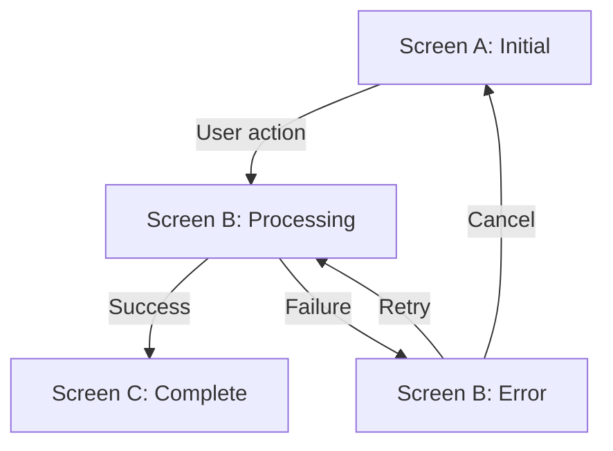

# [Screen Name] — Interaction Flow

## Screen Specification

| Field | Value |
|-------|-------|
| **Route** | /path |
| **Primary Actor** | [Persona] |
| **Entry Points** | [how users arrive] |
| **Exit Points** | [where users go next] |

## Component Summary

```
[Component tree — abbreviated]
```

## Data Requirements

| Data | API Endpoint | Method |
|------|-------------|--------|
| [item] | [endpoint] | GET/POST |

---

## Happy Path Flow

### [Flow Name — e.g., "First-time Access"]

**Preconditions**: [what must be true before this flow starts]

| Step | User Action | System Response | Screen State | AC Reference |
|------|-------------|-----------------|--------------|--------------|
| 1 | Navigates to [route] | Shows [initial state] | initial | — |
| 2 | [action] | [response] | [state] | US-X.X AC1 |
| 3 | [action] | [response] | [state] | US-X.X AC2 |

**Postconditions**: [what is true after this flow completes]

---

## Error Flows

### [Error Name — e.g., "Invalid Token"]

**Trigger**: [what causes this error]

| Step | User Action | System Response | Screen State | AC Reference |
|------|-------------|-----------------|--------------|--------------|
| 1 | [action that causes error] | [error detection] | [error state] | US-X.X AC3 |
| 2 | [user sees error] | [error message] | error | — |
| 3 | [recovery action] | [system response] | [recovery state] | — |

### [Error Name — e.g., "Rate Limited"]

**Trigger**: [what causes this error]

| Step | User Action | System Response | Screen State |
|------|-------------|-----------------|--------------|
| 1 | [repeated failed action] | [rate limit detection] | rate-limited |
| 2 | — | [block duration message] | rate-limited |
| 3 | [wait + retry] | [normal flow resumes] | initial |

---

## Edge Cases

### [Edge Case Name]

**Scenario**: [description]

| Step | What Happens | Expected Behavior |
|------|-------------|-------------------|
| 1 | [scenario] | [behavior] |

---

## Cross-Screen Flows

### [Journey Name — e.g., "Complete Onboarding"]

**Actor**: [Persona]
**Trigger**: [what starts this journey]



| Step | Screen | User Action | Navigation | Trigger |
|------|--------|-------------|------------|---------|
| 1 | [Screen A] | [action] | → Screen B | [event] |
| 2 | [Screen B] | [action] | → Screen C (success) | [event] |
| 2a | [Screen B] | — | → Screen B error (failure) | [event] |

---

## Acceptance Criteria Coverage

| Story | AC | Flow Reference | Covered |
|-------|----|----------------|---------|
| US-X.X | AC1: [brief description] | Happy Path Step 2 | Yes |
| US-X.X | AC2: [brief description] | Happy Path Step 3 | Yes |
| US-X.X | AC3: [brief description] | Error Flow: Invalid Token | Yes |
| US-X.X | AC4: [brief description] | — | **No — gap** |

## Gaps and Open Questions

- [ ] [Any unresolved design question]
- [ ] [Any AC that cannot be verified from this screen alone]
