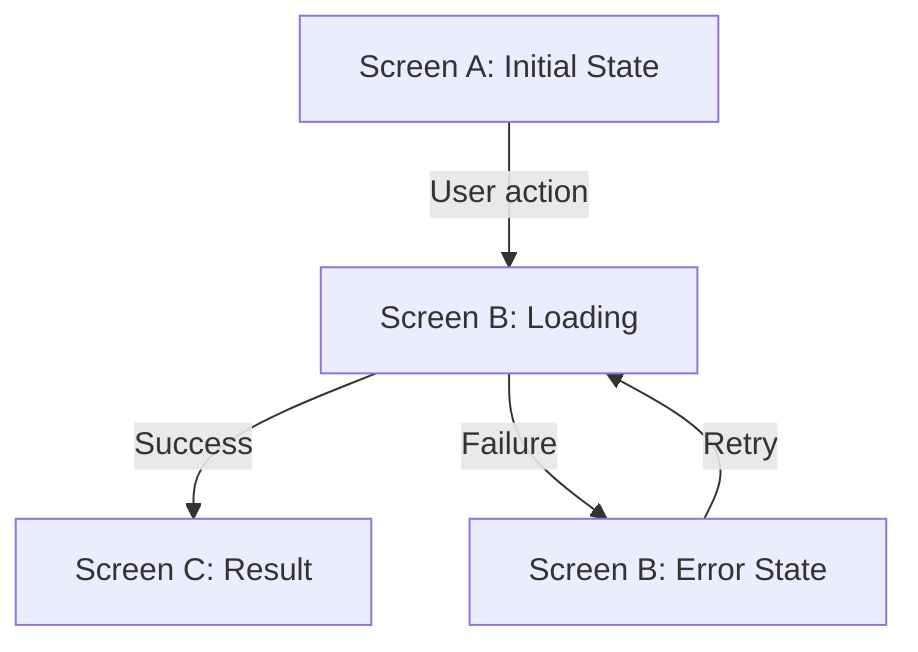

# Screen Interaction Design Workflow

This document defines the complete workflow for producing screen specifications and interaction flows. It is IDE-agnostic — any AI coding assistant can follow these instructions.

## Prerequisites

Before starting, gather available input artifacts:

1. **User stories** with acceptance criteria (required)
2. **Functional design** — frontend-components, business-logic-model (strongly recommended)
3. **Personas** — who uses each screen (recommended)
4. **DISCOVERY foundation** — brand story, CI, layout structure (if available)
5. **NFR requirements** — performance targets, security constraints (if available)

If functional design artifacts do not exist, derive screen requirements directly from user stories.

---

## Phase 1: Screen Inventory

**Goal**: Produce a complete list of all screens the application needs, with their states.

### 1.1 Extract Screens From Artifacts

Scan all input artifacts and extract every distinct screen or page:

- From `frontend-components.md`: each top-level component or page reference
- From user stories: each "Given...When...Then" that implies a UI surface
- From business-logic-model: each user-facing workflow step

### 1.2 Build Screen Inventory Table

For each screen, record:

| Field | Description |
|-------|-------------|
| **Screen ID** | Unique identifier (e.g., `SCR-001`) |
| **Screen Name** | Human-readable name (e.g., "Access Page") |
| **Route** | URL path (e.g., `/access`) |
| **Primary Actor** | Which persona uses this screen |
| **Related Stories** | User story IDs (e.g., US-1.1, US-1.2) |
| **States** | List of distinct visual states (see Phase 1.3) |
| **Priority** | MVP / Post-MVP |
| **Adapter Mode** | `demo/mock`, `api-backed mock`, or `live` |
| **Source Of Truth** | Which artifact owns the canonical shape: screen, API, mapping, or domain contract |

### 1.3 Identify Screen States

For every screen, check the states from `screen-states-checklist.md`. At minimum, every screen must define:

- **Initial / Default** — what the user sees on first load
- **Loading** — data fetching in progress
- **Empty** — no data available
- **Populated** — normal state with data
- **Error** — something went wrong
- **Disabled / Restricted** — user lacks permission

Additional states depend on the screen's purpose (e.g., form validation, success confirmation, timeout).

### 1.4 User Approval Gate

Present the screen inventory to the user for review before proceeding:

- Are all screens accounted for?
- Are the states comprehensive?
- Is the priority assignment correct?

**Do not proceed to Phase 2 until the user approves the inventory.**

### 1.5 Output

Write `screen-inventory.md` to the output directory.

---

## Phase 2: Screen Design

**Goal**: For each screen, produce an HTML prototype that shows every state.

### 2.1 Preparation

For each screen (in priority order), gather:

- The screen's entry from the inventory (states, related stories)
- Relevant acceptance criteria from user stories
- Component definitions from frontend-components.md (if available)
- Brand/CI guidelines from DISCOVERY foundation (if available)

### 2.2 Generate HTML Prototype

Delegate to `frontend-design` (or apply its principles directly):

1. **Design Direction**: Choose an aesthetic direction that matches the brand. If no brand exists, choose a clean, professional direction appropriate for the application type.

2. **Component Layout**: Arrange components on the page according to the functional design. Include:
   - Navigation context (header, sidebar if applicable)
   - Main content area with the screen's primary components
   - Footer or action bar if applicable

3. **State Variants**: The prototype must demonstrate all identified states. Use one of these approaches:
   - **Tab/toggle switcher** at the top of the prototype to switch between states
   - **Scrolling sections** showing each state vertically
   - **JavaScript state machine** with buttons to transition between states

4. **Interactivity**: Include basic interactivity:
   - Form inputs should accept text
   - Buttons should show hover/active states
   - Transitions between states should be demonstrable
   - Navigation links should show where they lead (even if the target doesn't exist yet)

5. **Self-Contained**: Each prototype must be a single HTML file with embedded CSS and JS. No external dependencies except CDN-hosted fonts or icon libraries.

6. **Responsive**: Include at minimum desktop (1280px+) and mobile (375px) layouts.

### 2.3 Screen Specification Metadata

For each prototype, also write a specification block (see `screen-spec-template.md`):

- Component tree (which components appear on this screen)
- Data requirements (what API data this screen needs)
- User permissions (who can access this screen)
- Entry/exit points (how users arrive and leave)
- Persistence boundary note (how the UI is isolated from storage or adapter changes)
- Adapter mode and demo dataset strategy
- Contract preservation rule for selectors, screen states, and actions

### 2.4 Output

For each screen, write to `screens/{screen-name}/`:
- `prototype.html` — the self-contained HTML prototype
- Screen specification metadata (included in `interaction-flow.md` or as a separate section)

---

## Phase 3: Interaction Flow

**Goal**: Document the step-by-step user journey through each screen and between screens.

### 3.1 Single-Screen Flows

For each screen, document the internal interaction flow:

```
Step 1: User arrives at [screen] via [trigger]
  → System shows [initial state]

Step 2: User [action]
  → System [response]
  → Screen transitions to [state]

Step 3: [continue...]
```

Include:
- **Happy path**: The primary success flow
- **Error paths**: What happens when things go wrong
- **Edge cases**: Timeout, concurrent actions, empty data

### 3.2 Cross-Screen Flows

Document user journeys that span multiple screens:

```
Journey: [Journey Name]
Actor: [Persona]
Trigger: [What initiates this journey]

1. [Screen A] → User does [action] → navigates to [Screen B]
2. [Screen B] → User does [action] → system responds with [result]
3. [Screen B] → On success → navigates to [Screen C]
   [Screen B] → On failure → shows error, stays on [Screen B]
```

When flows cross stages or bounded contexts, note whether they also cross a persistence boundary. Explicitly record what UI contract must survive if the underlying adapter changes later.

### 3.3 Flow Diagrams

For each cross-screen flow, include a Mermaid flowchart:



### 3.4 Map to Acceptance Criteria

For each interaction step, reference which user story acceptance criteria it satisfies. This ensures every AC has a corresponding UI behavior.

### 3.5 Output

For each screen, write `screens/{screen-name}/interaction-flow.md` using the template from `interaction-flow-template.md`.

---

## Phase 4: Validation

**Goal**: Verify prototypes work correctly using browser automation.

### 4.1 Serve Prototypes Locally

Start a local HTTP server to serve the prototype files:

```bash
python -m http.server 8080 --directory aidlc-docs/discovery/screen-design/screens/
```

### 4.2 Playwright Verification

Delegate to `webapp-testing` (or apply its principles directly):

For each prototype:
1. **Load test** — verify the page loads without console errors
2. **State test** — verify all states can be reached via the state switcher
3. **Responsive test** — capture screenshots at desktop and mobile breakpoints
4. **Interaction test** — verify form inputs, button clicks, and basic navigation
5. **Accessibility test** — verify basic a11y (contrast, labels, focus order)

### 4.3 Capture Screenshots

Save screenshots for each screen state at each breakpoint:

```
screens/{screen-name}/screenshots/
├── desktop-initial.png
├── desktop-loading.png
├── desktop-error.png
├── desktop-populated.png
├── mobile-initial.png
└── mobile-populated.png
```

### 4.4 Record Results

Document pass/fail for each test. If a prototype fails validation:
- Record the failure in the screen's interaction-flow.md
- Fix the prototype and re-validate
- If the fix requires design decisions, escalate to the user

### 4.5 Output

Screenshots in `screens/{screen-name}/screenshots/`.
Validation results noted in the screen's interaction-flow.md.

---

## Phase 5: Traceability

**Goal**: Ensure every user story has corresponding screen coverage and identify gaps.

### 5.1 Build Screen-Story Map

Create a bidirectional mapping:

**Screen → Stories**: For each screen, which stories does it fulfill?
**Story → Screens**: For each story, which screens implement it?

### 5.2 Gap Analysis

Identify:
- **Uncovered stories**: User stories with no corresponding screen
- **Orphan screens**: Screens not linked to any user story
- **Partial coverage**: Stories where some ACs lack UI coverage
- **Boundary drift**: Screens whose UI contract depends on a storage detail instead of a stable boundary
- **Adapter ambiguity**: Screens whose current mock/live mode is unclear or not documented

### 5.3 Output

Write:
- `screen-story-map.md` — the bidirectional mapping table
- `gap-report.md` — uncovered stories, orphan screens, recommendations

---

## Completion Checklist

A screen interaction design is complete when:

- [ ] Screen inventory approved by user
- [ ] HTML prototype exists for every MVP screen
- [ ] Every prototype demonstrates all identified states
- [ ] Interaction flows document happy path + error paths
- [ ] Cross-screen journeys are mapped with Mermaid diagrams
- [ ] Playwright validation passed (or blockers recorded)
- [ ] Screenshots captured for all screen states
- [ ] Screen-story map shows full coverage (or gaps documented)
- [ ] Gap report reviewed by user

## Incremental Execution

This workflow can run incrementally:
- **Sprint scope**: Run for a subset of screens (e.g., "all Access Control screens")
- **Phase scope**: Run only Phase 1-2 for initial design, add Phase 3-5 later
- **Single screen**: Run for one screen at a time during rapid iteration

When running incrementally, update `screen-inventory.md` and `screen-story-map.md` with each execution to maintain overall traceability.
