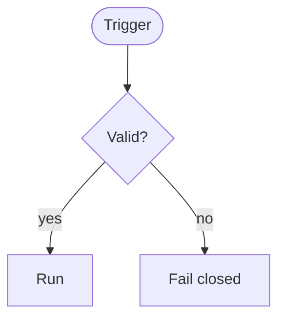
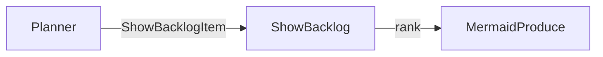
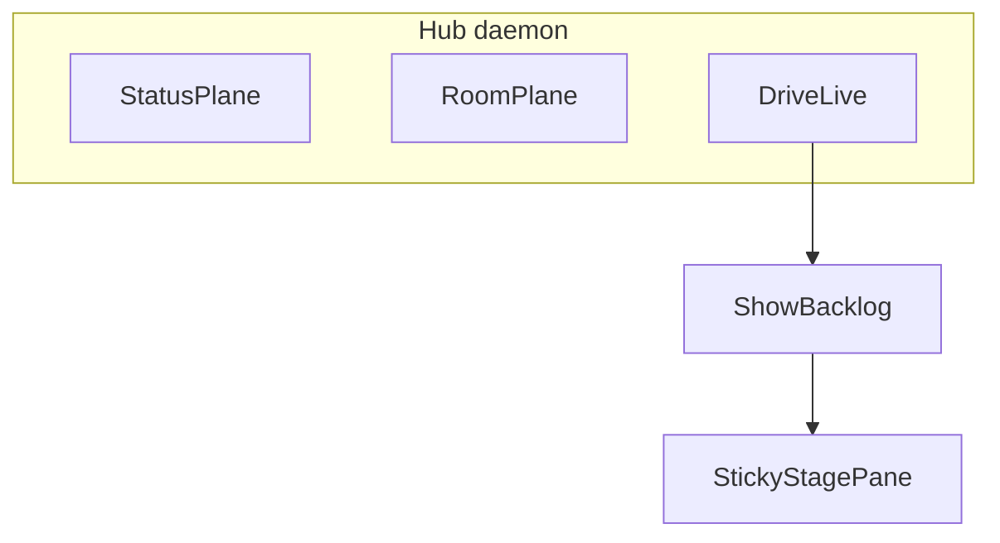
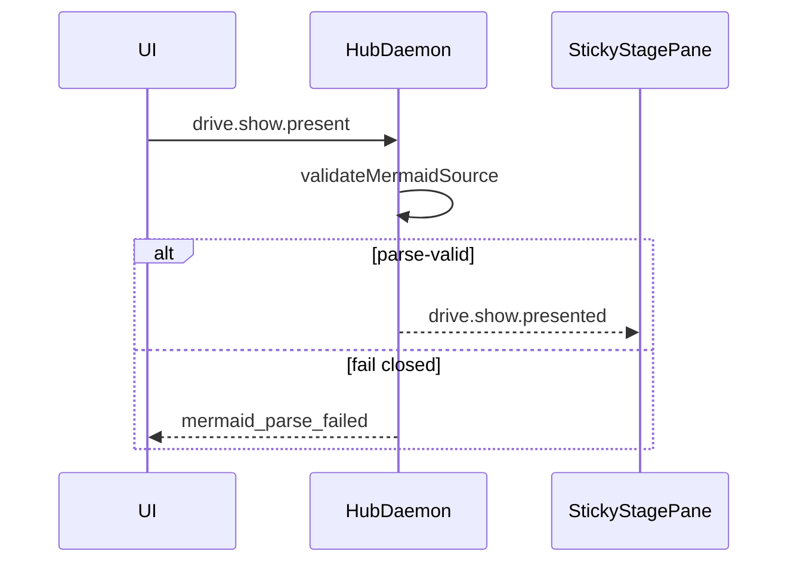

# Patterns (compact)

Emit flowchart / sequenceDiagram / erDiagram from memory. Open this file for reminders.

## Process — `flowchart TD`

## Data flow — `flowchart LR` (typed edges)

## Architecture — subgraphs

## Sequence

## Prioritization — `quadrantChart` (no fake dates)

Use for leadership prioritization; never invent day-level gantt schedules.
