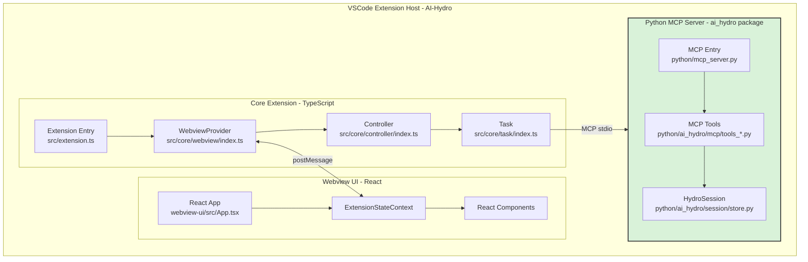

# AI-Hydro Extension Architecture & Development Guide

## Project Overview

AI-Hydro is a specialized VS Code extension (fork of Cline, Apache 2.0) that provides AI-powered assistance for hydrological data analysis and watershed modeling. The extension combines a TypeScript-based VS Code extension with a Python MCP server exposing hydrological tools via the Model Context Protocol.

## AI-Hydro Architecture Overview



## AI-Hydro Key Components

### 1. TypeScript Extension (Frontend)
- **Location**: `src/` directory
- **Purpose**: VSCode integration, user interface, task orchestration
- **Key Files**:
  - `src/extension.ts` - Extension entry point
  - `src/core/controller/index.ts` - State management and coordination
  - `src/core/task/index.ts` - Task execution and tool orchestration

### 2. Python MCP Server (Core Analysis Engine)
- **Entry point**: `python/mcp_server.py` (thin wrapper → `ai_hydro.mcp`)
- **Purpose**: Hydrological analysis, data processing, tool execution via MCP protocol
- **MCP tools** organized in modular files:
  - `ai_hydro/mcp/tools_analysis.py` — 8 analysis tools (watershed, streamflow, signatures, geomorphic, TWI, CN grid, forcing, CAMELS)
  - `ai_hydro/mcp/tools_session.py` — 6 session management tools
  - `ai_hydro/mcp/tools_modelling.py` — 2 modelling tools (HBV-light, NeuralHydrology)
- **Core computation packages**:
  - `ai_hydro/data/` — data retrieval (streamflow, forcing, landcover, soil)
  - `ai_hydro/analysis/` — computation (watershed, signatures, TWI, geomorphic, curve number)
  - `ai_hydro/modelling/` — model training (HBV-light, LSTM)
  - `ai_hydro/session/` — HydroSession persistent state management

### 3. Webview UI (User Interface)
- **Location**: `webview-ui/` directory
- **Purpose**: React-based user interface
- **Key Features**:
  - Chat interface for AI interaction
  - Task history and management
  - Settings and configuration
  - Real-time streaming updates

## AI-Hydro Specific Features

### Tool Integration

AI-Hydro tools are exposed as **MCP tools** via the `ai-hydro` MCP server.
Always call them as MCP tools — never import them as Python functions.

**Important Distinction:**
- ✅ Call tools directly: `delineate_watershed(gauge_id="01031500")`
- ❌ Do NOT run Python scripts: `python -c "from ai_hydro.tools..."`
- ❌ Do NOT call `pip install` — dependencies are pre-installed

The Python library is the implementation layer — the MCP server is the interface.
All session management, file saving, and caching is handled automatically by MCP tools.

### Architecture

**MCP Server** (`python/mcp_server.py`) — tools callable by any AI agent via stdio transport.
**Python Package** (`python/ai_hydro/`) — modular analysis, data, modelling, and session layers.
**External Data** — USGS NWIS, NHDPlus, GridMET, 3DEP, CAMELS via pygeohydro.

See `.clinerules/correct-tools.md` for the complete behavioral rules.

## Development Workflow

### Adding New Hydrological Tools

1. **Create the analysis function** in the appropriate `python/ai_hydro/` subpackage (data/, analysis/, modelling/)
2. **Add the MCP tool wrapper** as a `@mcp.tool()` function in `python/ai_hydro/mcp/tools_*.py`
3. **Update tests** in `python/tests/test_mcp_integration.py`
4. **Update documentation** in `docs/tools-reference.md` and this file
5. **(Optional)** Register as a plugin via `[project.entry-points."aihydro.tools"]` in `pyproject.toml`

### Testing

```bash
# Run MCP integration tests
/opt/miniconda3/bin/python -m pytest python/tests/test_mcp_integration.py -v

# Verify all tools register correctly
/opt/miniconda3/bin/python python/setup_mcp.py --check
```

## Key Differences from Base Cline

### 1. Domain-Specific Focus
- **Cline**: General-purpose AI coding assistant
- **AI-Hydro**: Specialized for hydrological analysis with built-in MCP tools

### 2. Tool Architecture
- **Cline**: Generic MCP server support (user-configured)
- **AI-Hydro**: Pre-configured Python MCP server (`python/mcp_server.py`) with FastMCP, exposing hydrological tools over stdio transport

### 3. Session Management
- **Cline**: No persistent research state
- **AI-Hydro**: HydroSession system with per-gauge JSON persistence at `~/.aihydro/sessions/`, automatic caching of expensive computations

### 4. Dual Execution Model (MCP-First Fallback)
- **Cline**: All tools via MCP or terminal commands
- **AI-Hydro**: Instruction-based dual execution — MCP tools are the primary path; Python scripting via `execute_command` is the fallback for tasks without a dedicated MCP tool

## Dual Execution Model

AI-Hydro uses an **instruction-based MCP-first fallback system**. This is NOT automatic code-level routing — the AI agent reads instructions and decides which path to take.

### Rules (defined consistently in 3 sources)

1. **If an MCP tool exists for the task → use it.** Never substitute Python scripting.
2. **If no MCP tool exists → Python scripting via `execute_command` is the correct fallback.**
3. Never call `pip install` — dependencies are pre-installed.

### Instruction Sources

| Source | Location | Purpose |
|--------|----------|---------|
| Workspace rules | `.clinerules/correct-tools.md` | Loaded at conversation start |
| FastMCP instructions | `python/ai_hydro/mcp/app.py` | Embedded in MCP server handshake |

### Example

```
User: "Delineate the watershed for gauge 01031500"
→ AI uses MCP tool: delineate_watershed(gauge_id="01031500")

User: "Plot the hydrograph with a 7-day moving average"
→ No MCP tool for custom plotting → AI writes Python via execute_command
```

## Documentation Reference

For detailed information, see:
- **docs/architecture.md** - System architecture and data flow
- **docs/tools-reference.md** - All MCP tools reference
- **.clinerules/correct-tools.md** - Tool usage rules (MCP-first fallback)
- **README.md** - Project overview and setup

## Contributing to AI-Hydro

When contributing to AI-Hydro:

1. **Follow Architecture**:
   - Use established patterns for tool implementation
   - Maintain separation between TypeScript and Python

2. **Test Thoroughly**:
   - Validate tool imports work
   - Run MCP integration tests

3. **Document Changes**:
   - Modify relevant documentation
   - Add examples for new features

## Best Practices

### For Python Tools
- Use type hints for all parameters
- Return structured dictionaries
- Handle errors gracefully
- Document data sources

---

**AI-Hydro** | Intelligent Hydrological Analysis Platform | Fork of Cline (Apache 2.0)
