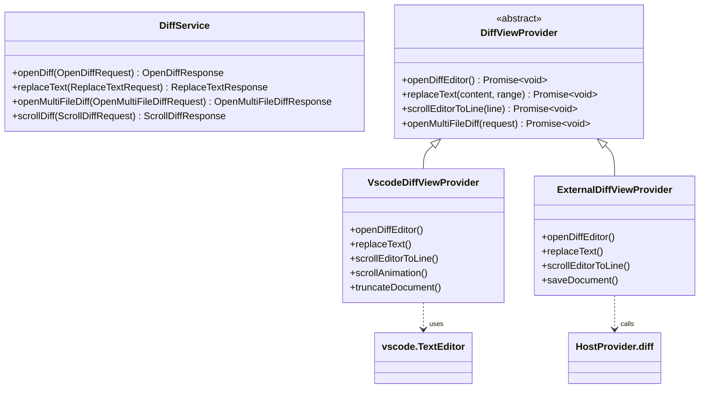
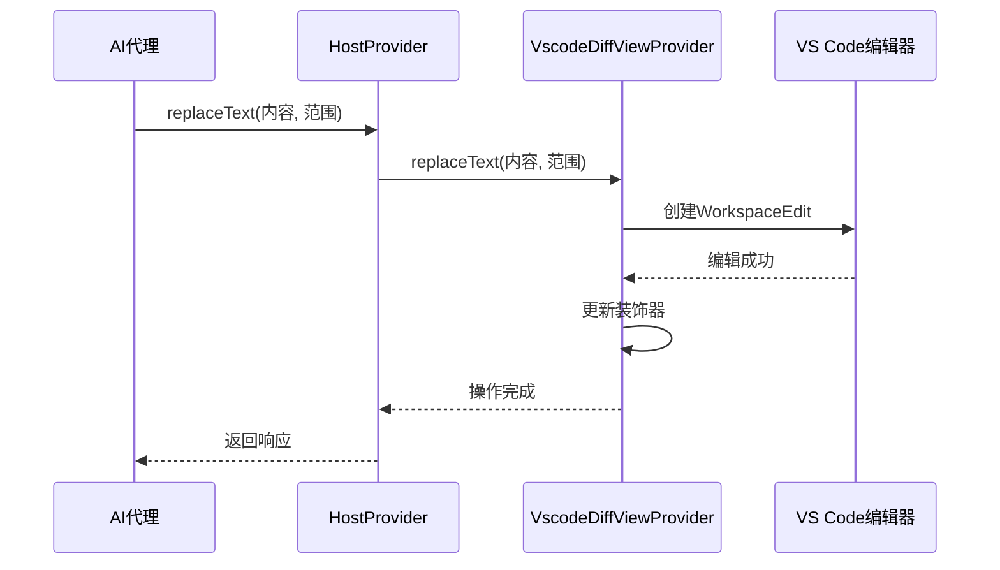

# Diff操作

<cite>
**本文档中引用的文件**  
- [diff.proto](file://proto/host/diff.proto)
- [diff.ts](file://src/core/assistant-message/diff.ts)
- [VscodeDiffViewProvider.ts](file://src/hosts/vscode/VscodeDiffViewProvider.ts)
- [multifile-diff.ts](file://src/core/task/multifile-diff.ts)
- [ExternalDiffviewProvider.ts](file://src/hosts/external/ExternalDiffviewProvider.ts)
</cite>

## 目录
1. [简介](#简介)
2. [核心功能概述](#核心功能概述)
3. `openDiff` 函数详解
4. `replaceText` 函数详解
5. `openMultiFileDiff` 函数详解
6. `scrollDiff` 函数详解
7. [在 cline 工作流中的作用](#在-cline-工作流中的作用)
8. [错误处理](#错误处理)
9. [性能考虑](#性能考虑)
10. [附录：TypeScript 调用示例](#附录：typescript-调用示例)

## 简介

`Diff操作` 模块是 cline 系统的核心组件之一，负责处理所有与文件差异和编辑相关的操作。该模块通过 VS Code Host Bridge 提供了一组 API，使 AI 代理能够精确地修改代码、向用户展示变更并控制差异视图。这些功能在 AI 驱动的代码生成和审查流程中起着关键作用。

本文档详细说明了 `openDiff`、`replaceText`、`openMultiFileDiff` 和 `scrollDiff` 四个核心函数的工作机制、调用方式及其在 cline 工作流中的集成。同时涵盖错误处理策略和性能优化建议。

**Section sources**
- [diff.proto](file://proto/host/diff.proto#L1-L108)

## 核心功能概述

Diff 操作模块基于 gRPC 协议定义了一套服务接口（`DiffService`），通过 `host.DiffService` 实现与 VS Code 编辑器的深度集成。主要功能包括：

- **打开差异编辑器**：在 VS Code 中并排显示原始文件与修改后的内容。
- **文本替换**：在差异视图中精确替换指定行范围的文本，是 AI 应用代码补丁的核心机制。
- **多文件差异展示**：一次性展示多个文件的变更，便于用户全面审查。
- **视图滚动控制**：自动滚动差异视图到指定位置，提升用户体验。
- **文档截断与保存**：支持动态截断内容和保存修改。

这些功能通过抽象的 `DiffViewProvider` 接口实现，并由 `VscodeDiffViewProvider` 和 `ExternalDiffViewProvider` 分别针对 VS Code 和外部环境提供具体实现。



**Diagram sources**
- [diff.proto](file://proto/host/diff.proto#L10-L108)
- [VscodeDiffViewProvider.ts](file://src/hosts/vscode/VscodeDiffViewProvider.ts#L1-L196)
- [ExternalDiffviewProvider.ts](file://src/hosts/external/ExternalDiffviewProvider.ts#L1-L94)

## `openDiff` 函数详解

`openDiff` 函数用于在 VS Code 中打开一个差异编辑器，允许用户对比原始文件内容与 AI 生成的修改内容。

### 工作流程
1. 接收文件路径（`path`）和新内容（`content`）作为输入。
2. 检查目标文件是否已在编辑器中打开，若已打开则先关闭以避免冲突。
3. 查找是否存在已打开的差异视图，若存在则复用该视图。
4. 若无现有视图，则创建新的差异编辑器，左侧显示原始内容（通过自定义 URI 方案 `cline-diff` 编码），右侧显示目标文件。
5. 设置装饰器控制器以实现视觉反馈（如淡入效果、活动行高亮）。

### 调用上下文
此函数通常在 AI 代理准备应用代码修改前调用，以便用户预览即将发生的变更。

**Section sources**
- [VscodeDiffViewProvider.ts](file://src/hosts/vscode/VscodeDiffViewProvider.ts#L20-L60)
- [ExternalDiffviewProvider.ts](file://src/hosts/external/ExternalDiffviewProvider.ts#L15-L22)

## `replaceText` 函数详解

`replaceText` 是 AI 代理执行代码修改的核心函数，负责在差异视图中精确替换指定范围的文本。

### 实现机制
- **参数**：`content`（新文本）、`startLine` 和 `endLine`（替换范围）、`diff_id`（差异视图标识符）。
- 在 VS Code 实现中，使用 `vscode.WorkspaceEdit` 对象创建编辑操作，并通过 `vscode.workspace.applyEdit` 应用到目标文档。
- 替换完成后，更新装饰器以反映当前修改状态（如高亮当前行、移除已覆盖部分的淡入效果）。

### 精确性保障
该函数确保替换操作严格限定在指定行范围内，不会影响文件其他部分。结合 `constructNewFileContent` 函数（位于 `diff.ts`），系统能处理复杂的 SEARCH/REPLACE 块格式，支持模糊匹配和回退策略（如行修剪匹配、块锚点匹配），从而提高在代码轻微变动时的鲁棒性。



**Diagram sources**
- [diff.proto](file://proto/host/diff.proto#L30-L37)
- [VscodeDiffViewProvider.ts](file://src/hosts/vscode/VscodeDiffViewProvider.ts#L62-L85)
- [ExternalDiffviewProvider.ts](file://src/hosts/external/ExternalDiffviewProvider.ts#L24-L33)
- [diff.ts](file://src/core/assistant-message/diff.ts#L1-L832)

## `openMultiFileDiff` 函数详解

`openMultiFileDiff` 函数用于展示多个文件的差异，帮助用户全面审查 AI 代理在一次任务中所做的所有修改。

### 使用场景
当 AI 完成一个涉及多个文件的复杂任务后，系统调用此函数汇总所有变更。例如，在重构或功能扩展场景中，用户可通过此功能一次性查看所有受影响的文件。

### 实现细节
- **输入**：包含标题（`title`）和多个 `ContentDiff` 对象的列表，每个对象包含文件路径、左侧内容（修改前）和右侧内容（修改后）。
- 内容直接以内存数据形式传递，不依赖文件系统读取，确保高效性和一致性。
- 在 cline 中，该函数由 `showChangedFilesDiff`（位于 `multifile-diff.ts`）调用，后者通过 `CheckpointTracker` 获取自上次检查点以来的所有变更文件。

### 用户体验
此功能避免了用户手动逐个打开文件进行对比的繁琐操作，显著提升了审查效率。

**Section sources**
- [diff.proto](file://proto/host/diff.proto#L90-L108)
- [multifile-diff.ts](file://src/core/task/multifile-diff.ts#L1-L122)

## `scrollDiff` 函数详解

`scrollDiff` 函数用于控制差异视图的滚动位置，确保用户注意力集中在关键变更区域。

### 功能描述
- 接收 `diff_id` 和目标行号（`line`）作为参数。
- 在 VS Code 实现中，调用 `TextEditor.revealRange` 方法将指定行滚动至视图中央。
- 支持平滑滚动动画（通过 `scrollAnimation` 方法实现），提升视觉体验。

### 应用场景
在 AI 逐步生成和应用代码补丁时，`scrollDiff` 可自动将视图滚动到当前修改的位置，引导用户实时跟踪变更过程。

**Section sources**
- [diff.proto](file://proto/host/diff.proto#L40-L43)
- [VscodeDiffViewProvider.ts](file://src/hosts/vscode/VscodeDiffViewProvider.ts#L87-L100)
- [ExternalDiffviewProvider.ts](file://src/hosts/external/ExternalDiffviewProvider.ts#L54-L59)

## 在 cline 工作流中的作用

Diff 操作模块在 cline 的 AI 驱动开发工作流中扮演着核心角色：

1. **代码修改应用**：当 AI 生成代码补丁后，`replaceText` 函数被调用来在差异视图中应用更改。这允许用户在实际提交前预览所有修改。
2. **变更审查**：`openDiff` 和 `openMultiFileDiff` 向用户清晰展示“即将应用的变更”，确保透明度和可控性。用户可以接受、拒绝或进一步编辑这些变更。
3. **交互引导**：`scrollDiff` 和 `scrollAnimation` 等功能主动引导用户关注当前修改点，实现流畅的人机协作体验。
4. **状态管理**：结合检查点（Checkpoint）机制，系统能精确追踪和展示自上次任务完成以来的所有变更，支持增量审查。

该模块的设计确保了 AI 操作的可观察性和可逆性，是构建可信 AI 编程助手的关键。

**Section sources**
- [multifile-diff.ts](file://src/core/task/multifile-diff.ts#L1-L122)
- [VscodeDiffViewProvider.ts](file://src/hosts/vscode/VscodeDiffViewProvider.ts#L1-L196)

## 错误处理

Diff 操作模块实现了全面的错误处理机制：

- **文件不存在**：在 `openDiff` 中，若文件路径无效，会抛出明确错误。
- **差异视图未找到**：在 `replaceText` 和 `scrollDiff` 中，若 `diff_id` 无效或视图已关闭，外部实现会捕获 `NOT_FOUND` 错误并静默处理，避免中断主流程。
- **匹配失败**：在 `constructNewFileContent` 中，若 SEARCH 块无法在原文件中找到匹配，会依次尝试行修剪匹配和块锚点匹配；若所有策略均失败，则抛出详细错误信息，帮助调试。
- **编辑冲突**：通过在打开差异视图前关闭同名文件的普通编辑器标签，减少编辑冲突的可能性。

这些策略确保了系统的健壮性和用户体验的流畅性。

**Section sources**
- [diff.ts](file://src/core/assistant-message/diff.ts#L1-L832)
- [ExternalDiffviewProvider.ts](file://src/hosts/external/ExternalDiffviewProvider.ts#L40-L51)

## 性能考虑

为优化性能，特别是处理大文件时，模块采用了以下策略：

- **增量处理**：`constructNewFileContent` 支持增量更新，允许在接收到部分 diff 内容时就开始构建结果，实现流式响应。
- **高效匹配算法**：优先使用精确字符串匹配，失败后才启用成本较高的回退策略（如行修剪匹配），并限制搜索范围以提高效率。
- **内存数据传递**：`openMultiFileDiff` 直接传递内存中的内容，避免频繁的文件 I/O 操作。
- **装饰器优化**：在 VS Code 中，使用 `DecorationController` 批量管理文本装饰，减少 UI 更新开销。
- **异步操作**：所有编辑和滚动操作均以异步方式进行，防止阻塞主线程。

对于超大文件，建议 AI 代理采用分块处理策略，避免单次操作过大文本范围。

**Section sources**
- [diff.ts](file://src/core/assistant-message/diff.ts#L1-L832)
- [VscodeDiffViewProvider.ts](file://src/hosts/vscode/VscodeDiffViewProvider.ts#L1-L196)

## 附录：TypeScript 调用示例

以下为各核心函数的 TypeScript 调用示例。

### `openDiff` 调用示例
```typescript
const response = await HostProvider.diff.openDiff({
  path: "/path/to/file.ts",
  content: "修改后的文件内容..."
});
const diffId = response.diffId;
```

### `replaceText` 调用示例
```typescript
await HostProvider.diff.replaceText({
  diffId: "diff-123",
  content: "新文本内容\n",
  startLine: 10,
  endLine: 15
});
```

### `openMultiFileDiff` 调用示例
```typescript
await HostProvider.diff.openMultiFileDiff({
  title: "本次任务的所有变更",
  diffs: [
    {
      filePath: "/src/service/user.ts",
      leftContent: "旧版本内容...",
      rightContent: "新版本内容..."
    },
    {
      filePath: "/src/controller/user.ts",
      leftContent: "旧版本内容...",
      rightContent: "新版本内容..."
    }
  ]
});
```

### `scrollDiff` 调用示例
```typescript
await HostProvider.diff.scrollDiff({
  diffId: "diff-123",
  line: 25
});
```

**Section sources**
- [diff.proto](file://proto/host/diff.proto#L1-L108)
- [VscodeDiffViewProvider.ts](file://src/hosts/vscode/VscodeDiffViewProvider.ts#L1-L196)