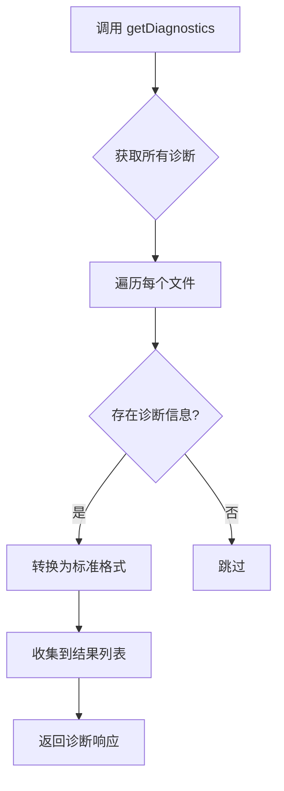

# 工作区操作

<cite>
**本文档中引用的文件**  
- [getWorkspacePaths.ts](file://src/hosts/vscode/hostbridge/workspace/getWorkspacePaths.ts)
- [getDiagnostics.ts](file://src/hosts/vscode/hostbridge/workspace/getDiagnostics.ts)
- [openClineSidebarPanel.ts](file://src/hosts/vscode/hostbridge/workspace/openClineSidebarPanel.ts)
- [openProblemsPanel.ts](file://src/hosts/vscode/hostbridge/workspace/openProblemsPanel.ts)
- [saveOpenDocumentIfDirty.ts](file://src/hosts/vscode/hostbridge/workspace/saveOpenDocumentIfDirty.ts)
</cite>

## 目录
1. [简介](#简介)
2. [核心API功能说明](#核心api功能说明)
3. [getWorkspacePaths：获取工作区路径](#getworkspacepaths获取工作区路径)
4. [getDiagnostics：获取诊断信息](#getdiagnostics获取诊断信息)
5. [面板控制函数](#面板控制函数)
6. [辅助函数：saveOpenDocumentIfDirty](#辅助函数saveopendocumentifdirty)
7. [在AI工作流中的应用](#在ai工作流中的应用)
8. [TypeScript调用示例](#typescript调用示例)
9. [总结](#总结)

## 简介
VS Code Host Bridge 工作区API模块为AI代理提供了对当前开发环境的深度访问能力。通过该模块，AI可以感知项目结构、读取编译错误、控制用户界面面板，并确保文件状态一致。这些功能是实现智能代码理解与自动化修复的基础。

## 核心API功能说明
本模块提供了一系列关键函数，用于桥接AI系统与VS Code本地环境之间的交互。主要功能包括：
- 获取当前打开的工作区路径
- 读取项目的诊断信息（错误与警告）
- 控制侧边栏和问题面板的显示
- 管理未保存的文档状态

这些接口构成了AI代理理解上下文、定位问题和执行操作的核心能力。

## getWorkspacePaths：获取工作区路径

`getWorkspacePaths` 函数用于获取当前VS Code实例中所有打开的工作区根目录路径。这是AI代理构建项目上下文的第一步，使其能够定位项目文件并理解整体结构。

该函数返回一个包含所有工作区路径的数组，路径格式为POSIX兼容字符串。AI代理利用这些路径作为基准，进行相对路径解析、文件搜索和上下文构建。

**Section sources**
- [getWorkspacePaths.ts](file://src/hosts/vscode/hostbridge/workspace/getWorkspacePaths.ts#L1-L7)

## getDiagnostics：获取诊断信息

`getDiagnostics` 函数用于从VS Code中提取所有活动编辑器中的诊断信息，包括编译器错误、linter警告和其他语言服务报告的问题。这对于AI理解代码健康状况至关重要。

该函数会遍历所有打开文件的诊断数据，将其转换为标准化的协议缓冲区格式，包含以下信息：
- 文件路径
- 诊断消息
- 问题范围（行、列）
- 严重级别（错误、警告、提示等）
- 来源工具（如 ESLint、TypeScript）

AI代理可利用这些信息优先处理存在错误的文件，生成修复建议或自动修正代码缺陷。



**Diagram sources**
- [getDiagnostics.ts](file://src/hosts/vscode/hostbridge/workspace/getDiagnostics.ts#L10-L67)

**Section sources**
- [getDiagnostics.ts](file://src/hosts/vscode/hostbridge/workspace/getDiagnostics.ts#L1-L67)

## 面板控制函数

### openClineSidebarPanel
此函数用于打开Cline专用的侧边栏面板。该面板通常用于展示AI助手的交互界面、任务历史或配置选项。通过编程方式激活该面板，AI代理可以引导用户关注特定信息或操作流程。

### openProblemsPanel
该函数用于显示VS Code内置的“问题”面板，其中列出了项目中所有的错误和警告。AI代理可在完成代码修改后调用此函数，以便用户立即查看修复效果和剩余问题。

**Section sources**
- [openClineSidebarPanel.ts](file://src/hosts/vscode/hostbridge/workspace/openClineSidebarPanel.ts)
- [openProblemsPanel.ts](file://src/hosts/vscode/hostbridge/workspace/openProblemsPanel.ts)

## 辅助函数：saveOpenDocumentIfDirty

`saveOpenDocumentIfDirty` 函数用于保存指定路径的已打开但未保存（dirty）的文档。该函数接收文件路径作为请求参数，在内存中查找匹配的文档实例，若存在且处于未保存状态，则触发保存操作。

典型使用场景包括：
- 在执行代码修改前确保文件状态一致
- 防止因未保存更改导致的上下文偏差
- 自动化流程中维护文件系统一致性

该函数返回一个布尔值 `wasSaved`，指示是否实际执行了保存操作。

**Section sources**
- [saveOpenDocumentIfDirty.ts](file://src/hosts/vscode/hostbridge/workspace/saveOpenDocumentIfDirty.ts#L1-L13)

## 在AI工作流中的应用

这些API函数在AI代理的工作流中扮演着关键角色：

1. **上下文构建阶段**：AI调用 `getWorkspacePaths` 获取项目根路径，建立文件索引和目录结构视图。
2. **问题识别阶段**：通过 `getDiagnostics` 获取当前项目的错误和警告列表，确定需要优先处理的文件。
3. **操作执行阶段**：在修改代码前后调用 `saveOpenDocumentIfDirty` 确保文件状态同步。
4. **用户交互阶段**：使用 `openProblemsPanel` 展示修复结果，或通过 `openClineSidebarPanel` 提供详细解释和建议。

这种闭环流程使得AI代理能够以接近人类开发者的模式进行感知-决策-执行-反馈。

## TypeScript调用示例

以下是各函数的TypeScript调用示例：

```typescript
// 获取工作区路径
const workspaceResponse = await getWorkspacePaths(GetWorkspacePathsRequest.create());
console.log(workspaceResponse.paths); // 输出: ["d:/project/root"]

// 获取诊断信息
const diagnosticsResponse = await getDiagnostics(GetDiagnosticsRequest.create());
diagnosticsResponse.fileDiagnostics.forEach(fileDiag => {
  console.log(`${fileDiag.filePath}: ${fileDiag.diagnostics.length} 个问题`);
});

// 打开Cline侧边栏
await openClineSidebarPanel(OpenClineSidebarPanelRequest.create());

// 打开问题面板
await openProblemsPanel(OpenProblemsPanelRequest.create());

// 保存指定文件（如果已修改）
const saveResponse = await saveOpenDocumentIfDirty(
  SaveOpenDocumentIfDirtyRequest.create({ filePath: "src/main.ts" })
);
if (saveResponse.wasSaved) {
  console.log("文件已保存");
}
```

## 总结
VS Code Host Bridge 的工作区API为AI代理提供了强大的环境感知与控制能力。通过 `getWorkspacePaths` 和 `getDiagnostics`，AI能够准确理解项目结构与代码质量；通过面板控制函数，实现与用户的高效交互；通过辅助函数确保操作的可靠性。这些功能共同支撑了智能化开发助手的核心工作流。