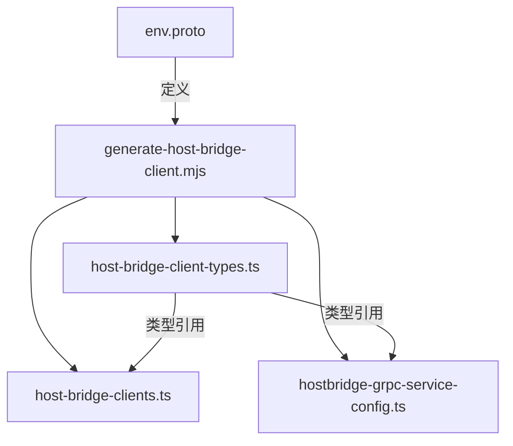

# 环境操作

<cite>
**本文档中引用的文件**  
- [clipboardReadText.ts](file://src/hosts/vscode/hostbridge/env/clipboardReadText.ts)
- [clipboardWriteText.ts](file://src/hosts/vscode/hostbridge/env/clipboardWriteText.ts)
- [getHostVersion.ts](file://src/hosts/vscode/hostbridge/env/getHostVersion.ts)
- [getMachineId.ts](file://src/hosts/vscode/hostbridge/env/getMachineId.ts)
- [subscribeToTelemetrySettings.ts](file://src/hosts/vscode/hostbridge/env/subscribeToTelemetrySettings.ts)
- [env.proto](file://proto/host/env.proto)
- [generate-host-bridge-client.mjs](file://scripts/generate-host-bridge-client.mjs)
</cite>

## 目录
1. [简介](#简介)
2. [核心功能概览](#核心功能概览)
3. [剪贴板交互 API](#剪贴板交互-api)
4. [环境元数据获取 API](#环境元数据获取-api)
5. [事件订阅 API](#事件订阅-api)
6. [TypeScript 调用示例](#typescript-调用示例)
7. [实际应用场景](#实际应用场景)
8. [接口生成机制](#接口生成机制)

## 简介
VS Code Host Bridge 环境模块为插件提供了访问 VS Code 运行环境信息和系统级功能的标准化接口。该模块通过 gRPC 协议实现，允许插件与宿主 IDE 安全地交互，获取环境元数据、操作剪贴板以及监听用户设置变更。这些功能对于 AI 代理在开发环境中高效工作至关重要，例如在用户请求帮助时自动复制代码片段，或在问题报告中收集调试信息。

## 核心功能概览
环境模块（EnvService）提供了一组核心 API，主要分为三类：
- **剪贴板操作**：`clipboardReadText` 和 `clipboardWriteText`，实现与系统剪贴板的双向数据交换。
- **环境信息获取**：`getHostVersion` 和 `getMachineId`，用于收集宿主环境的版本和唯一标识。
- **事件订阅**：`subscribeToTelemetrySettings`，允许插件监听用户对遥测设置的更改。

这些 API 定义在 `env.proto` 文件中，并通过代码生成工具自动创建客户端和服务端绑定，确保了类型安全和跨平台一致性。

## 剪贴板交互 API

### clipboardReadText
此函数允许插件从系统剪贴板读取文本内容。当 AI 代理需要分析用户复制的代码片段或错误信息时，此功能至关重要。

```typescript
const text = await envClient.clipboardReadText({});
```

**Section sources**
- [clipboardReadText.ts](file://src/hosts/vscode/hostbridge/env/clipboardReadText.ts#L1-L7)
- [env.proto](file://proto/host/env.proto#L12-L14)

### clipboardWriteText
此函数允许插件将文本写入系统剪贴板。当 AI 代理生成代码建议或修复方案后，可以将其复制到剪贴板，方便用户一键粘贴。

```typescript
await envClient.clipboardWriteText({ value: "const result = await fetchData();" });
```

**Section sources**
- [clipboardWriteText.ts](file://src/hosts/vscode/hostbridge/env/clipboardWriteText.ts#L1-L7)
- [env.proto](file://proto/host/env.proto#L9-L11)

## 环境元数据获取 API

### getHostVersion
此函数返回宿主 IDE 的名称和版本号。在用户报告问题时，此信息会被自动收集，帮助开发团队复现和诊断问题。

```typescript
const versionInfo = await envClient.getHostVersion({});
// 返回: { platform: "VSCode", version: "1.103.0" }
```

**Section sources**
- [getHostVersion.ts](file://src/hosts/vscode/hostbridge/env/getHostVersion.ts#L1-L7)
- [env.proto](file://proto/host/env.proto#L22-L29)

### getMachineId
此函数返回一个稳定的机器标识符，用于遥测和分析目的。该 ID 在同一台机器上的 VS Code 安装中保持不变，但不会暴露个人身份信息。

```typescript
const machineId = await envClient.getMachineId({});
// 返回: { value: "some-stable-id" }
```

**Section sources**
- [getMachineId.ts](file://src/hosts/vscode/hostbridge/env/getMachineId.ts#L1-L7)
- [env.proto](file://proto/host/env.proto#L17-L19)

## 事件订阅 API

### subscribeToTelemetrySettings
此函数允许插件订阅用户遥测设置的变更事件。当用户在 VS Code 中启用或禁用遥测时，插件会收到通知，从而可以相应地调整其行为。

```typescript
const unsubscribe = envClient.subscribeToTelemetrySettings(
  {},
  {
    onNext: (event) => console.log("Telemetry enabled:", event.isEnabled),
    onError: (err) => console.error("Subscription error:", err),
  }
);
// 当不再需要监听时调用
// unsubscribe();
```

**Section sources**
- [subscribeToTelemetrySettings.ts](file://src/hosts/vscode/hostbridge/env/subscribeToTelemetrySettings.ts#L1-L18)
- [env.proto](file://proto/host/env.proto#L48-L50)

## TypeScript 调用示例
以下是一个完整的 TypeScript 示例，展示如何使用环境 API：

```typescript
import { EnvServiceClient } from "@generated/hosts/host-bridge-client-types";
import { Channel, createClient } from "nice-grpc";

// 假设已建立 gRPC 通道
const channel: Channel = /* ... */;

// 创建环境服务客户端
const envClient = createClient(EnvServiceClient, channel);

// 1. 获取环境版本
const version = await envClient.getHostVersion({});
console.log(`Host: ${version.platform} v${version.version}`);

// 2. 读取剪贴板内容
const clipboardText = await envClient.clipboardReadText({});
console.log(`Clipboard content: ${clipboardText.value}`);

// 3. 写入剪贴板
await envClient.clipboardWriteText({ value: "Hello from Cline!" });

// 4. 订阅遥测设置变更
const unsubscribe = envClient.subscribeToTelemetrySettings(
  {},
  {
    onNext: (event) => {
      const status = event.isEnabled ? "enabled" : "disabled";
      console.log(`Telemetry has been ${status}`);
    },
  }
);

// 清理资源
// unsubscribe();
```

## 实际应用场景
这些 API 在实际开发中扮演着关键角色：
- **AI 代码助手**：当用户选中一段代码并请求解释时，`clipboardReadText` 可以获取代码内容，AI 分析后通过 `clipboardWriteText` 将解释结果复制回剪贴板。
- **错误报告**：当用户通过 `reportBug` 命令提交问题时，系统会自动调用 `getHostVersion` 和 `getMachineId` 收集环境信息，形成完整的诊断报告。
- **隐私合规**：`subscribeToTelemetrySettings` 确保插件行为与用户隐私偏好保持一致。当用户禁用遥测时，插件会立即停止发送任何使用数据。

## 接口生成机制
环境 API 的实现依赖于自动化代码生成。`generate-host-bridge-client.mjs` 脚本解析 `env.proto` 等 Protobuf 定义文件，自动生成 TypeScript 客户端接口和服务器端处理程序。这种机制确保了：
- **类型安全**：所有请求和响应都具有精确的 TypeScript 类型。
- **一致性**：客户端和服务端的契约由单一的 Protobuf 文件定义。
- **可维护性**：添加新 API 时，只需修改 `.proto` 文件并重新运行生成脚本。



**Diagram sources**
- [env.proto](file://proto/host/env.proto#L1-L54)
- [generate-host-bridge-client.mjs](file://scripts/generate-host-bridge-client.mjs#L1-L243)

**Section sources**
- [generate-host-bridge-client.mjs](file://scripts/generate-host-bridge-client.mjs#L1-L243)