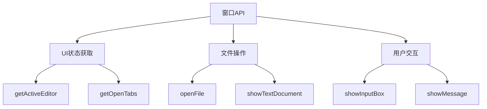
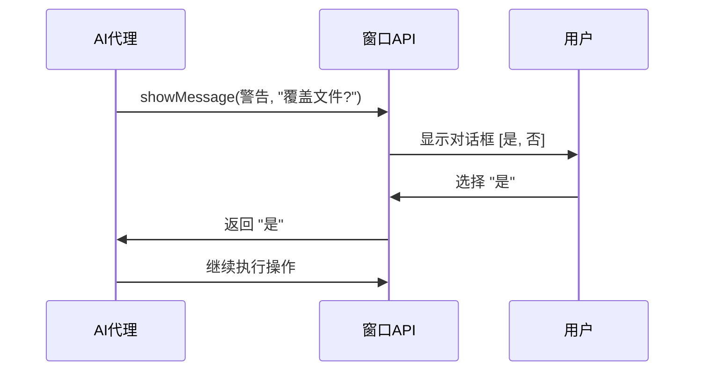
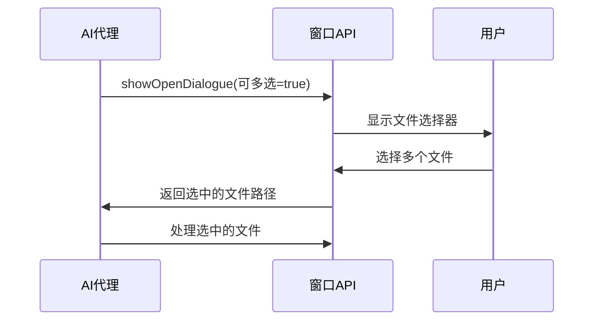

# 窗口操作

<cite>
**本文档中引用的文件**  
- [window.proto](file://proto/host/window.proto)
- [getActiveEditor.ts](file://src/hosts/vscode/hostbridge/window/getActiveEditor.ts)
- [getOpenTabs.ts](file://src/hosts/vscode/hostbridge/window/getOpenTabs.ts)
- [openFile.ts](file://src/hosts/vscode/hostbridge/window/openFile.ts)
- [showTextDocument.ts](file://src/hosts/vscode/hostbridge/window/showTextDocument.ts)
- [showInputBox.ts](file://src/hosts/vscode/hostbridge/window/showInputBox.ts)
- [showMessage.ts](file://src/hosts/vscode/hostbridge/window/showMessage.ts)
- [open-file.ts](file://src/integrations/misc/open-file.ts)
</cite>

## 目录
1. [简介](#简介)
2. [核心功能概览](#核心功能概览)
3. [UI状态获取](#ui状态获取)
4. [文件操作](#文件操作)
5. [用户交互](#用户交互)
6. [cline工作流中的应用](#cline工作流中的应用)
7. [最佳实践](#最佳实践)

## 简介
VS Code Host Bridge 窗口API模块负责管理VS Code的用户界面、编辑器状态和用户交互。该模块为AI代理提供了理解当前开发环境上下文的关键能力，使其能够感知用户正在编辑的文件、打开的标签页，并通过标准对话框与用户进行交互。这些功能是实现智能代码辅助、上下文感知建议和自动化任务的基础。

**Section sources**
- [window.proto](file://proto/host/window.proto#L1-L10)

## 核心功能概览
窗口API模块提供了一组核心功能，分为三大类：UI状态查询、文件操作和用户交互。这些功能通过gRPC服务暴露，允许外部系统（如AI代理）以编程方式与VS Code的UI层进行交互。



**Diagram sources**
- [window.proto](file://proto/host/window.proto#L12-L30)

## UI状态获取

### 获取活动编辑器
`getActiveEditor`函数用于获取当前处于焦点的编辑器信息。它返回活动编辑器中打开的文件路径，这对于AI代理理解用户当前正在处理的代码至关重要。

```typescript
// TypeScript调用示例
const request = GetActiveEditorRequest.create({});
const response: GetActiveEditorResponse = await windowService.getActiveEditor(request);
if (response.filePath) {
  console.log(`当前编辑的文件: ${response.filePath}`);
}
```

**Section sources**
- [getActiveEditor.ts](file://src/hosts/vscode/hostbridge/window/getActiveEditor.ts#L4-L7)
- [window.proto](file://proto/host/window/window.proto#L145-L150)

### 获取打开的标签页
`getOpenTabs`函数返回当前所有打开的编辑器标签页的文件路径列表。这使AI代理能够了解用户的整体工作上下文，而不仅仅是当前焦点文件。

```typescript
// TypeScript调用示例
const request = GetOpenTabsRequest.create({});
const response: GetOpenTabsResponse = await windowService.getOpenTabs(request);
console.log(`打开的文件: ${response.paths.join(', ')}`);
```

**Section sources**
- [getOpenTabs.ts](file://src/hosts/vscode/hostbridge/window/getOpenTabs.ts#L3-L10)
- [window.proto](file://proto/host/window/window.proto#L130-L135)

## 文件操作

### 打开文件
`openFile`函数直接在VS Code中打开指定路径的文件。这是一个高层级操作，通常用于快速导航到特定文件。

```typescript
// TypeScript调用示例
const request = OpenFileRequest.create({ filePath: "/path/to/file.ts" });
const response: OpenFileResponse = await windowService.openFile(request);
```

**Section sources**
- [openFile.ts](file://src/hosts/vscode/hostbridge/window/openFile.ts#L3-L6)
- [window.proto](file://proto/host/window/window.proto#L67-L71)

### 显示文本文档
`showTextDocument`提供了更精细的文件打开控制，允许指定预览模式、焦点保留和视图列等选项。它还返回有关新打开编辑器的详细信息。

```typescript
// TypeScript调用示例
const request = ShowTextDocumentRequest.create({
  path: "/path/to/file.ts",
  options: {
    preview: false,
    preserveFocus: true,
    viewColumn: 1
  }
});
const editorInfo: TextEditorInfo = await windowService.showTextDocument(request);
console.log(`文档在列 ${editorInfo.viewColumn} 中打开`);
```

**Section sources**
- [showTextDocument.ts](file://src/hosts/vscode/hostbridge/window/showTextDocument.ts#L4-L45)
- [window.proto](file://proto/host/window/window.proto#L15-L20)

## 用户交互

### 显示输入框
`showInputBox`用于向用户请求文本输入，例如获取文件名、搜索查询或配置值。

```typescript
// TypeScript调用示例
const request = ShowInputBoxRequest.create({
  title: "创建新文件",
  prompt: "请输入文件名",
  value: "new-file.ts"
});
const response: ShowInputBoxResponse = await windowService.showInputBox(request);
if (response.response) {
  console.log(`用户输入: ${response.response}`);
}
```

**Section sources**
- [showInputBox.ts](file://src/hosts/vscode/hostbridge/window/showInputBox.ts#L3-L10)
- [window.proto](file://proto/host/window/window.proto#L51-L57)

### 显示消息
`showMessage`用于向用户显示通知或请求确认，支持错误、信息和警告三种类型，并可提供多个操作选项。

```typescript
// TypeScript调用示例
const request = ShowMessageRequest.create({
  type: ShowMessageType.WARNING,
  message: "确定要删除此文件吗？",
  options: {
    items: ["是", "否"],
    modal: true
  }
});
const response: SelectedResponse = await windowService.showMessage(request);
if (response.selectedOption === "是") {
  // 执行删除操作
}
```

**Section sources**
- [showMessage.ts](file://src/hosts/vscode/hostbridge/window/showMessage.ts#L5-L25)
- [window.proto](file://proto/host/window/window.proto#L33-L49)

## cline工作流中的应用
在cline工作流中，这些窗口API操作被广泛用于增强AI代理与用户的协作。

### 用户确认流程
当AI代理需要执行可能影响代码库的操作时，会使用`showMessage`请求用户确认：


### 文件选择流程
当AI需要用户选择一个文件时，会调用`showOpenDialogue`：


**Diagram sources**
- [window.proto](file://proto/host/window/window.proto#L23-L31)

## 最佳实践

### UI状态同步
- 在执行任何文件操作前，使用`getOpenTabs`和`getActiveEditor`获取当前UI状态
- 避免不必要的文件重复打开，利用`showTextDocument`的`preview`选项
- 尊重用户的焦点偏好，合理使用`preserveFocus`参数

### 用户交互设计
- 对于破坏性操作，始终使用`showMessage`请求确认
- 为`showInputBox`提供有意义的默认值和提示
- 使用`modal: true`确保关键决策得到用户明确响应
- 保持消息简洁明了，避免信息过载

**Section sources**
- [open-file.ts](file://src/integrations/misc/open-file.ts#L31-L43)
- [window.proto](file://proto/host/window/window.proto#L33-L57)