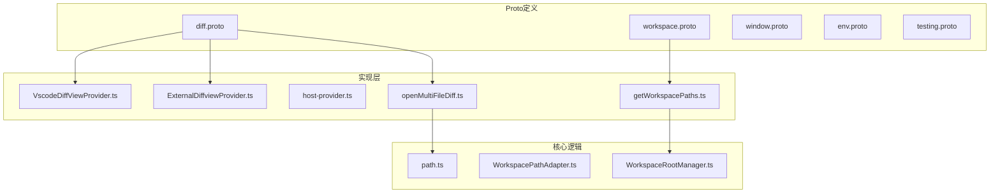
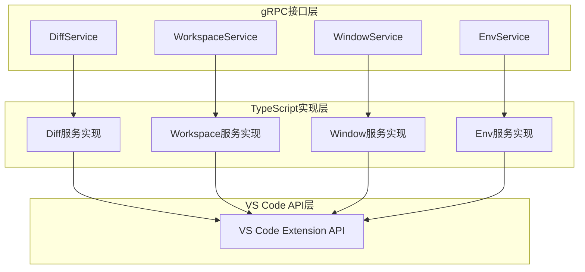
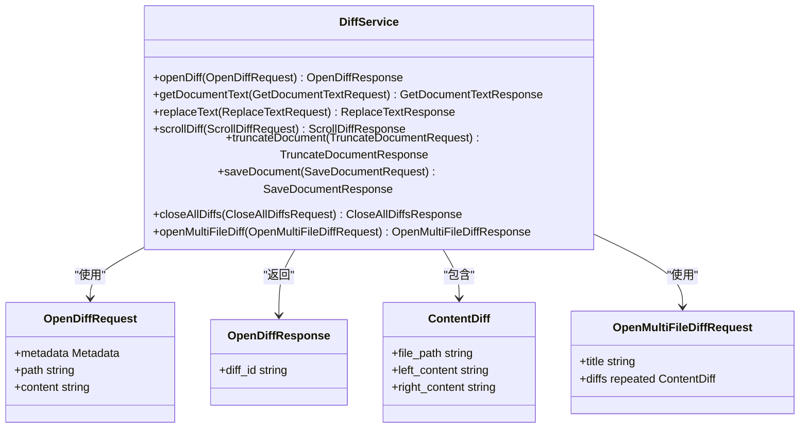
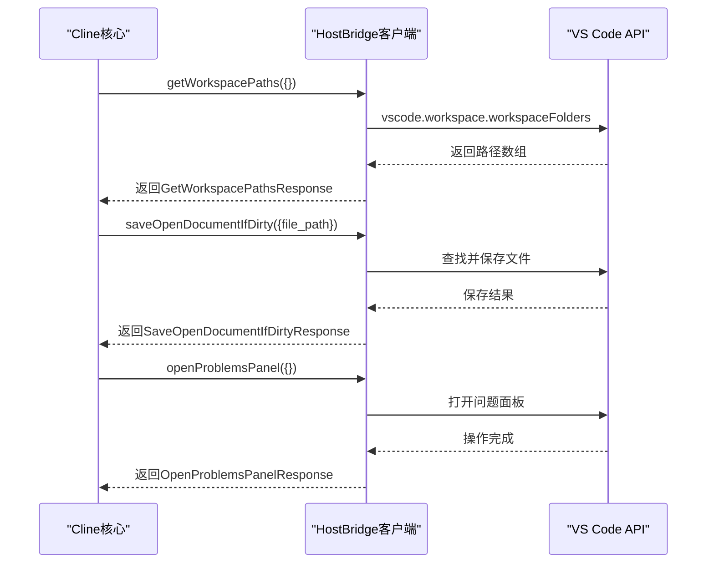
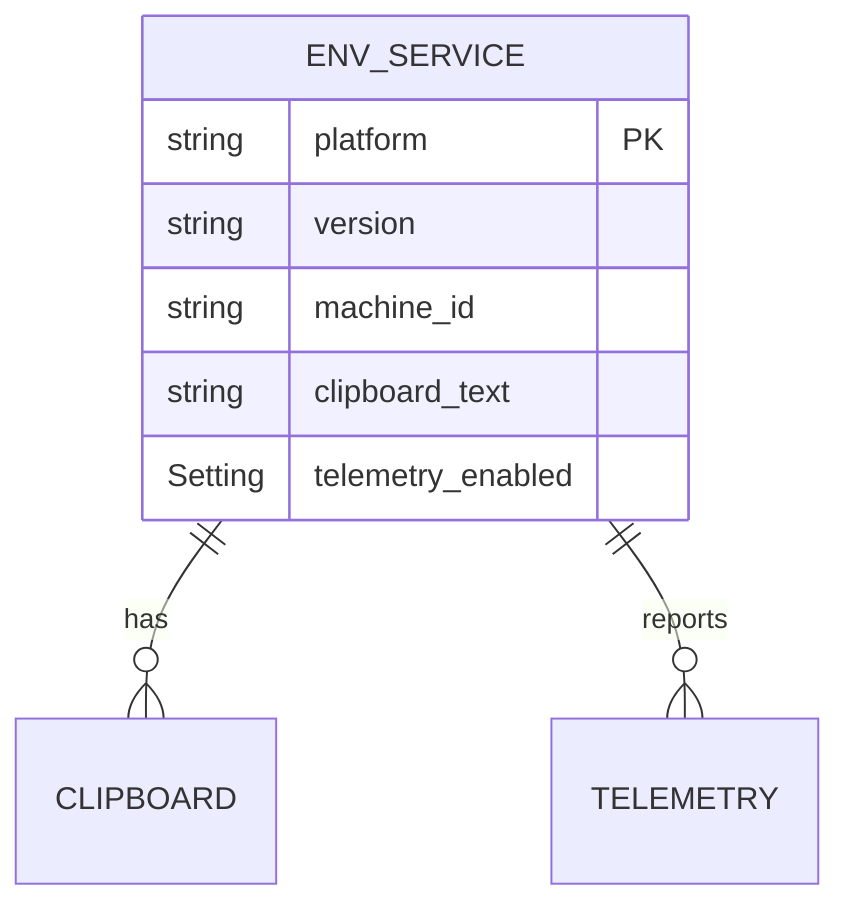
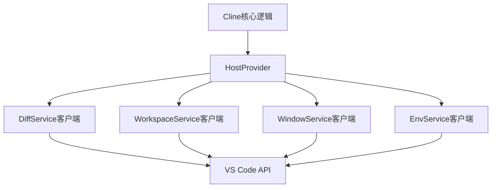

# Host服务

<cite>
**本文档中引用的文件**  
- [diff.proto](file://proto/host/diff.proto)
- [workspace.proto](file://proto/host/workspace.proto)
- [window.proto](file://proto/host/window.proto)
- [env.proto](file://proto/host/env.proto)
- [VscodeDiffViewProvider.ts](file://src/hosts/vscode/VscodeDiffViewProvider.ts)
- [ExternalDiffviewProvider.ts](file://src/hosts/external/ExternalDiffviewProvider.ts)
- [host-provider.ts](file://src/hosts/host-provider.ts)
- [getWorkspacePaths.ts](file://src/hosts/vscode/hostbridge/workspace/getWorkspacePaths.ts)
- [openMultiFileDiff.ts](file://src/hosts/vscode/hostbridge/diff/openMultiFileDiff.ts)
- [WorkspaceRootManager.ts](file://src/core/workspace/WorkspaceRootManager.ts)
- [WorkspacePathAdapter.ts](file://src/core/workspace/WorkspacePathAdapter.ts)
- [path.ts](file://src/utils/path.ts)
</cite>

## 目录
1. [简介](#简介)
2. [项目结构](#项目结构)
3. [核心组件](#核心组件)
4. [架构概述](#架构概述)
5. [详细组件分析](#详细组件分析)
6. [依赖分析](#依赖分析)
7. [性能考量](#性能考量)
8. [故障排除指南](#故障排除指南)
9. [结论](#结论)

## 简介
本文档旨在为`proto/host/`目录下的HostBridge服务提供全面的API文档。该服务作为cline与VS Code等IDE之间的桥梁，实现了深度集成能力，支持文件差异展示、工作区管理、窗口控制和环境抽象等功能。文档将详细描述各子服务的RPC方法、关键消息类型以及主机环境的抽象模型，并通过实际调用示例说明其在VS Code Diff Editor中的应用。

## 项目结构
Host服务的接口定义位于`proto/host/`目录下，包含五个核心`.proto`文件，分别对应不同的服务功能。这些定义通过gRPC生成客户端和服务端代码，实现在VS Code等环境中的具体功能。

**Diagram sources**
- [diff.proto](file://proto/host/diff.proto)
- [workspace.proto](file://proto/host/workspace.proto)
- [VscodeDiffViewProvider.ts](file://src/hosts/vscode/VscodeDiffViewProvider.ts)
- [ExternalDiffviewProvider.ts](file://src/hosts/external/ExternalDiffviewProvider.ts)
- [getWorkspacePaths.ts](file://src/hosts/vscode/hostbridge/workspace/getWorkspacePaths.ts)
- [openMultiFileDiff.ts](file://src/hosts/vscode/hostbridge/diff/openMultiFileDiff.ts)
- [WorkspaceRootManager.ts](file://src/core/workspace/WorkspaceRootManager.ts)
- [WorkspacePathAdapter.ts](file://src/core/workspace/WorkspacePathAdapter.ts)
- [path.ts](file://src/utils/path.ts)

**Section sources**
- [diff.proto](file://proto/host/diff.proto)
- [workspace.proto](file://proto/host/workspace.proto)
- [window.proto](file://proto/host/window.proto)
- [env.proto](file://proto/host/env.proto)
- [testing.proto](file://proto/host/testing.proto)

## 核心组件
Host服务由四个主要子服务构成：DiffService、WorkspaceService、WindowService和EnvService。每个服务负责特定领域的功能，共同构建了cline与IDE之间的完整交互能力。DiffService专注于文件差异的展示和编辑，WorkspaceService管理多工作区环境，WindowService控制IDE的UI元素，而EnvService则提供对系统环境的访问。

**Section sources**
- [diff.proto](file://proto/host/diff.proto)
- [workspace.proto](file://proto/host/workspace.proto)
- [window.proto](file://proto/host/window.proto)
- [env.proto](file://proto/host/env.proto)

## 架构概述
Host服务采用分层架构，上层为`.proto`文件定义的gRPC接口，中层为TypeScript实现的客户端和服务端逻辑，底层为VS Code API。这种设计实现了协议与实现的解耦，使得cline可以灵活地支持不同的IDE环境。

**Diagram sources**
- [diff.proto](file://proto/host/diff.proto)
- [workspace.proto](file://proto/host/workspace.proto)
- [window.proto](file://proto/host/window.proto)
- [env.proto](file://proto/host/env.proto)

## 详细组件分析

### DiffService分析
DiffService是Host服务的核心组件之一，负责在IDE中展示和管理文件差异。它提供了打开、读取、修改和保存差异视图的能力，是实现代码修改预览功能的关键。

#### DiffService类图

**Diagram sources**
- [diff.proto](file://proto/host/diff.proto)

**Section sources**
- [diff.proto](file://proto/host/diff.proto)
- [VscodeDiffViewProvider.ts](file://src/hosts/vscode/VscodeDiffViewProvider.ts)
- [ExternalDiffviewProvider.ts](file://src/hosts/external/ExternalDiffviewProvider.ts)

### WorkspaceService分析
WorkspaceService负责管理IDE中的工作区信息，包括获取工作区路径、保存文件、打开问题面板等操作。它为cline提供了对项目结构的访问能力。

#### WorkspaceService序列图

**Diagram sources**
- [workspace.proto](file://proto/host/workspace.proto)
- [getWorkspacePaths.ts](file://src/hosts/vscode/hostbridge/workspace/getWorkspacePaths.ts)

**Section sources**
- [workspace.proto](file://proto/host/workspace.proto)
- [getWorkspacePaths.ts](file://src/hosts/vscode/hostbridge/workspace/getWorkspacePaths.ts)
- [WorkspaceRootManager.ts](file://src/core/workspace/WorkspaceRootManager.ts)
- [WorkspacePathAdapter.ts](file://src/core/workspace/WorkspacePathAdapter.ts)

### 主机环境抽象模型
EnvService提供了对主机环境的抽象，包括剪贴板操作、机器标识、IDE版本信息等。这种抽象使得cline可以在不同环境中保持一致的行为。

#### 主机环境模型

**Diagram sources**
- [env.proto](file://proto/host/env.proto)

**Section sources**
- [env.proto](file://proto/host/env.proto)

## 依赖分析
Host服务的实现依赖于多个层级的组件。最底层是VS Code的Extension API，提供了对编辑器功能的直接访问。中间层是HostBridge的gRPC接口，定义了标准化的通信协议。上层是cline核心逻辑，通过HostProvider统一访问这些服务。

**Diagram sources**
- [host-provider.ts](file://src/hosts/host-provider.ts)
- [diff.proto](file://proto/host/diff.proto)
- [workspace.proto](file://proto/host/workspace.proto)
- [window.proto](file://proto/host/window.proto)
- [env.proto](file://proto/host/env.proto)

**Section sources**
- [host-provider.ts](file://src/hosts/host-provider.ts)

## 性能考量
在使用Host服务时，需要注意以下性能相关的问题：
1. **gRPC调用开销**：每次RPC调用都有一定的网络和序列化开销，应尽量批量操作。
2. **VS Code API响应时间**：某些API调用（如`vscode.diff`）可能需要较长时间完成，应设置合理的超时。
3. **内存使用**：在处理大型文件差异时，应考虑内存使用情况，避免一次性加载过多内容。
4. **并发控制**：多个gRPC调用同时进行时，应注意VS Code的响应能力，避免造成界面卡顿。

## 故障排除指南
当Host服务出现问题时，可以参考以下常见问题的解决方案：

**Section sources**
- [VscodeDiffViewProvider.ts](file://src/hosts/vscode/VscodeDiffViewProvider.ts)
- [ExternalDiffviewProvider.ts](file://src/hosts/external/ExternalDiffviewProvider.ts)
- [openMultiFileDiff.ts](file://src/hosts/vscode/hostbridge/diff/openMultiFileDiff.ts)

## 结论
Host服务为cline与IDE之间的深度集成提供了坚实的基础。通过清晰的gRPC接口定义和灵活的实现机制，它成功地抽象了不同IDE的差异，为用户提供了一致的体验。未来可以进一步优化性能，增加更多IDE的适配，以及提供更丰富的调试和监控功能。