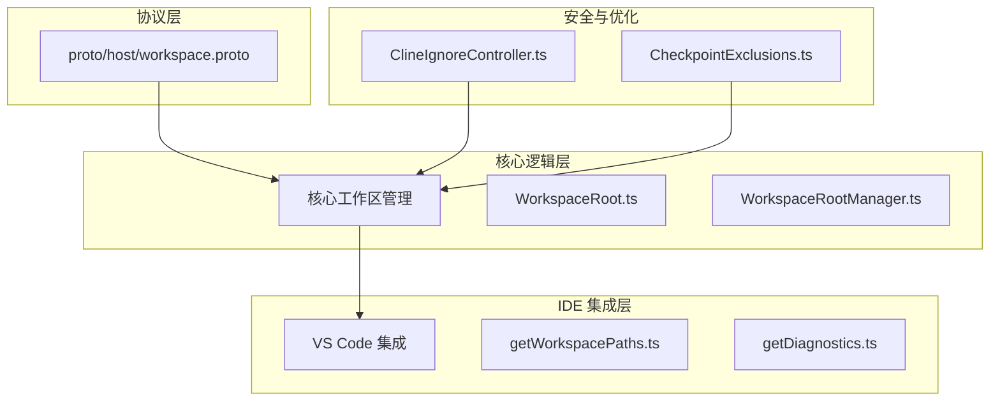
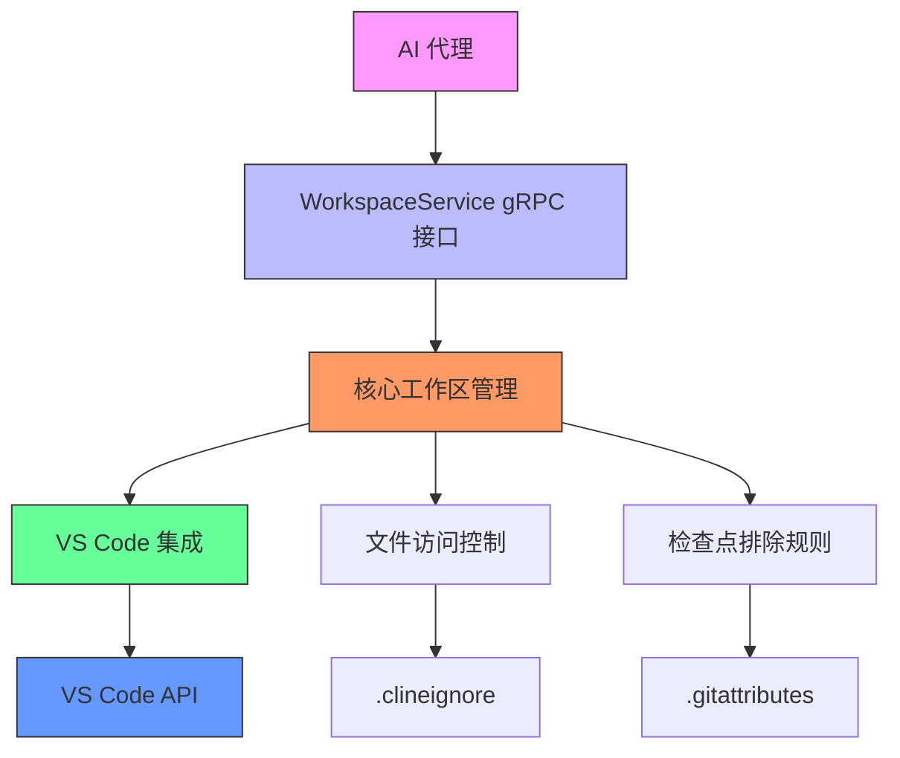
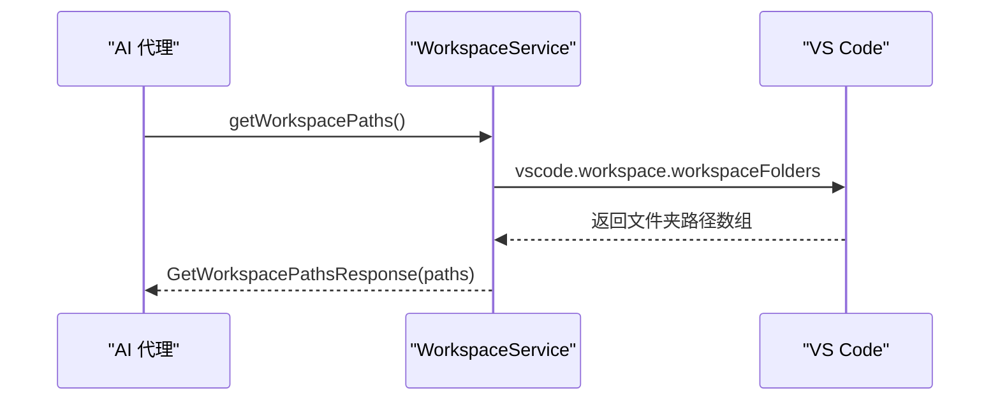
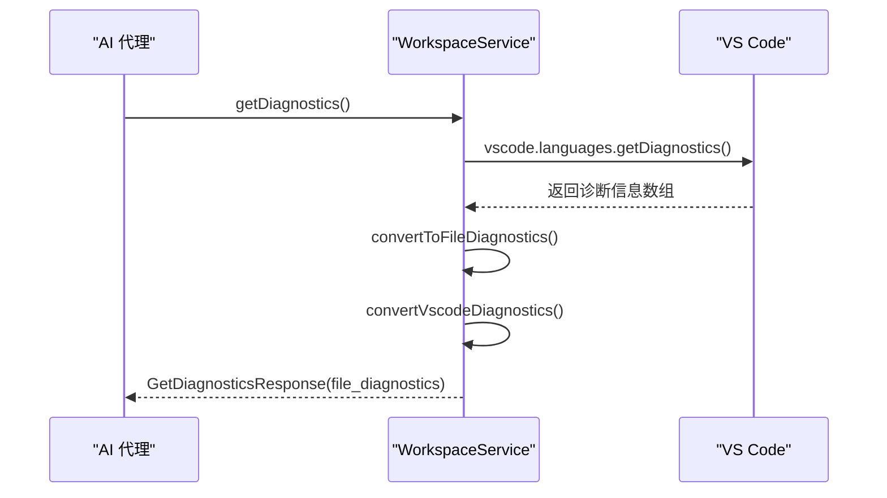
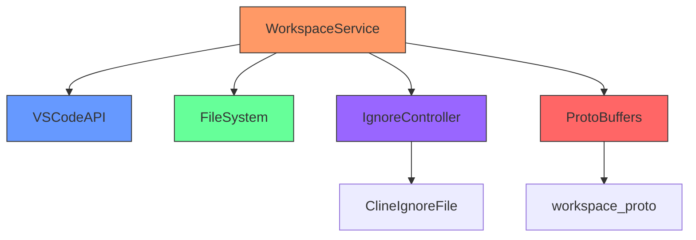

# 工作区服务

<cite>
**本文档中引用的文件**  
- [workspace.proto](file://proto/host/workspace.proto)
- [getDiagnostics.ts](file://src/hosts/vscode/hostbridge/workspace/getDiagnostics.ts)
- [WorkspaceRoot.ts](file://src/core/workspace/WorkspaceRoot.ts)
- [WorkspaceRootManager.ts](file://src/core/workspace/WorkspaceRootManager.ts)
- [getWorkspacePaths.ts](file://src/hosts/vscode/hostbridge/workspace/getWorkspacePaths.ts)
- [ClineIgnoreController.ts](file://src/core/ignore/ClineIgnoreController.ts)
- [CheckpointExclusions.ts](file://src/integrations/checkpoints/CheckpointExclusions.ts)
</cite>

## 目录
1. [简介](#简介)
2. [项目结构](#项目结构)
3. [核心组件](#核心组件)
4. [架构概述](#架构概述)
5. [详细组件分析](#详细组件分析)
6. [依赖分析](#依赖分析)
7. [性能考虑](#性能考虑)
8. [故障排除指南](#故障排除指南)
9. [结论](#结论)

## 简介
工作区服务是 cline 系统的核心组件之一，为 AI 代理提供对项目文件系统的访问能力。该服务通过 gRPC 接口暴露一系列 RPC 方法，使 AI 代理能够获取工作区路径、诊断信息、保存文档等。它在 cline 与 IDE（如 VS Code）之间架起桥梁，支持代码搜索、文件操作和上下文感知功能。特别地，`getDiagnostics` 方法集成了 VS Code 的错误检测系统，使 AI 代理能够感知代码质量问题，从而做出更智能的决策。本文档详细描述 `workspace.proto` 中定义的 WorkspaceService 服务，并提供实际使用示例和最佳实践。

## 项目结构
cline 项目采用模块化结构，工作区相关功能分布在多个目录中。核心工作区逻辑位于 `src/core/workspace`，VS Code 集成实现在 `src/hosts/vscode/hostbridge/workspace`，协议定义在 `proto/host/workspace.proto`。这种分层设计确保了平台无关性与 IDE 特定功能的分离。



**图示来源**  
- [workspace.proto](file://proto/host/workspace.proto)
- [WorkspaceRoot.ts](file://src/core/workspace/WorkspaceRoot.ts)
- [getWorkspacePaths.ts](file://src/hosts/vscode/hostbridge/workspace/getWorkspacePaths.ts)
- [ClineIgnoreController.ts](file://src/core/ignore/ClineIgnoreController.ts)

**节来源**  
- [workspace.proto](file://proto/host/workspace.proto)
- [src/core/workspace](file://src/core/workspace)
- [src/hosts/vscode/hostbridge/workspace](file://src/hosts/vscode/hostbridge/workspace)

## 核心组件
工作区服务的核心组件包括工作区路径管理、诊断信息获取、文件系统访问控制和多工作区支持。`WorkspaceRoot` 和 `WorkspaceRootManager` 类提供了对单个和多个工作区根目录的抽象，而 `getWorkspacePaths` 和 `getDiagnostics` 函数实现了与 VS Code 的具体集成。`ClineIgnoreController` 确保了安全的文件访问控制，防止 AI 代理访问敏感或无关文件。

**节来源**  
- [WorkspaceRoot.ts](file://src/core/workspace/WorkspaceRoot.ts)
- [WorkspaceRootManager.ts](file://src/core/workspace/WorkspaceRootManager.ts)
- [getWorkspacePaths.ts](file://src/hosts/vscode/hostbridge/workspace/getWorkspacePaths.ts)
- [getDiagnostics.ts](file://src/hosts/vscode/hostbridge/workspace/getDiagnostics.ts)
- [ClineIgnoreController.ts](file://src/core/ignore/ClineIgnoreController.ts)

## 架构概述
工作区服务采用分层架构，从上到下分为协议层、核心逻辑层和 IDE 集成层。协议层定义了标准化的 gRPC 接口，核心逻辑层处理工作区状态和业务逻辑，IDE 集成层负责与具体编辑器（如 VS Code）的交互。这种设计实现了良好的解耦，使得 cline 可以轻松支持不同的 IDE。



**图示来源**  
- [workspace.proto](file://proto/host/workspace.proto)
- [WorkspaceRootManager.ts](file://src/core/workspace/WorkspaceRootManager.ts)
- [getDiagnostics.ts](file://src/hosts/vscode/hostbridge/workspace/getDiagnostics.ts)
- [ClineIgnoreController.ts](file://src/core/ignore/ClineIgnoreController.ts)
- [CheckpointExclusions.ts](file://src/integrations/checkpoints/CheckpointExclusions.ts)

## 详细组件分析

### 工作区路径管理分析
`getWorkspacePaths` 方法允许 AI 代理获取当前工作区的所有顶级目录路径。这对于多根工作区项目尤其重要，AI 代理需要了解项目的完整结构才能做出正确的决策。



**图示来源**  
- [getWorkspacePaths.ts](file://src/hosts/vscode/hostbridge/workspace/getWorkspacePaths.ts)

**节来源**  
- [getWorkspacePaths.ts](file://src/hosts/vscode/hostbridge/workspace/getWorkspacePaths.ts)

### 诊断信息集成分析
`getDiagnostics` 方法是 cline 感知代码质量的关键。它从 VS Code 的语言服务中获取所有诊断信息（错误、警告等），并将其转换为标准化格式供 AI 代理使用。



**图示来源**  
- [getDiagnostics.ts](file://src/hosts/vscode/hostbridge/workspace/getDiagnostics.ts)

**节来源**  
- [getDiagnostics.ts](file://src/hosts/vscode/hostbridge/workspace/getDiagnostics.ts)

### 多工作区支持分析
`WorkspaceRootManager` 类提供了对多工作区项目的全面支持，包括主工作区管理、提交哈希更新和工作区摘要生成。

```mermaid
classDiagram
class WorkspaceRootManager {
+roots : WorkspaceRoot[]
+primaryIndex : number
+fromJSON(data) : WorkspaceRootManager
+getSummary() : string
+isSingleRoot() : boolean
+getSingleRoot() : WorkspaceRoot
+updateCommitHashes() : Promise~void~
}
class WorkspaceRoot {
+path : string
+name? : string
+vcs : VcsType
+commitHash? : string
}
enum VcsType {
None
Git
Mercurial
}
WorkspaceRootManager --> WorkspaceRoot : "包含"
```

**图示来源**  
- [WorkspaceRoot.ts](file://src/core/workspace/WorkspaceRoot.ts)
- [WorkspaceRootManager.ts](file://src/core/workspace/WorkspaceRootManager.ts)

**节来源**  
- [WorkspaceRoot.ts](file://src/core/workspace/WorkspaceRoot.ts)
- [WorkspaceRootManager.ts](file://src/core/workspace/WorkspaceRootManager.ts)

## 依赖分析
工作区服务依赖于多个核心组件和外部系统。它依赖 VS Code API 获取工作区和诊断信息，依赖文件系统模块进行路径操作，依赖忽略控制器实现安全访问控制。这些依赖关系确保了服务的功能完整性和安全性。



**图示来源**  
- [workspace.proto](file://proto/host/workspace.proto)
- [getDiagnostics.ts](file://src/hosts/vscode/hostbridge/workspace/getDiagnostics.ts)
- [ClineIgnoreController.ts](file://src/core/ignore/ClineIgnoreController.ts)

**节来源**  
- [workspace.proto](file://proto/host/workspace.proto)
- [src/hosts/vscode/hostbridge/workspace](file://src/hosts/vscode/hostbridge/workspace)
- [src/core/ignore/ClineIgnoreController.ts)

## 性能考虑
对于大型项目，工作区服务的性能优化至关重要。建议实施以下策略：使用 `ClineIgnoreController` 过滤无关文件，避免频繁调用 `getDiagnostics`，利用检查点排除规则减少不必要的文件跟踪。此外，AI 代理应在执行任务前扫描工作区以收集上下文信息，而不是在每次操作时都查询完整状态。

## 故障排除指南
当工作区服务出现问题时，应首先检查 `.clineignore` 文件配置是否正确，确保 VS Code 工作区已正确打开，验证 gRPC 连接状态。对于诊断信息获取失败的情况，检查 VS Code 的语言服务器是否正常运行。使用 `getWorkspacePaths` 方法验证工作区路径是否正确识别。

**节来源**  
- [ClineIgnoreController.ts](file://src/core/ignore/ClineIgnoreController.ts)
- [getWorkspacePaths.ts](file://src/hosts/vscode/hostbridge/workspace/getWorkspacePaths.ts)
- [getDiagnostics.ts](file://src/hosts/vscode/hostbridge/workspace/getDiagnostics.ts)

## 结论
工作区服务是 cline 实现智能代码操作的基础。通过标准化的 gRPC 接口，它为 AI 代理提供了对项目文件系统的全面访问能力，特别是通过 `getDiagnostics` 方法实现了代码质量感知。合理的架构设计和安全控制机制确保了服务的可靠性和安全性。在实际使用中，应遵循性能优化最佳实践，充分利用多工作区支持功能，以实现高效的开发辅助。