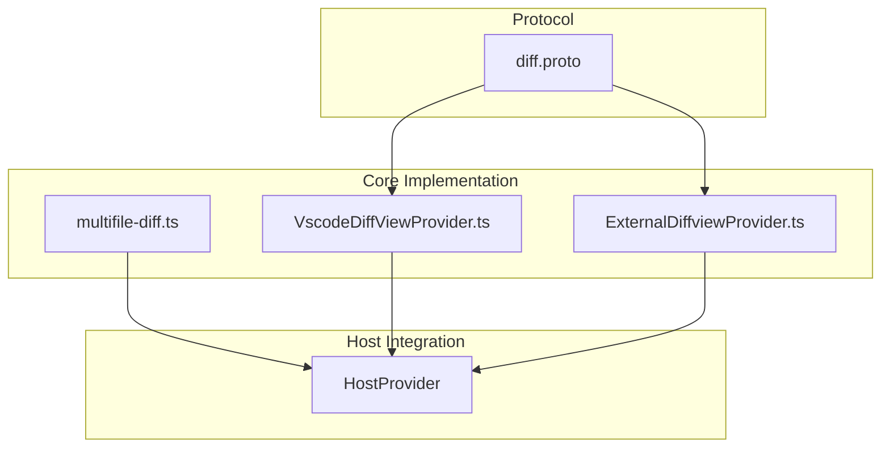
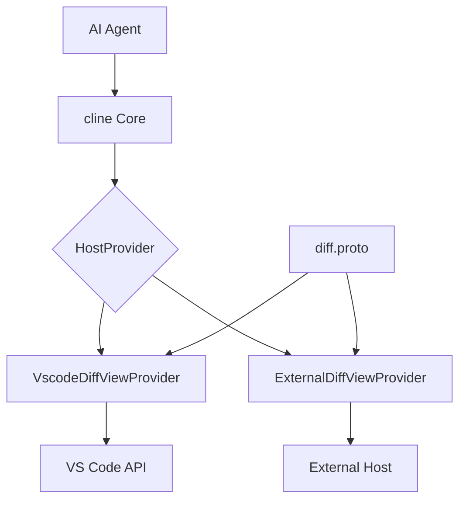
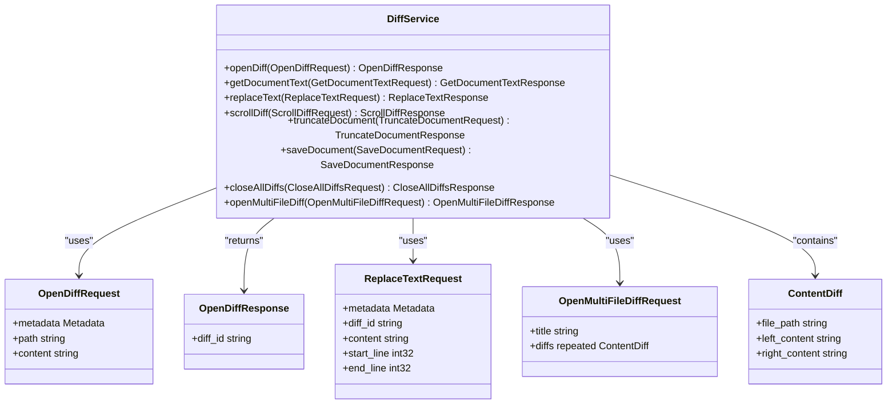
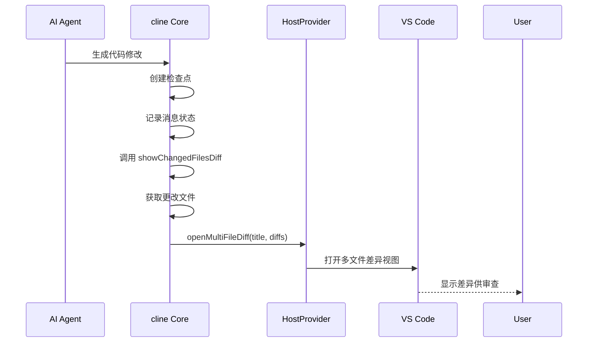
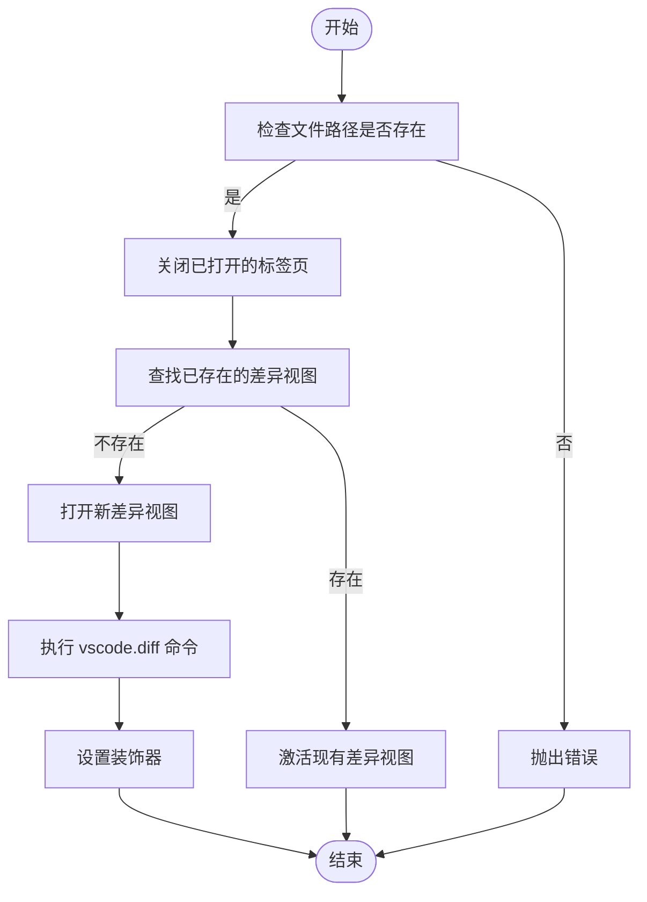
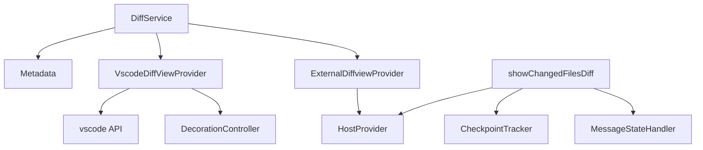

# 差异服务

<cite>
**本文档中引用的文件**  
- [diff.proto](file://proto/host/diff.proto)
- [VscodeDiffViewProvider.ts](file://src/hosts/vscode/VscodeDiffViewProvider.ts)
- [ExternalDiffviewProvider.ts](file://src/hosts/external/ExternalDiffviewProvider.ts)
- [multifile-diff.ts](file://src/core/task/multifile-diff.ts)
</cite>

## 目录
1. [简介](#简介)
2. [项目结构](#项目结构)
3. [核心组件](#核心组件)
4. [架构概述](#架构概述)
5. [详细组件分析](#详细组件分析)
6. [依赖分析](#依赖分析)
7. [性能考虑](#性能考虑)
8. [故障排除指南](#故障排除指南)
9. [结论](#结论)

## 简介
本文档全面描述了 `diff.proto` 中定义的 `DiffService` 服务，详细说明其所有 RPC 方法（如 `OpenDiff`、`OpenMultiFileDiff`、`ReplaceText` 等）的请求和响应消息类型。文档解释了这些接口如何与 VS Code 的差异编辑器功能集成，特别是如何处理多文件差异展示和文本替换操作。此外，还提供了一个实际的调用流程示例：当 AI 代理生成代码修改后，cline 如何通过此服务在 IDE 中打开差异视图供用户审查。文档还记录了与 VS Code API 的对应关系、性能优化建议（如大文件差异处理）以及版本兼容性注意事项。

## 项目结构
`cline` 项目采用模块化结构，主要分为 `proto`、`src`、`evals`、`scripts` 等目录。`proto` 目录存放协议缓冲区定义文件，其中 `host/diff.proto` 定义了 `DiffService` 服务。`src` 目录包含核心逻辑实现，`hosts` 子目录中的 `vscode` 和 `external` 模块分别处理 VS Code 和外部环境的差异视图提供。`core/task` 目录下的 `multifile-diff.ts` 实现了多文件差异展示的业务逻辑。

**Diagram sources**
- [diff.proto](file://proto/host/diff.proto#L1-L108)
- [VscodeDiffViewProvider.ts](file://src/hosts/vscode/VscodeDiffViewProvider.ts#L1-L196)
- [ExternalDiffviewProvider.ts](file://src/hosts/external/ExternalDiffviewProvider.ts#L1-L94)
- [multifile-diff.ts](file://src/core/task/multifile-diff.ts#L1-L122)

**Section sources**
- [diff.proto](file://proto/host/diff.proto#L1-L108)
- [VscodeDiffViewProvider.ts](file://src/hosts/vscode/VscodeDiffViewProvider.ts#L1-L196)

## 核心组件
`DiffService` 是一个 gRPC 服务，提供了一系列用于操作差异视图的方法。核心组件包括：
- `OpenDiffRequest` 和 `OpenDiffResponse`：用于打开单个文件的差异视图。
- `OpenMultiFileDiffRequest` 和 `OpenMultiFileDiffResponse`：用于打开多个文件的差异视图。
- `ReplaceTextRequest` 和 `ReplaceTextResponse`：用于替换差异视图中的文本。
- `GetDocumentTextRequest` 和 `GetDocumentTextResponse`：用于获取差异视图的内容。

这些组件共同构成了一个完整的差异操作 API，允许外部系统（如 AI 代理）与 IDE 的差异编辑器进行交互。

**Section sources**
- [diff.proto](file://proto/host/diff.proto#L1-L108)

## 架构概述
`DiffService` 的架构分为三层：协议层、实现层和集成层。协议层由 `diff.proto` 定义，使用 Protocol Buffers 描述服务接口和消息类型。实现层由 `VscodeDiffViewProvider` 和 `ExternalDiffviewProvider` 提供，分别针对 VS Code 和外部环境实现了 `DiffViewProvider` 抽象类。集成层通过 `HostProvider` 统一暴露这些功能，使得上层业务逻辑可以透明地调用差异服务。

**Diagram sources**
- [diff.proto](file://proto/host/diff.proto#L1-L108)
- [VscodeDiffViewProvider.ts](file://src/hosts/vscode/VscodeDiffViewProvider.ts#L1-L196)
- [ExternalDiffviewProvider.ts](file://src/hosts/external/ExternalDiffviewProvider.ts#L1-L94)
- [HostProvider](file://src/hosts/host-provider.ts)

## 详细组件分析

### DiffService 分析
`DiffService` 是一个 gRPC 服务，定义了多个 RPC 方法来操作差异视图。这些方法包括打开差异视图、替换文本、滚动差异、截断文档、保存文档和关闭所有差异视图。

#### 服务定义

**Diagram sources**
- [diff.proto](file://proto/host/diff.proto#L1-L108)

**Section sources**
- [diff.proto](file://proto/host/diff.proto#L1-L108)

### 多文件差异展示分析
`showChangedFilesDiff` 函数是多文件差异展示的核心实现。它通过 `CheckpointTracker` 获取自上次检查点以来的更改文件，并调用 `HostProvider.diff.openMultiFileDiff` 方法在 IDE 中打开这些文件的差异视图。

#### 调用流程

**Diagram sources**
- [multifile-diff.ts](file://src/core/task/multifile-diff.ts#L1-L122)
- [VscodeDiffViewProvider.ts](file://src/hosts/vscode/VscodeDiffViewProvider.ts#L1-L196)

**Section sources**
- [multifile-diff.ts](file://src/core/task/multifile-diff.ts#L1-L122)

### VS Code 差异视图提供者分析
`VscodeDiffViewProvider` 是 `DiffViewProvider` 的具体实现，负责与 VS Code API 交互以管理差异视图。

#### 实现逻辑

**Diagram sources**
- [VscodeDiffViewProvider.ts](file://src/hosts/vscode/VscodeDiffViewProvider.ts#L1-L196)

**Section sources**
- [VscodeDiffViewProvider.ts](file://src/hosts/vscode/VscodeDiffViewProvider.ts#L1-L196)

## 依赖分析
`DiffService` 的实现依赖于多个组件和模块。主要依赖关系如下：

**Diagram sources**
- [diff.proto](file://proto/host/diff.proto#L1-L108)
- [VscodeDiffViewProvider.ts](file://src/hosts/vscode/VscodeDiffViewProvider.ts#L1-L196)
- [ExternalDiffviewProvider.ts](file://src/hosts/external/ExternalDiffviewProvider.ts#L1-L94)
- [multifile-diff.ts](file://src/core/task/multifile-diff.ts#L1-L122)

**Section sources**
- [diff.proto](file://proto/host/diff.proto#L1-L108)
- [VscodeDiffViewProvider.ts](file://src/hosts/vscode/VscodeDiffViewProvider.ts#L1-L196)
- [ExternalDiffviewProvider.ts](file://src/hosts/external/ExternalDiffviewProvider.ts#L1-L94)
- [multifile-diff.ts](file://src/core/task/multifile-diff.ts#L1-L122)

## 性能考虑
在处理大文件差异时，应注意以下性能优化建议：
- 使用 `truncateDocument` 方法截断过长的差异文档，避免内存溢出。
- 在 `replaceText` 操作中，尽量减少对整个文档的重写，只替换必要的部分。
- 使用 `scrollAnimation` 方法时，控制动画步数以平衡流畅性和性能。
- 对于多文件差异，考虑分批加载文件，避免一次性打开过多文件导致 IDE 响应缓慢。

## 故障排除指南
当差异服务无法正常工作时，可参考以下常见问题及解决方案：

**Section sources**
- [VscodeDiffViewProvider.ts](file://src/hosts/vscode/VscodeDiffViewProvider.ts#L1-L196)
- [ExternalDiffviewProvider.ts](file://src/hosts/external/ExternalDiffviewProvider.ts#L1-L94)

## 结论
`DiffService` 提供了一套完整的 API，用于在 IDE 中操作差异视图。通过 `diff.proto` 定义的 gRPC 接口，cline 能够与 VS Code 或其他外部环境无缝集成，实现代码修改的可视化审查。该服务的设计充分考虑了可扩展性和性能，为 AI 代理与开发者之间的协作提供了坚实的基础。