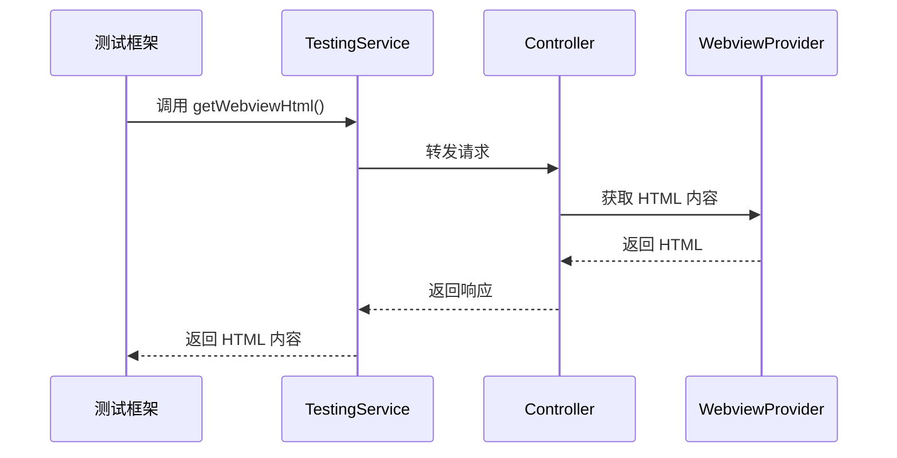
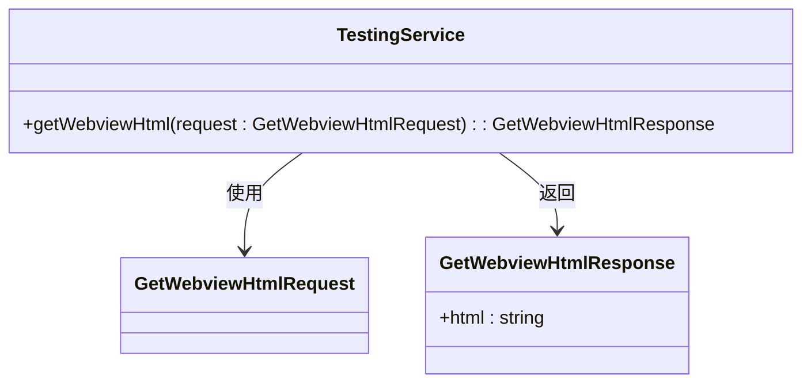
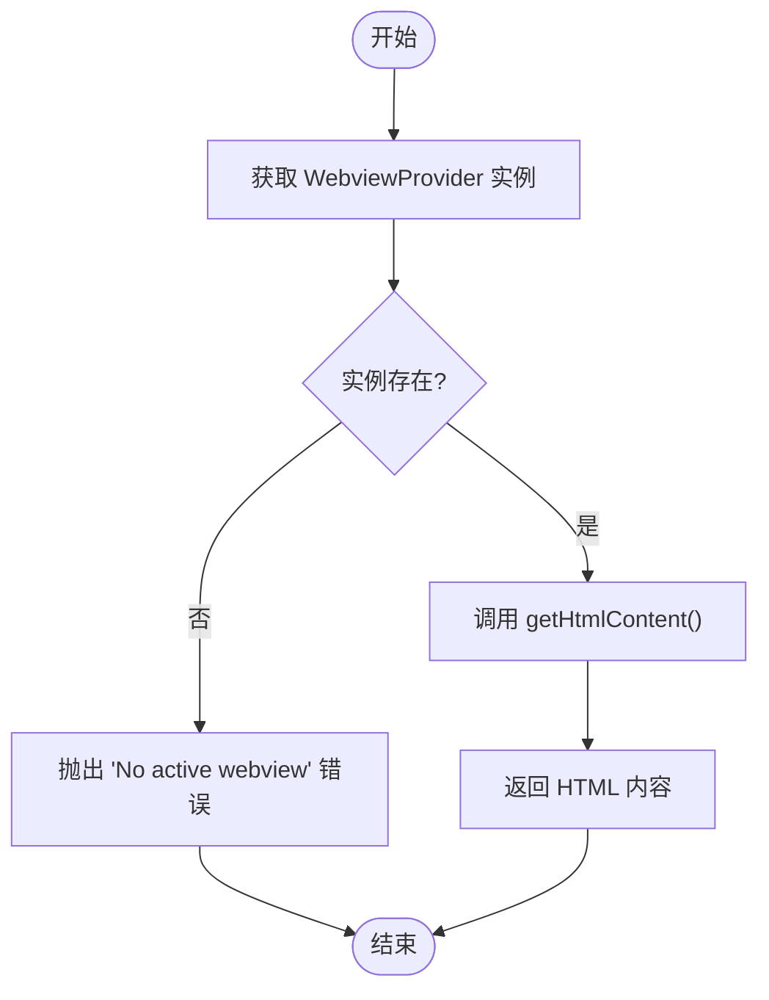
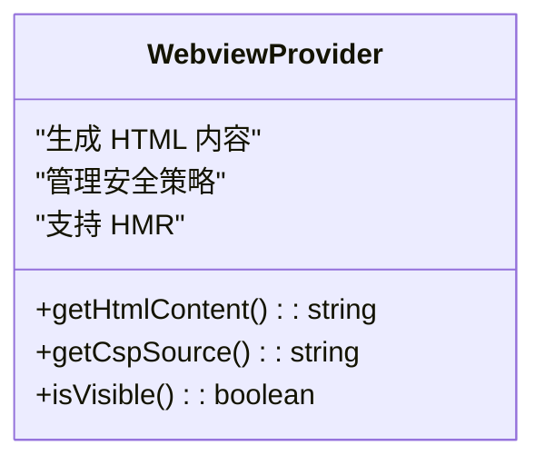
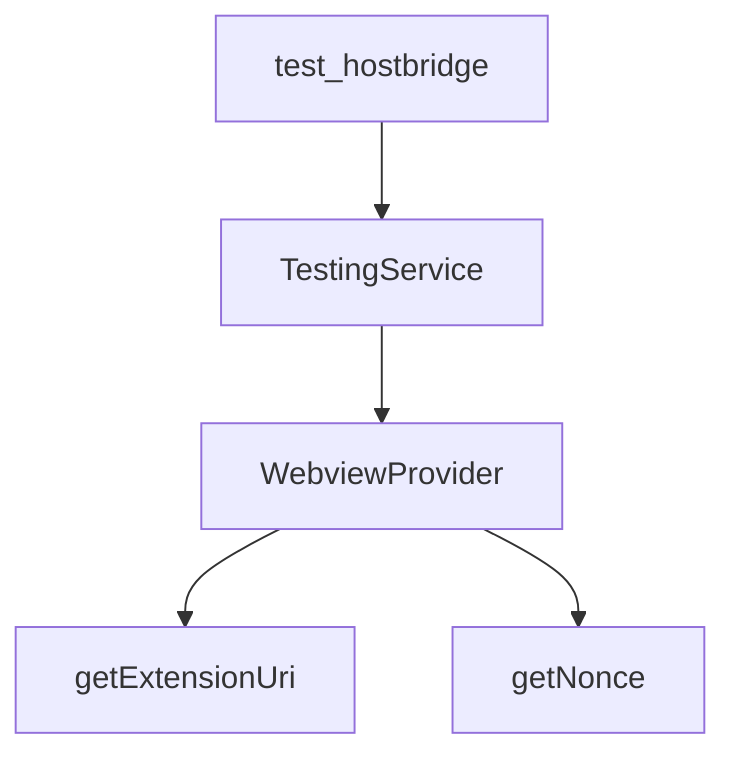

# 测试服务

<cite>
**本文档中引用的文件**  
- [testing.proto](file://proto/host/testing.proto)
- [getWebviewHtml.ts](file://src/core/controller/ui/getWebviewHtml.ts)
- [WebviewProvider.ts](file://src/core/webview/WebviewProvider.ts)
- [getWebviewHtml.ts](file://src/hosts/vscode/hostbridge/testing/getWebviewHtml.ts)
- [playwright.config.ts](file://playwright.config.ts)
- [test-hostbridge-server.ts](file://scripts/test-hostbridge-server.ts)
</cite>

## 目录
1. [简介](#简介)
2. [项目结构](#项目结构)
3. [核心组件](#核心组件)
4. [架构概述](#架构概述)
5. [详细组件分析](#详细组件分析)
6. [依赖分析](#依赖分析)
7. [性能考虑](#性能考虑)
8. [故障排除指南](#故障排除指南)
9. [结论](#结论)

## 简介
本文档详细描述了 `testing.proto` 中定义的 `TestingService` 服务，特别是 `getWebviewHtml` 等 RPC 方法的用途和实现。该服务是 cline 测试基础设施的核心部分，为自动化测试提供必要的接口。文档分析了其在端到端测试中的角色，例如如何为测试框架提供 Webview 内容以进行 UI 验证。此外，还提供了一个实际的测试场景示例：Playwright 测试如何调用此服务来验证 Webview 的渲染正确性，并记录了测试专用接口与生产接口的区别和使用限制。

## 项目结构
`TestingService` 服务定义在 `proto/host/testing.proto` 文件中，其实现分布在核心控制器和主机桥接层中。该服务主要由 `getWebviewHtml` 方法组成，用于获取 Webview 的 HTML 内容。相关的实现文件包括 `src/core/controller/ui/getWebviewHtml.ts` 和 `src/hosts/vscode/hostbridge/testing/getWebviewHtml.ts`。测试平台和 Playwright 配置文件位于 `testing-platform` 和 `src/test/e2e` 目录中，用于执行和验证自动化测试。

```mermaid
graph TB
subgraph "Protocol Definitions"
testing_proto[testing.proto]
end
subgraph "Core Implementation"
getWebviewHtml_controller[getWebviewHtml.ts<br/>(Controller)]
WebviewProvider[WebviewProvider.ts]
end
subgraph "Host Bridge"
getWebviewHtml_bridge[getWebviewHtml.ts<br/>(Host Bridge)]
end
subgraph "Testing Platform"
playwright_config[playwright.config.ts]
test_hostbridge[test-hostbridge-server.ts]
end
testing_proto --> getWebviewHtml_controller
getWebviewHtml_controller --> WebviewProvider
getWebviewHtml_controller --> getWebviewHtml_bridge
test_hostbridge --> getWebviewHtml_bridge
playwright_config --> test_hostbridge
```

**Diagram sources**
- [testing.proto](file://proto/host/testing.proto)
- [getWebviewHtml.ts](file://src/core/controller/ui/getWebviewHtml.ts)
- [WebviewProvider.ts](file://src/core/webview/WebviewProvider.ts)
- [getWebviewHtml.ts](file://src/hosts/vscode/hostbridge/testing/getWebviewHtml.ts)
- [playwright.config.ts](file://playwright.config.ts)
- [test-hostbridge-server.ts](file://scripts/test-hostbridge-server.ts)

**Section sources**
- [testing.proto](file://proto/host/testing.proto)
- [getWebviewHtml.ts](file://src/core/controller/ui/getWebviewHtml.ts)
- [WebviewProvider.ts](file://src/core/webview/WebviewProvider.ts)
- [getWebviewHtml.ts](file://src/hosts/vscode/hostbridge/testing/getWebviewHtml.ts)
- [playwright.config.ts](file://playwright.config.ts)
- [test-hostbridge-server.ts](file://scripts/test-hostbridge-server.ts)

## 核心组件
`TestingService` 是一个 gRPC 服务，专为集成测试而设计，其主要功能是通过 `getWebviewHtml` 方法获取 Webview 的 HTML 内容。该方法在 `src/core/controller/ui/getWebviewHtml.ts` 中实现，通过 `WebviewProvider` 获取当前活动的 Webview 实例并返回其 HTML 内容。在 VS Code 扩展环境中，此方法未实现，因为 HTML 内容直接从 Webview 解析。测试平台通过 `test-hostbridge-server.ts` 中的模拟服务来验证此功能。

**Section sources**
- [testing.proto](file://proto/host/testing.proto#L1-L17)
- [getWebviewHtml.ts](file://src/core/controller/ui/getWebviewHtml.ts#L1-L17)
- [WebviewProvider.ts](file://src/core/webview/WebviewProvider.ts#L117-L149)

## 架构概述
`TestingService` 服务通过 gRPC 协议与测试平台通信。当测试框架调用 `getWebviewHtml` 方法时，请求被路由到核心控制器，控制器通过 `WebviewProvider` 获取 Webview 的 HTML 内容并返回给客户端。在测试环境中，`test-hostbridge-server.ts` 提供了一个模拟的 `TestingService`，用于验证服务的正确性。Playwright 测试框架通过 `playwright.config.ts` 配置的测试环境来执行端到端测试。



**Diagram sources**
- [testing.proto](file://proto/host/testing.proto#L1-L17)
- [getWebviewHtml.ts](file://src/core/controller/ui/getWebviewHtml.ts#L1-L17)
- [WebviewProvider.ts](file://src/core/webview/WebviewProvider.ts#L117-L149)

## 详细组件分析

### TestingService 分析
`TestingService` 是一个简单的 gRPC 服务，仅包含一个 `getWebviewHtml` 方法。该方法在 `testing.proto` 中定义，返回一个包含 HTML 内容的字符串。在核心控制器中，该方法通过 `WebviewProvider` 获取当前活动的 Webview 实例并返回其 HTML 内容。在 VS Code 扩展中，此方法未实现，因为 HTML 内容直接从 Webview 解析。



**Diagram sources**
- [testing.proto](file://proto/host/testing.proto#L1-L17)

**Section sources**
- [testing.proto](file://proto/host/testing.proto#L1-L17)

### getWebviewHtml 方法分析
`getWebviewHtml` 方法在 `src/core/controller/ui/getWebviewHtml.ts` 中实现。该方法首先获取最后一个活动的 `WebviewProvider` 实例，然后调用其 `getHtmlContent` 方法返回 HTML 内容。如果未找到活动的 Webview，则抛出错误。该方法仅用于独立服务，VS Code 扩展直接从 Webview 获取 HTML 内容。



**Diagram sources**
- [getWebviewHtml.ts](file://src/core/controller/ui/getWebviewHtml.ts#L1-L17)
- [WebviewProvider.ts](file://src/core/webview/WebviewProvider.ts#L117-L149)

**Section sources**
- [getWebviewHtml.ts](file://src/core/controller/ui/getWebviewHtml.ts#L1-L17)
- [WebviewProvider.ts](file://src/core/webview/WebviewProvider.ts#L117-L149)

### WebviewProvider 分析
`WebviewProvider` 是一个抽象类，定义了 Webview 的基本行为。`getHtmlContent` 方法生成并返回 Webview 的 HTML 内容，包括 CSS、JavaScript 和安全策略。该方法确保 Webview 的内容安全，并支持热模块替换（HMR）。



**Diagram sources**
- [WebviewProvider.ts](file://src/core/webview/WebviewProvider.ts#L117-L149)

**Section sources**
- [WebviewProvider.ts](file://src/core/webview/WebviewProvider.ts#L117-L149)

## 依赖分析
`TestingService` 依赖于 `WebviewProvider` 来获取 Webview 的 HTML 内容。`WebviewProvider` 依赖于 `getExtensionUri` 和 `getNonce` 等工具函数来生成正确的资源路径和安全策略。测试平台依赖于 `test-hostbridge-server.ts` 中的模拟服务来验证 `TestingService` 的正确性。



**Diagram sources**
- [getWebviewHtml.ts](file://src/core/controller/ui/getWebviewHtml.ts#L1-L17)
- [WebviewProvider.ts](file://src/core/webview/WebviewProvider.ts#L117-L149)
- [test-hostbridge-server.ts](file://scripts/test-hostbridge-server.ts#L15-L47)

**Section sources**
- [getWebviewHtml.ts](file://src/core/controller/ui/getWebviewHtml.ts#L1-L17)
- [WebviewProvider.ts](file://src/core/webview/WebviewProvider.ts#L117-L149)
- [test-hostbridge-server.ts](file://scripts/test-hostbridge-server.ts#L15-L47)

## 性能考虑
`getWebviewHtml` 方法的性能主要取决于 `WebviewProvider` 的 `getHtmlContent` 方法。该方法生成 HTML 内容时需要读取多个资源文件，因此在高频率调用时可能会影响性能。建议在测试中合理使用此方法，避免不必要的调用。

## 故障排除指南
如果 `getWebviewHtml` 方法返回空内容或抛出错误，请检查以下几点：
1. 确保有活动的 Webview 实例。
2. 检查 `WebviewProvider` 的实现是否正确。
3. 确认资源文件路径是否正确。

**Section sources**
- [getWebviewHtml.ts](file://src/core/controller/ui/getWebviewHtml.ts#L1-L17)
- [WebviewProvider.ts](file://src/core/webview/WebviewProvider.ts#L117-L149)

## 结论
`TestingService` 及其 `getWebviewHtml` 方法为 cline 的测试基础设施提供了关键支持。通过该服务，测试框架可以验证 Webview 的渲染正确性，确保 UI 的一致性。文档详细描述了该服务的实现和使用方法，并提供了实际的测试场景示例。建议在测试中合理使用此服务，以提高测试的可靠性和效率。