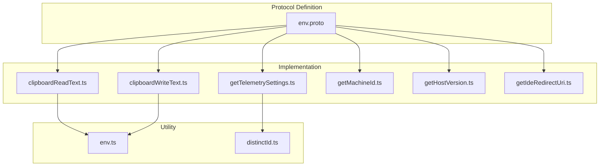
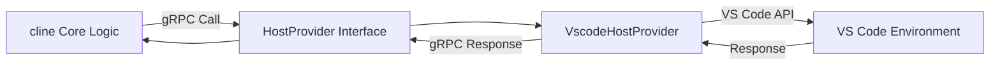
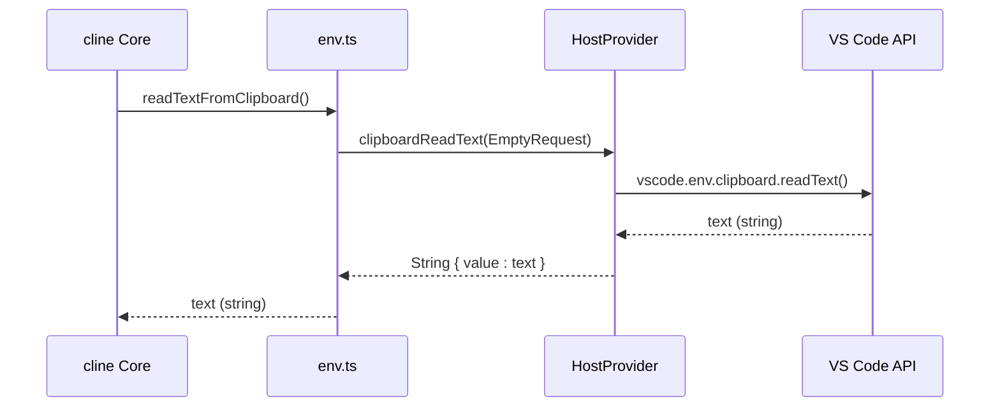
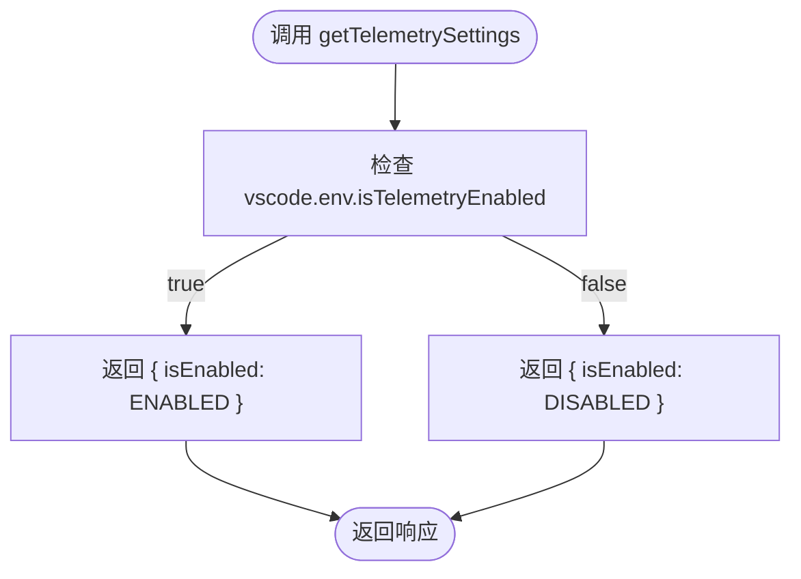
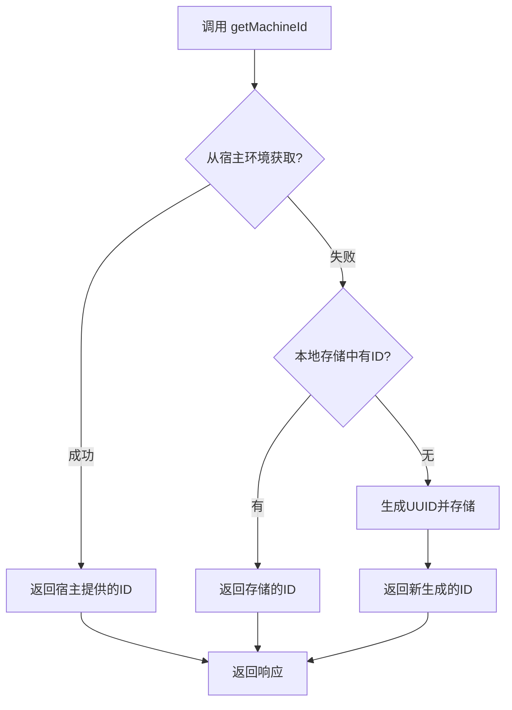
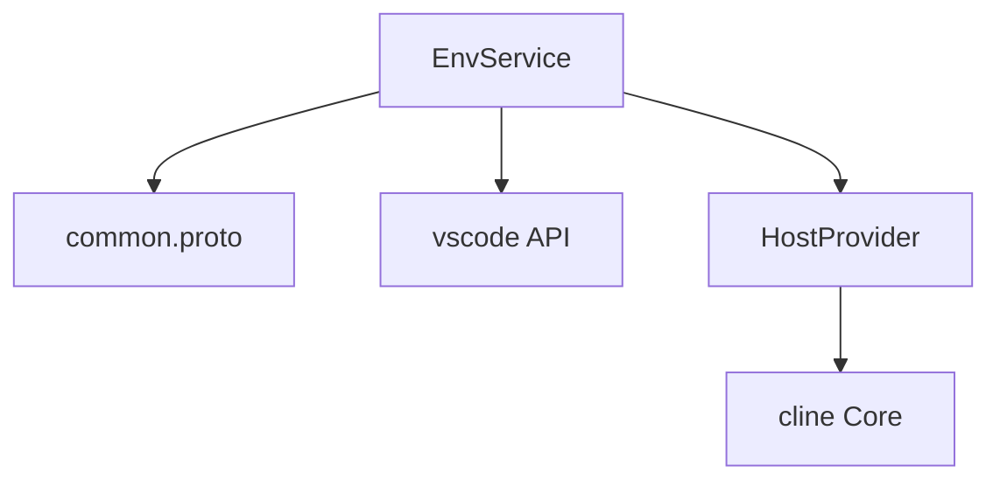

# 环境服务

<cite>
**本文档中引用的文件**  
- [env.proto](file://proto/host/env.proto)
- [clipboardReadText.ts](file://src/hosts/vscode/hostbridge/env/clipboardReadText.ts)
- [clipboardWriteText.ts](file://src/hosts/vscode/hostbridge/env/clipboardWriteText.ts)
- [getTelemetrySettings.ts](file://src/hosts/vscode/hostbridge/env/getTelemetrySettings.ts)
- [env.ts](file://src/utils/env.ts)
- [distinctId.ts](file://src/services/logging/distinctId.ts)
</cite>

## 目录
1. [简介](#简介)
2. [项目结构](#项目结构)
3. [核心组件](#核心组件)
4. [架构概述](#架构概述)
5. [详细组件分析](#详细组件分析)
6. [依赖分析](#依赖分析)
7. [性能考量](#性能考量)
8. [故障排除指南](#故障排除指南)
9. [结论](#结论)

## 简介
`EnvService` 是 `cline` 系统中的核心服务之一，定义于 `proto/host/env.proto` 文件中。该服务为 `cline` 提供了一套统一的接口，用于抽象化底层集成开发环境（IDE）的各种环境信息和功能，如主机版本、机器标识、重定向 URI 以及剪贴板读写等。通过此服务，`cline` 能够以一致的方式访问不同 IDE（如 VS Code、IntelliJ IDEA 等）的环境信息，从而实现跨平台兼容性。特别地，`getTelemetrySettings` 和 `subscribeToTelemetrySettings` 方法支持对遥测功能进行动态配置与监控。本文档将详细描述该服务的各个 RPC 方法，并通过实际示例说明其应用。

## 项目结构
`EnvService` 的定义位于 `proto/host/` 目录下的 `env.proto` 文件中。其具体的实现逻辑分散在 `src/hosts/vscode/hostbridge/env/` 目录下的多个 TypeScript 文件中，每个文件对应一个 RPC 方法的实现。这些实现通过 `HostProvider` 接口与上层业务逻辑解耦，确保了核心逻辑的可移植性。

**Diagram sources**
- [env.proto](file://proto/host/env.proto#L1-L55)
- [clipboardReadText.ts](file://src/hosts/vscode/hostbridge/env/clipboardReadText.ts#L1-L8)
- [clipboardWriteText.ts](file://src/hosts/vscode/hostbridge/env/clipboardWriteText.ts#L1-L8)
- [getTelemetrySettings.ts](file://src/hosts/vscode/hostbridge/env/getTelemetrySettings.ts#L1-L12)
- [distinctId.ts](file://src/services/logging/distinctId.ts#L1-L35)

**Section sources**
- [env.proto](file://proto/host/env.proto#L1-L55)
- [src/hosts/vscode/hostbridge/env/](file://src/hosts/vscode/hostbridge/env/)

## 核心组件
`EnvService` 的核心组件是其定义的七个 RPC 方法，它们共同构成了 `cline` 与宿主 IDE 环境交互的基础。这些方法包括 `clipboardWriteText` 和 `clipboardReadText` 用于剪贴板操作，`getMachineId` 用于获取设备唯一标识，`getHostVersion` 用于获取 IDE 信息，`getIdeRedirectUri` 用于生成重定向链接，以及 `getTelemetrySettings` 和 `subscribeToTelemetrySettings` 用于遥测配置。这些方法的实现位于 `src/hosts/vscode/hostbridge/env/` 目录下，通过调用 VS Code 的原生 API 完成具体功能。

**Section sources**
- [env.proto](file://proto/host/env.proto#L1-L55)
- [src/hosts/vscode/hostbridge/env/](file://src/hosts/vscode/hostbridge/env/)

## 架构概述
`EnvService` 采用 gRPC 作为通信协议，实现了清晰的客户端-服务器架构。`cline` 核心逻辑作为客户端，通过 `HostProvider` 调用 `EnvService` 的方法。`HostProvider` 作为抽象层，其具体实现（如 `VscodeHostProvider`）负责将 gRPC 请求转发给 VS Code 的原生 API。这种分层设计使得 `cline` 的核心逻辑不依赖于任何特定的 IDE，从而保证了其可扩展性和可维护性。

**Diagram sources**
- [env.proto](file://proto/host/env.proto#L1-L55)
- [env.ts](file://src/utils/env.ts#L1-L44)
- [clipboardReadText.ts](file://src/hosts/vscode/hostbridge/env/clipboardReadText.ts#L1-L8)

## 详细组件分析

### 剪贴板操作分析
`EnvService` 提供了 `clipboardWriteText` 和 `clipboardReadText` 两个方法，用于实现对系统剪贴板的读写。`cline` 的上层逻辑通过 `writeTextToClipboard` 和 `readTextFromClipboard` 这两个工具函数来调用这些服务。这些工具函数封装了 gRPC 调用的细节，并处理了可能发生的错误。

#### 剪贴板读取流程

**Diagram sources**
- [env.ts](file://src/utils/env.ts#L20-L35)
- [clipboardReadText.ts](file://src/hosts/vscode/hostbridge/env/clipboardReadText.ts#L1-L8)

### 遥测设置分析
`getTelemetrySettings` 方法用于查询当前宿主环境的遥测设置状态。在 VS Code 实现中，该方法直接查询 `vscode.env.isTelemetryEnabled` 的布尔值，并将其映射为 proto 定义的 `Setting` 枚举（`ENABLED` 或 `DISABLED`）。`subscribeToTelemetrySettings` 方法则提供了一个流式接口，允许 `cline` 订阅遥测设置的变更事件，从而实现动态响应。

#### 遥测设置获取

**Diagram sources**
- [getTelemetrySettings.ts](file://src/hosts/vscode/hostbridge/env/getTelemetrySettings.ts#L1-L12)

### 机器标识分析
`getMachineId` 方法用于获取一个稳定的机器标识符，主要用于遥测数据的去重。在 VS Code 环境中，如果宿主环境未能提供机器 ID，`cline` 会生成一个 UUID 并将其存储在全局状态中，以确保后续调用返回相同的标识符。

#### 机器ID获取流程

**Diagram sources**
- [distinctId.ts](file://src/services/logging/distinctId.ts#L1-L35)

## 依赖分析
`EnvService` 的实现依赖于多个关键组件。首先，它依赖于 `@shared/proto` 包中的 `common.proto` 定义，以使用 `StringRequest`、`Empty` 等基础消息类型。其次，其 VS Code 实现直接依赖于 `vscode` 模块的 API，如 `vscode.env.clipboard` 和 `vscode.env.isTelemetryEnabled`。此外，`HostProvider` 作为核心抽象层，是 `cline` 核心逻辑与 `EnvService` 之间的桥梁。

**Diagram sources**
- [env.proto](file://proto/host/env.proto#L6)
- [clipboardReadText.ts](file://src/hosts/vscode/hostbridge/env/clipboardReadText.ts#L2)
- [env.ts](file://src/utils/env.ts#L4)

**Section sources**
- [env.proto](file://proto/host/env.proto#L1-L55)
- [clipboardReadText.ts](file://src/hosts/vscode/hostbridge/env/clipboardReadText.ts#L1-L8)
- [env.ts](file://src/utils/env.ts#L1-L44)

## 性能考量
`EnvService` 的所有方法均为轻量级的同步或异步查询，通常具有极低的延迟。剪贴板操作和环境信息查询都直接调用宿主 IDE 的原生 API，性能开销可以忽略不计。流式方法 `subscribeToTelemetrySettings` 仅在设置发生变更时才发送事件，避免了不必要的轮询，是一种高效的事件通知机制。

## 故障排除指南
当 `EnvService` 功能异常时，应首先检查 `HostProvider` 是否正确初始化。对于剪贴板操作失败，需确认 `HostProvider.env` 接口是否可用，并检查 gRPC 调用的错误日志。若 `getMachineId` 返回的 ID 不稳定，应检查 `distinctId` 的存储逻辑是否正常工作。遥测设置相关问题通常源于 `vscode.env.isTelemetryEnabled` 的值与预期不符，这可能与 VS Code 的用户设置有关。

**Section sources**
- [env.ts](file://src/utils/env.ts#L10-L35)
- [distinctId.ts](file://src/services/logging/distinctId.ts#L1-L35)

## 结论
`EnvService` 成功地为 `cline` 提供了一个强大且一致的环境抽象层。它不仅封装了跨平台的环境信息访问，还通过流式 API 支持了动态的遥测配置。其清晰的分层架构和模块化设计确保了代码的可维护性和可扩展性。通过 `HostProvider` 模式，`cline` 能够轻松适配新的 IDE 环境，而无需修改核心业务逻辑。