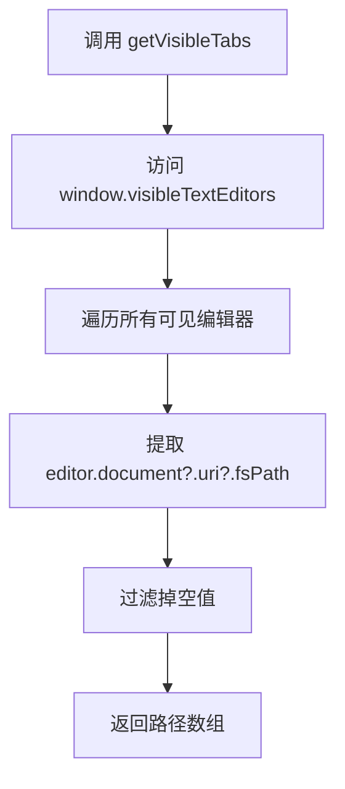
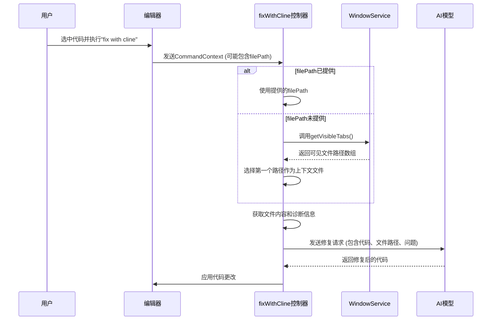

# 窗口服务

<cite>
**本文档中引用的文件**  
- [window.proto](file://proto/host/window.proto)
- [getOpenTabs.ts](file://src/hosts/vscode/hostbridge/window/getOpenTabs.ts)
- [getVisibleTabs.ts](file://src/hosts/vscode/hostbridge/window/getVisibleTabs.ts)
- [fixWithCline.ts](file://src/core/controller/commands/fixWithCline.ts)
</cite>

## 目录
1. [简介](#简介)
2. [核心功能概述](#核心功能概述)
3. [WindowService 服务详解](#windowservice-服务详解)
4. [获取打开和可见标签页](#获取打开和可见标签页)
5. [实际应用示例：fix with cline 命令](#实际应用示例：fix-with-cline-命令)
6. [性能影响与最佳实践](#性能影响与最佳实践)
7. [结论](#结论)

## 简介
窗口服务（WindowService）是 `cline` IDE 扩展的核心组件之一，负责管理集成开发环境（IDE）的用户界面状态和用户交互。该服务通过 gRPC 接口暴露一系列远程过程调用（RPC）方法，使 `cline` 能够控制 IDE 的窗口、编辑器、文件标签页和消息提示等 UI 元素。通过此服务，AI 代理可以感知用户的上下文环境，执行文件操作，并与用户进行交互，从而实现智能化的代码辅助功能。

## 核心功能概述
窗口服务提供了对 IDE 窗口和编辑器的全面控制能力，主要功能包括：
- **文件操作**：打开文件、显示文本文档、打开文件选择对话框。
- **用户交互**：显示消息框、提示用户输入、打开设置界面。
- **状态查询**：获取当前活动编辑器、查询所有打开的标签页和当前可见的标签页。
这些功能共同构成了 `cline` 与 IDE 用户界面交互的基础，使其能够根据上下文执行精确的操作。

## WindowService 服务详解

`WindowService` 在 `window.proto` 文件中定义，提供了以下关键的 RPC 方法：

| 方法名 | 请求类型 | 响应类型 | 功能描述 |
| :--- | :--- | :--- | :--- |
| `showTextDocument` | `ShowTextDocumentRequest` | `TextEditorInfo` | 在 IDE 编辑器中打开一个文本文档并返回编辑器信息。 |
| `showOpenDialogue` | `ShowOpenDialogueRequest` | `SelectedResources` | 显示文件打开对话框，允许用户选择一个或多个文件。 |
| `showMessage` | `ShowMessageRequest` | `SelectedResponse` | 在 IDE 中显示一个通知消息（错误、信息或警告），并可提供可选的响应按钮。 |
| `showInputBox` | `ShowInputBoxRequest` | `ShowInputBoxResponse` | 弹出一个输入框，提示用户输入文本，并返回用户输入的内容。 |
| `showSaveDialog` | `ShowSaveDialogRequest` | `ShowSaveDialogResponse` | 显示文件保存对话框，允许用户选择保存路径。 |
| `openFile` | `OpenFileRequest` | `OpenFileResponse` | 直接在 IDE 中打开指定路径的文件。 |
| `openSettings` | `OpenSettingsRequest` | `OpenSettingsResponse` | 打开主机（IDE）的设置界面，可选择性地聚焦到特定的设置项。 |
| `getOpenTabs` | `GetOpenTabsRequest` | `GetOpenTabsResponse` | 获取当前所有已打开的文件标签页的路径列表。 |
| `getVisibleTabs` | `GetVisibleTabsRequest` | `GetVisibleTabsResponse` | 获取当前所有可见的文件标签页的路径列表。 |
| `getActiveEditor` | `GetActiveEditorRequest` | `GetActiveEditorResponse` | 获取当前处于活动状态的编辑器的文件路径。 |

**Section sources**
- [window.proto](file://proto/host/window.proto#L1-L163)

## 获取打开和可见标签页

`getOpenTabs` 和 `getVisibleTabs` 是两个至关重要的方法，它们使 `cline` 能够理解用户当前的工作上下文。

### getOpenTabs 方法
此方法返回 IDE 中所有已打开的文件标签页的路径。无论标签页是否在当前视图中可见，只要文件被打开过，其路径就会包含在返回的列表中。该方法的实现依赖于 VS Code 的 `window.tabGroups.all` API，遍历所有标签组和标签，提取其 URI 路径。

```mermaid
flowchart TD
A[调用 getOpenTabs] --> B[访问 window.tabGroups.all]
B --> C[遍历所有标签组]
C --> D[遍历每个组内的所有标签]
D --> E[提取 (tab.input as TabInputText)?.uri?.fsPath]
E --> F[过滤掉空值]
F --> G[返回路径数组]
```

**Diagram sources**
- [getOpenTabs.ts](file://src/hosts/vscode/hostbridge/window/getOpenTabs.ts#L1-L11)

### getVisibleTabs 方法
此方法返回当前在 IDE 界面中实际可见的文件标签页的路径。只有当一个编辑器被显示在某个视图列（ViewColumn）中，并且没有被其他标签页完全遮挡时，它才被认为是“可见”的。该方法的实现直接使用 VS Code 的 `window.visibleTextEditors` API，获取所有可见文本编辑器的文档路径。



**Diagram sources**
- [getVisibleTabs.ts](file://src/hosts/vscode/hostbridge/window/getVisibleTabs.ts#L1-L8)

### 区别与应用场景
- **`getOpenTabs`** 反映了用户的“工作集”，即用户最近处理过的所有文件。这对于理解用户的长期上下文非常有用。
- **`getVisibleTabs`** 反映了用户的“当前焦点”，即用户此刻正在查看的文件。这对于理解用户的即时意图至关重要。
例如，当用户执行“修复”命令时，`cline` 会优先考虑 `getVisibleTabs` 的结果，因为用户最可能希望修复当前正在查看的代码。

**Section sources**
- [getOpenTabs.ts](file://src/hosts/vscode/hostbridge/window/getOpenTabs.ts#L1-L11)
- [getVisibleTabs.ts](file://src/hosts/vscode/hostbridge/window/getVisibleTabs.ts#L1-L8)

## 实际应用示例：fix with cline 命令

当用户在编辑器中选中一段代码并执行“fix with cline”命令时，`cline` 会通过窗口服务来确定上下文文件。其工作流程如下：

1.  **命令触发**：用户在编辑器中右键点击，选择“fix with cline”。
2.  **上下文获取**：`cline` 的 `fixWithCline` 控制器函数被调用。它首先尝试从 `CommandContext` 请求中获取 `filePath`。
3.  **上下文推断**：如果 `filePath` 未提供（例如，用户在聊天界面手动触发），`cline` 会调用 `getVisibleTabs` 方法。
4.  **确定目标文件**：`getVisibleTabs` 返回一个路径数组。`cline` 通常会选择第一个（或唯一一个）可见的标签页作为上下文文件。如果没有任何标签页可见，则可能使用 `getActiveEditor` 作为后备方案。
5.  **任务初始化**：一旦确定了目标文件路径，`cline` 就会使用该路径和选中的文本内容来初始化一个新的任务，并向 AI 模型发送修复请求。



**Diagram sources**
- [fixWithCline.ts](file://src/core/controller/commands/fixWithCline.ts#L1-L20)
- [window.proto](file://proto/host/window.proto#L30-L32)

**Section sources**
- [fixWithCline.ts](file://src/core/controller/commands/fixWithCline.ts#L1-L20)

## 性能影响与最佳实践

### 性能影响
频繁地调用 `getOpenTabs` 或 `getVisibleTabs` 等查询方法通常性能开销很低，因为它们只是读取 IDE 的当前状态。然而，仍需注意以下几点：
- **过度查询**：在短时间内进行大量不必要的查询可能会对主线程造成轻微负担，尤其是在大型项目中。
- **网络延迟**：在远程开发场景下，gRPC 调用会引入网络延迟，频繁调用会影响用户体验。

### 最佳实践
- **缓存结果**：对于短时间内不会频繁变化的状态（如打开的标签页列表），`cline` 应在客户端进行缓存，避免重复查询。
- **按需调用**：仅在真正需要上下文信息时才调用这些方法。例如，在用户执行命令时获取一次即可，而不是在后台持续轮询。
- **合并请求**：如果可能，将多个状态查询合并为一个更复杂的请求，以减少 gRPC 调用次数。
- **使用合适的 API**：明确区分 `getOpenTabs` 和 `getVisibleTabs` 的用途。在需要了解用户当前焦点时使用后者，避免使用前者进行不必要的遍历。

## 结论
窗口服务是 `cline` 实现智能代码辅助的核心桥梁。通过 `getOpenTabs` 和 `getVisibleTabs` 等方法，`cline` 能够精准地感知用户的上下文环境，从而在执行“fix with cline”等命令时，自动确定目标文件，提供无缝且智能的用户体验。开发者在使用这些 API 时，应遵循性能最佳实践，确保功能强大且响应迅速。