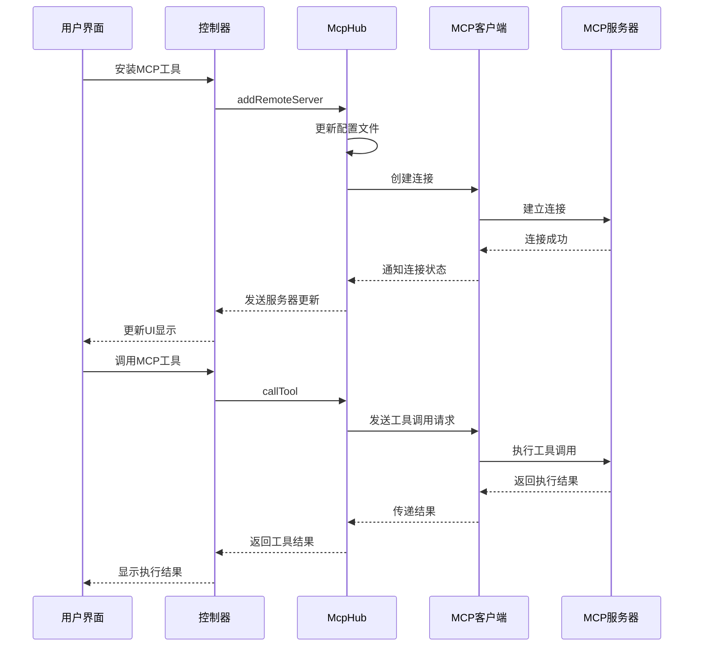
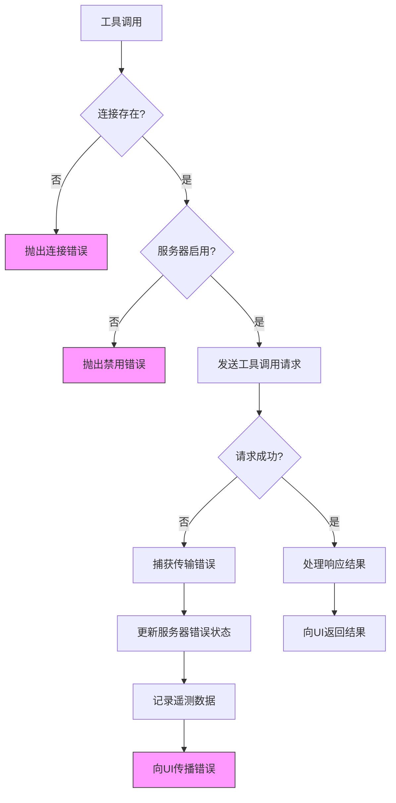

# MCP服务

<cite>
**本文档引用的文件**  
- [mcp.proto](file://proto/cline/mcp.proto)
- [McpHub.ts](file://src/services/mcp/McpHub.ts)
- [addRemoteMcpServer.ts](file://src/core/controller/mcp/addRemoteMcpServer.ts)
- [updateMcpTimeout.ts](file://src/core/controller/mcp/updateMcpTimeout.ts)
- [UseMcpToolHandler.ts](file://src/core/task/tools/handlers/UseMcpToolHandler.ts)
- [AccessMcpResourceHandler.ts](file://src/core/task/tools/handlers/AccessMcpResourceHandler.ts)
- [subscribeToMcpServers.ts](file://src/core/controller/mcp/subscribeToMcpServers.ts)
- [downloadMcp.ts](file://src/core/controller/mcp/downloadMcp.ts)
- [constants.ts](file://src/services/mcp/constants.ts)
</cite>

## 目录
1. [简介](#简介)
2. [RPC方法签名](#rpc方法签名)
3. [消息定义](#消息定义)
4. [MCP Marketplace集成流程](#mcp-marketplace集成流程)
5. [工具调用执行流程](#工具调用执行流程)
6. [沙箱执行与超时控制](#沙箱执行与超时控制)
7. [错误传播机制](#错误传播机制)

## 简介
MCP（Model Context Protocol）服务为系统提供与本地运行的MCP服务器通信的能力，通过扩展工具和资源来增强系统功能。该服务基于gRPC协议实现，支持动态管理MCP服务器、调用工具、访问资源以及与MCP Marketplace集成。本文档详细描述了MCP服务的API接口、配置结构、集成流程以及核心执行机制。

## RPC方法签名

### 服务定义
```protobuf
service McpService {
  rpc toggleMcpServer(ToggleMcpServerRequest) returns (McpServers);
  rpc updateMcpTimeout(UpdateMcpTimeoutRequest) returns (McpServers);
  rpc addRemoteMcpServer(AddRemoteMcpServerRequest) returns (McpServers);
  rpc downloadMcp(StringRequest) returns (McpDownloadResponse);
  rpc restartMcpServer(StringRequest) returns (McpServers);
  rpc deleteMcpServer(StringRequest) returns (McpServers);
  rpc toggleToolAutoApprove(ToggleToolAutoApproveRequest) returns (McpServers);
  rpc refreshMcpMarketplace(EmptyRequest) returns (McpMarketplaceCatalog);
  rpc openMcpSettings(EmptyRequest) returns (Empty);
  
  // 订阅MCP市场目录更新
  rpc subscribeToMcpMarketplaceCatalog(EmptyRequest) returns (stream McpMarketplaceCatalog);
  rpc getLatestMcpServers(Empty) returns (McpServers);
  
  // 订阅MCP服务器更新
  rpc subscribeToMcpServers(EmptyRequest) returns (stream McpServers);
}
```

### 方法说明
- **toggleMcpServer**: 切换MCP服务器的启用/禁用状态
- **updateMcpTimeout**: 更新MCP服务器的超时配置
- **addRemoteMcpServer**: 添加远程MCP服务器
- **downloadMcp**: 从Marketplace下载MCP服务器
- **restartMcpServer**: 重启MCP服务器连接
- **deleteMcpServer**: 删除MCP服务器
- **toggleToolAutoApprove**: 切换工具的自动批准状态
- **refreshMcpMarketplace**: 刷新MCP Marketplace目录
- **openMcpSettings**: 打开MCP设置
- **subscribeToMcpMarketplaceCatalog**: 订阅MCP Marketplace目录更新流
- **getLatestMcpServers**: 获取最新的MCP服务器列表
- **subscribeToMcpServers**: 订阅MCP服务器更新流

**Section sources**
- [mcp.proto](file://proto/cline/mcp.proto#L10-L35)

## 消息定义

### MCP服务器配置
```protobuf
message McpServer {
  string name = 1;
  string config = 2;
  McpServerStatus status = 3;
  optional string error = 4;
  repeated McpTool tools = 5;
  repeated McpResource resources = 6;
  repeated McpResourceTemplate resource_templates = 7;
  optional bool disabled = 8;
  optional int32 timeout = 9;
}
```

### 工具调用请求和响应
```protobuf
message McpTool {
  string name = 1;
  optional string description = 2;
  optional string input_schema = 3;
  optional bool auto_approve = 4;
}

message McpResource {
  string uri = 1;
  string name = 2;
  optional string mime_type = 3;
  optional string description = 4;
}

enum McpServerStatus {
  MCP_SERVER_STATUS_DISCONNECTED = 0;
  MCP_SERVER_STATUS_CONNECTED = 1;
  MCP_SERVER_STATUS_CONNECTING = 2;
}
```

### MCP Marketplace项目
```protobuf
message McpMarketplaceItem {
  string mcp_id = 1;
  string github_url = 2;
  string name = 3;
  string author = 4;
  string description = 5;
  string codicon_icon = 6;
  string logo_url = 7;
  string category = 8;
  repeated string tags = 9;
  bool requires_api_key = 10;
  optional string readme_content = 11;
  optional string llms_installation_content = 12;
  bool is_recommended = 13;
  int32 github_stars = 14;
  int32 download_count = 15;
  string created_at = 16;
  string updated_at = 17;
  string last_github_sync = 18;
}
```

**Section sources**
- [mcp.proto](file://proto/cline/mcp.proto#L37-L132)

## MCP Marketplace集成流程

### 集成步骤
1. **获取Marketplace目录**: 通过`refreshMcpMarketplace`方法获取最新的MCP服务器目录
2. **下载MCP服务器**: 调用`downloadMcp`方法，传入MCP ID从Marketplace下载服务器
3. **添加远程服务器**: 使用`addRemoteMcpServer`方法将下载的服务器添加到配置中
4. **建立连接**: 系统自动尝试连接新添加的服务器
5. **订阅更新**: 通过`subscribeToMcpServers`订阅服务器状态更新

### 下载流程实现
```typescript
export async function downloadMcp(controller: Controller, request: StringRequest): Promise<McpDownloadResponse> {
  try {
    if (!request.value) {
      throw new Error("MCP ID is required")
    }

    const mcpId = request.value
    const servers = controller.mcpHub?.getServers() || []
    const isInstalled = servers.some((server: McpServer) => server.name === mcpId)

    if (isInstalled) {
      throw new Error("This MCP server is already installed")
    }

    const response = await axios.post<McpDownloadResponse>(
      `${clineEnvConfig.mcpBaseUrl}/download`,
      { mcpId },
      {
        headers: { "Content-Type": "application/json" },
        timeout: 10000,
      },
    )

    if (!response.data) {
      throw new Error("Invalid response from MCP marketplace API")
    }

    return McpDownloadResponse.create(response.data)
  } catch (error) {
    console.error(`Failed to download MCP server ${request.value}:`, error)
    throw error
  }
}
```

**Section sources**
- [mcp.proto](file://proto/cline/mcp.proto#L23-L24)
- [downloadMcp.ts](file://src/core/controller/mcp/downloadMcp.ts#L0-L43)

## 工具调用执行流程

### 通信链路建立
当用户通过UI安装并调用MCP工具时，完整的通信链路如下：



**Diagram sources**
- [mcp.proto](file://proto/cline/mcp.proto#L10-L35)
- [McpHub.ts](file://src/services/mcp/McpHub.ts#L39-L1154)
- [UseMcpToolHandler.ts](file://src/core/task/tools/handlers/UseMcpToolHandler.ts#L126-L159)

### 工具调用处理
```typescript
const toolResult = await config.services.mcpHub.callTool(server_name, tool_name, parsedArguments, config.ulid)

// 检查调用后的通知
const notificationsAfter = config.services.mcpHub.getPendingNotifications()
for (const notification of notificationsAfter) {
  await config.callbacks.say("mcp_notification", `[${notification.serverName}] ${notification.message}`)
}

// 处理工具结果
const toolResultImages =
  toolResult?.content
    .filter((item: any) => item.type === "image")
    .map((item: any) => `data:${item.mimeType};base64,${item.data}`) || []

let toolResultText =
  (toolResult?.isError ? "Error:\n" : "") +
    toolResult?.content
      .map((item: any) => {
        if (item.type === "text") {
          return item.text
        }
        if (item.type === "resource") {
          const { blob: _blob, ...rest } = item.resource
          return JSON.stringify(rest, null, 2)
        }
        return ""
      })
      .filter(Boolean)
      .join("\n\n") || "(No response)"

// webview提取图像以在UI中显示
const toolResultToDisplay = toolResultText + toolResultImages?.map((image: any) => `\n\n${image}`).join("")
await config.callbacks.say("mcp_server_response", toolResultToDisplay)
```

**Section sources**
- [UseMcpToolHandler.ts](file://src/core/task/tools/handlers/UseMcpToolHandler.ts#L126-L159)
- [AccessMcpResourceHandler.ts](file://src/core/task/tools/handlers/AccessMcpResourceHandler.ts#L101-L124)

## 沙箱执行与超时控制

### 沙箱执行机制
MCP工具在独立的沙箱环境中执行，确保系统安全性和稳定性：
- 每个MCP服务器拥有独立的传输连接和客户端实例
- 支持多种传输类型：stdio、sse、streamableHttp
- 错误隔离：单个服务器的错误不会影响其他服务器

### 超时控制
```typescript
// 默认请求超时（内部MCP数据请求）
export const DEFAULT_REQUEST_TIMEOUT_MS = 5000

// 默认MCP超时（用户界面）
export const DEFAULT_MCP_TIMEOUT_SECONDS = 30
export const MIN_MCP_TIMEOUT_SECONDS = 10

async callTool(
  serverName: string,
  toolName: string,
  toolArguments: Record<string, unknown> | undefined,
  ulid: string,
): Promise<McpToolCallResponse> {
  const connection = this.connections.find((conn) => conn.server.name === serverName)
  if (!connection) {
    throw new Error(`No connection found for server: ${serverName}`)
  }

  if (connection.server.disabled) {
    throw new Error(`Server "${serverName}" is disabled and cannot be used`)
  }

  let timeout = secondsToMs(DEFAULT_MCP_TIMEOUT_SECONDS)

  try {
    const config = JSON.parse(connection.server.config)
    const parsedConfig = ServerConfigSchema.parse(config)
    timeout = secondsToMs(parsedConfig.timeout)
  } catch (error) {
    console.error(`Failed to parse timeout configuration for server ${serverName}: ${error}`)
  }

  this.telemetryService.captureMcpToolCall(
    ulid,
    serverName,
    toolName,
    "started",
    undefined,
    toolArguments ? Object.keys(toolArguments) : undefined,
  )

  try {
    const result = await connection.client.request(
      {
        method: "tools/call",
        params: {
          name: toolName,
          arguments: toolArguments,
        },
      },
      CallToolResultSchema,
      {
        timeout,
      },
    )

    this.telemetryService.captureMcpToolCall(
      ulid,
      serverName,
      toolName,
      "success",
      undefined,
      toolArguments ? Object.keys(toolArguments) : undefined,
    )

    return {
      ...result,
      content: result.content ?? [],
    }
  } catch (error) {
    this.telemetryService.captureMcpToolCall(
      ulid,
      serverName,
      toolName,
      "error",
      error instanceof Error ? error.message : String(error),
      toolArguments ? Object.keys(toolArguments) : undefined,
    )
    throw error
  }
}
```

**Section sources**
- [constants.ts](file://src/services/mcp/constants.ts#L0-L9)
- [McpHub.ts](file://src/services/mcp/McpHub.ts#L39-L1154)

## 错误传播机制

### 错误处理流程
MCP服务实现了完整的错误传播机制，确保错误信息能够从底层传输层传递到用户界面：



### 错误传播实现
```typescript
private async connectToServer(
  name: string,
  config: z.infer<typeof ServerConfigSchema>,
  source: "rpc" | "internal",
): Promise<void> {
  // ... 连接逻辑
  
  transport.onerror = async (error) => {
    console.error(`Transport error for "${name}":`, error)
    const connection = this.findConnection(name, source)
    if (connection) {
      connection.server.status = "disconnected"
      this.appendErrorMessage(connection, error instanceof Error ? error.message : `${error}`)
    }
    await this.notifyWebviewOfServerChanges()
  }

  transport.onclose = async () => {
    const connection = this.findConnection(name, source)
    if (connection) {
      connection.server.status = "disconnected"
    }
    await this.notifyWebviewOfServerChanges()
  }
}

private appendErrorMessage(connection: McpConnection, error: string) {
  const newError = connection.server.error ? `${connection.server.error}\n${error}` : error
  connection.server.error = newError
}
```

**Diagram sources**
- [McpHub.ts](file://src/services/mcp/McpHub.ts#L39-L1154)

**Section sources**
- [McpHub.ts](file://src/services/mcp/McpHub.ts#L39-L1154)