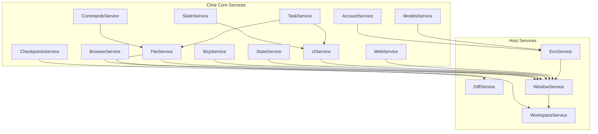

# gRPC服务API

<cite>
**本文档中引用的文件**  
- [account.proto](file://proto/cline/account.proto)
- [browser.proto](file://proto/cline/browser.proto)
- [checkpoints.proto](file://proto/cline/checkpoints.proto)
- [commands.proto](file://proto/cline/commands.proto)
- [common.proto](file://proto/cline/common.proto)
- [file.proto](file://proto/cline/file.proto)
- [mcp.proto](file://proto/cline/mcp.proto)
- [models.proto](file://proto/cline/models.proto)
- [slash.proto](file://proto/cline/slash.proto)
- [state.proto](file://proto/cline/state.proto)
- [task.proto](file://proto/cline/task.proto)
- [ui.proto](file://proto/cline/ui.proto)
- [web.proto](file://proto/cline/web.proto)
- [diff.proto](file://proto/host/diff.proto)
- [env.proto](file://proto/host/env.proto)
- [testing.proto](file://proto/host/testing.proto)
- [window.proto](file://proto/host/window.proto)
- [workspace.proto](file://proto/host/workspace.proto)
</cite>

## 目录
1. [简介](#简介)
2. [核心服务接口](#核心服务接口)
   - [AccountService](#accountservice)
   - [BrowserService](#browserservice)
   - [CheckpointsService](#checkpointsservice)
   - [CommandsService](#commandsservice)
   - [FileService](#fileservice)
   - [McpService](#mcpservice)
   - [ModelsService](#modelsservice)
   - [SlashService](#slashservice)
   - [StateService](#stateservice)
   - [TaskService](#taskservice)
   - [UiService](#uiservice)
   - [WebService](#webservice)
3. [主机端服务接口](#主机端服务接口)
   - [DiffService](#diffservice)
   - [EnvService](#envservice)
   - [WindowService](#windowservice)
   - [WorkspaceService](#workspaceservice)
4. [枚举类型定义](#枚举类型定义)
5. [服务调用关系图](#服务调用关系图)
6. [API调用示例](#api调用示例)
7. [限制与性能考量](#限制与性能考量)
8. [错误处理模式](#错误处理模式)

## 简介
本文档详细描述了cline项目中定义的gRPC服务API，涵盖`proto/cline/`和`proto/host/`目录下的所有`.proto`文件。文档为每个服务提供了完整的接口定义，包括RPC方法签名、请求/响应消息结构、字段含义、枚举值定义，并提供了实际调用示例和系统集成说明。

## 核心服务接口

### AccountService
账户管理服务，处理用户认证、登录、登出及信用额度查询等操作。

**RPC方法**

| 方法名 | 请求消息类型 | 响应消息类型 | 说明 |
|-------|------------|------------|------|
| accountLoginClicked | EmptyRequest | String | 处理用户点击登录链接，生成nonce并打开认证URL |
| accountLogoutClicked | EmptyRequest | Empty | 处理用户点击登出按钮，清除API密钥和用户状态 |
| subscribeToAuthStatusUpdate | EmptyRequest | stream AuthState | 订阅认证状态更新事件 |
| authStateChanged | AuthStateChangedRequest | AuthState | 处理Firebase上下文的认证状态变化 |
| getUserCredits | EmptyRequest | UserCreditsData | 获取用户信用额度数据 |
| getOrganizationCredits | GetOrganizationCreditsRequest | OrganizationCreditsData | 获取组织信用额度数据 |
| getUserOrganizations | EmptyRequest | UserOrganizationsResponse | 获取用户所属组织列表 |
| setUserOrganization | UserOrganizationUpdateRequest | Empty | 设置用户当前组织 |
| openrouterAuthClicked | EmptyRequest | Empty | 处理OpenRouter认证点击 |
| getRedirectUrl | EmptyRequest | String | 获取WebView用于重定向回IDE的链接 |

**请求/响应消息字段定义**

**AuthStateChangedRequest**
- `metadata`: Metadata - 元数据
- `user`: UserInfo - 用户信息

**UserInfo**
- `uid`: string - 用户唯一标识
- `display_name`: string (optional) - 显示名称
- `email`: string (optional) - 邮箱地址
- `photo_url`: string (optional) - 头像URL
- `app_base_url`: string (optional) - Cline应用基础URL

**UserCreditsData**
- `balance`: UserCreditsBalance - 当前余额
- `usage_transactions`: UsageTransaction[] - 使用交易记录
- `payment_transactions`: PaymentTransaction[] - 支付交易记录

**UserCreditsBalance**
- `current_balance`: double - 当前余额（美元）

**UsageTransaction**
- `ai_inference_provider_name`: string - AI推理提供商名称
- `ai_model_name`: string - AI模型名称
- `ai_model_type_name`: string - AI模型类型名称
- `completion_tokens`: int32 - 完成令牌数
- `cost_usd`: double - 成本（美元）
- `created_at`: string - 创建时间
- `credits_used`: double - 使用的信用额度
- `generation_id`: string - 生成ID
- `organization_id`: string - 组织ID
- `prompt_tokens`: int32 - 提示令牌数
- `total_tokens`: int32 - 总令牌数
- `user_id`: string - 用户ID

**PaymentTransaction**
- `paid_at`: string - 支付时间
- `creator_id`: string - 创建者ID
- `amount_cents`: int32 - 金额（美分）
- `credits`: double - 信用额度

**Section sources**
- [account.proto](file://proto/cline/account.proto#L1-L135)

### BrowserService
浏览器服务，管理与浏览器的连接和配置。

**RPC方法**

| 方法名 | 请求消息类型 | 响应消息类型 | 说明 |
|-------|------------|------------|------|
| getBrowserConnectionInfo | EmptyRequest | BrowserConnectionInfo | 获取浏览器连接信息 |
| testBrowserConnection | StringRequest | BrowserConnection | 测试浏览器连接 |
| discoverBrowser | EmptyRequest | BrowserConnection | 发现浏览器 |
| getDetectedChromePath | EmptyRequest | ChromePath | 获取检测到的Chrome路径 |
| relaunchChromeDebugMode | EmptyRequest | String | 以调试模式重启Chrome |

**请求/响应消息字段定义**

**BrowserConnectionInfo**
- `is_connected`: bool - 是否已连接
- `is_remote`: bool - 是否为远程连接
- `host`: string (optional) - 主机地址

**BrowserConnection**
- `success`: bool - 是否成功
- `message`: string - 消息
- `endpoint`: string (optional) - 端点URL

**ChromePath**
- `path`: string - Chrome可执行文件路径
- `is_bundled`: bool - 是否为捆绑版本

**Section sources**
- [browser.proto](file://proto/cline/browser.proto#L1-L51)

### CheckpointsService
检查点服务，管理代码变更的检查点功能。

**RPC方法**

| 方法名 | 请求消息类型 | 响应消息类型 | 说明 |
|-------|------------|------------|------|
| checkpointDiff | Int64Request | Empty | 显示指定检查点的差异 |
| checkpointRestore | CheckpointRestoreRequest | Empty | 恢复指定检查点 |

**请求/响应消息字段定义**

**CheckpointRestoreRequest**
- `metadata`: Metadata - 元数据
- `number`: int64 - 检查点编号
- `restore_type`: string - 恢复类型
- `offset`: int64 (optional) - 偏移量

**Section sources**
- [checkpoints.proto](file://proto/cline/checkpoints.proto#L1-L18)

### CommandsService
命令服务，处理IDE中的上下文菜单命令。

**RPC方法**

| 方法名 | 请求消息类型 | 响应消息类型 | 说明 |
|-------|------------|------------|------|
| addToCline | CommandContext | Empty | 将内容添加到Cline |
| fixWithCline | CommandContext | Empty | 使用Cline修复代码 |
| explainWithCline | CommandContext | Empty | 使用Cline解释代码 |
| improveWithCline | CommandContext | Empty | 使用Cline改进代码 |

**请求/响应消息字段定义**

**CommandContext**
- `file_path`: string (optional) - 当前文件的绝对路径
- `selected_text`: string (optional) - 选中的源代码文本
- `language`: string (optional) - 当前文件的语言标识符
- `diagnostics`: Diagnostic[] - 当前文件的诊断问题

**Diagnostic**
- `message`: string - 诊断消息
- `range`: DiagnosticRange - 诊断范围
- `severity`: DiagnosticSeverity - 严重程度
- `source`: string (optional) - 来源

**DiagnosticRange**
- `start`: DiagnosticPosition - 起始位置
- `end`: DiagnosticPosition - 结束位置

**DiagnosticPosition**
- `line`: int32 - 行号
- `character`: int32 - 字符位置

**Section sources**
- [commands.proto](file://proto/cline/commands.proto#L1-L29)
- [common.proto](file://proto/cline/common.proto#L1-L98)

### FileService
文件服务，处理文件操作和搜索功能。

**RPC方法**

| 方法名 | 请求消息类型 | 响应消息类型 | 说明 |
|-------|------------|------------|------|
| copyToClipboard | StringRequest | Empty | 复制文本到剪贴板 |
| openFile | StringRequest | Empty | 在编辑器中打开文件 |
| openImage | StringRequest | Empty | 在系统查看器中打开图片 |
| openMention | StringRequest | Empty | 打开引用（文件、路径、git提交等） |
| deleteRuleFile | RuleFileRequest | RuleFile | 删除规则文件 |
| createRuleFile | RuleFileRequest | RuleFile | 创建规则文件 |
| searchCommits | StringRequest | GitCommits | 在工作区搜索git提交 |
| selectFiles | BooleanRequest | StringArrays | 从文件系统选择图片和其他文件 |
| getRelativePaths | RelativePathsRequest | RelativePaths | 将URI转换为工作区相对路径 |
| searchFiles | FileSearchRequest | FileSearchResults | 在工作区中模糊搜索文件 |
| toggleClineRule | ToggleClineRuleRequest | ToggleClineRules | 切换Cline规则（启用或禁用） |
| toggleCursorRule | ToggleCursorRuleRequest | ClineRulesToggles | 切换Cursor规则（启用或禁用） |
| toggleWindsurfRule | ToggleWindsurfRuleRequest | ClineRulesToggles | 切换Windsurf规则（启用或禁用） |
| refreshRules | EmptyRequest | RefreshedRules | 刷新所有规则切换状态 |
| openTaskHistory | StringRequest | Empty | 打开任务对话历史文件 |
| toggleWorkflow | ToggleWorkflowRequest | ClineRulesToggles | 切换工作流（启用或禁用） |
| ifFileExistsRelativePath | StringRequest | BooleanResponse | 检查文件是否存在于项目中 |
| openFileRelativePath | StringRequest | Empty | 通过相对路径在编辑器中打开文件 |
| openFocusChainFile | StringRequest | Empty | 打开或创建焦点链检查清单markdown文件 |

**请求/响应消息字段定义**

**RuleFileRequest**
- `metadata`: Metadata - 元数据
- `is_global`: bool - 是否为全局规则
- `rule_path`: string (optional) - 规则文件路径（用于删除）
- `filename`: string (optional) - 文件名（用于创建）
- `type`: string (optional) - 要创建的文件类型

**RuleFile**
- `file_path`: string - 规则文件路径
- `display_name`: string - 用于显示的文件名
- `already_exists`: bool - 文件是否已存在

**RelativePathsRequest**
- `metadata`: Metadata - 元数据
- `uris`: string[] - 要转换的URI列表

**RelativePaths**
- `paths`: string[] - 转换后的相对路径列表

**FileSearchType**
- `FILE`: 0 - 文件类型
- `FOLDER`: 1 - 文件夹类型

**FileSearchRequest**
- `metadata`: Metadata - 元数据
- `query`: string - 搜索查询字符串
- `mentions_request_id`: string (optional) - 用于跟踪请求的可选请求ID
- `limit`: int32 (optional) - 结果限制（默认：20）
- `selected_type`: FileSearchType (optional) - 可选的类型过滤器

**FileSearchResults**
- `results`: FileInfo[] - 文件/文件夹结果数组
- `mentions_request_id`: string (optional) - 用于跟踪的请求ID回显

**FileInfo**
- `path`: string - 从工作区根目录开始的相对路径
- `type`: string - "file"或"folder"
- `label`: string (optional) - 显示名称（通常是基名）

**GitCommits**
- `commits`: GitCommit[] - Git提交列表

**GitCommit**
- `hash`: string - 提交哈希
- `short_hash`: string - 短哈希
- `subject`: string - 主题
- `author`: string - 作者
- `date`: string - 日期

**ToggleClineRuleRequest**
- `metadata`: Metadata - 元数据
- `is_global`: bool - 是否为全局规则
- `rule_path`: string - 规则文件路径
- `enabled`: bool - 是否启用规则

**ClineRulesToggles**
- `toggles`: map<string, bool> - 文件路径到启用/禁用状态的映射

**ToggleClineRules**
- `global_cline_rules_toggles`: ClineRulesToggles - 全局Cline规则切换状态
- `local_cline_rules_toggles`: ClineRulesToggles - 本地Cline规则切换状态

**ToggleCursorRuleRequest**
- `metadata`: Metadata - 元数据
- `rule_path`: string - 规则文件路径
- `enabled`: bool - 是否启用规则

**ToggleWindsurfRuleRequest**
- `metadata`: Metadata - 元数据
- `rule_path`: string - 规则文件路径
- `enabled`: bool - 是否启用规则

**RefreshedRules**
- `global_cline_rules_toggles`: ClineRulesToggles - 全局Cline规则切换状态
- `local_cline_rules_toggles`: ClineRulesToggles - 本地Cline规则切换状态
- `local_cursor_rules_toggles`: ClineRulesToggles - 本地Cursor规则切换状态
- `local_windsurf_rules_toggles`: ClineRulesToggles - 本地Windsurf规则切换状态
- `local_workflow_toggles`: ClineRulesToggles - 本地工作流切换状态
- `global_workflow_toggles`: ClineRulesToggles - 全局工作流切换状态

**ToggleWorkflowRequest**
- `metadata`: Metadata - 元数据
- `workflow_path`: string - 工作流路径
- `enabled`: bool - 是否启用
- `is_global`: bool - 是否为全局

**Section sources**
- [file.proto](file://proto/cline/file.proto#L1-L186)

### McpService
MCP（Model Control Protocol）服务，管理MCP服务器和工具。

**RPC方法**

| 方法名 | 请求消息类型 | 响应消息类型 | 说明 |
|-------|------------|------------|------|
| toggleMcpServer | ToggleMcpServerRequest | McpServers | 切换MCP服务器状态 |
| updateMcpTimeout | UpdateMcpTimeoutRequest | McpServers | 更新MCP服务器超时设置 |
| addRemoteMcpServer | AddRemoteMcpServerRequest | McpServers | 添加远程MCP服务器 |
| downloadMcp | StringRequest | McpDownloadResponse | 下载MCP服务器 |
| restartMcpServer | StringRequest | McpServers | 重启MCP服务器 |
| deleteMcpServer | StringRequest | McpServers | 删除MCP服务器 |
| toggleToolAutoApprove | ToggleToolAutoApproveRequest | McpServers | 切换工具自动批准 |
| refreshMcpMarketplace | EmptyRequest | McpMarketplaceCatalog | 刷新MCP市场 |
| openMcpSettings | EmptyRequest | Empty | 打开MCP设置 |
| subscribeToMcpMarketplaceCatalog | EmptyRequest | stream McpMarketplaceCatalog | 订阅MCP市场目录更新 |
| getLatestMcpServers | Empty | McpServers | 获取最新的MCP服务器列表 |
| subscribeToMcpServers | EmptyRequest | stream McpServers | 订阅MCP服务器更新 |

**请求/响应消息字段定义**

**ToggleMcpServerRequest**
- `metadata`: Metadata - 元数据
- `server_name`: string - 服务器名称
- `disabled`: bool - 是否禁用

**UpdateMcpTimeoutRequest**
- `metadata`: Metadata - 元数据
- `server_name`: string - 服务器名称
- `timeout`: int32 - 超时时间（秒）

**AddRemoteMcpServerRequest**
- `metadata`: Metadata - 元数据
- `server_name`: string - 服务器名称
- `server_url`: string - 服务器URL

**ToggleToolAutoApproveRequest**
- `metadata`: Metadata - 元数据
- `server_name`: string - 服务器名称
- `tool_names`: string[] - 工具名称列表
- `auto_approve`: bool - 是否自动批准

**McpTool**
- `name`: string - 工具名称
- `description`: string (optional) - 描述
- `input_schema`: string (optional) - 输入模式
- `auto_approve`: bool (optional) - 是否自动批准

**McpResource**
- `uri`: string - URI
- `name`: string - 名称
- `mime_type`: string (optional) - MIME类型
- `description`: string (optional) - 描述

**McpResourceTemplate**
- `uri_template`: string - URI模板
- `name`: string - 名称
- `mime_type`: string (optional) - MIME类型
- `description`: string (optional) - 描述

**McpServerStatus**
- `MCP_SERVER_STATUS_DISCONNECTED`: 0 - 断开连接（默认）
- `MCP_SERVER_STATUS_CONNECTED`: 1 - 已连接
- `MCP_SERVER_STATUS_CONNECTING`: 2 - 连接中

**McpServer**
- `name`: string - 服务器名称
- `config`: string - 配置
- `status`: McpServerStatus - 状态
- `error`: string (optional) - 错误信息
- `tools`: McpTool[] - 工具列表
- `resources`: McpResource[] - 资源列表
- `resource_templates`: McpResourceTemplate[] - 资源模板列表
- `disabled`: bool (optional) - 是否禁用
- `timeout`: int32 (optional) - 超时时间

**McpServers**
- `mcp_servers`: McpServer[] - MCP服务器列表

**McpMarketplaceItem**
- `mcp_id`: string - MCP ID
- `github_url`: string - GitHub URL
- `name`: string - 名称
- `author`: string - 作者
- `description`: string - 描述
- `codicon_icon`: string - Codicon图标
- `logo_url`: string - Logo URL
- `category`: string - 类别
- `tags`: string[] - 标签
- `requires_api_key`: bool - 是否需要API密钥
- `readme_content`: string (optional) - README内容
- `llms_installation_content`: string (optional) - LLMs安装内容
- `is_recommended`: bool - 是否推荐
- `github_stars`: int32 - GitHub星标数
- `download_count`: int32 - 下载次数
- `created_at`: string - 创建时间
- `updated_at`: string - 更新时间
- `last_github_sync`: string - 最后GitHub同步时间

**McpMarketplaceCatalog**
- `items`: McpMarketplaceItem[] - 项目列表

**McpDownloadResponse**
- `mcp_id`: string - MCP ID
- `github_url`: string - GitHub URL
- `name`: string - 名称
- `author`: string - 作者
- `description`: string - 描述
- `readme_content`: string - README内容
- `llms_installation_content`: string - LLMs安装内容
- `requires_api_key`: bool - 是否需要API密钥
- `error`: string (optional) - 错误信息

**Section sources**
- [mcp.proto](file://proto/cline/mcp.proto#L1-L132)

### ModelsService
模型服务，管理AI模型的获取和配置。

**RPC方法**

| 方法名 | 请求消息类型 | 响应消息类型 | 说明 |
|-------|------------|------------|------|
| getOllamaModels | StringRequest | StringArray | 获取Ollama可用模型 |
| getLmStudioModels | StringRequest | StringArray | 获取LM Studio可用模型 |
| getVsCodeLmModels | EmptyRequest | VsCodeLmModelsArray | 获取VS Code LM API可用模型 |
| refreshOpenRouterModels | EmptyRequest | OpenRouterCompatibleModelInfo | 刷新并返回OpenRouter模型 |
| refreshHuggingFaceModels | EmptyRequest | OpenRouterCompatibleModelInfo | 刷新并返回Hugging Face模型 |
| refreshOpenAiModels | OpenAiModelsRequest | StringArray | 刷新并返回OpenAI模型 |
| refreshVercelAiGatewayModels | EmptyRequest | OpenRouterCompatibleModelInfo | 刷新并返回Vercel AI Gateway模型 |
| refreshRequestyModels | EmptyRequest | OpenRouterCompatibleModelInfo | 刷新并返回Requesty模型 |
| subscribeToOpenRouterModels | EmptyRequest | stream OpenRouterCompatibleModelInfo | 订阅OpenRouter模型更新 |
| updateApiConfigurationProto | UpdateApiConfigurationRequest | Empty | 更新API配置 |
| refreshGroqModels | EmptyRequest | OpenRouterCompatibleModelInfo | 刷新并返回Groq模型 |
| refreshBasetenModels | EmptyRequest | OpenRouterCompatibleModelInfo | 刷新并返回Baseten模型 |
| getSapAiCoreModels | SapAiCoreModelsRequest | SapAiCoreModelsResponse | 获取SAP AI Core可用模型 |

**请求/响应消息字段定义**

**VsCodeLmModelsArray**
- `models`: LanguageModelChatSelector[] - VS Code LM模型列表

**LanguageModelChatSelector**
- `vendor`: string (optional) - 供应商
- `family`: string (optional) - 家族
- `version`: string (optional) - 版本
- `id`: string (optional) - ID

**PriceTier**
- `token_limit`: int64 - 输入令牌的上限（包含）
- `price`: double - 每百万令牌的价格

**ThinkingConfig**
- `max_budget`: int64 (optional) - 最大允许思考预算令牌
- `output_price`: double (optional) - 预算>0时的输出价格（每百万令牌）
- `output_price_tiers`: PriceTier[] (optional) - 预算>0时的分层输出价格

**ModelTier**
- `context_window`: int64 - 上下文窗口大小
- `input_price`: double (optional) - 输入价格
- `output_price`: double (optional) - 输出价格
- `cache_writes_price`: double (optional) - 缓存写入价格
- `cache_reads_price`: double (optional) - 缓存读取价格

**OpenRouterModelInfo**
- `max_tokens`: int64 (optional) - 最大令牌数
- `context_window`: int64 (optional) - 上下文窗口大小
- `supports_images`: bool (optional) - 是否支持图片
- `supports_prompt_cache`: bool - 是否支持提示缓存
- `input_price`: double (optional) - 输入价格
- `output_price`: double (optional) - 输出价格
- `cache_writes_price`: double (optional) - 缓存写入价格
- `cache_reads_price`: double (optional) - 缓存读取价格
- `description`: string (optional) - 描述
- `thinking_config`: ThinkingConfig (optional) - 思考配置
- `supports_global_endpoint`: bool (optional) - 是否支持全局端点
- `tiers`: ModelTier[] - 分层定价结构

**OpenRouterCompatibleModelInfo**
- `models`: map<string, OpenRouterModelInfo> - 模型映射

**OpenAiModelsRequest**
- `metadata`: Metadata - 元数据
- `base_url`: string - 基础URL
- `api_key`: string - API密钥

**SapAiCoreModelsRequest**
- `metadata`: Metadata - 元数据
- `client_id`: string - 客户端ID
- `client_secret`: string - 客户端密钥
- `base_url`: string - 基础URL
- `token_url`: string - 令牌URL
- `resource_group`: string - 资源组

**SapAiCoreModelDeployment**
- `model_name`: string - 模型名称
- `deployment_id`: string - 部署ID

**SapAiCoreModelsResponse**
- `deployments`: SapAiCoreModelDeployment[] - 部署列表
- `orchestration_available`: bool - 编排是否可用

**UpdateApiConfigurationRequest**
- `metadata`: Metadata - 元数据
- `api_configuration`: ModelsApiConfiguration - API配置

**ApiProvider**
- `ANTHROPIC`: 0 - Anthropic提供商
- `OPENROUTER`: 1 - OpenRouter提供商
- `BEDROCK`: 2 - Bedrock提供商
- `VERTEX`: 3 - Vertex提供商
- `OPENAI`: 4 - OpenAI提供商
- `OLLAMA`: 5 - Ollama提供商
- `LMSTUDIO`: 6 - LMStudio提供商
- `GEMINI`: 7 - Gemini提供商
- `OPENAI_NATIVE`: 8 - OpenAI原生提供商
- `REQUESTY`: 9 - Requesty提供商
- `TOGETHER`: 10 - Together提供商
- `DEEPSEEK`: 11 - DeepSeek提供商
- `QWEN`: 12 - Qwen提供商
- `DOUBAO`: 13 - Doubao提供商
- `MISTRAL`: 14 - Mistral提供商
- `VSCODE_LM`: 15 - VS Code LM提供商
- `CLINE`: 16 - Cline提供商
- `LITELLM`: 17 - LiteLLM提供商
- `NEBIUS`: 18 - Nebius提供商
- `FIREWORKS`: 19 - Fireworks提供商
- `ASKSAGE`: 20 - AskSage提供商
- `XAI`: 21 - xAI提供商
- `SAMBANOVA`: 22 - SambaNova提供商
- `CEREBRAS`: 23 - Cerebras提供商
- `GROQ`: 24 - Groq提供商
- `SAPAICORE`: 25 - SAP AI Core提供商
- `CLAUDE_CODE`: 26 - Claude Code提供商
- `MOONSHOT`: 27 - Moonshot提供商
- `HUGGINGFACE`: 28 - Hugging Face提供商
- `HUAWEI_CLOUD_MAAS`: 29 - 华为云MaaS提供商
- `BASETEN`: 30 - Baseten提供商
- `ZAI`: 31 - Zai提供商
- `VERCEL_AI_GATEWAY`: 32 - Vercel AI Gateway提供商
- `QWEN_CODE`: 33 - Qwen Code提供商
- `DIFY`: 34 - Dify提供商

**OpenAiCompatibleModelInfo**
- `max_tokens`: int64 (optional) - 最大令牌数
- `context_window`: int64 (optional) - 上下文窗口大小
- `supports_images`: bool (optional) - 是否支持图片
- `supports_prompt_cache`: bool - 是否支持提示缓存
- `input_price`: double (optional) - 输入价格
- `output_price`: double (optional) - 输出价格
- `thinking_config`: ThinkingConfig (optional) - 思考配置
- `supports_global_endpoint`: bool (optional) - 是否支持全局端点
- `cache_writes_price`: double (optional) - 缓存写入价格
- `cache_reads_price`: double (optional) - 缓存读取价格
- `description`: string (optional) - 描述
- `tiers`: ModelTier[] - 分层定价结构
- `temperature`: double (optional) - 温度
- `is_r1_format_required`: bool (optional) - 是否需要r1格式

**LiteLLMModelInfo**
- `max_tokens`: int64 (optional) - 最大令牌数
- `context_window`: int64 (optional) - 上下文窗口大小
- `supports_images`: bool (optional) - 是否支持图片
- `supports_prompt_cache`: bool - 是否支持提示缓存
- `input_price`: double (optional) - 输入价格
- `output_price`: double (optional) - 输出价格
- `thinking_config`: ThinkingConfig (optional) - 思考配置
- `supports_global_endpoint`: bool (optional) - 是否支持全局端点
- `cache_writes_price`: double (optional) - 缓存写入价格
- `cache_reads_price`: double (optional) - 缓存读取价格
- `description`: string (optional) - 描述
- `tiers`: ModelTier[] - 分层定价结构
- `temperature`: double (optional) - 温度

**ModelsApiConfiguration**
- `api_key`: string (optional) - API密钥
- `cline_api_key`: string (optional) - Cline API密钥
- `ulid`: string (optional) - ULID
- `lite_llm_base_url`: string (optional) - LiteLLM基础URL
- `lite_llm_api_key`: string (optional) - LiteLLM API密钥
- `lite_llm_use_prompt_cache`: bool (optional) - 是否使用提示缓存
- `open_ai_headers`: map<string, string> - OpenAI头部
- `anthropic_base_url`: string (optional) - Anthropic基础URL
- `open_router_api_key`: string (optional) - OpenRouter API密钥
- `open_router_provider_sorting`: string (optional) - OpenRouter提供商排序
- `aws_access_key`: string (optional) - AWS访问密钥
- `aws_secret_key`: string (optional) - AWS密钥
- `aws_session_token`: string (optional) - AWS会话令牌
- `aws_region`: string (optional) - AWS区域
- `aws_use_cross_region_inference`: bool (optional) - 是否使用跨区域推理
- `aws_bedrock_use_prompt_cache`: bool (optional) - 是否使用Bedrock提示缓存
- `aws_use_profile`: bool (optional) - 是否使用配置文件
- `aws_profile`: string (optional) - AWS配置文件
- `aws_bedrock_endpoint`: string (optional) - AWS Bedrock端点
- `claude_code_path`: string (optional) - Claude Code路径
- `vertex_project_id`: string (optional) - Vertex项目ID
- `vertex_region`: string (optional) - Vertex区域
- `open_ai_base_url`: string (optional) - OpenAI基础URL
- `open_ai_api_key`: string (optional) - OpenAI API密钥
- `ollama_base_url`: string (optional) - Ollama基础URL
- `ollama_api_options_ctx_num`: string (optional) - Ollama API选项上下文数量
- `lm_studio_base_url`: string (optional) - LM Studio基础URL
- `gemini_api_key`: string (optional) - Gemini API密钥
- `gemini_base_url`: string (optional) - Gemini基础URL
- `open_ai_native_api_key`: string (optional) - OpenAI原生API密钥
- `deep_seek_api_key`: string (optional) - DeepSeek API密钥
- `requesty_api_key`: string (optional) - Requesty API密钥
- `requesty_base_url`: string (optional) - Requesty基础URL
- `together_api_key`: string (optional) - Together API密钥
- `fireworks_api_key`: string (optional) - Fireworks API密钥
- `fireworks_model_max_completion_tokens`: int64 (optional) - Fireworks模型最大完成令牌数
- `fireworks_model_max_tokens`: int64 (optional) - Fireworks模型最大令牌数
- `qwen_api_key`: string (optional) - Qwen API密钥
- `doubao_api_key`: string (optional) - Doubao API密钥
- `mistral_api_key`: string (optional) - Mistral API密钥
- `azure_api_version`: string (optional) - Azure API版本
- `qwen_api_line`: string (optional) - Qwen API线路
- `nebius_api_key`: string (optional) - Nebius API密钥
- `asksage_api_url`: string (optional) - AskSage API URL
- `asksage_api_key`: string (optional) - AskSage API密钥
- `xai_api_key`: string (optional) - xAI API密钥
- `sambanova_api_key`: string (optional) - SambaNova API密钥
- `cerebras_api_key`: string (optional) - Cerebras API密钥
- `request_timeout_ms`: int64 (optional) - 请求超时时间（毫秒）
- `sap_ai_core_client_id`: string (optional) - SAP AI Core客户端ID
- `sap_ai_core_client_secret`: string (optional) - SAP AI Core客户端密钥
- `sap_ai_resource_group`: string (optional) - SAP AI资源组
- `sap_ai_core_token_url`: string (optional) - SAP AI Core令牌URL
- `sap_ai_core_base_url`: string (optional) - SAP AI Core基础URL
- `sap_ai_core_use_orchestration_mode`: bool (optional) - 是否使用编排模式
- `moonshot_api_key`: string (optional) - Moonshot API密钥
- `moonshot_api_line`: string (optional) - Moonshot API线路
- `aws_authentication`: string (optional) - AWS认证
- `aws_bedrock_api_key`: string (optional) - AWS Bedrock API密钥
- `cline_account_id`: string (optional) - Cline账户ID
- `groq_api_key`: string (optional) - Groq API密钥
- `hugging_face_api_key`: string (optional) - Hugging Face API密钥
- `huawei_cloud_maas_api_key`: string (optional) - 华为云MaaS API密钥
- `baseten_api_key`: string (optional) - Baseten API密钥
- `ollama_api_key`: string (optional) - Ollama API密钥
- `zai_api_key`: string (optional) - Zai API密钥
- `zai_api_line`: string (optional) - Zai API线路
- `lm_studio_max_tokens`: string (optional) - LM Studio最大令牌数
- `vercel_ai_gateway_api_key`: string (optional) - Vercel AI Gateway API密钥
- `qwen_code_oauth_path`: string (optional) - Qwen Code OAuth路径
- `dify_api_key`: string (optional) - Dify API密钥
- `dify_base_url`: string (optional) - Dify基础URL
- `plan_mode_api_provider`: ApiProvider (optional) - 计划模式API提供商
- `plan_mode_api_model_id`: string (optional) - 计划模式API模型ID
- `plan_mode_thinking_budget_tokens`: int64 (optional) - 计划模式思考预算令牌
- `plan_mode_reasoning_effort`: string (optional) - 计划模式推理努力程度
- `plan_mode_vs_code_lm_model_selector`: LanguageModelChatSelector (optional) - 计划模式VS Code LM模型选择器
- `plan_mode_aws_bedrock_custom_selected`: bool (optional) - 计划模式AWS Bedrock自定义选择
- `plan_mode_aws_bedrock_custom_model_base_id`: string (optional) - 计划模式AWS Bedrock自定义模型基础ID
- `plan_mode_open_router_model_id`: string (optional) - 计划模式OpenRouter模型ID
- `plan_mode_open_router_model_info`: OpenRouterModelInfo (optional) - 计划模式OpenRouter模型信息
- `plan_mode_open_ai_model_id`: string (optional) - 计划模式OpenAI模型ID
- `plan_mode_open_ai_model_info`: OpenAiCompatibleModelInfo (optional) - 计划模式OpenAI模型信息
- `plan_mode_ollama_model_id`: string (optional) - 计划模式Ollama模型ID
- `plan_mode_lm_studio_model_id`: string (optional) - 计划模式LM Studio模型ID
- `plan_mode_lite_llm_model_id`: string (optional) - 计划模式LiteLLM模型ID
- `plan_mode_lite_llm_model_info`: LiteLLMModelInfo (optional) - 计划模式LiteLLM模型信息
- `plan_mode_requesty_model_id`: string (optional) - 计划模式Requesty模型ID
- `plan_mode_requesty_model_info`: OpenRouterModelInfo (optional) - 计划模式Requesty模型信息
- `plan_mode_together_model_id`: string (optional) - 计划模式Together模型ID
- `plan_mode_fireworks_model_id`: string (optional) - 计划模式Fireworks模型ID
- `plan_mode_sap_ai_core_model_id`: string (optional) - 计划模式SAP AI Core模型ID
- `plan_mode_sap_ai_core_deployment_id`: string (optional) - 计划模式SAP AI Core部署ID
- `plan_mode_groq_model_id`: string (optional) - 计划模式Groq模型ID
- `plan_mode_groq_model_info`: OpenRouterModelInfo (optional) - 计划模式Groq模型信息
- `plan_mode_hugging_face_model_id`: string (optional) - 计划模式Hugging Face模型ID
- `plan_mode_hugging_face_model_info`: OpenRouterModelInfo (optional) - 计划模式Hugging Face模型信息
- `plan_mode_huawei_cloud_maas_model_id`: string (optional) - 计划模式华为云MaaS模型ID
- `plan_mode_huawei_cloud_maas_model_info`: OpenRouterModelInfo (optional) - 计划模式华为云MaaS模型信息
- `plan_mode_baseten_model_id`: string (optional) - 计划模式Baseten模型ID
- `plan_mode_baseten_model_info`: OpenRouterModelInfo (optional) - 计划模式Baseten模型信息
- `plan_mode_vercel_ai_gateway_model_id`: string (optional) - 计划模式Vercel AI Gateway模型ID
- `plan_mode_vercel_ai_gateway_model_info`: OpenRouterModelInfo (optional) - 计划模式Vercel AI Gateway模型信息
- `act_mode_api_provider`: ApiProvider (optional) - 执行模式API提供商
- `act_mode_api_model_id`: string (optional) - 执行模式API模型ID
- `act_mode_thinking_budget_tokens`: int64 (optional) - 执行模式思考预算令牌
- `act_mode_reasoning_effort`: string (optional) - 执行模式推理努力程度
- `act_mode_vs_code_lm_model_selector`: LanguageModelChatSelector (optional) - 执行模式VS Code LM模型选择器
- `act_mode_aws_bedrock_custom_selected`: bool (optional) - 执行模式AWS Bedrock自定义选择
- `act_mode_aws_bedrock_custom_model_base_id`: string (optional) - 执行模式AWS Bedrock自定义模型基础ID
- `act_mode_open_router_model_id`: string (optional) - 执行模式OpenRouter模型ID
- `act_mode_open_router_model_info`: OpenRouterModelInfo (optional) - 执行模式OpenRouter模型信息
- `act_mode_open_ai_model_id`: string (optional) - 执行模式OpenAI模型ID
- `act_mode_open_ai_model_info`: OpenAiCompatibleModelInfo (optional) - 执行模式OpenAI模型信息
- `act_mode_ollama_model_id`: string (optional) - 执行模式Ollama模型ID
- `act_mode_lm_studio_model_id`: string (optional) - 执行模式LM Studio模型ID
- `act_mode_lite_llm_model_id`: string (optional) - 执行模式LiteLLM模型ID
- `act_mode_lite_llm_model_info`: LiteLLMModelInfo (optional) - 执行模式LiteLLM模型信息
- `act_mode_requesty_model_id`: string (optional) - 执行模式Requesty模型ID
- `act_mode_requesty_model_info`: OpenRouterModelInfo (optional) - 执行模式Requesty模型信息
- `act_mode_together_model_id`: string (optional) - 执行模式Together模型ID
- `act_mode_fireworks_model_id`: string (optional) - 执行模式Fireworks模型ID
- `act_mode_sap_ai_core_model_id`: string (optional) - 执行模式SAP AI Core模型ID
- `act_mode_sap_ai_core_deployment_id`: string (optional) - 执行模式SAP AI Core部署ID
- `act_mode_groq_model_id`: string (optional) - 执行模式Groq模型ID
- `act_mode_groq_model_info`: OpenRouterModelInfo (optional) - 执行模式Groq模型信息
- `act_mode_hugging_face_model_id`: string (optional) - 执行模式Hugging Face模型ID
- `act_mode_hugging_face_model_info`: OpenRouterModelInfo (optional) - 执行模式Hugging Face模型信息
- `act_mode_huawei_cloud_maas_model_id`: string (optional) - 执行模式华为云MaaS模型ID
- `act_mode_huawei_cloud_maas_model_info`: OpenRouterModelInfo (optional) - 执行模式华为云MaaS模型信息
- `act_mode_baseten_model_id`: string (optional) - 执行模式Baseten模型ID
- `act_mode_baseten_model_info`: OpenRouterModelInfo (optional) - 执行模式Baseten模型信息
- `act_mode_vercel_ai_gateway_model_id`: string (optional) - 执行模式Vercel AI Gateway模型ID
- `act_mode_vercel_ai_gateway_model_info`: OpenRouterModelInfo (optional) - 执行模式Vercel AI Gateway模型信息
- `favorited_model_ids`: string[] - 收藏的模型ID列表

**Section sources**
- [models.proto](file://proto/cline/models.proto#L1-L349)

### SlashService
斜杠命令服务，处理斜杠命令相关操作。

**RPC方法**

| 方法名 | 请求消息类型 | 响应消息类型 | 说明 |
|-------|------------|------------|------|
| reportBug | StringRequest | Empty | 发送报告bug按钮点击消息 |
| condense | StringRequest | Empty | 发送压缩消息 |

**Section sources**
- [slash.proto](file://proto/cline/slash.proto#L1-L13)

### StateService
状态服务，管理应用状态和设置。

**RPC方法**

| 方法名 | 请求消息类型 | 响应消息类型 | 说明 |
|-------|------------|------------|------|
| getLatestState | EmptyRequest | State | 获取最新状态 |
| updateTerminalConnectionTimeout | UpdateTerminalConnectionTimeoutRequest | UpdateTerminalConnectionTimeoutResponse | 更新终端连接超时 |
| updateTerminalReuseEnabled | BooleanRequest | Empty | 更新终端重用启用状态 |
| getAvailableTerminalProfiles | EmptyRequest | TerminalProfiles | 获取可用终端配置文件 |
| subscribeToState | EmptyRequest | stream State | 订阅状态更新 |
| toggleFavoriteModel | StringRequest | Empty | 切换收藏模型 |
| resetState | ResetStateRequest | Empty | 重置状态 |
| togglePlanActModeProto | TogglePlanActModeRequest | Boolean | 切换计划/执行模式 |
| updateAutoApprovalSettings | AutoApprovalSettingsRequest | Empty | 更新自动批准设置 |
| updateSettings | UpdateSettingsRequest | Empty | 更新设置 |
| updateTelemetrySetting | TelemetrySettingRequest | Empty | 更新遥测设置 |
| setWelcomeViewCompleted | BooleanRequest | Empty | 设置欢迎视图已完成 |

**请求/响应消息字段定义**

**State**
- `state_json`: string - 状态JSON字符串

**TerminalProfiles**
- `profiles`: TerminalProfile[] - 终端配置文件列表

**TerminalProfile**
- `id`: string - ID
- `name`: string - 名称
- `path`: string (optional) - 路径
- `description`: string (optional) - 描述

**TogglePlanActModeRequest**
- `metadata`: Metadata - 元数据
- `mode`: PlanActMode - 模式
- `chat_content`: ChatContent (optional) - 聊天内容

**PlanActMode**
- `PLAN`: 0 - 计划模式
- `ACT`: 1 - 执行模式

**OpenaiReasoningEffort**
- `LOW`: 0 - 低
- `MEDIUM`: 1 - 中
- `HIGH`: 2 - 高
- `MINIMAL`: 3 - 最小

**McpDisplayMode**
- `RICH`: 0 - 丰富
- `PLAIN`: 1 - 纯文本
- `MARKDOWN`: 2 - Markdown

**ChatContent**
- `message`: string (optional) - 消息
- `images`: string[] - 图片
- `files`: string[] - 文件

**ResetStateRequest**
- `metadata`: Metadata - 元数据
- `global`: bool (optional) - 是否为全局

**AutoApprovalSettingsRequest**
- `metadata`: Metadata - 元数据
- `version`: int32 - 版本
- `enabled`: bool - 是否启用
- `actions`: Actions - 操作
- `max_requests`: int32 - 最大请求数
- `enable_notifications`: bool - 是否启用通知
- `favorites`: string[] - 收藏

**Actions**
- `read_files`: bool - 读取文件
- `read_files_externally`: bool - 外部读取文件
- `edit_files`: bool - 编辑文件
- `edit_files_externally`: bool - 外部编辑文件
- `execute_safe_commands`: bool - 执行安全命令
- `execute_all_commands`: bool - 执行所有命令
- `use_browser`: bool - 使用浏览器
- `use_mcp`: bool - 使用MCP

**TelemetrySettingEnum**
- `UNSET`: 0 - 未设置
- `ENABLED`: 1 - 启用
- `DISABLED`: 2 - 禁用

**TelemetrySettingRequest**
- `metadata`: Metadata - 元数据
- `setting`: TelemetrySettingEnum - 设置

**BrowserSettingsUpdate**
- `viewport`: Viewport (optional) - 视口
- `remote_browser_host`: string (optional) - 远程浏览器主机
- `remote_browser_enabled`: bool (optional) - 远程浏览器启用
- `chrome_executable_path`: string (optional) - Chrome可执行文件路径
- `disable_tool_use`: bool (optional) - 禁用工具使用
- `custom_args`: string (optional) - 自定义参数

**UpdateSettingsRequest**
- `metadata`: Metadata - 元数据
- `api_configuration`: ApiConfiguration (optional) - API配置
- `telemetry_setting`: string (optional) - 遥测设置
- `plan_act_separate_models_setting`: bool (optional) - 计划/执行分离模型设置
- `enable_checkpoints_setting`: bool (optional) - 启用检查点设置
- `mcp_marketplace_enabled`: bool (optional) - MCP市场启用
- `shell_integration_timeout`: int32 (optional) - Shell集成超时
- `terminal_reuse_enabled`: bool (optional) - 终端重用启用
- `mcp_responses_collapsed`: bool (optional) - MCP响应折叠
- `mcp_display_mode`: McpDisplayMode (optional) - MCP显示模式
- `terminal_output_line_limit`: int32 (optional) - 终端输出行限制
- `mode`: PlanActMode (optional) - 模式
- `preferred_language`: string (optional) - 首选语言
- `openai_reasoning_effort`: OpenaiReasoningEffort (optional) - OpenAI推理努力程度
- `strict_plan_mode_enabled`: bool (optional) - 严格计划模式启用
- `focus_chain_settings`: FocusChainSettings (optional) - 焦点链设置
- `use_auto_condense`: bool (optional) - 使用自动压缩
- `custom_prompt`: string (optional) - 自定义提示
- `browser_settings`: BrowserSettingsUpdate (optional) - 浏览器设置
- `default_terminal_profile`: string (optional) - 默认终端配置文件
- `yolo_mode_toggled`: bool (optional) - YOLO模式切换

**ApiConfiguration**
- `api_key`: string (optional) - API密钥（Anthropic）
- `cline_api_key`: string (optional) - Cline API密钥
- `ulid`: string (optional) - ULID
- `lite_llm_base_url`: string (optional) - LiteLLM基础URL
- `lite_llm_api_key`: string (optional) - LiteLLM API密钥
- `lite_llm_use_prompt_cache`: bool (optional) - 是否使用LiteLLM提示缓存
- `openai_headers`: string (optional) - OpenAI头部（JSON字符串）
- `anthropic_base_url`: string (optional) - Anthropic基础URL
- `openrouter_api_key`: string (optional) - OpenRouter API密钥
- `openrouter_provider_sorting`: string (optional) - OpenRouter提供商排序
- `aws_access_key`: string (optional) - AWS访问密钥
- `aws_secret_key`: string (optional) - AWS密钥
- `aws_session_token`: string (optional) - AWS会话令牌
- `aws_region`: string (optional) - AWS区域
- `aws_use_cross_region_inference`: bool (optional) - 是否使用跨区域推理
- `aws_bedrock_use_prompt_cache`: bool (optional) - 是否使用AWS Bedrock提示缓存
- `aws_use_profile`: bool (optional) - 是否使用AWS配置文件
- `aws_profile`: string (optional) - AWS配置文件
- `aws_bedrock_endpoint`: string (optional) - AWS Bedrock端点
- `claude_code_path`: string (optional) - Claude Code路径
- `vertex_project_id`: string (optional) - Vertex项目ID
- `vertex_region`: string (optional) - Vertex区域
- `openai_base_url`: string (optional) - OpenAI基础URL
- `openai_api_key`: string (optional) - OpenAI API密钥
- `ollama_base_url`: string (optional) - Ollama基础URL
- `ollama_api_options_ctx_num`: string (optional) - Ollama API选项上下文数量
- `lm_studio_base_url`: string (optional) - LM Studio基础URL
- `gemini_api_key`: string (optional) - Gemini API密钥
- `gemini_base_url`: string (optional) - Gemini基础URL
- `openai_native_api_key`: string (optional) - OpenAI原生API密钥
- `deep_seek_api_key`: string (optional) - DeepSeek API密钥
- `requesty_api_key`: string (optional) - Requesty API密钥
- `requesty_base_url`: string (optional) - Requesty基础URL
- `together_api_key`: string (optional) - Together API密钥
- `fireworks_api_key`: string (optional) - Fireworks API密钥
- `fireworks_model_max_completion_tokens`: int32 (optional) - Fireworks模型最大完成令牌数
- `fireworks_model_max_tokens`: int32 (optional) - Fireworks模型最大令牌数
- `qwen_api_key`: string (optional) - Qwen API密钥
- `doubao_api_key`: string (optional) - Doubao API密钥
- `mistral_api_key`: string (optional) - Mistral API密钥
- `azure_api_version`: string (optional) - Azure API版本
- `qwen_api_line`: string (optional) - Qwen API线路
- `nebius_api_key`: string (optional) - Nebius API密钥
- `asksage_api_url`: string (optional) - AskSage API URL
- `asksage_api_key`: string (optional) - AskSage API密钥
- `xai_api_key`: string (optional) - xAI API密钥
- `sambanova_api_key`: string (optional) - SambaNova API密钥
- `cerebras_api_key`: string (optional) - Cerebras API密钥
- `request_timeout_ms`: int32 (optional) - 请求超时时间（毫秒）
- `sap_ai_core_client_id`: string (optional) - SAP AI Core客户端ID
- `sap_ai_core_client_secret`: string (optional) - SAP AI Core客户端密钥
- `sap_ai_resource_group`: string (optional) - SAP AI资源组
- `sap_ai_core_token_url`: string (optional) - SAP AI Core令牌URL
- `sap_ai_core_base_url`: string (optional) - SAP AI Core基础URL
- `moonshot_api_key`: string (optional) - Moonshot API密钥
- `moonshot_api_line`: string (optional) - Moonshot API线路
- `huawei_cloud_maas_api_key`: string (optional) - 华为云MaaS API密钥
- `ollama_api_key`: string (optional) - Ollama API密钥
- `zai_api_key`: string (optional) - Zai API密钥
- `zai_api_line`: string (optional) - Zai API线路
- `lm_studio_max_tokens`: string (optional) - LM Studio最大令牌数
- `vercel_ai_gateway_api_key`: string (optional) - Vercel AI Gateway API密钥
- `qwen_code_oauth_path`: string (optional) - Qwen Code OAuth路径
- `dify_api_key`: string (optional) - Dify API密钥
- `dify_base_url`: string (optional) - Dify基础URL
- `plan_mode_api_provider`: string (optional) - 计划模式API提供商
- `plan_mode_api_model_id`: string (optional) - 计划模式API模型ID
- `plan_mode_thinking_budget_tokens`: int32 (optional) - 计划模式思考预算令牌
- `plan_mode_reasoning_effort`: string (optional) - 计划模式推理努力程度
- `plan_mode_vscode_lm_model_selector`: string (optional) - 计划模式VS Code LM模型选择器（JSON字符串）
- `plan_mode_aws_bedrock_custom_selected`: bool (optional) - 计划模式AWS Bedrock自定义选择
- `plan_mode_aws_bedrock_custom_model_base_id`: string (optional) - 计划模式AWS Bedrock自定义模型基础ID
- `plan_mode_openrouter_model_id`: string (optional) - 计划模式OpenRouter模型ID
- `plan_mode_openrouter_model_info`: string (optional) - 计划模式OpenRouter模型信息（JSON字符串）
- `plan_mode_openai_model_id`: string (optional) - 计划模式OpenAI模型ID
- `plan_mode_openai_model_info`: string (optional) - 计划模式OpenAI模型信息（JSON字符串）
- `plan_mode_ollama_model_id`: string (optional) - 计划模式Ollama模型ID
- `plan_mode_lm_studio_model_id`: string (optional) - 计划模式LM Studio模型ID
- `plan_mode_lite_llm_model_id`: string (optional) - 计划模式LiteLLM模型ID
- `plan_mode_lite_llm_model_info`: string (optional) - 计划模式LiteLLM模型信息（JSON字符串）
- `plan_mode_requesty_model_id`: string (optional) - 计划模式Requesty模型ID
- `plan_mode_requesty_model_info`: string (optional) - 计划模式Requesty模型信息（JSON字符串）
- `plan_mode_together_model_id`: string (optional) - 计划模式Together模型ID
- `plan_mode_fireworks_model_id`: string (optional) - 计划模式Fireworks模型ID
- `plan_mode_sap_ai_core_model_id`: string (optional) - 计划模式SAP AI Core模型ID
- `plan_mode_huawei_cloud_maas_model_id`: string (optional) - 计划模式华为云MaaS模型ID
- `plan_mode_huawei_cloud_maas_model_info`: string (optional) - 计划模式华为云MaaS模型信息
- `plan_mode_vercel_ai_gateway_model_id`: string (optional) - 计划模式Vercel AI Gateway模型ID
- `plan_mode_vercel_ai_gateway_model_info`: string (optional) - 计划模式Vercel AI Gateway模型信息
- `act_mode_api_provider`: string (optional) - 执行模式API提供商
- `act_mode_api_model_id`: string (optional) - 执行模式API模型ID
- `act_mode_thinking_budget_tokens`: int32 (optional) - 执行模式思考预算令牌
- `act_mode_reasoning_effort`: string (optional) - 执行模式推理努力程度
- `act_mode_vscode_lm_model_selector`: string (optional) - 执行模式VS Code LM模型选择器（JSON字符串）
- `act_mode_aws_bedrock_custom_selected`: bool (optional) - 执行模式AWS Bedrock自定义选择
- `act_mode_aws_bedrock_custom_model_base_id`: string (optional) - 执行模式AWS Bedrock自定义模型基础ID
- `act_mode_openrouter_model_id`: string (optional) - 执行模式OpenRouter模型ID
- `act_mode_openrouter_model_info`: string (optional) - 执行模式OpenRouter模型信息（JSON字符串）
- `act_mode_openai_model_id`: string (optional) - 执行模式OpenAI模型ID
- `act_mode_openai_model_info`: string (optional) - 执行模式OpenAI模型信息（JSON字符串）
- `act_mode_ollama_model_id`: string (optional) - 执行模式Ollama模型ID
- `act_mode_lm_studio_model_id`: string (optional) - 执行模式LM Studio模型ID
- `act_mode_lite_llm_model_id`: string (optional) - 执行模式LiteLLM模型ID
- `act_mode_lite_llm_model_info`: string (optional) - 执行模式LiteLLM模型信息（JSON字符串）
- `act_mode_requesty_model_id`: string (optional) - 执行模式Requesty模型ID
- `act_mode_requesty_model_info`: string (optional) - 执行模式Requesty模型信息（JSON字符串）
- `act_mode_together_model_id`: string (optional) - 执行模式Together模型ID
- `act_mode_fireworks_model_id`: string (optional) - 执行模式Fireworks模型ID
- `act_mode_sap_ai_core_model_id`: string (optional) - 执行模式SAP AI Core模型ID
- `act_mode_huawei_cloud_maas_model_id`: string (optional) - 执行模式华为云MaaS模型ID
- `act_mode_huawei_cloud_maas_model_info`: string (optional) - 执行模式华为云MaaS模型信息
- `act_mode_vercel_ai_gateway_model_id`: string (optional) - 执行模式Vercel AI Gateway模型ID
- `act_mode_vercel_ai_gateway_model_info`: string (optional) - 执行模式Vercel AI Gateway模型信息
- `favorited_model_ids`: string[] - 收藏的模型ID
- `aws_authentication`: string (optional) - AWS认证
- `aws_bedrock_api_key`: string (optional) - AWS Bedrock API密钥
- `cline_account_id`: string (optional) - Cline账户ID

**UpdateTerminalConnectionTimeoutRequest**
- `timeout_ms`: int32 (optional) - 超时时间（毫秒）

**FocusChainSettings**
- `enabled`: bool - 是否启用
- `remind_cline_interval`: int32 - 提醒Cline间隔

**Viewport**
- `width`: int32 - 宽度
- `height`: int32 - 高度

**UpdateTerminalConnectionTimeoutResponse**
- `timeout_ms`: int32 (optional) - 超时时间（毫秒）

**Section sources**
- [state.proto](file://proto/cline/state.proto#L1-L291)

### TaskService
任务服务，管理任务的创建、查询和操作。

**RPC方法**

| 方法名 | 请求消息类型 | 响应消息类型 | 说明 |
|-------|------------|------------|------|
| cancelTask | EmptyRequest | Empty | 取消当前运行的任务 |
| clearTask | EmptyRequest | Empty | 清除当前任务 |
| getTotalTasksSize | EmptyRequest | Int64 | 获取所有任务的总大小 |
| deleteTasksWithIds | StringArrayRequest | Empty | 删除多个指定ID的任务 |
| newTask | NewTaskRequest | Empty | 使用给定文本和可选图片创建新任务 |
| showTaskWithId | StringRequest | TaskResponse | 显示指定ID的任务 |
| exportTaskWithId | StringRequest | Empty | 将指定ID的任务导出为markdown |
| toggleTaskFavorite | TaskFavoriteRequest | Empty | 切换任务的收藏状态 |
| getTaskHistory | GetTaskHistoryRequest | TaskHistoryArray | 获取过滤后的任务历史 |
| askResponse | AskResponseRequest | Empty | 发送对之前ask操作的响应 |
| taskFeedback | StringRequest | Empty | 记录任务反馈（点赞/点踩） |
| taskCompletionViewChanges | Int64Request | Empty | 在视图中显示任务完成变更差异 |
| executeQuickWin | ExecuteQuickWinRequest | Empty | 使用命令和标题执行快速胜利任务 |
| deleteAllTaskHistory | EmptyRequest | DeleteAllTaskHistoryCount | 删除所有任务历史 |

**请求/响应消息字段定义**

**NewTaskRequest**
- `metadata`: Metadata - 元数据
- `text`: string - 任务文本
- `images`: string[] - 图片
- `files`: string[] - 文件

**TaskFavoriteRequest**
- `metadata`: Metadata - 元数据
- `task_id`: string - 任务ID
- `is_favorited`: bool - 是否收藏

**TaskResponse**
- `id`: string - 任务ID
- `task`: string - 任务内容
- `ts`: int64 - 时间戳
- `is_favorited`: bool - 是否收藏
- `size`: int64 - 大小
- `total_cost`: double - 总成本
- `tokens_in`: int32 - 输入令牌数
- `tokens_out`: int32 - 输出令牌数
- `cache_writes`: int32 - 缓存写入数
- `cache_reads`: int32 - 缓存读取数

**GetTaskHistoryRequest**
- `metadata`: Metadata - 元数据
- `favorites_only`: bool - 仅收藏
- `search_query`: string - 搜索查询
- `sort_by`: string - 排序方式
- `current_workspace_only`: bool - 仅当前工作区

**TaskHistoryArray**
- `tasks`: TaskItem[] - 任务列表
- `total_count`: int32 - 总计数

**TaskItem**
- `id`: string - 任务ID
- `task`: string - 任务内容
- `ts`: int64 - 时间戳
- `is_favorited`: bool - 是否收藏
- `size`: int64 - 大小
- `total_cost`: double - 总成本
- `tokens_in`: int32 - 输入令牌数
- `tokens_out`: int32 - 输出令牌数
- `cache_writes`: int32 - 缓存写入数
- `cache_reads`: int32 - 缓存读取数

**AskResponseRequest**
- `metadata`: Metadata - 元数据
- `response_type`: string - 响应类型
- `text`: string - 文本
- `images`: string[] - 图片
- `files`: string[] - 文件

**ExecuteQuickWinRequest**
- `metadata`: Metadata - 元数据
- `command`: string - 命令
- `title`: string - 标题

**DeleteAllTaskHistoryCount**
- `tasks_deleted`: int32 - 删除的任务数

**Section sources**
- [task.proto](file://proto/cline/task.proto#L1-L116)

### UiService
UI服务，处理UI交互和事件订阅。

**RPC方法**

| 方法名 | 请求消息类型 | 响应消息类型 | 说明 |
|-------|------------|------------|------|
| scrollToSettings | StringRequest | KeyValuePair | 滚动到设置视图中的特定设置部分 |
| onDidShowAnnouncement | EmptyRequest | Boolean | 标记当前公告为已显示并返回是否仍应显示公告 |
| subscribeToAddToInput | StringRequest | stream String | 订阅addToInput事件（当用户通过上下文菜单添加内容时） |
| subscribeToMcpButtonClicked | WebviewProviderTypeRequest | stream Empty | 订阅MCP按钮点击事件 |
| subscribeToHistoryButtonClicked | WebviewProviderTypeRequest | stream Empty | 订阅历史按钮点击事件 |
| subscribeToChatButtonClicked | EmptyRequest | stream Empty | 订阅聊天按钮点击事件（当在VSCode中点击聊天按钮时） |
| subscribeToAccountButtonClicked | EmptyRequest | stream Empty | 订阅账户按钮点击事件 |
| subscribeToSettingsButtonClicked | WebviewProviderTypeRequest | stream Empty | 订阅设置按钮点击事件 |
| subscribeToPartialMessage | EmptyRequest | stream ClineMessage | 订阅部分消息更新（流式传输构建中的Cline消息） |
| initializeWebview | EmptyRequest | Empty | 在WebView启动时初始化 |
| subscribeToRelinquishControl | EmptyRequest | stream Empty | 订阅放弃控制事件 |
| subscribeToFocusChatInput | StringRequest | stream Empty | 订阅聚焦聊天输入事件（带客户端ID） |
| subscribeToDidBecomeVisible | EmptyRequest | stream Empty | 订阅WebView可见性变化事件 |
| getWebviewHtml | EmptyRequest | String | 返回WebView索引页面的HTML（仅用于外部客户端，不用于VSCode WebView） |
| openUrl | StringRequest | Empty | 在默认浏览器中打开URL |
| openWalkthrough | EmptyRequest | Empty | 打开Cline引导 |

**请求/响应消息字段定义**

**WebviewProviderType**
- `SIDEBAR`: 0 - 侧边栏
- `TAB`: 1 - 标签页

**WebviewProviderTypeRequest**
- `metadata`: Metadata - 元数据
- `provider_type`: WebviewProviderType - 提供者类型

**ClineMessageType**
- `ASK`: 0 - 询问
- `SAY`: 1 - 陈述

**ClineAsk**
- `FOLLOWUP`: 0 - 跟进
- `PLAN_MODE_RESPOND`: 1 - 计划模式响应
- `COMMAND`: 2 - 命令
- `COMMAND_OUTPUT`: 3 - 命令输出
- `COMPLETION_RESULT`: 4 - 完成结果
- `TOOL`: 5 - 工具
- `API_REQ_FAILED`: 6 - API请求失败
- `RESUME_TASK`: 7 - 恢复任务
- `RESUME_COMPLETED_TASK`: 8 - 恢复已完成任务
- `MISTAKE_LIMIT_REACHED`: 9 - 达到错误限制
- `AUTO_APPROVAL_MAX_REQ_REACHED`: 10 - 达到自动批准最大请求数
- `BROWSER_ACTION_LAUNCH`: 11 - 浏览器操作启动
- `USE_MCP_SERVER`: 12 - 使用MCP服务器
- `NEW_TASK`: 13 - 新任务
- `CONDENSE`: 14 - 压缩
- `REPORT_BUG`: 15 - 报告bug
- `SUMMARIZE_TASK`: 16 - 总结任务

**ClineSay**
- `TASK`: 0 - 任务
- `ERROR`: 1 - 错误
- `API_REQ_STARTED`: 2 - API请求开始
- `API_REQ_FINISHED`: 3 - API请求完成
- `TEXT`: 4 - 文本
- `REASONING`: 5 - 推理
- `COMPLETION_RESULT_SAY`: 6 - 完成结果
- `USER_FEEDBACK`: 7 - 用户反馈
- `USER_FEEDBACK_DIFF`: 8 - 用户反馈差异
- `API_REQ_RETRIED`: 9 - API请求重试
- `COMMAND_SAY`: 10 - 命令
- `COMMAND_OUTPUT_SAY`: 11 - 命令输出
- `TOOL_SAY`: 12 - 工具
- `SHELL_INTEGRATION_WARNING`: 13 - Shell集成警告
- `BROWSER_ACTION_LAUNCH_SAY`: 14 - 浏览器操作启动
- `BROWSER_ACTION`: 15 - 浏览器操作
- `BROWSER_ACTION_RESULT`: 16 - 浏览器操作结果
- `MCP_SERVER_REQUEST_STARTED`: 17 - MCP服务器请求开始
- `MCP_SERVER_RESPONSE`: 18 - MCP服务器响应
- `MCP_NOTIFICATION`: 19 - MCP通知
- `USE_MCP_SERVER_SAY`: 20 - 使用MCP服务器
- `DIFF_ERROR`: 21 - 差异错误
- `DELETED_API_REQS`: 22 - 已删除API请求
- `CLINEIGNORE_ERROR`: 23 - ClineIgnore错误
- `CHECKPOINT_CREATED`: 24 - 检查点创建
- `LOAD_MCP_DOCUMENTATION`: 25 - 加载MCP文档
- `INFO`: 26 - 信息
- `TASK_PROGRESS`: 27 - 任务进度

**ClineSayToolType**
- `EDITED_EXISTING_FILE`: 0 - 编辑现有文件
- `NEW_FILE_CREATED`: 1 - 创建新文件
- `READ_FILE`: 2 - 读取文件
- `LIST_FILES_TOP_LEVEL`: 3 - 列出顶级文件
- `LIST_FILES_RECURSIVE`: 4 - 递归列出文件
- `LIST_CODE_DEFINITION_NAMES`: 5 - 列出代码定义名称
- `SEARCH_FILES`: 6 - 搜索文件
- `WEB_FETCH`: 7 - 网络获取

**BrowserAction**
- `LAUNCH`: 0 - 启动
- `CLICK`: 1 - 点击
- `TYPE`: 2 - 输入
- `SCROLL_DOWN`: 3 - 向下滚动
- `SCROLL_UP`: 4 - 向上滚动
- `CLOSE`: 5 - 关闭

**McpServerRequestType**
- `USE_MCP_TOOL`: 0 - 使用MCP工具
- `ACCESS_MCP_RESOURCE`: 1 - 访问MCP资源

**ClineApiReqCancelReason**
- `STREAMING_FAILED`: 0 - 流式传输失败
- `USER_CANCELLED`: 1 - 用户取消
- `RETRIES_EXHAUSTED`: 2 - 重试耗尽

**ConversationHistoryDeletedRange**
- `start_index`: int32 - 开始索引
- `end_index`: int32 - 结束索引

**ClineSayTool**
- `tool`: ClineSayToolType - 工具类型
- `path`: string - 路径
- `diff`: string - 差异
- `content`: string - 内容
- `regex`: string - 正则表达式
- `file_pattern`: string - 文件模式
- `operation_is_located_in_workspace`: bool - 操作是否位于工作区中

**ClineSayBrowserAction**
- `action`: BrowserAction - 操作
- `coordinate`: string - 坐标
- `text`: string - 文本

**BrowserActionResult**
- `screenshot`: string - 截图
- `logs`: string - 日志
- `current_url`: string - 当前URL
- `current_mouse_position`: string - 当前鼠标位置

**ClineAskUseMcpServer**
- `server_name`: string - 服务器名称
- `type`: McpServerRequestType - 类型
- `tool_name`: string - 工具名称
- `arguments`: string - 参数
- `uri`: string - URI

**ClinePlanModeResponse**
- `response`: string - 响应
- `options`: string[] - 选项
- `selected`: string - 选中项

**ClineAskQuestion**
- `question`: string - 问题
- `options`: string[] - 选项
- `selected`: string - 选中项

**ClineAskNewTask**
- `context`: string - 上下文

**ApiReqRetryStatus**
- `attempt`: int32 - 尝试次数
- `max_attempts`: int32 - 最大尝试次数
- `delay_sec`: int32 - 延迟秒数
- `error_snippet`: string - 错误片段

**ClineApiReqInfo**
- `request`: string - 请求
- `tokens_in`: int32 - 输入令牌数
- `tokens_out`: int32 - 输出令牌数
- `cache_writes`: int32 - 缓存写入数
- `cache_reads`: int32 - 缓存读取数
- `cost`: double - 成本
- `cancel_reason`: ClineApiReqCancelReason - 取消原因
- `streaming_failed_message`: string - 流式传输失败消息
- `retry_status`: ApiReqRetryStatus - 重试状态

**ClineMessage**
- `ts`: int64 - 时间戳
- `type`: ClineMessageType - 类型
- `ask`: ClineAsk - 询问
- `say`: ClineSay - 陈述
- `text`: string - 文本
- `reasoning`: string - 推理
- `images`: string[] - 图片
- `files`: string[] - 文件
- `partial`: bool - 是否部分
- `last_checkpoint_hash`: string - 最后检查点哈希
- `is_checkpoint_checked_out`: bool - 检查点是否已检出
- `is_operation_outside_workspace`: bool - 操作是否在工作区外
- `conversation_history_index`: int32 - 对话历史索引
- `conversation_history_deleted_range`: ConversationHistoryDeletedRange - 对话历史删除范围
- `say_tool`: ClineSayTool - 陈述工具
- `say_browser_action`: ClineSayBrowserAction - 陈述浏览器操作
- `browser_action_result`: BrowserActionResult - 浏览器操作结果
- `ask_use_mcp_server`: ClineAskUseMcpServer - 询问使用MCP服务器
- `plan_mode_response`: ClinePlanModeResponse - 计划模式响应
- `ask_question`: ClineAskQuestion - 询问问题
- `ask_new_task`: ClineAskNewTask - 询问新任务
- `api_req_info`: ClineApiReqInfo - API请求信息

**Section sources**
- [ui.proto](file://proto/cline/ui.proto#L1-L272)

### WebService
Web服务，处理Web相关的操作。

**RPC方法**

| 方法名 | 请求消息类型 | 响应消息类型 | 说明 |
|-------|------------|------------|------|
| checkIsImageUrl | StringRequest | IsImageUrl | 检查URL是否为图片 |
| fetchOpenGraphData | StringRequest | OpenGraphData | 获取OpenGraph数据 |
| openInBrowser | StringRequest | Empty | 在浏览器中打开URL |

**请求/响应消息字段定义**

**IsImageUrl**
- `is_image`: bool - 是否为图片
- `url`: string - URL

**OpenGraphData**
- `title`: string - 标题
- `description`: string - 描述
- `image`: string - 图片
- `url`: string - URL
- `site_name`: string - 站点名称
- `type`: string - 类型

**Section sources**
- [web.proto](file://proto/cline/web.proto#L1-L26)

## 主机端服务接口

### DiffService
差异服务，提供差异视图的操作。

**RPC方法**

| 方法名 | 请求消息类型 | 响应消息类型 | 说明 |
|-------|------------|------------|------|
| openDiff | OpenDiffRequest | OpenDiffResponse | 打开差异视图/编辑器 |
| getDocumentText | GetDocumentTextRequest | GetDocumentTextResponse | 获取差异视图的内容 |
| replaceText | ReplaceTextRequest | ReplaceTextResponse | 替换差异中的文本选择 |
| scrollDiff | ScrollDiffRequest | ScrollDiffResponse | 滚动差异 |
| truncateDocument | TruncateDocumentRequest | TruncateDocumentResponse | 截断差异文档 |
| saveDocument | SaveDocumentRequest | SaveDocumentResponse | 保存差异文档 |
| closeAllDiffs | CloseAllDiffsRequest | CloseAllDiffsResponse | 关闭所有差异编辑器窗口/标签 |
| openMultiFileDiff | OpenMultiFileDiffRequest | OpenMultiFileDiffResponse | 显示多文件差异视图 |

**请求/响应消息字段定义**

**OpenDiffRequest**
- `metadata`: Metadata - 元数据
- `path`: string (optional) - 要编辑的文档的绝对路径
- `content`: string (optional) - 文件的新内容

**OpenDiffResponse**
- `diff_id`: string (optional) - 打开的差异视图的唯一标识符

**GetDocumentTextRequest**
- `metadata`: Metadata - 元数据
- `diff_id`: string (optional) - 差异ID

**GetDocumentTextResponse**
- `content`: string (optional) - 内容

**ReplaceTextRequest**
- `metadata`: Metadata - 元数据
- `diff_id`: string (optional) - 差异ID
- `content`: string (optional) - 内容
- `start_line`: int32 (optional) - 开始行
- `end_line`: int32 (optional) - 结束行

**ScrollDiffRequest**
- `diff_id`: string (optional) - 差异ID
- `line`: int32 (optional) - 行号

**TruncateDocumentRequest**
- `metadata`: Metadata - 元数据
- `diff_id`: string (optional) - 差异ID
- `end_line`: int32 (optional) - 结束行

**CloseAllDiffsRequest** - 无字段

**SaveDocumentRequest**
- `metadata`: Metadata - 元数据
- `diff_id`: string (optional) - 差异ID

**OpenMultiFileDiffRequest**
- `title`: string (optional) - 标题
- `diffs`: ContentDiff[] - 差异内容

**ContentDiff**
- `file_path`: string (optional) - 绝对文件路径
- `left_content`: string (optional) - 左侧内容
- `right_content`: string (optional) - 右侧内容

**Section sources**
- [diff.proto](file://proto/host/diff.proto#L1-L107)

### EnvService
环境服务，提供与用户环境交互的方法。

**RPC方法**

| 方法名 | 请求消息类型 | 响应消息类型 | 说明 |
|-------|------------|------------|------|
| clipboardWriteText | StringRequest | Empty | 将文本写入系统剪贴板 |
| clipboardReadText | EmptyRequest | String | 从系统剪贴板读取文本 |
| getMachineId | EmptyRequest | String | 返回用于遥测distinctId的稳定机器标识符 |
| getHostVersion | EmptyRequest | GetHostVersionResponse | 返回主机IDE或环境的名称和版本 |
| getIdeRedirectUri | EmptyRequest | String | 返回将重定向到主机环境的URI |
| getTelemetrySettings | EmptyRequest | GetTelemetrySettingsResponse | 返回主机环境的遥测设置 |
| subscribeToTelemetrySettings | EmptyRequest | stream TelemetrySettingsEvent | 返回遥测设置更改时的事件 |

**请求/响应消息字段定义**

**GetHostVersionResponse**
- `platform`: string (optional) - 主机平台名称（如VSCode）
- `version`: string (optional) - 主机平台版本（如1.103.0）

**Setting**
- `UNSUPPORTED`: 0 - 此主机不支持此设置
- `ENABLED`: 1 - 启用
- `DISABLED`: 2 - 禁用

**GetTelemetrySettingsResponse**
- `is_enabled`: Setting - 是否启用

**TelemetrySettingsEvent**
- `is_enabled`: Setting - 是否启用

**Section sources**
- [env.proto](file://proto/host/env.proto#L1-L54)

### WindowService
窗口服务，提供与IDE窗口和编辑器交互的方法。

**RPC方法**

| 方法名 | 请求消息类型 | 响应消息类型 | 说明 |
|-------|------------|------------|------|
| showTextDocument | ShowTextDocumentRequest | TextEditorInfo | 在IDE编辑器中打开文本文档并返回编辑器信息 |
| showOpenDialogue | ShowOpenDialogueRequest | SelectedResources | 显示打开文件对话框/文件选择器 |
| showMessage | ShowMessageRequest | SelectedResponse | 显示通知 |
| showInputBox | ShowInputBoxRequest | ShowInputBoxResponse | 提示用户输入并返回响应 |
| showSaveDialog | ShowSaveDialogRequest | ShowSaveDialogResponse | 显示文件保存对话框/文件选择器 |
| openFile | OpenFileRequest | OpenFileResponse | 在IDE中打开文件 |
| openSettings | OpenSettingsRequest | OpenSettingsResponse | 打开主机设置UI，可选择聚焦特定查询/部分 |
| getOpenTabs | GetOpenTabsRequest | GetOpenTabsResponse | 返回打开的标签页 |
| getVisibleTabs | GetVisibleTabsRequest | GetVisibleTabsResponse | 返回可见的标签页 |
| getActiveEditor | GetActiveEditorRequest | GetActiveEditorResponse | 返回当前编辑器的信息 |

**请求/响应消息字段定义**

**ShowTextDocumentRequest**
- `path`: string - 路径
- `options`: ShowTextDocumentOptions (optional) - 选项

**ShowTextDocumentOptions**
- `preview`: bool (optional) - 是否预览
- `preserve_focus`: bool (optional) - 是否保持焦点
- `view_column`: int32 (optional) - 视图列

**TextEditorInfo**
- `document_path`: string - 文档路径
- `view_column`: int32 (optional) - 视图列
- `is_active`: bool - 是否激活

**ShowOpenDialogueRequest**
- `can_select_many`: bool (optional) - 是否可以选择多个
- `open_label`: string (optional) - 打开标签
- `filters`: ShowOpenDialogueFilterOption (optional) - 过滤器选项

**ShowOpenDialogueFilterOption**
- `files`: string[] - 文件扩展名列表

**SelectedResources**
- `paths`: string[] - 路径列表

**ShowMessageType**
- `ERROR`: 0 - 错误
- `INFORMATION`: 1 - 信息
- `WARNING`: 2 - 警告

**ShowMessageRequest**
- `type`: ShowMessageType - 类型
- `message`: string - 消息
- `options`: ShowMessageRequestOptions (optional) - 选项

**ShowMessageRequestOptions**
- `items`: string[] - 项目
- `modal`: bool (optional) - 是否模态
- `detail`: string (optional) - 详细信息

**SelectedResponse**
- `selected_option`: string (optional) - 选中的选项

**ShowSaveDialogRequest**
- `options`: ShowSaveDialogOptions (optional) - 选项

**ShowSaveDialogOptions**
- `default_path`: string (optional) - 默认路径
- `filters`: map<string, FileExtensionList> - 过滤器

**FileExtensionList**
- `extensions`: string[] - 扩展名列表（无点）

**ShowSaveDialogResponse**
- `selected_path`: string (optional) - 选中的路径

**ShowInputBoxRequest**
- `title`: string - 标题
- `prompt`: string (optional) - 提示
- `value`: string (optional) - 值

**ShowInputBoxResponse**
- `response`: string (optional) - 响应

**OpenFileRequest**
- `file_path`: string - 文件路径

**OpenSettingsRequest**
- `query`: string (optional) - 要聚焦的特定设置部分/键的查询

**GetOpenTabsRequest** - 无字段

**GetOpenTabsResponse**
- `paths`: string[] - 路径列表

**GetVisibleTabsRequest** - 无字段

**GetVisibleTabsResponse**
- `paths`: string[] - 路径列表

**GetActiveEditorRequest** - 无字段

**GetActiveEditorResponse**
- `file_path`: string (optional) - 文件路径

**Section sources**
- [window.proto](file://proto/host/window.proto#L1-L163)

### WorkspaceService
工作区服务，提供与工作区/项目交互的方法。

**RPC方法**

| 方法名 | 请求消息类型 | 响应消息类型 | 说明 |
|-------|------------|------------|------|
| getWorkspacePaths | GetWorkspacePathsRequest | GetWorkspacePathsResponse | 返回工作区的顶级目录列表 |
| saveOpenDocumentIfDirty | SaveOpenDocumentIfDirtyRequest | SaveOpenDocumentIfDirtyResponse | 保存打开的文档（如果已修改） |
| getDiagnostics | GetDiagnosticsRequest | GetDiagnosticsResponse | 获取工作区的诊断信息 |
| openProblemsPanel | OpenProblemsPanelRequest | OpenProblemsPanelResponse | 使问题面板/窗格在IDE中可见并聚焦 |
| openInFileExplorerPanel | OpenInFileExplorerPanelRequest | OpenInFileExplorerPanelResponse | 在IDE文件资源管理器面板中打开并选择文件或目录 |
| openClineSidebarPanel | OpenClineSidebarPanelRequest | OpenClineSidebarPanelResponse | 在主机IDE中打开并聚焦Cline侧边栏面板 |

**请求/响应消息字段定义**

**GetWorkspacePathsRequest**
- `id`: string (optional) - 工作区/项目的唯一ID

**GetWorkspacePathsResponse**
- `id`: string (optional) - 工作区/项目的唯一ID
- `paths`: string[] - 路径列表

**SaveOpenDocumentIfDirtyRequest**
- `file_path`: string (optional) - 文件路径

**SaveOpenDocumentIfDirtyResponse**
- `was_saved`: bool (optional) - 文档是否已保存

**GetDiagnosticsRequest**
- `metadata`: Metadata - 元数据

**GetDiagnosticsResponse**
- `file_diagnostics`: FileDiagnostics[] - 文件诊断信息

**SearchWorkspaceItemsRequest**
- `query`: string - 搜索查询字符串
- `limit`: int32 (optional) - 结果限制
- `selected_type`: SearchItemType (optional) - 选中的类型过滤器

**SearchItemType**
- `FILE`: 0 - 文件
- `FOLDER`: 1 - 文件夹

**SearchWorkspaceItemsResponse**
- `items`: SearchItem[] - 项目列表

**SearchItem**
- `path`: string - 工作区相对路径
- `type`: SearchItemType - 类型
- `label`: string (optional) - 显示标签

**OpenProblemsPanelRequest** - 无字段

**OpenInFileExplorerPanelRequest**
- `path`: string - 路径

**OpenClineSidebarPanelRequest** - 无字段

**Section sources**
- [workspace.proto](file://proto/host/workspace.proto#L1-L93)

## 枚举类型定义

### DiagnosticSeverity
诊断严重程度枚举

- `DIAGNOSTIC_ERROR`: 0 - 错误
- `DIAGNOSTIC_WARNING`: 1 - 警告
- `DIAGNOSTIC_INFORMATION`: 2 - 信息
- `DIAGNOSTIC_HINT`: 3 - 提示

### McpServerStatus
MCP服务器状态枚举

- `MCP_SERVER_STATUS_DISCONNECTED`: 0 - 断开连接（默认）
- `MCP_SERVER_STATUS_CONNECTED`: 1 - 已连接
- `MCP_SERVER_STATUS_CONNECTING`: 2 - 连接中

### PlanActMode
计划/执行模式枚举

- `PLAN`: 0 - 计划模式
- `ACT`: 1 - 执行模式

### OpenaiReasoningEffort
OpenAI推理努力程度枚举

- `LOW`: 0 - 低
- `MEDIUM`: 1 - 中
- `HIGH`: 2 - 高
- `MINIMAL`: 3 - 最小

### McpDisplayMode
MCP显示模式枚举

- `RICH`: 0 - 丰富
- `PLAIN`: 1 - 纯文本
- `MARKDOWN`: 2 - Markdown

### ShowMessageType
显示消息类型枚举

- `ERROR`: 0 - 错误
- `INFORMATION`: 1 - 信息
- `WARNING`: 2 - 警告

### Setting
设置状态枚举

- `UNSUPPORTED`: 0 - 不支持
- `ENABLED`: 1 - 启用
- `DISABLED`: 2 - 禁用

### WebviewProviderType
WebView提供者类型枚举

- `SIDEBAR`: 0 - 侧边栏
- `TAB`: 1 - 标签页

### ClineMessageType
Cline消息类型枚举

- `ASK`: 0 - 询问
- `SAY`: 1 - 陈述

### ClineAsk
Cline询问类型枚举

- `FOLLOWUP`: 0 - 跟进
- `PLAN_MODE_RESPOND`: 1 - 计划模式响应
- `COMMAND`: 2 - 命令
- `COMMAND_OUTPUT`: 3 - 命令输出
- `COMPLETION_RESULT`: 4 - 完成结果
- `TOOL`: 5 - 工具
- `API_REQ_FAILED`: 6 - API请求失败
- `RESUME_TASK`: 7 - 恢复任务
- `RESUME_COMPLETED_TASK`: 8 - 恢复已完成任务
- `MISTAKE_LIMIT_REACHED`: 9 - 达到错误限制
- `AUTO_APPROVAL_MAX_REQ_REACHED`: 10 - 达到自动批准最大请求数
- `BROWSER_ACTION_LAUNCH`: 11 - 浏览器操作启动
- `USE_MCP_SERVER`: 12 - 使用MCP服务器
- `NEW_TASK`: 13 - 新任务
- `CONDENSE`: 14 - 压缩
- `REPORT_BUG`: 15 - 报告bug
- `SUMMARIZE_TASK`: 16 - 总结任务

### ClineSay
Cline陈述类型枚举

- `TASK`: 0 - 任务
- `ERROR`: 1 - 错误
- `API_REQ_STARTED`: 2 - API请求开始
- `API_REQ_FINISHED`: 3 - API请求完成
- `TEXT`: 4 - 文本
- `REASONING`: 5 - 推理
- `COMPLETION_RESULT_SAY`: 6 - 完成结果
- `USER_FEEDBACK`: 7 - 用户反馈
- `USER_FEEDBACK_DIFF`: 8 - 用户反馈差异
- `API_REQ_RETRIED`: 9 - API请求重试
- `COMMAND_SAY`: 10 - 命令
- `COMMAND_OUTPUT_SAY`: 11 - 命令输出
- `TOOL_SAY`: 12 - 工具
- `SHELL_INTEGRATION_WARNING`: 13 - Shell集成警告
- `BROWSER_ACTION_LAUNCH_SAY`: 14 - 浏览器操作启动
- `BROWSER_ACTION`: 15 - 浏览器操作
- `BROWSER_ACTION_RESULT`: 16 - 浏览器操作结果
- `MCP_SERVER_REQUEST_STARTED`: 17 - MCP服务器请求开始
- `MCP_SERVER_RESPONSE`: 18 - MCP服务器响应
- `MCP_NOTIFICATION`: 19 - MCP通知
- `USE_MCP_SERVER_SAY`: 20 - 使用MCP服务器
- `DIFF_ERROR`: 21 - 差异错误
- `DELETED_API_REQS`: 22 - 已删除API请求
- `CLINEIGNORE_ERROR`: 23 - ClineIgnore错误
- `CHECKPOINT_CREATED`: 24 - 检查点创建
- `LOAD_MCP_DOCUMENTATION`: 25 - 加载MCP文档
- `INFO`: 26 - 信息
- `TASK_PROGRESS`: 27 - 任务进度

### ClineSayToolType
Cline陈述工具类型枚举

- `EDITED_EXISTING_FILE`: 0 - 编辑现有文件
- `NEW_FILE_CREATED`: 1 - 创建新文件
- `READ_FILE`: 2 - 读取文件
- `LIST_FILES_TOP_LEVEL`: 3 - 列出顶级文件
- `LIST_FILES_RECURSIVE`: 4 - 递归列出文件
- `LIST_CODE_DEFINITION_NAMES`: 5 - 列出代码定义名称
- `SEARCH_FILES`: 6 - 搜索文件
- `WEB_FETCH`: 7 - 网络获取

### BrowserAction
浏览器操作枚举

- `LAUNCH`: 0 - 启动
- `CLICK`: 1 - 点击
- `TYPE`: 2 - 输入
- `SCROLL_DOWN`: 3 - 向下滚动
- `SCROLL_UP`: 4 - 向上滚动
- `CLOSE`: 5 - 关闭

### McpServerRequestType
MCP服务器请求类型枚举

- `USE_MCP_TOOL`: 0 - 使用MCP工具
- `ACCESS_MCP_RESOURCE`: 1 - 访问MCP资源

### ClineApiReqCancelReason
Cline API请求取消原因枚举

- `STREAMING_FAILED`: 0 - 流式传输失败
- `USER_CANCELLED`: 1 - 用户取消
- `RETRIES_EXHAUSTED`: 2 - 重试耗尽

### FileSearchType
文件搜索类型枚举

- `FILE`: 0 - 文件
- `FOLDER`: 1 - 文件夹

### SearchItemType
搜索项目类型枚举

- `FILE`: 0 - 文件
- `FOLDER`: 1 - 文件夹

### ApiProvider
API提供商枚举

- `ANTHROPIC`: 0 - Anthropic提供商
- `OPENROUTER`: 1 - OpenRouter提供商
- `BEDROCK`: 2 - Bedrock提供商
- `VERTEX`: 3 - Vertex提供商
- `OPENAI`: 4 - OpenAI提供商
- `OLLAMA`: 5 - Ollama提供商
- `LMSTUDIO`: 6 - LMStudio提供商
- `GEMINI`: 7 - Gemini提供商
- `OPENAI_NATIVE`: 8 - OpenAI原生提供商
- `REQUESTY`: 9 - Requesty提供商
- `TOGETHER`: 10 - Together提供商
- `DEEPSEEK`: 11 - DeepSeek提供商
- `QWEN`: 12 - Qwen提供商
- `DOUBAO`: 13 - Doubao提供商
- `MISTRAL`: 14 - Mistral提供商
- `VSCODE_LM`: 15 - VS Code LM提供商
- `CLINE`: 16 - Cline提供商
- `LITELLM`: 17 - LiteLLM提供商
- `NEBIUS`: 18 - Nebius提供商
- `FIREWORKS`: 19 - Fireworks提供商
- `ASKSAGE`: 20 - AskSage提供商
- `XAI`: 21 - xAI提供商
- `SAMBANOVA`: 22 - SambaNova提供商
- `CEREBRAS`: 23 - Cerebras提供商
- `GROQ`: 24 - Groq提供商
- `SAPAICORE`: 25 - SAP AI Core提供商
- `CLAUDE_CODE`: 26 - Claude Code提供商
- `MOONSHOT`: 27 - Moonshot提供商
- `HUGGINGFACE`: 28 - Hugging Face提供商
- `HUAWEI_CLOUD_MAAS`: 29 - 华为云MaaS提供商
- `BASETEN`: 30 - Baseten提供商
- `ZAI`: 31 - Zai提供商
- `VERCEL_AI_GATEWAY`: 32 - Vercel AI Gateway提供商
- `QWEN_CODE`: 33 - Qwen Code提供商
- `DIFY`: 34 - Dify提供商

### TelemetrySettingEnum
遥测设置枚举

- `UNSET`: 0 - 未设置
- `ENABLED`: 1 - 启用
- `DISABLED`: 2 - 禁用

## 服务调用关系图



**Diagram sources**
- [account.proto](file://proto/cline/account.proto#L1-L135)
- [browser.proto](file://proto/cline/browser.proto#L1-L51)
- [checkpoints.proto](file://proto/cline/checkpoints.proto#L1-L18)
- [commands.proto](file://proto/cline/commands.proto#L1-L29)
- [file.proto](file://proto/cline/file.proto#L1-L186)
- [mcp.proto](file://proto/cline/mcp.proto#L1-L132)
- [models.proto](file://proto/cline/models.proto#L1-L349)
- [slash.proto](file://proto/cline/slash.proto#L1-L13)
- [state.proto](file://proto/cline/state.proto#L1-L291)
- [task.proto](file://proto/cline/task.proto#L1-L116)
- [ui.proto](file://proto/cline/ui.proto#L1-L272)
- [web.proto](file://proto/cline/web.proto#L1-L26)
- [diff.proto](file://proto/host/diff.proto#L1-L107)
- [env.proto](file://proto/host/env.proto#L1-L54)
- [window.proto](file://proto/host/window.proto#L1-L163)
- [workspace.proto](file://proto/host/workspace.proto#L1-L93)

## API调用示例

### 示例1：创建新任务
```javascript
// cline核心向VS Code扩展发送创建新任务的请求
const newTaskRequest = {
  metadata: {},
  text: "请帮我重构这个函数以提高性能",
  images: [],
  files: []
};

// 调用TaskService的newTask方法
await taskService.newTask(newTaskRequest);

// VS Code扩展收到请求后，在UI中显示新任务
```

### 示例2：文件搜索
```javascript
// cline核心向VS Code扩展发送文件搜索请求
const fileSearchRequest = {
  metadata: {},
  query: "utils",
  limit: 10,
  selected_type: FileSearchType.FILE
};

// 调用FileService的searchFiles方法
const response = await fileService.searchFiles(fileSearchRequest);

// VS Code扩展返回搜索结果
console.log(response.results);
// 输出: [{path: "src/utils/helper.ts", type: "file"}, ...]
```

### 示例3：打开差异视图
```javascript
// cline核心向VS Code扩展发送打开差异视图的请求
const openDiffRequest = {
  metadata: {},
  path: "/path/to/file.ts",
  content: "更新后的文件内容"
};

// 调用DiffService的openDiff方法
const response = await diffService.openDiff(openDiffRequest);

// VS Code扩展打开差异视图并返回diff_id
console.log(response.diff_id);
// 输出: "diff-12345"
```

### 示例4：订阅部分消息更新
```javascript
// cline核心订阅部分消息更新，以实时显示AI响应
uiService.subscribeToPartialMessage({})
  .on('data', (clineMessage) => {
    // 当AI生成响应时，实时更新UI
    if (clineMessage.partial) {
      updateChatMessage(clineMessage.text);
    }
    
    // 当响应完成时，显示完整消息
    if (!clineMessage.partial) {
      finalizeChatMessage(clineMessage.text);
    }
  });
```

### 示例5：获取工作区路径
```javascript
// cline核心向VS Code扩展请求工作区路径
const request = {
  id: "workspace-1"
};

// 调用WorkspaceService的getWorkspacePaths方法
const response = await workspaceService.getWorkspacePaths(request);

// VS Code扩展返回工作区路径
console.log(response.paths);
// 输出: ["/Users/user/project/src", "/Users/user/project/tests"]
```

**Section sources**
- [task.proto](file://proto/cline/task.proto#L1-L116)
- [file.proto](file://proto/cline/file.proto#L1-L186)
- [diff.proto](file://proto/host/diff.proto#L1-L107)
- [ui.proto](file://proto/cline/ui.proto#L1-L272)
- [workspace.proto](file://proto/host/workspace.proto#L1-L93)

## 限制与性能考量

### 通信延迟
- gRPC调用存在网络延迟，特别是在跨进程通信时
- 流式响应（如`subscribeToPartialMessage`）可以减少用户等待时间
- 对于频繁调用的方法，考虑批量操作以减少通信开销

### 数据大小限制
- 大文件内容传输可能影响性能
- 建议对大文件进行分块处理或只传输必要部分
- 消息大小应控制在合理范围内，避免内存溢出

### 并发控制
- 某些操作（如`openDiff`）可能需要同步执行
- 避免同时发起大量并发请求，可能导致资源竞争
- 使用适当的锁机制保护共享资源

### 缓存策略
- 频繁查询的数据（如模型列表）应适当缓存
- 设置合理的缓存过期时间，平衡数据新鲜度和性能
- 提供刷新接口（如`refreshOpenRouterModels`）以手动更新缓存

### 资源管理
- 及时关闭不再需要的流式订阅，避免内存泄漏
- 清理临时创建的差异视图和编辑器
- 监控资源使用情况，及时释放未使用的资源

**Section sources**
- [models.proto](file://proto/cline/models.proto#L1-L349)
- [ui.proto](file://proto/cline/ui.proto#L1-L272)
- [diff.proto](file://proto/host/diff.proto#L1-L107)

## 错误处理模式

### 错误分类
- **客户端错误**：请求参数无效、权限不足等
- **服务端错误**：内部服务器错误、数据库连接失败等
- **网络错误**：连接超时、断开连接等
- **资源错误**：文件不存在、资源不足等

### 错误响应结构
大多数服务使用标准的错误处理模式：
- 成功响应返回预期的消息类型
- 错误情况下通过gRPC状态码和消息返回错误信息
- 流式响应通过`on('error')`事件传递错误

### 重试机制
- 对于临时性错误（如网络超时），实现指数退避重试
- 设置最大重试次数，避免无限重试
- 某些操作（如`saveDocument`）可能需要用户确认后重试

### 超时处理
- 为所有RPC调用设置合理的超时时间
- 长时间运行的操作提供进度更新
- 超时后清理相关资源，避免状态不一致

### 断线重连
- 监控连接状态，自动尝试重新连接
- 重新连接后同步最新状态
- 提供用户友好的断线提示

### 具体错误场景
- `accountLoginClicked`：认证服务不可用时，提示用户检查网络
- `openDiff`：文件不存在时，返回适当的错误状态
- `getDiagnostics`：IDE未提供诊断信息时，返回空结果而非错误
- `subscribeToState`：连接中断时，自动重试订阅

**Section sources**
- [account.proto](file://proto/cline/account.proto#L1-L135)
- [diff.proto](file://proto/host/diff.proto#L1-L107)
- [workspace.proto](file://proto/host/workspace.proto#L1-L93)
- [ui.proto](file://proto/cline/ui.proto#L1-L272)