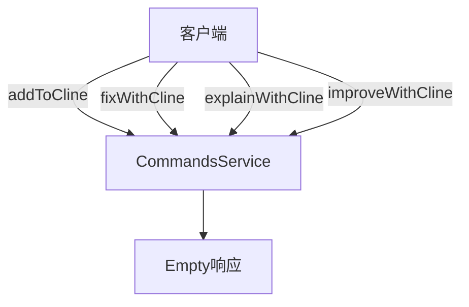
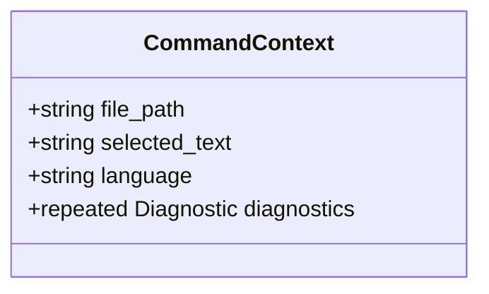
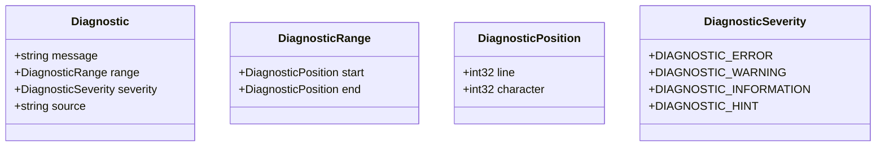
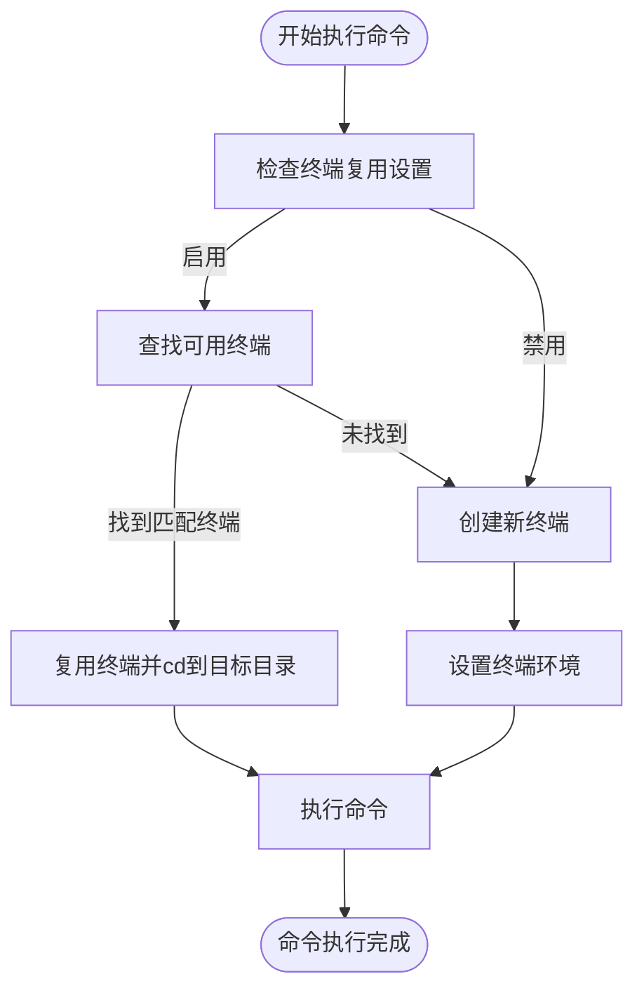
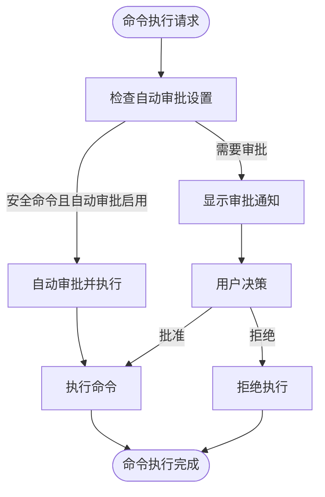
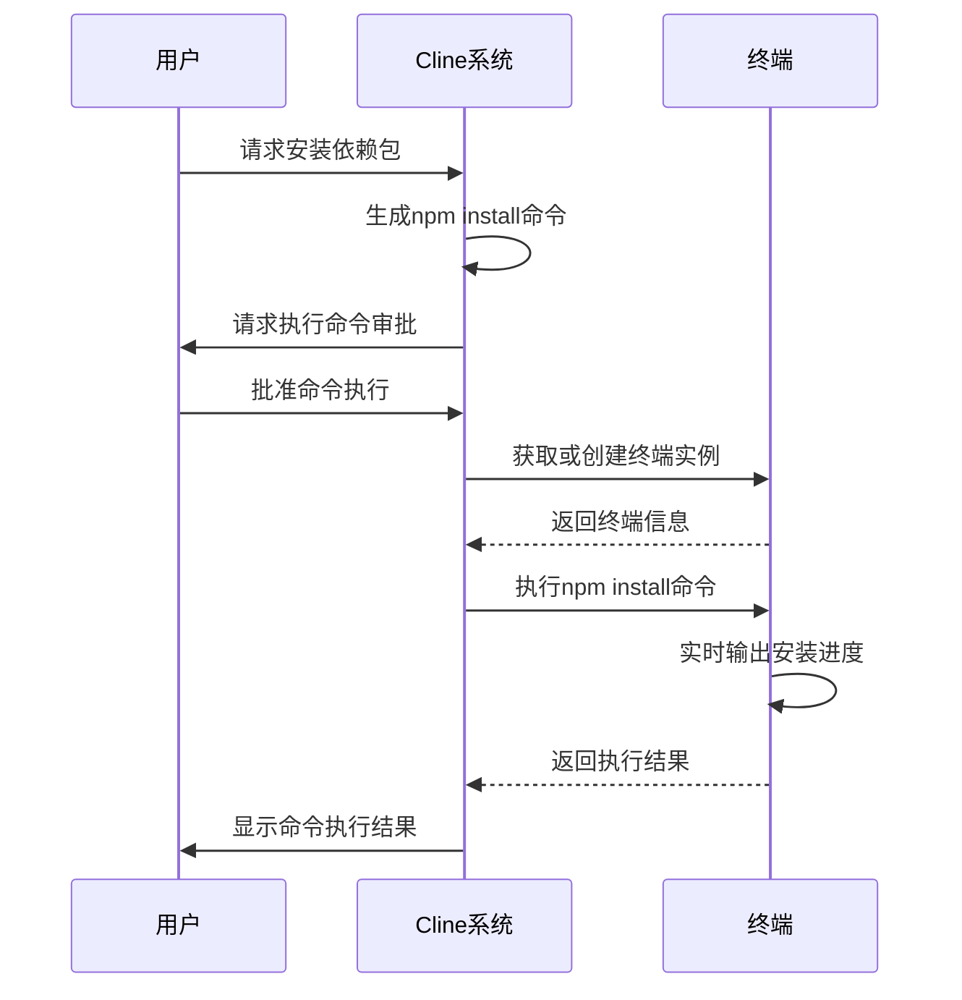
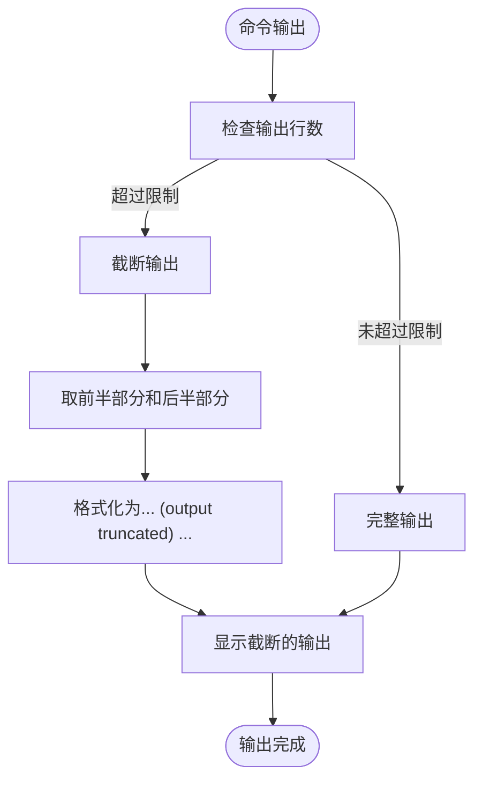

# 命令服务

<cite>
**本文档引用的文件**  
- [commands.proto](file://proto/cline/commands.proto)
- [common.proto](file://proto/cline/common.proto)
- [TerminalManager.ts](file://src/integrations/terminal/TerminalManager.ts)
- [ExecuteCommandToolHandler.ts](file://src/core/task/tools/handlers/ExecuteCommandToolHandler.ts)
</cite>

## 目录
1. [简介](#简介)
2. [RPC方法定义](#rpc方法定义)
3. [消息结构定义](#消息结构定义)
4. [终端会话管理](#终端会话管理)
5. [命令执行安全机制](#命令执行安全机制)
6. [实际调用示例](#实际调用示例)
7. [输出流处理与资源限制](#输出流处理与资源限制)

## 简介
命令服务（CommandsService）是Cline系统中的核心组件之一，负责在集成开发环境（IDE）中执行各种上下文相关的命令操作。该服务通过Protocol Buffer（protobuf）定义的接口，允许IDE直接调用而非通过Web视图，以响应IDE中的用户交互。本API文档详细描述了CommandsService服务的接口规范、消息结构、终端管理机制以及安全防护措施。

**Section sources**
- [commands.proto](file://proto/cline/commands.proto#L1-L29)

## RPC方法定义
CommandsService服务提供了四个主要的远程过程调用（RPC）方法，用于处理不同的代码操作请求：

| 方法名称 | 请求类型 | 响应类型 | 描述 |
|--------|--------|--------|------|
| addToCline | CommandContext | Empty | 将当前文件或选中文本添加到Cline上下文中 |
| fixWithCline | CommandContext | Empty | 使用Cline修复当前文件或选中文本中的问题 |
| explainWithCline | CommandContext | Empty | 使用Cline解释当前文件或选中文本的功能 |
| improveWithCline | CommandContext | Empty | 使用Cline改进当前文件或选中文本的质量 |

**Diagram sources**
- [commands.proto](file://proto/cline/commands.proto#L1-L29)

**Section sources**
- [commands.proto](file://proto/cline/commands.proto#L1-L29)

## 消息结构定义
### CommandContext消息
CommandContext消息包含了执行命令所需的所有上下文信息：

**Diagram sources**
- [commands.proto](file://proto/cline/commands.proto#L1-L29)

#### 字段说明
- **file_path**: 当前文件的绝对路径（可选）
- **selected_text**: 用户选中的源代码文本（可选）
- **language**: 当前文件的语言标识符（可选）
- **diagnostics**: 当前文件的诊断问题列表（可重复）

### Diagnostic消息
Diagnostic消息定义了代码诊断信息的结构，用于传递编译错误、警告等信息：

**Diagram sources**
- [common.proto](file://proto/cline/common.proto#L50-L98)

**Section sources**
- [common.proto](file://proto/cline/common.proto#L50-L98)

## 终端会话管理
命令服务通过TerminalManager组件管理终端会话的生命周期，确保命令执行的效率和资源的合理利用。

### 终端复用机制
系统实现了智能的终端复用策略，根据工作目录和shell配置决定是否复用现有终端：

**Diagram sources**
- [TerminalManager.ts](file://src/integrations/terminal/TerminalManager.ts#L200-L300)

### 终端管理API
TerminalManager提供了以下关键方法来管理终端实例：

| 方法 | 参数 | 返回值 | 描述 |
|------|------|--------|------|
| getOrCreateTerminal | cwd: string | Promise<TerminalInfo> | 获取或创建指定工作目录的终端 |
| runCommand | terminalInfo: TerminalInfo, command: string | TerminalProcessResultPromise | 在指定终端上运行命令 |
| closeTerminals | filterFn: (terminal: TerminalInfo) => boolean, force: boolean | number | 关闭符合条件的终端 |
| setDefaultTerminalProfile | profileId: string | {closedCount: number, busyTerminals: TerminalInfo[]} | 设置默认终端配置文件 |

**Section sources**
- [TerminalManager.ts](file://src/integrations/terminal/TerminalManager.ts#L1-L461)

## 命令执行安全机制
系统实施了多层次的安全防护机制，确保命令执行的安全性。

### 命令审批流程
所有命令执行都必须经过严格的审批流程，分为自动审批和手动审批两种模式：

**Diagram sources**
- [ExecuteCommandToolHandler.ts](file://src/core/task/tools/handlers/ExecuteCommandToolHandler.ts#L90-L120)

### 安全防护措施
1. **命令注入防护**: 通过参数验证和输入清理防止恶意命令注入
2. **权限控制**: 基于requires_approval参数区分安全和危险操作
3. **超时机制**: 为长时间运行的命令设置超时限制
4. **忽略文件检查**: 通过clineignore机制防止访问受保护的文件

**Section sources**
- [ExecuteCommandToolHandler.ts](file://src/core/task/tools/handlers/ExecuteCommandToolHandler.ts#L1-L147)

## 实际调用示例
以下示例展示了如何使用execute_command工具在用户的开发环境中安全地执行shell命令。

### 示例场景
在用户的Node.js项目中安装依赖包：

**Diagram sources**
- [ExecuteCommandToolHandler.ts](file://src/core/task/tools/handlers/ExecuteCommandToolHandler.ts#L120-L140)
- [TerminalManager.ts](file://src/integrations/terminal/TerminalManager.ts#L200-L250)

### 执行流程
1. 用户在IDE中触发"安装依赖"操作
2. Cline系统生成相应的npm install命令
3. 系统根据命令的潜在影响决定是否需要用户审批
4. 如果需要审批，向用户显示审批请求
5. 用户批准后，系统通过TerminalManager获取终端实例
6. 在终端中执行命令并实时捕获输出
7. 将执行结果返回给用户界面

**Section sources**
- [ExecuteCommandToolHandler.ts](file://src/core/task/tools/handlers/ExecuteCommandToolHandler.ts#L1-L147)
- [TerminalManager.ts](file://src/integrations/terminal/TerminalManager.ts#L1-L461)

## 输出流处理与资源限制
系统实现了高效的输出流处理和资源限制机制，确保大规模输出的可管理性和系统资源的合理使用。

### 输出流处理
TerminalManager对命令输出进行智能处理，防止内存溢出：

**Diagram sources**
- [TerminalManager.ts](file://src/integrations/terminal/TerminalManager.ts#L348-L360)

### 资源限制配置
系统提供了可配置的资源限制参数：

| 配置项 | 默认值 | 描述 |
|--------|--------|------|
| terminalOutputLineLimit | 500 | 终端输出行数限制 |
| shellIntegrationTimeout | 4000ms | Shell集成超时时间 |
| terminalReuseEnabled | true | 是否启用终端复用 |

这些配置可以通过系统设置进行调整，以适应不同的使用场景和性能需求。

**Section sources**
- [TerminalManager.ts](file://src/integrations/terminal/TerminalManager.ts#L92-L100)