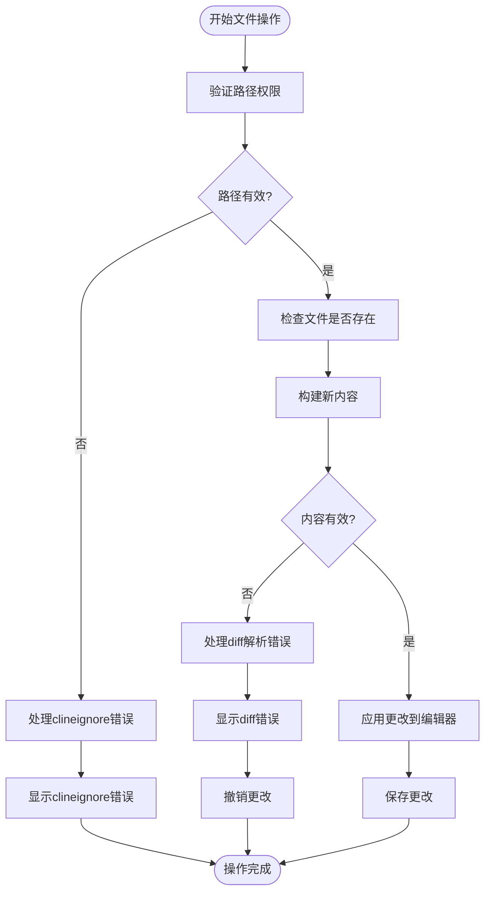
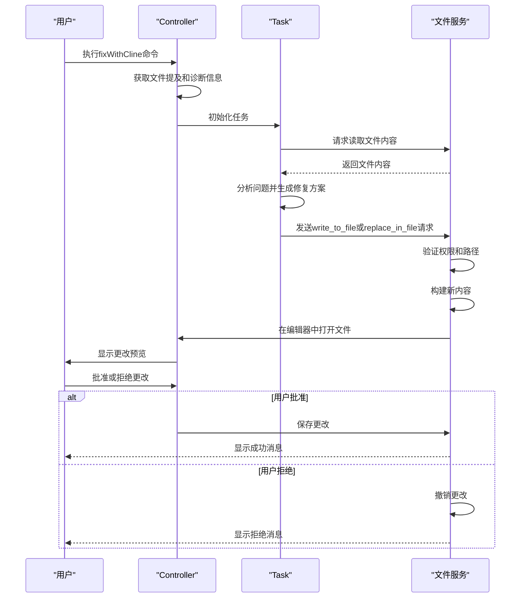
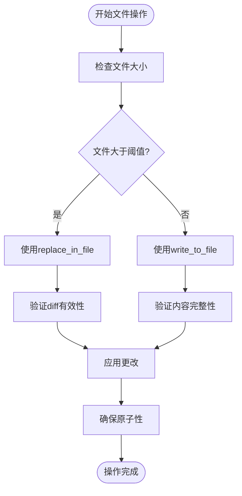

# 文件服务

<cite>
**本文档引用的文件**   
- [file.proto](file://proto/cline/file.proto)
- [fs.ts](file://src/utils/fs.ts)
- [WriteToFileToolHandler.ts](file://src/core/task/tools/handlers/WriteToFileToolHandler.ts)
- [fixWithCline.ts](file://src/core/controller/commands/fixWithCline.ts)
</cite>

## 目录
1. [简介](#简介)
2. [RPC方法签名](#rpc方法签名)
3. [请求与响应消息定义](#请求与响应消息定义)
4. [权限模型与错误码](#权限模型与错误码)
5. [调用示例：fixWithCline命令](#调用示例：fixwithcline命令)
6. [大文件处理与原子性保证](#大文件处理与原子性保证)

## 简介
文件服务（FileService）是Cline系统中的核心组件，提供了一组用于文件操作的gRPC接口。该服务支持文件读取、写入、搜索、规则管理等多种功能，为自动化代码修复、文件修改等高级功能提供底层支持。本API文档详细描述了FileService的所有接口、消息结构、权限控制机制以及性能考量。

**Section sources**
- [file.proto](file://proto/cline/file.proto)

## RPC方法签名
文件服务提供了多个RPC方法，涵盖文件操作、规则管理、路径转换等功能。以下是所有可用方法的完整签名：

```protobuf
// 文件相关操作的服务
service FileService {
  // 将文本复制到剪贴板
  rpc copyToClipboard(StringRequest) returns (Empty);
 
  // 在编辑器中打开文件
  rpc openFile(StringRequest) returns (Empty);
 
  // 在系统查看器中打开图像
  rpc openImage(StringRequest) returns (Empty);
  
  // 打开提及（文件、路径、git提交、问题、终端或URL）
  rpc openMention(StringRequest) returns (Empty);

  // 从全局或工作区规则目录中删除规则文件
  rpc deleteRuleFile(RuleFileRequest) returns (RuleFile);
  
  // 从全局或工作区规则目录中创建规则文件
  rpc createRuleFile(RuleFileRequest) returns (RuleFile);
  
  // 在工作区中搜索git提交
  rpc searchCommits(StringRequest) returns (GitCommits);

  // 从文件系统中选择图像和其他文件，并分别返回数据URL和路径
  rpc selectFiles(BooleanRequest) returns (StringArrays);
  
  // 将URIs转换为工作区相对路径
  rpc getRelativePaths(RelativePathsRequest) returns (RelativePaths);
  
  // 在工作区中使用模糊匹配搜索文件
  rpc searchFiles(FileSearchRequest) returns (FileSearchResults);
  
  // 切换Cline规则（启用或禁用）
  rpc toggleClineRule(ToggleClineRuleRequest) returns (ToggleClineRules);

  // 切换Cursor规则（启用或禁用）
  rpc toggleCursorRule(ToggleCursorRuleRequest) returns (ClineRulesToggles);
  
  // 切换Windsurf规则（启用或禁用）
  rpc toggleWindsurfRule(ToggleWindsurfRuleRequest) returns (ClineRulesToggles);
  
  // 刷新所有规则切换（Cline、External和Workflows）
  rpc refreshRules(EmptyRequest) returns (RefreshedRules);

  // 在磁盘上打开任务的对话历史文件
  rpc openTaskHistory(StringRequest) returns (Empty);
  
  // 切换工作流的开启或关闭状态
  rpc toggleWorkflow(ToggleWorkflowRequest) returns (ClineRulesToggles);

  // 检查文件是否存在于项目中
  rpc ifFileExistsRelativePath(StringRequest) returns (BooleanResponse);

  // 通过相对路径在编辑器中打开文件
  rpc openFileRelativePath(StringRequest) returns (Empty);
  
  // 打开或创建焦点链检查清单markdown文件进行编辑
  rpc openFocusChainFile(StringRequest) returns (Empty);
}
```

**Section sources**
- [file.proto](file://proto/cline/file.proto#L10-L78)

## 请求与响应消息定义
### 核心请求消息

#### RelativePathsRequest
用于将URI列表转换为相对路径的请求。

| 字段 | 类型 | 必需性 | 业务含义 |
|------|------|--------|----------|
| metadata | Metadata | 是 | 请求元数据，包含上下文信息 |
| uris | repeated string | 是 | 需要转换的URI列表 |

#### FileSearchRequest
用于在工作区中搜索文件的请求。

| 字段 | 类型 | 必需性 | 业务含义 |
|------|------|--------|----------|
| metadata | Metadata | 是 | 请求元数据，包含上下文信息 |
| query | string | 是 | 搜索查询字符串，支持模糊匹配 |
| mentions_request_id | string (optional) | 否 | 可选的请求ID，用于跟踪请求 |
| limit | int32 (optional) | 否 | 可选的结果限制（默认：20） |
| selected_type | FileSearchType (optional) | 否 | 可选的类型过滤器（文件或文件夹） |

#### RuleFileRequest
用于所有规则文件操作的统一请求。

| 字段 | 类型 | 必需性 | 业务含义 |
|------|------|--------|----------|
| metadata | Metadata | 是 | 请求元数据，包含上下文信息 |
| is_global | bool | 是 | 指示是全局规则还是工作区规则 |
| rule_path | string (optional) | 否 | 删除规则文件时的路径 |
| filename | string (optional) | 否 | 创建规则文件时的文件名 |
| type | string (optional) | 否 | 要创建的文件类型 |

#### ToggleClineRuleRequest
用于切换Cline规则的请求。

| 字段 | 类型 | 必需性 | 业务含义 |
|------|------|--------|----------|
| metadata | Metadata | 是 | 请求元数据，包含上下文信息 |
| is_global | bool | 是 | 指示是全局规则还是工作区规则 |
| rule_path | string | 是 | 规则文件的路径 |
| enabled | bool | 是 | 指示是启用还是禁用规则 |

### 核心响应消息

#### RelativePaths
包含转换后的相对路径的响应。

| 字段 | 类型 | 业务含义 |
|------|------|----------|
| paths | repeated string | 转换后的相对路径数组 |

#### FileSearchResults
文件搜索操作的结果。

| 字段 | 类型 | 业务含义 |
|------|------|----------|
| results | repeated FileInfo | 文件/文件夹结果数组 |
| mentions_request_id | string (optional) | 回显的请求ID，用于跟踪 |

#### FileInfo
搜索结果中的文件信息结构。

| 字段 | 类型 | 业务含义 |
|------|------|----------|
| path | string | 从工作区根目录开始的相对路径 |
| type | string | "file" 或 "folder" |
| label | string (optional) | 显示名称（通常是基名称） |

#### RuleFile
规则文件操作的结果，仅包含有意义的数据。

| 字段 | 类型 | 业务含义 |
|------|------|----------|
| file_path | string | 规则文件的路径 |
| display_name | string | 用于显示的文件名 |
| already_exists | bool | 对于createRuleFile，指示文件是否已存在 |

#### ToggleClineRules
toggleClineRule操作的响应。

| 字段 | 类型 | 业务含义 |
|------|------|----------|
| global_cline_rules_toggles | ClineRulesToggles | 全局Cline规则切换 |
| local_cline_rules_toggles | ClineRulesToggles | 本地Cline规则切换 |

#### ClineRulesToggles
从文件路径到启用/禁用状态的映射，匹配应用的ClineRulesToggles类型。

| 字段 | 类型 | 业务含义 |
|------|------|----------|
| toggles | map<string, bool> | 文件路径到启用/禁用状态的映射 |

#### RefreshedRules
refreshRules操作的响应。

| 字段 | 类型 | 业务含义 |
|------|------|----------|
| global_cline_rules_toggles | ClineRulesToggles | 全局Cline规则切换 |
| local_cline_rules_toggles | ClineRulesToggles | 本地Cline规则切换 |
| local_cursor_rules_toggles | ClineRulesToggles | 本地Cursor规则切换 |
| local_windsurf_rules_toggles | ClineRulesToggles | 本地Windsurf规则切换 |
| local_workflow_toggles | ClineRulesToggles | 本地工作流切换 |
| global_workflow_toggles | ClineRulesToggles | 全局工作流切换 |

**Section sources**
- [file.proto](file://proto/cline/file.proto#L80-L210)

## 权限模型与错误码
文件服务的权限模型基于`clineignore`机制和工作区边界控制。所有文件操作都必须通过权限验证才能执行。

### 权限验证流程
1. **路径验证**：首先检查目标路径是否符合工作区范围
2. **clineignore检查**：使用`ToolValidator.checkClineIgnorePath()`验证路径是否被`clineignore`规则排除
3. **存在性检查**：对于修改操作，验证文件是否存在
4. **自动审批检查**：根据用户设置决定是否需要手动审批

当权限验证失败时，系统会通过回调机制返回错误信息，而不是直接抛出异常。

### 错误处理机制
文件服务采用分层错误处理策略：



**Diagram sources**
- [WriteToFileToolHandler.ts](file://src/core/task/tools/handlers/WriteToFileToolHandler.ts#L284-L303)
- [fs.ts](file://src/utils/fs.ts#L34-L79)

**Section sources**
- [WriteToFileToolHandler.ts](file://src/core/task/tools/handlers/WriteToFileToolHandler.ts#L284-L303)
- [fs.ts](file://src/utils/fs.ts#L34-L79)

## 调用示例：fixWithCline命令
`fixWithCline`命令是文件服务的一个典型应用场景，它展示了如何通过文件服务读取和修改项目文件来修复代码问题。

### 执行流程


**Diagram sources**
- [fixWithCline.ts](file://src/core/controller/commands/fixWithCline.ts#L0-L19)
- [WriteToFileToolHandler.ts](file://src/core/task/tools/handlers/WriteToFileToolHandler.ts#L90-L123)

### 代码实现细节
`fixWithCline`命令的实现涉及多个组件的协作：

1. **命令触发**：用户在编辑器中选择代码并触发`fixWithCline`命令
2. **上下文收集**：控制器收集选中的文本、文件路径和诊断信息
3. **任务初始化**：创建新任务并设置上下文
4. **文件操作**：使用文件服务读取和修改文件

```typescript
export async function fixWithCline(controller: Controller, request: CommandContext): Promise<Empty> {
	const filePath = request.filePath || ""
	const fileMention = await getFileMentionFromPath(filePath)
	const problemsString = await singleFileDiagnosticsToProblemsString(filePath, request.diagnostics)

	await controller.initTask(
		`Fix the following code in ${fileMention}
\`\`\`\n${request.selectedText}\n\`\`\`\n\nProblems:\n${problemsString}`,
	)
	console.log("fixWithCline", request.selectedText, request.filePath, request.language, problemsString)

	telemetryService.captureButtonClick("codeAction_fixWithCline", controller.task?.ulid)
	return {}
}
```

在此过程中，文件服务负责实际的文件读写操作，而控制器负责协调整个流程。

**Section sources**
- [fixWithCline.ts](file://src/core/controller/commands/fixWithCline.ts#L0-L19)
- [WriteToFileToolHandler.ts](file://src/core/task/tools/handlers/WriteToFileToolHandler.ts#L90-L123)

## 大文件处理与原子性保证
文件服务在处理大文件时采用了特殊的优化策略，确保性能和数据完整性。

### 大文件处理策略
1. **流式处理**：对于大文件，系统采用流式处理方式，避免一次性加载整个文件到内存
2. **增量更新**：使用`replace_in_file`工具进行局部修改，而不是重写整个文件
3. **大小限制**：对图像等二进制文件实施7500px的尺寸限制，防止内存溢出



**Diagram sources**
- [WriteToFileToolHandler.ts](file://src/core/task/tools/handlers/WriteToFileToolHandler.ts#L284-L303)
- [fs.ts](file://src/utils/fs.ts#L81-L106)

### 原子性保证机制
文件服务通过以下机制确保操作的原子性：

1. **事务性编辑**：所有文件更改首先在内存中进行，只有在用户批准后才持久化
2. **撤销机制**：提供完整的撤销功能，可以在保存前恢复原始状态
3. **错误恢复**：在任何步骤发生错误时，自动回滚到初始状态

关键实现代码：
```typescript
async validateAndPrepareFileOperation(config: TaskConfig, block: ToolUse, relPath: string, diff?: string, content?: string) {
	// 检查clineignore访问权限
	const accessValidation = this.validator.checkClineIgnorePath(relPath)
	if (!accessValidation.ok) {
		await config.callbacks.say("clineignore_error", relPath)
		return
	}
	
	// 构建新内容
	let newContent: string
	if (diff) {
		try {
			newContent = await constructNewFileContent(
				diff,
				config.services.diffViewProvider.originalContent || "",
				!block.partial,
			)
		} catch (error) {
			// 处理diff错误
			await config.services.diffViewProvider.revertChanges()
			await config.services.diffViewProvider.reset()
			return
		}
	}
	
	return { relPath, fileExists, diff, content, newContent }
}
```

这种设计确保了即使在复杂的文件操作中，系统也能保持数据的一致性和可靠性。

**Section sources**
- [WriteToFileToolHandler.ts](file://src/core/task/tools/handlers/WriteToFileToolHandler.ts#L284-L303)
- [fs.ts](file://src/utils/fs.ts#L81-L106)