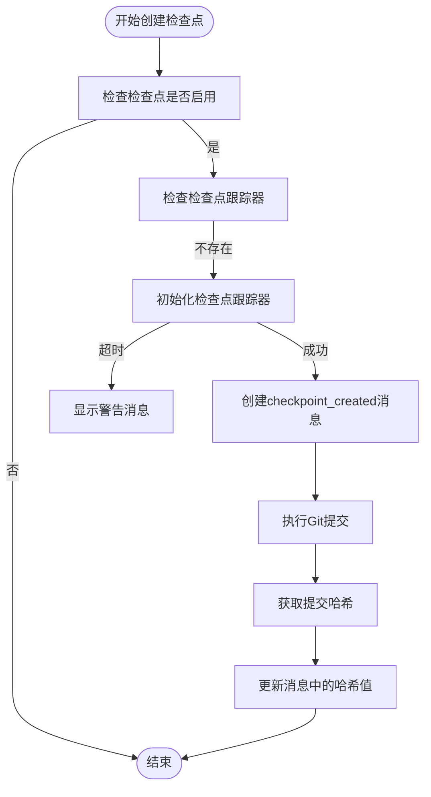
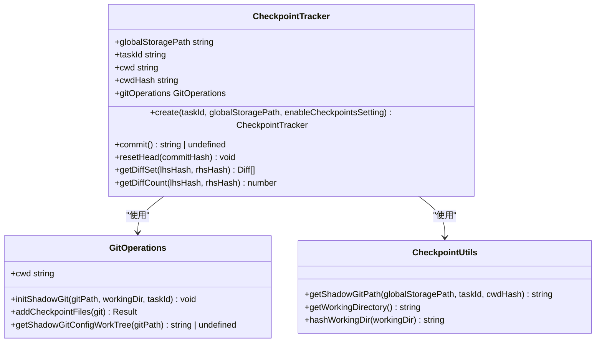
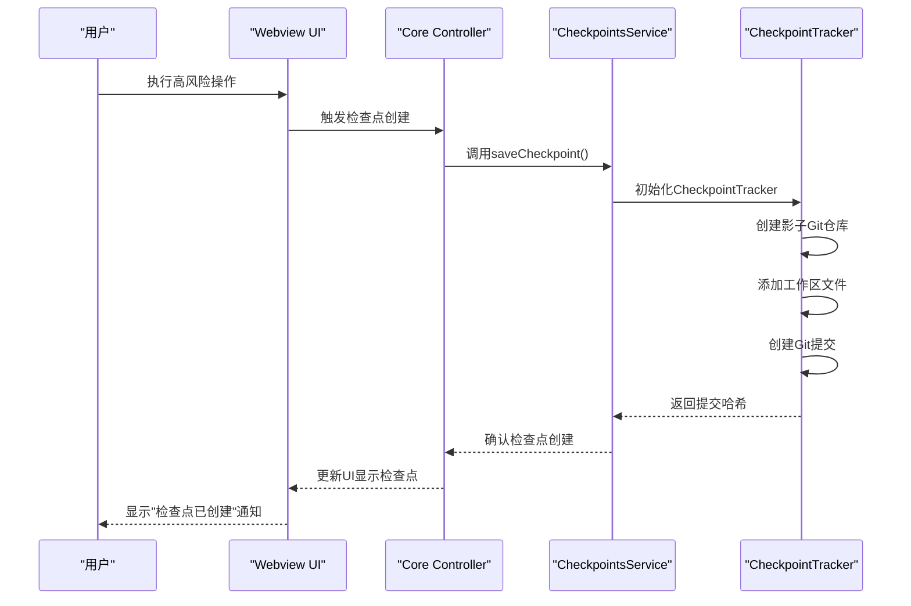
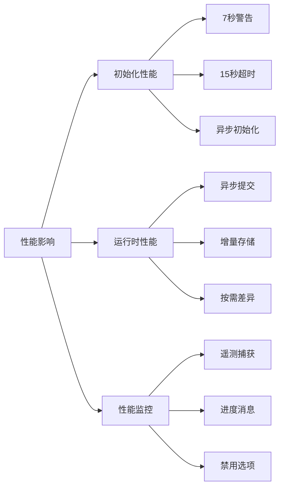

# 检查点服务

<cite>
**本文档中引用的文件**  
- [checkpoints.proto](file://proto/cline/checkpoints.proto)
- [index.ts](file://src/integrations/checkpoints/index.ts)
- [CheckpointTracker.ts](file://src/integrations/checkpoints/CheckpointTracker.ts)
- [checkpointDiff.ts](file://src/core/controller/checkpoints/checkpointDiff.ts)
- [checkpointRestore.ts](file://src/core/controller/checkpoints/checkpointRestore.ts)
</cite>

## 目录
1. [简介](#简介)
2. [RPC方法签名](#rpc方法签名)
3. [消息结构定义](#消息结构定义)
4. [检查点创建策略与存储机制](#检查点创建策略与存储机制)
5. [Git集成与存储管理](#git集成与存储管理)
6. [调用示例：高风险代码修改前的检查点创建](#调用示例高风险代码修改前的检查点创建)
7. [性能影响](#性能影响)

## 简介
检查点服务为Cline提供了一种安全的版本控制机制，允许在执行代码修改前创建工作区状态的快照，并在需要时回滚到先前的状态。该服务通过在后台使用Git实现，但与用户的主Git仓库隔离，避免了冲突。检查点可用于任务上下文、文件系统或两者同时恢复。

**检查点服务**的核心功能包括：
- 创建检查点以保存当前工作区状态
- 恢复到先前的检查点
- 显示检查点之间的差异
- 与Git系统集成以实现高效的版本控制

## RPC方法签名

### checkpointDiff
此方法用于显示指定消息时间戳处的检查点与当前工作区状态之间的差异。

**方法签名**  
`rpc checkpointDiff(Int64Request) returns (Empty);`

**参数说明**  
- `Int64Request.value` (int64): 指定要比较的检查点消息的时间戳（以毫秒为单位）。

**返回值**  
- `Empty`: 无返回数据，操作成功时返回空响应。

**行为描述**  
当调用此方法时，系统会查找对应时间戳的检查点，并使用多文件差异视图显示从该检查点到当前状态的所有更改。如果检查点不存在或无法访问，则会显示错误消息。

[SPEC SYMBOL](file://proto/cline/checkpoints.proto#L10)

### checkpointRestore
此方法用于将任务和/或工作区恢复到指定检查点。

**方法签名**  
`rpc checkpointRestore(CheckpointRestoreRequest) returns (Empty);`

**参数说明**  
- `CheckpointRestoreRequest.metadata` (Metadata): 请求的元数据。
- `CheckpointRestoreRequest.number` (int64): 目标检查点消息的时间戳。
- `CheckpointRestoreRequest.restore_type` (string): 恢复类型，可选值为 "task"、"workspace" 或 "taskAndWorkspace"。
- `CheckpointRestoreRequest.offset` (optional int64): 可选偏移量，用于调整恢复的消息索引。

**返回值**  
- `Empty`: 无返回数据，操作成功时返回空响应。

**行为描述**  
根据指定的恢复类型，系统会将任务消息历史、工作区文件或两者同时恢复到目标检查点的状态。恢复过程中会处理相关的上下文历史和API请求信息。

[SPEC SYMBOL](file://proto/cline/checkpoints.proto#L11)

## 消息结构定义

### CheckpointRestoreRequest
此消息定义了恢复检查点请求的结构。

**字段定义**  
- `metadata` (Metadata, 标签1): 请求的元数据，包含身份验证和上下文信息。
- `number` (int64, 标签2): 目标检查点的时间戳，用于定位要恢复的检查点。
- `restore_type` (string, 标签3): 指定恢复的范围，支持三种模式：
  - `"task"`: 仅恢复任务上下文和消息历史
  - `"workspace"`: 仅恢复工作区文件
  - `"taskAndWorkspace"`: 同时恢复任务和工作区
- `offset` (optional int64, 标签4): 可选的索引偏移量，用于在恢复时调整目标消息的位置。

**使用场景**  
此消息在用户选择恢复操作时由前端构造并发送到后端服务，包含了恢复所需的所有必要信息。

[SPEC SYMBOL](file://proto/cline/checkpoints.proto#L14-L18)

### CheckpointInfo
虽然在proto文件中未直接定义`CheckpointInfo`，但从实现代码中可以推断其结构。

**推断字段定义**  
- `timestamp` (int64): 检查点创建的时间戳。
- `hash` (string): 对应Git提交的哈希值，用于唯一标识检查点。
- `message` (string): 检查点的描述性消息，通常包含工作目录哈希和任务ID。
- `isCheckpointCheckedOut` (boolean): 标识当前是否已恢复到此检查点。

**数据来源**  
这些信息存储在消息系统中，类型为`checkpoint_created`的消息包含`lastCheckpointHash`字段，用于关联检查点与Git提交。

[SPEC SYMBOL](file://src/integrations/checkpoints/index.ts#L155-L167)

### Diff
差异信息通过`getDiffSet`方法生成，表示两个检查点之间的文件变化。

**字段定义**  
- `relativePath` (string): 文件的相对路径。
- `absolutePath` (string): 文件的绝对路径。
- `before` (string): 检查点中文件的内容。
- `after` (string): 当前状态中文件的内容。

**生成逻辑**  
系统使用Git的`diff`功能比较两个提交之间的差异，对于未指定右侧哈希的情况，则比较检查点与当前工作区状态。

[SPEC SYMBOL](file://src/integrations/checkpoints/CheckpointTracker.ts#L290-L337)

## 检查点创建策略与存储机制

### 创建策略
检查点的创建遵循以下策略：

1. **自动创建时机**：
   - 在非尝试完成消息时自动创建检查点
   - 在任务完成尝试时创建检查点
   - 避免连续创建相同的检查点消息

2. **条件检查**：
   - 检查点功能必须在设置中启用
   - 避免在已超时错误的情况下重复初始化
   - 确保不会创建重复的`checkpoint_created`消息

3. **异步处理**：
   - 创建检查点消息后异步获取提交哈希
   - 更新消息系统中的`lastCheckpointHash`字段



**图源**  
- [index.ts](file://src/integrations/checkpoints/index.ts#L126-L153)
- [CheckpointTracker.ts](file://src/integrations/checkpoints/CheckpointTracker.ts#L128-L168)

### 存储机制
检查点使用"影子Git仓库"（shadow git repository）进行存储，具有以下特点：

- **隔离性**：在用户主Git仓库之外创建独立的Git仓库，避免干扰
- **位置**：存储在全局存储路径下，按任务ID和工作目录哈希组织
- **结构**：每个工作区有唯一的影子Git仓库，所有提交存储在同一分支上
- **安全性**：防止在敏感目录（如主目录、桌面）中使用

**存储流程**：
1. 计算工作目录的哈希值作为唯一标识
2. 在全局存储路径下创建影子Git仓库
3. 配置Git设置（身份、LFS等）
4. 将工作区文件添加到影子仓库
5. 创建带有特定格式消息的提交

[SPEC SYMBOL](file://src/integrations/checkpoints/CheckpointTracker.ts#L100-L127)

## Git集成与存储管理

### Git集成方式
检查点服务深度集成Git系统，但采用非侵入式方法：

**核心组件**：
- `CheckpointTracker`: 管理影子Git仓库的核心类
- `GitOperations`: 处理Git操作的辅助类
- `simple-git`: Git操作的Node.js封装

**集成特点**：
- **影子仓库**：创建独立的Git仓库，不影响用户原有的版本控制
- **自动配置**：自动设置Git身份、禁用LFS等
- **嵌套仓库处理**：能够处理工作区中已存在的Git仓库
- **工作树配置**：正确配置Git工作树以跟踪目标目录

**操作流程**：
1. 验证Git是否安装
2. 创建或初始化影子Git仓库
3. 配置仓库设置
4. 执行Git操作（提交、重置、差异比较）



**图源**  
- [CheckpointTracker.ts](file://src/integrations/checkpoints/CheckpointTracker.ts#L10-L377)
- [CheckpointGitOperations.ts](file://src/integrations/checkpoints/CheckpointGitOperations.ts)
- [CheckpointUtils.ts](file://src/integrations/checkpoints/CheckpointUtils.ts)

### 存储空间管理
系统通过多种机制管理存储空间：

**空间优化策略**：
- **排除文件**：通过`CheckpointExclusions`类过滤不需要跟踪的文件
- **定期清理**：虽然当前实现未显示自动清理，但可以通过任务完成时清理相关检查点
- **高效存储**：利用Git的增量存储机制，只保存变化的部分

**存储位置**：
- 全局存储路径：`context.globalStorageUri.fsPath`
- 按任务ID和工作目录哈希组织：确保不同任务和工作区的隔离

**容量监控**：
- 初始化时有超时机制（15秒），防止在大型仓库中长时间阻塞
- 7秒后显示警告，提示用户在大型仓库中可能需要更长时间

[SPEC SYMBOL](file://src/integrations/checkpoints/CheckpointTracker.ts#L169-L200)

## 调用示例：高风险代码修改前的检查点创建

### 使用场景
在执行高风险代码修改（如大规模重构、依赖升级或架构变更）前，创建检查点以确保可以安全回滚。

### 调用流程


**图源**  
- [index.ts](file://src/integrations/checkpoints/index.ts#L126-L153)
- [checkpointDiff.ts](file://src/core/controller/checkpoints/checkpointDiff.ts#L0-L8)

### 代码示例
```typescript
// 在执行高风险代码修改前
await checkpointManager.saveCheckpoint();

// 执行高风险操作...
try {
    // 尝试进行代码修改
    await performRiskyCodeModification();
} catch (error) {
    // 操作失败，恢复到检查点
    await checkpointManager.restoreCheckpoint(
        lastCheckpointTimestamp,
        "taskAndWorkspace"
    );
    console.log("已恢复到安全状态");
}
```

### 实际应用
1. **重构前**：在开始大规模代码重构前创建检查点
2. **依赖升级**：在更新重要依赖包前创建检查点
3. **架构变更**：在修改系统架构前创建检查点
4. **实验性功能**：在开发实验性功能前创建检查点

此机制确保开发者可以大胆尝试变更，而不必担心破坏现有功能。

[SPEC SYMBOL](file://src/integrations/checkpoints/index.ts#L126-L153)

## 性能影响

### 初始化性能
检查点系统的初始化可能对性能产生影响：

**时间消耗**：
- **正常情况**：在小型到中型仓库中，初始化通常在几秒内完成
- **警告阈值**：7秒后显示警告消息，提示用户初始化时间较长
- **超时限制**：15秒后超时，防止在大型仓库中无限等待

**优化措施**：
- 使用`pTimeout`包装初始化过程，防止阻塞
- 异步初始化，避免阻塞主线程
- 缓存`checkpointTrackerInitPromise`，防止并发初始化

### 运行时性能
在正常使用过程中的性能特征：

**检查点创建**：
- **轻量级操作**：Git提交通常很快，特别是小规模更改
- **异步执行**：提交操作异步进行，不阻塞用户界面
- **增量存储**：Git只存储变化的部分，节省磁盘空间

**差异比较**：
- **按需生成**：只有在用户请求时才生成差异
- **高效算法**：利用Git内置的高效差异算法
- **内存管理**：逐个文件处理差异，避免内存峰值

### 性能监控
系统内置了性能监控机制：

**遥测数据**：
- `shadow_git_initialized`: 影子Git初始化耗时
- `commit_created`: 提交创建耗时
- `restored`: 恢复操作耗时
- `diff_generated`: 差异生成耗时

**用户体验优化**：
- 在长时间操作时显示进度消息
- 提供禁用检查点的选项
- 在大型仓库中建议重新打开项目



**图源**  
- [CheckpointTracker.ts](file://src/integrations/checkpoints/CheckpointTracker.ts#L180-L185)
- [telemetryService](file://src/services/telemetry/TelemetryService.ts)