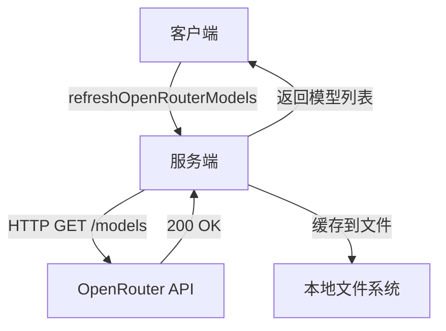
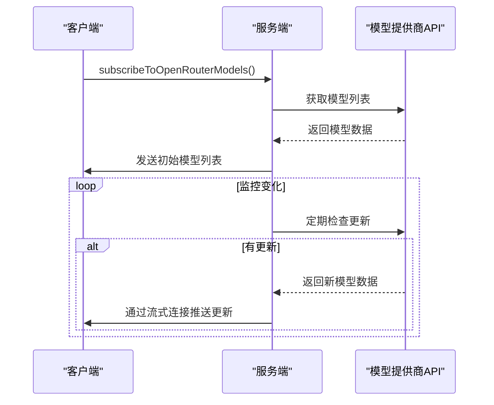
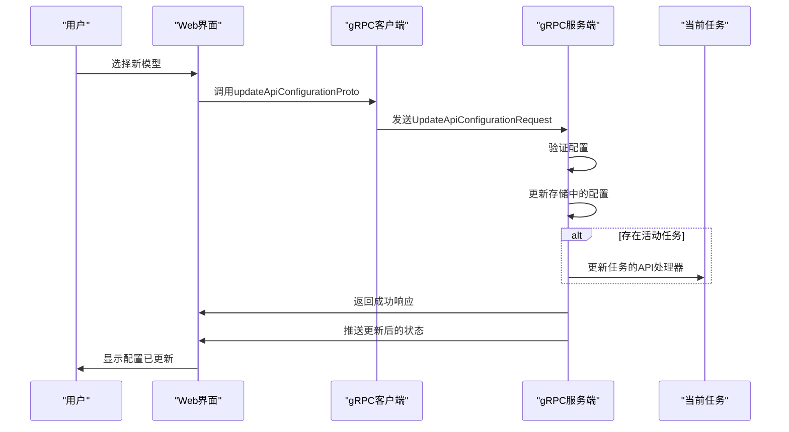
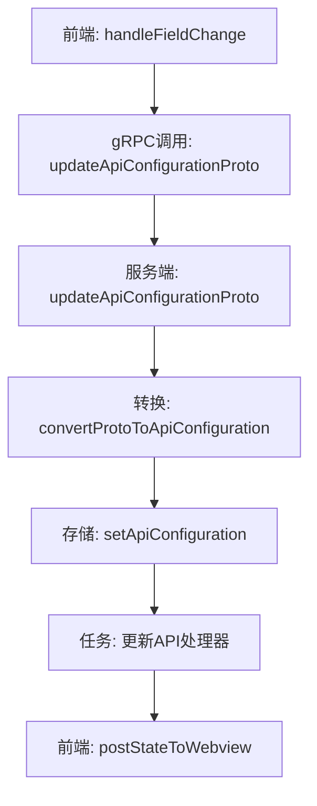

# 模型服务

<cite>
**本文档中引用的文件**  
- [models.proto](file://proto/cline/models.proto)
- [updateApiConfigurationProto.ts](file://src/core/controller/models/updateApiConfigurationProto.ts)
- [api-configuration-conversion.ts](file://src/shared/proto-conversions/models/api-configuration-conversion.ts)
- [useApiConfigurationHandlers.ts](file://webview-ui/src/components/settings/utils/useApiConfigurationHandlers.ts)
- [refreshRequestyModels.ts](file://src/core/controller/models/refreshRequestyModels.ts)
- [refreshBasetenModels.ts](file://src/core/controller/models/refreshBasetenModels.ts)
- [refreshGroqModels.ts](file://src/core/controller/models/refreshGroqModels.ts)
</cite>

## 目录
1. [模型服务API概览](#模型服务api概览)
2. [RPC方法签名](#rpc方法签名)
3. [核心消息定义](#核心消息定义)
4. [模型提供商注册与发现机制](#模型提供商注册与发现机制)
5. [模型能力协商与流式响应](#模型能力协商与流式响应)
6. [故障转移策略](#故障转移策略)
7. [配置更新调用示例](#配置更新调用示例)
8. [总结](#总结)

## 模型服务API概览

模型服务（ModelsService）是系统中负责管理AI模型生命周期的核心gRPC服务。它提供了一套统一的接口来发现、配置和管理来自不同提供商的AI模型。该服务支持多种模型提供商，包括OpenRouter、OpenAI、Ollama、LM Studio、Groq、Baseten、Hugging Face、Vercel AI Gateway等，并通过`ModelsApiConfiguration`消息实现集中式配置管理。

服务通过`updateApiConfigurationProto`方法接收配置更新，并将这些配置应用于当前运行的任务。配置变更会触发状态同步，确保前端界面与后端状态保持一致。服务还支持流式响应，用于实时推送模型列表更新。

**Section sources**
- [models.proto](file://proto/cline/models.proto#L1-L350)

## RPC方法签名

模型服务定义了多个RPC方法，用于与不同模型提供商交互：

- **getOllamaModels**：获取Ollama可用模型列表
  - 请求：`StringRequest`
  - 响应：`StringArray`

- **getLmStudioModels**：获取LM Studio可用模型列表
  - 请求：`StringRequest`
  - 响应：`StringArray`

- **getVsCodeLmModels**：获取VS Code LM API可用模型
  - 请求：`EmptyRequest`
  - 响应：`VsCodeLmModelsArray`

- **refreshOpenRouterModels**：刷新并返回OpenRouter模型
  - 请求：`EmptyRequest`
  - 响应：`OpenRouterCompatibleModelInfo`

- **refreshHuggingFaceModels**：刷新并返回Hugging Face模型
  - 请求：`EmptyRequest`
  - 响应：`OpenRouterCompatibleModelInfo`

- **refreshOpenAiModels**：刷新并返回OpenAI模型
  - 请求：`OpenAiModelsRequest`
  - 响应：`StringArray`

- **refreshVercelAiGatewayModels**：刷新并返回Vercel AI Gateway模型
  - 请求：`EmptyRequest`
  - 响应：`OpenRouterCompatibleModelInfo`

- **refreshRequestyModels**：刷新并返回Requesty模型
  - 请求：`EmptyRequest`
  - 响应：`OpenRouterCompatibleModelInfo`

- **subscribeToOpenRouterModels**：订阅OpenRouter模型更新
  - 请求：`EmptyRequest`
  - 响应：`stream OpenRouterCompatibleModelInfo`

- **updateApiConfigurationProto**：更新API配置
  - 请求：`UpdateApiConfigurationRequest`
  - 响应：`Empty`

- **refreshGroqModels**：刷新并返回Groq模型
  - 请求：`EmptyRequest`
  - 响应：`OpenRouterCompatibleModelInfo`

- **refreshBasetenModels**：刷新并返回Baseten模型
  - 请求：`EmptyRequest`
  - 响应：`OpenRouterCompatibleModelInfo`

- **getSapAiCoreModels**：获取SAP AI Core模型
  - 请求：`SapAiCoreModelsRequest`
  - 响应：`SapAiCoreModelsResponse`

**Section sources**
- [models.proto](file://proto/cline/models.proto#L7-L90)

## 核心消息定义

### 模型元数据（ModelInfo）

模型元数据通过`OpenRouterModelInfo`消息定义，包含以下字段：

- `max_tokens`：最大生成令牌数
- `context_window`：上下文窗口大小
- `supports_images`：是否支持图像输入
- `supports_prompt_cache`：是否支持提示缓存
- `input_price`：输入价格（每百万令牌）
- `output_price`：输出价格（每百万令牌）
- `cache_writes_price`：缓存写入价格
- `cache_reads_price`：缓存读取价格
- `description`：模型描述
- `thinking_config`：思考配置
- `supports_global_endpoint`：是否支持全局端点
- `tiers`：模型层级定价

### 配置（ModelConfiguration）

模型配置通过`ModelsApiConfiguration`消息定义，包含全局配置和模式特定配置：

- **全局配置**：API密钥、基础URL、超时设置等
- **计划模式配置**：`plan_mode_api_provider`、`plan_mode_api_model_id`等
- **执行模式配置**：`act_mode_api_provider`、`act_mode_api_model_id`等
- **偏好模型**：`favorited_model_ids`列表

### API提供商枚举

`ApiProvider`枚举定义了支持的模型提供商：

- ANTHROPIC
- OPENROUTER
- BEDROCK
- VERTEX
- OPENAI
- OLLAMA
- LMSTUDIO
- GEMINI
- OPENAI_NATIVE
- REQUESTY
- TOGETHER
- DEEPSEEK
- QWEN
- DOUBAO
- MISTRAL
- VSCODE_LM
- CLINE
- LITELLM
- NEBIUS
- FIREWORKS
- ASKSAGE
- XAI
- SAMBANOVA
- CEREBRAS
- GROQ
- BASETEN
- ZAI
- VERCEL_AI_GATEWAY
- QWEN_CODE
- DIFY

**Section sources**
- [models.proto](file://proto/cline/models.proto#L92-L350)

## 模型提供商注册与发现机制

模型提供商通过`refresh`系列RPC方法实现动态注册与发现。当客户端调用`refreshOpenRouterModels`、`refreshGroqModels`或`refreshBasetenModels`等方法时，服务会向相应提供商的API发起请求，获取最新的模型列表。

发现机制的工作流程如下：
1. 客户端发起`refresh`请求
2. 服务端调用相应提供商的API
3. 服务端解析响应并构建`OpenRouterCompatibleModelInfo`消息
4. 服务端将模型信息缓存到本地文件系统
5. 服务端返回模型列表给客户端

对于支持流式响应的`subscribeToOpenRouterModels`方法，服务端会建立持久连接，当模型列表发生变化时，主动推送更新给订阅者。

**Diagram sources**
- [models.proto](file://proto/cline/models.proto#L40-L45)
- [refreshRequestyModels.ts](file://src/core/controller/models/refreshRequestyModels.ts#L1-L26)
- [refreshBasetenModels.ts](file://src/core/controller/models/refreshBasetenModels.ts#L92-L121)

**Section sources**
- [models.proto](file://proto/cline/models.proto#L40-L55)
- [refreshRequestyModels.ts](file://src/core/controller/models/refreshRequestyModels.ts#L1-L26)
- [refreshBasetenModels.ts](file://src/core/controller/models/refreshBasetenModels.ts#L1-L121)

## 模型能力协商与流式响应

模型服务支持基于`OpenRouterModelInfo`消息的模型能力协商。客户端可以通过检查`supports_images`、`supports_prompt_cache`等字段来确定模型的功能支持情况。

流式响应主要用于`subscribeToOpenRouterModels`方法，允许客户端实时接收模型列表更新。服务端在检测到模型列表变化时，会通过流式连接推送新的`OpenRouterCompatibleModelInfo`消息。

流式响应处理流程：
1. 客户端建立流式连接
2. 服务端发送初始模型列表
3. 服务端监控模型列表变化
4. 当变化发生时，服务端推送更新
5. 客户端接收并处理更新

**Diagram sources**
- [models.proto](file://proto/cline/models.proto#L44-L45)
- [refreshRequestyModels.ts](file://src/core/controller/models/refreshRequestyModels.ts#L1-L26)

**Section sources**
- [models.proto](file://proto/cline/models.proto#L44-L45)
- [refreshRequestyModels.ts](file://src/core/controller/models/refreshRequestyModels.ts#L1-L26)

## 故障转移策略

模型服务的故障转移策略主要体现在配置更新和模型发现过程中。当某个提供商的API调用失败时，服务会：

1. 记录详细的错误日志
2. 提供具体的错误消息（如401无效API密钥、403访问被拒等）
3. 返回缓存的模型列表作为降级方案
4. 继续处理其他提供商的请求

例如，在`refreshBasetenModels`方法中，当API请求失败时，服务会检查错误类型并提供相应的用户友好错误消息，同时确保不会影响其他功能的正常运行。

**Section sources**
- [refreshBasetenModels.ts](file://src/core/controller/models/refreshBasetenModels.ts#L92-L121)

## 配置更新调用示例

当用户在设置中切换AI模型时，配置更新流程如下：

1. 用户在前端界面选择新的模型
2. 前端调用`updateApiConfigurationProto`方法
3. 服务端验证并更新配置
4. 服务端将新配置应用到当前任务
5. 服务端同步状态到前端

配置更新的关键代码路径：
- 前端：`useApiConfigurationHandlers.ts`中的`handleFieldChange`
- 服务端：`updateApiConfigurationProto.ts`中的处理逻辑
- 转换：`api-configuration-conversion.ts`中的转换函数

**Diagram sources**
- [useApiConfigurationHandlers.ts](file://webview-ui/src/components/settings/utils/useApiConfigurationHandlers.ts#L1-L32)
- [updateApiConfigurationProto.ts](file://src/core/controller/models/updateApiConfigurationProto.ts#L1-L43)
- [api-configuration-conversion.ts](file://src/shared/proto-conversions/models/api-configuration-conversion.ts#L1-L639)

**Section sources**
- [useApiConfigurationHandlers.ts](file://webview-ui/src/components/settings/utils/useApiConfigurationHandlers.ts#L1-L32)
- [updateApiConfigurationProto.ts](file://src/core/controller/models/updateApiConfigurationProto.ts#L1-L43)
- [api-configuration-conversion.ts](file://src/shared/proto-conversions/models/api-configuration-conversion.ts#L1-L639)

## 总结

模型服务提供了一套完整的API来管理AI模型的发现、配置和使用。通过标准化的gRPC接口，服务实现了对多种模型提供商的统一管理。配置更新机制确保了用户选择的模型能够立即生效，而流式响应和故障转移策略则保证了系统的可靠性和实时性。

该服务的设计充分考虑了用户体验和系统稳定性，通过详细的错误处理、缓存机制和状态同步，为用户提供了一个流畅的模型管理体验。

**Section sources**
- [models.proto](file://proto/cline/models.proto#L1-L350)
- [updateApiConfigurationProto.ts](file://src/core/controller/models/updateApiConfigurationProto.ts#L1-L43)