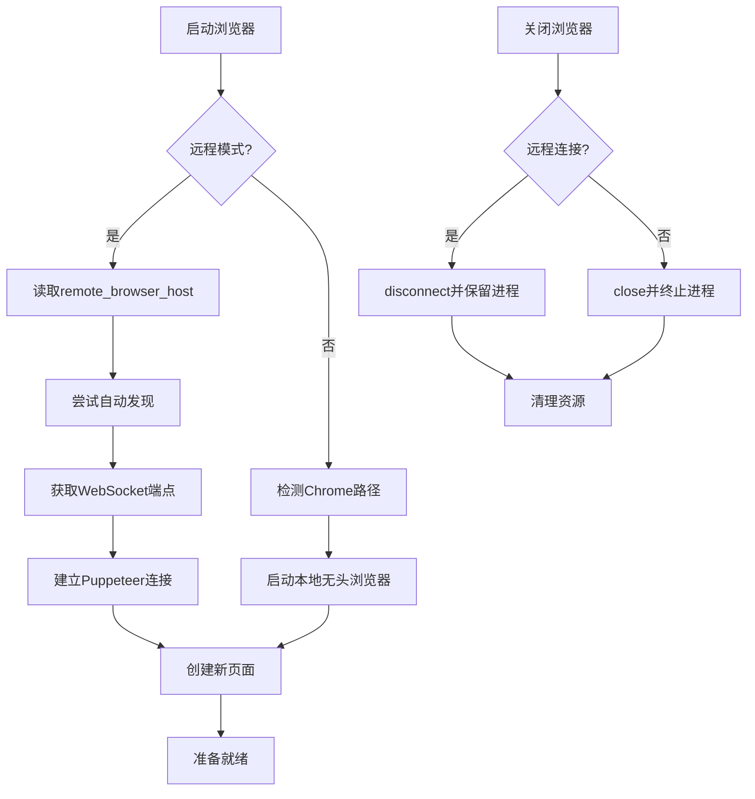
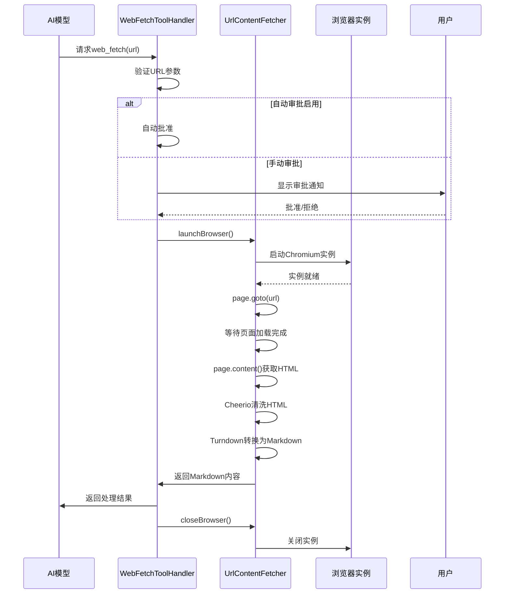

# 浏览器服务

<cite>
**本文档中引用的文件**  
- [browser.proto](file://proto/cline/browser.proto)
- [BrowserSession.ts](file://src/services/browser/BrowserSession.ts)
- [UrlContentFetcher.ts](file://src/services/browser/UrlContentFetcher.ts)
- [WebFetchToolHandler.ts](file://src/core/task/tools/handlers/WebFetchToolHandler.ts)
- [BrowserSettings.ts](file://src/shared/BrowserSettings.ts)
</cite>

## 目录
1. [简介](#简介)
2. [RPC方法签名](#rpc方法签名)
3. [消息类型定义](#消息类型定义)
4. [浏览器实例管理流程](#浏览器实例管理流程)
5. [调用示例：web_fetch工具](#调用示例：web_fetch工具)
6. [安全与配置建议](#安全与配置建议)

## 简介
浏览器服务（BrowserService）为自动化网页交互提供底层支持，涵盖浏览器会话管理、页面导航和内容抓取功能。该服务基于Chrome DevTools Protocol，通过Puppeteer Core实现对本地或远程Chrome实例的控制。核心功能包括启动/连接浏览器、执行页面操作（如点击、输入、滚动）、获取网页内容并转换为Markdown格式。服务设计支持本地无头模式运行或连接已启用调试模式的远程浏览器实例。

**Section sources**
- [browser.proto](file://proto/cline/browser.proto#L1-L51)
- [BrowserSession.ts](file://src/services/browser/BrowserSession.ts#L1-L637)

## RPC方法签名

### getBrowserConnectionInfo
获取当前浏览器连接状态信息。

```protobuf
rpc getBrowserConnectionInfo(EmptyRequest) returns (BrowserConnectionInfo);
```

### testBrowserConnection
测试与指定主机的浏览器连接。

```protobuf
rpc testBrowserConnection(StringRequest) returns (BrowserConnection);
```

### discoverBrowser
自动发现本地运行的Chrome实例。

```protobuf
rpc discoverBrowser(EmptyRequest) returns (BrowserConnection);
```

### getDetectedChromePath
获取检测到的Chrome可执行文件路径。

```protobuf
rpc getDetectedChromePath(EmptyRequest) returns (ChromePath);
```

### relaunchChromeDebugMode
以调试模式重新启动Chrome浏览器。

```protobuf
rpc relaunchChromeDebugMode(EmptyRequest) returns (String);
```

**Section sources**
- [browser.proto](file://proto/cline/browser.proto#L10-L15)

## 消息类型定义

### BrowserConnectionInfo
表示浏览器连接状态。

```protobuf
message BrowserConnectionInfo {
  bool is_connected = 1;
  bool is_remote = 2;
  optional string host = 3;
}
```

### BrowserConnection
表示浏览器连接操作的结果。

```protobuf
message BrowserConnection {
  bool success = 1;
  string message = 2;
  optional string endpoint = 3;
}
```

### ChromePath
包含Chrome可执行文件路径及其来源信息。

```protobuf
message ChromePath {
  string path = 1;
  bool is_bundled = 2;
}
```

### BrowserSettings
浏览器配置选项，包括视口尺寸、远程主机设置等。

```protobuf
message BrowserSettings {
  Viewport viewport = 1;
  optional string remote_browser_host = 2;
  optional bool remote_browser_enabled = 3;
  optional string chrome_executable_path = 4;
  optional bool disable_tool_use = 5;
  optional string custom_args = 6;
}
```

### UpdateBrowserSettingsRequest
更新浏览器设置的请求消息。

```protobuf
message UpdateBrowserSettingsRequest {
  Metadata metadata = 1;
  Viewport viewport = 2;
  optional string remote_browser_host = 3;
  optional bool remote_browser_enabled = 4;
  optional string chrome_executable_path = 5;
  optional bool disable_tool_use = 6;
  optional string custom_args = 7;
}
```

**Section sources**
- [browser.proto](file://proto/cline/browser.proto#L17-L51)
- [BrowserSettings.ts](file://src/shared/BrowserSettings.ts#L1-L35)

## 浏览器实例管理流程

### 启动流程
1. **配置读取**：从全局状态读取`BrowserSettings`。
2. **路径检测**：优先使用用户指定的`chrome_executable_path`；若未设置，则尝试查找系统Chrome；最后回退到捆绑的Chromium版本。
3. **模式选择**：
   - **本地模式**：当`remote_browser_enabled`为`false`时，以无头模式启动本地浏览器。
   - **远程模式**：当`remote_browser_enabled`为`true`时，尝试连接`remote_browser_host`指定的实例，支持自动发现本地运行的Chrome。
4. **WebSocket连接**：对于远程实例，通过`/json/version`端点获取WebSocket调试URL并建立连接。

### 连接流程
- **自动发现**：扫描本地网络端口以发现运行中的Chrome实例。
- **端点缓存**：成功连接后缓存WebSocket端点，用于后续快速重连（有效期1小时）。
- **连接测试**：通过HTTP请求测试指定主机的调试端口是否响应。

### 关闭流程
- **本地浏览器**：调用`browser.close()`完全关闭进程。
- **远程浏览器**：调用`browser.disconnect()`断开连接但保留浏览器进程运行。
- **资源清理**：清除页面监听器，重置会话状态。



**Diagram sources**
- [BrowserSession.ts](file://src/services/browser/BrowserSession.ts#L150-L350)

**Section sources**
- [BrowserSession.ts](file://src/services/browser/BrowserSession.ts#L1-L637)

## 调用示例：web_fetch工具

`web_fetch`工具利用浏览器服务从指定URL抓取内容并转换为Markdown格式。以下是其工作流程：

1. **参数验证**：检查`url`参数是否存在。
2. **用户审批**：
   - 若启用自动审批，则直接执行。
   - 否则弹出通知请求用户确认。
3. **浏览器操作**：
   - 调用`UrlContentFetcher.launchBrowser()`启动浏览器。
   - 使用`page.goto()`导航至目标URL，等待`domcontentloaded`和`networkidle2`事件。
4. **内容提取**：
   - 使用Cheerio库解析HTML，移除`script`、`style`、`nav`等非内容元素。
   - 通过TurndownService将清洗后的HTML转换为Markdown。
5. **资源清理**：无论成功与否，最终调用`closeBrowser()`释放资源。



**Diagram sources**
- [WebFetchToolHandler.ts](file://src/core/task/tools/handlers/WebFetchToolHandler.ts#L1-L105)
- [UrlContentFetcher.ts](file://src/services/browser/UrlContentFetcher.ts#L1-L97)

**Section sources**
- [WebFetchToolHandler.ts](file://src/core/task/tools/handlers/WebFetchToolHandler.ts#L1-L105)

## 安全与配置建议

### 跨域安全策略
- **同源策略**：浏览器实例遵循标准同源策略，无法直接跨域读取资源。
- **CORS限制**：JavaScript发起的跨域请求受CORS头限制。
- **规避建议**：服务端应提供代理接口或确保目标站点正确配置CORS头。

### 无头浏览器配置
- **用户代理**：默认设置为常见桌面浏览器UA，避免被识别为自动化工具。
- **自定义参数**：可通过`custom_args`字段添加启动参数（如`--disable-web-security`用于开发测试，**生产环境禁用**）。
- **视口预设**：提供多种预设尺寸（大桌面、小桌面、平板、手机）以模拟不同设备。

### 性能优化建议
- **连接复用**：在单次任务中复用浏览器实例，避免频繁启停开销。
- **资源限制**：设置合理的页面加载超时（当前为10秒）防止无限等待。
- **内容清洗**：移除非必要元素（脚本、样式、导航栏）减少处理负载。
- **缓存机制**：对频繁访问的静态资源实现应用层缓存。
- **并发控制**：限制同时运行的浏览器实例数量，防止系统资源耗尽。

**Section sources**
- [BrowserSettings.ts](file://src/shared/BrowserSettings.ts#L1-L35)
- [UrlContentFetcher.ts](file://src/services/browser/UrlContentFetcher.ts#L1-L97)
- [BrowserSession.ts](file://src/services/browser/BrowserSession.ts#L1-L637)