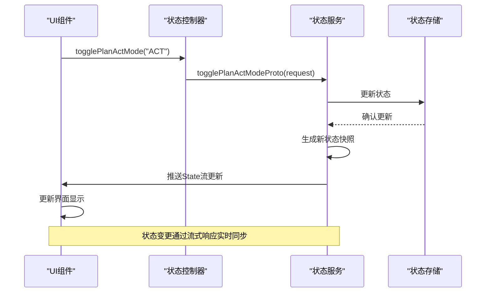
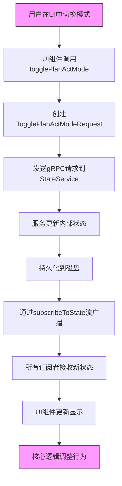
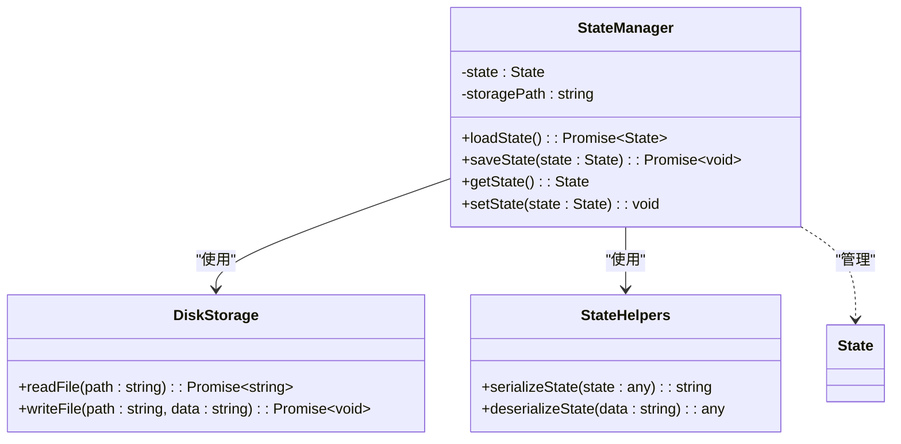
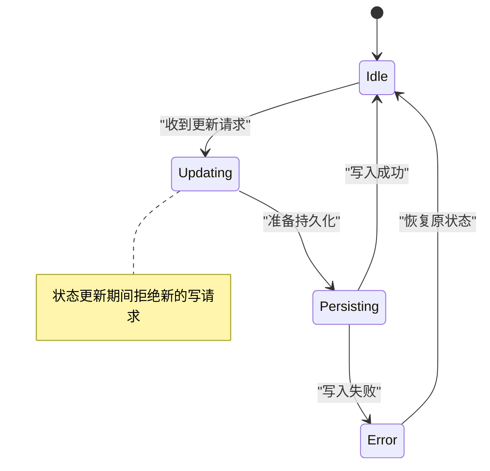

# 状态服务

<cite>
**本文档引用的文件**
- [state.proto](file://proto/cline/state.proto)
- [StateManager.ts](file://src/core/storage/StateManager.ts)
- [togglePlanActModeProto.ts](file://src/core/controller/state/togglePlanActModeProto.ts)
- [subscribeToState.ts](file://src/core/controller/state/subscribeToState.ts)
- [disk.ts](file://src/core/storage/disk.ts)
- [state-helpers.ts](file://src/core/storage/utils/state-helpers.ts)
</cite>

## 目录
1. [简介](#简介)
2. [RPC方法签名](#rpc方法签名)
3. [状态数据结构定义](#状态数据结构定义)
4. [状态变更通知机制](#状态变更通知机制)
5. [实际调用示例](#实际调用示例)
6. [状态持久化机制](#状态持久化机制)
7. [数据一致性保证](#数据一致性保证)

## 简介
状态服务（StateService）是Cline系统的核心组件，负责管理应用程序的全局状态、用户设置和运行时配置。该服务通过gRPC接口提供状态读取、更新和订阅功能，实现核心逻辑与UI层之间的实时同步。服务支持多种状态类型，包括用户偏好、模型配置、终端设置和遥测选项。

## RPC方法签名

### 获取最新状态
```protobuf
rpc getLatestState(EmptyRequest) returns (State);
```

### 订阅状态变更
```protobuf
rpc subscribeToState(EmptyRequest) returns (stream State);
```

### 切换Plan-Act模式
```protobuf
rpc togglePlanActModeProto(TogglePlanActModeRequest) returns (Boolean);
```

### 更新设置
```protobuf
rpc updateSettings(UpdateSettingsRequest) returns (Empty);
```

### 更新遥测设置
```protobuf
rpc updateTelemetrySetting(TelemetrySettingRequest) returns (Empty);
```

### 重置状态
```protobuf
rpc resetState(ResetStateRequest) returns (Empty);
```

### 切换收藏模型
```protobuf
rpc toggleFavoriteModel(StringRequest) returns (Empty);
```

### 更新终端连接超时
```protobuf
rpc updateTerminalConnectionTimeout(UpdateTerminalConnectionTimeoutRequest) returns (UpdateTerminalConnectionTimeoutResponse);
```

### 更新自动审批设置
```protobuf
rpc updateAutoApprovalSettings(AutoApprovalSettingsRequest) returns (Empty);
```

### 设置欢迎视图完成状态
```protobuf
rpc setWelcomeViewCompleted(BooleanRequest) returns (Empty);
```

### 获取可用终端配置文件
```protobuf
rpc getAvailableTerminalProfiles(EmptyRequest) returns (TerminalProfiles);
```

### 更新终端复用启用状态
```protobuf
rpc updateTerminalReuseEnabled(BooleanRequest) returns (Empty);
```

**Section sources**
- [state.proto](file://proto/cline/state.proto#L15-L45)

## 状态数据结构定义

### Settings（设置）
| 配置项 | 类型 | 默认值 | 描述 |
|-------|------|--------|------|
| plan_act_separate_models_setting | bool | false | 是否为Plan和Act模式使用独立模型 |
| enable_checkpoints_setting | bool | true | 是否启用检查点功能 |
| mcp_marketplace_enabled | bool | true | 是否启用MCP市场 |
| shell_integration_timeout | int32 | 5000 | Shell集成超时时间（毫秒） |
| terminal_reuse_enabled | bool | true | 是否启用终端复用 |
| mcp_responses_collapsed | bool | false | MCP响应是否折叠显示 |
| mcp_display_mode | McpDisplayMode | RICH | MCP显示模式 |
| terminal_output_line_limit | int32 | 1000 | 终端输出行数限制 |
| mode | PlanActMode | PLAN | 当前操作模式 |
| preferred_language | string | "en" | 首选语言 |
| openai_reasoning_effort | OpenaiReasoningEffort | MEDIUM | OpenAI推理努力程度 |
| strict_plan_mode_enabled | bool | false | 是否启用严格计划模式 |
| use_auto_condense | bool | true | 是否自动压缩 |
| custom_prompt | string | "" | 自定义提示词 |
| default_terminal_profile | string | "" | 默认终端配置文件 |
| yolo_mode_toggled | bool | false | YOLO模式是否启用 |

### TelemetrySettings（遥测设置）
| 配置项 | 类型 | 默认值 | 描述 |
|-------|------|--------|------|
| telemetry_setting | TelemetrySettingEnum | UNSET | 遥测设置状态 |

### AutoApprovalSettings（自动审批设置）
| 配置项 | 类型 | 默认值 | 描述 |
|-------|------|--------|------|
| enabled | bool | false | 自动审批是否启用 |
| version | int32 | 1 | 设置版本号 |
| max_requests | int32 | 5 | 最大请求数 |
| enable_notifications | bool | true | 是否启用通知 |
| favorites | repeated string | [] | 收藏列表 |

**Section sources**
- [state.proto](file://proto/cline/state.proto#L100-L300)

## 状态变更通知机制

状态服务采用发布-订阅模式实现状态变更的实时通知。客户端可以通过`subscribeToState`方法订阅状态流，当任何状态发生变化时，服务器会推送最新的状态快照。



**Diagram sources**
- [state.proto](file://proto/cline/state.proto#L18)
- [subscribeToState.ts](file://src/core/controller/state/subscribeToState.ts#L1-L20)

## 实际调用示例

当用户在设置面板中切换'Plan-Act'模式时，状态同步流程如下：



**Diagram sources**
- [togglePlanActModeProto.ts](file://src/core/controller/state/togglePlanActModeProto.ts#L1-L30)
- [state.proto](file://proto/cline/state.proto#L27)

## 状态持久化机制

状态服务通过本地磁盘存储实现状态持久化，确保应用重启后用户设置不丢失。



**Diagram sources**
- [StateManager.ts](file://src/core/storage/StateManager.ts#L1-L50)
- [disk.ts](file://src/core/storage/disk.ts#L1-L20)
- [state-helpers.ts](file://src/core/storage/utils/state-helpers.ts#L1-L15)

## 数据一致性保证

状态服务通过以下机制确保数据一致性：

1. **单状态源**：所有状态变更必须通过StateService进行
2. **原子更新**：状态更新操作是原子的，避免中间状态
3. **版本控制**：自动审批设置包含版本号，防止过期更新
4. **序列化访问**：状态管理器确保同一时间只有一个写操作
5. **持久化确认**：只有在磁盘写入成功后才确认状态变更



**Diagram sources**
- [StateManager.ts](file://src/core/storage/StateManager.ts#L50-L100)
- [state.proto](file://proto/cline/state.proto#L10)