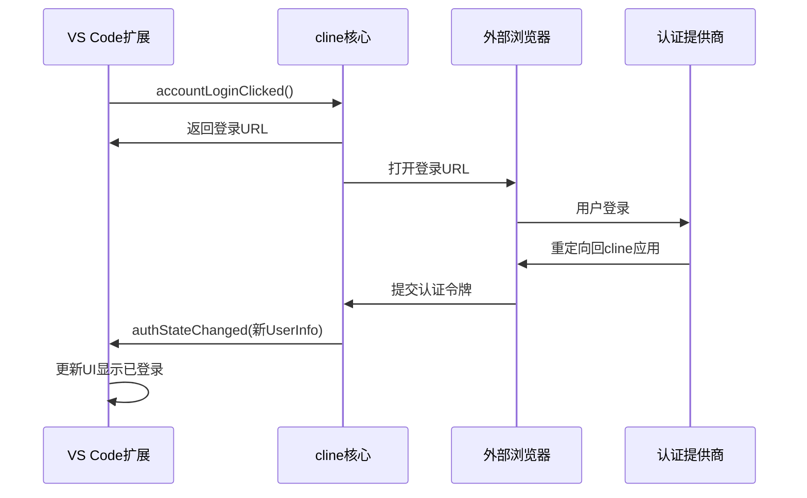

# 账户服务

<cite>
**本文档中引用的文件**  
- [account.proto](file://proto/cline/account.proto)
- [ClineAccountService.ts](file://src/services/account/ClineAccountService.ts)
- [accountLoginClicked.ts](file://src/core/controller/account/accountLoginClicked.ts)
- [accountLogoutClicked.ts](file://src/core/controller/account/accountLogoutClicked.ts)
- [authStateChanged.ts](file://src/core/controller/account/authStateChanged.ts)
- [getOrganizationCredits.ts](file://src/core/controller/account/getOrganizationCredits.ts)
- [AccountOptions.tsx](file://webview-ui/src/components/account/AccountOptions.tsx)
- [ClineAccountInfoCard.tsx](file://webview-ui/src/components/settings/ClineAccountInfoCard.tsx)
</cite>

## 目录
1. [简介](#简介)
2. [RPC方法](#rpc方法)
3. [请求与响应消息](#请求与响应消息)
4. [枚举与常量](#枚举与常量)
5. [调用示例：用户登录流程](#调用示例用户登录流程)
6. [认证状态同步](#认证状态同步)
7. [错误处理模式](#错误处理模式)
8. [安全考量](#安全考量)

## 简介
账户服务（AccountService）是cline核心系统中负责用户身份验证、账户状态管理和信用额度查询的核心gRPC服务。该服务为VS Code扩展提供统一的账户操作接口，支持登录、登出、组织切换、信用查询等功能。本API文档基于`proto/cline/account.proto`文件生成，详细描述了所有RPC方法、消息结构及其实现逻辑。

**Section sources**
- [account.proto](file://proto/cline/account.proto#L1-L135)

## RPC方法
账户服务定义了多个远程过程调用（RPC）方法，用于处理用户账户相关的操作。

### accountLoginClicked
处理用户在UI中点击登录链接的事件。生成用于状态验证的安全随机数（nonce），将其存储在密钥管理中，并在外部浏览器中打开身份验证URL。

- **请求类型**: `EmptyRequest`
- **响应类型**: `String`
- **流式**: 否

**Section sources**
- [account.proto](file://proto/cline/account.proto#L15-L18)
- [accountLoginClicked.ts](file://src/core/controller/account/accountLoginClicked.ts#L1-L15)

### accountLogoutClicked
处理用户在UI中点击登出按钮的事件。清除API密钥和用户状态。

- **请求类型**: `EmptyRequest`
- **响应类型**: `Empty`
- **流式**: 否

**Section sources**
- [account.proto](file://proto/cline/account.proto#L20-L22)
- [accountLogoutClicked.ts](file://src/core/controller/account/accountLogoutClicked.ts#L1-L16)

### subscribeToAuthStatusUpdate
订阅身份验证状态更新事件（当身份验证状态发生变化时）。此方法返回一个流，客户端可以监听认证状态的变化。

- **请求类型**: `EmptyRequest`
- **响应类型**: `stream AuthState`
- **流式**: 是

**Section sources**
- [account.proto](file://proto/cline/account.proto#L24-L26)

### authStateChanged
处理来自Firebase上下文的身份验证状态变化。将用户信息更新到全局状态中，并返回更新后的值。

- **请求类型**: `AuthStateChangedRequest`
- **响应类型**: `AuthState`
- **流式**: 否

**Section sources**
- [account.proto](file://proto/cline/account.proto#L28-L31)
- [authStateChanged.ts](file://src/core/controller/account/authStateChanged.ts#L1-L22)

### getUserCredits
获取所有用户信用数据（余额、使用交易、支付交易）。

- **请求类型**: `EmptyRequest`
- **响应类型**: `UserCreditsData`
- **流式**: 否

**Section sources**
- [account.proto](file://proto/cline/account.proto#L33-L34)

### getOrganizationCredits
获取指定组织的信用数据。

- **请求类型**: `GetOrganizationCreditsRequest`
- **响应类型**: `OrganizationCreditsData`
- **流式**: 否

**Section sources**
- [account.proto](file://proto/cline/account.proto#L36-L37)
- [getOrganizationCredits.ts](file://src/core/controller/account/getOrganizationCredits.ts#L1-L27)

### getUserOrganizations
获取所有用户组织数据。返回一个`UserOrganization`对象列表。

- **请求类型**: `EmptyRequest`
- **响应类型**: `UserOrganizationsResponse`
- **流式**: 否

**Section sources**
- [account.proto](file://proto/cline/account.proto#L39-L41)

### setUserOrganization
设置用户的当前组织。

- **请求类型**: `UserOrganizationUpdateRequest`
- **响应类型**: `Empty`
- **流式**: 否

**Section sources**
- [account.proto](file://proto/cline/account.proto#L43-L44)

### openrouterAuthClicked
处理用户点击OpenRouter认证链接的事件。

- **请求类型**: `EmptyRequest`
- **响应类型**: `Empty`
- **流式**: 否

**Section sources**
- [account.proto](file://proto/cline/account.proto#L46-L47)

### getRedirectUrl
返回webview可以用来重定向回用户IDE的链接。

- **请求类型**: `EmptyRequest`
- **响应类型**: `String`
- **流式**: 否

**Section sources**
- [account.proto](file://proto/cline/account.proto#L49-L50)

## 请求与响应消息
本节详细定义了账户服务中使用的所有请求和响应消息的字段。

### AuthStateChangedRequest
表示身份验证状态变化的请求。

| 字段名 | 类型 | 必填 | 业务含义 |
| :--- | :--- | :--- | :--- |
| metadata | Metadata | 是 | 请求元数据 |
| user | UserInfo | 是 | 用户信息对象 |

**Section sources**
- [account.proto](file://proto/cline/account.proto#L52-L54)

### AuthState
表示当前的认证状态。

| 字段名 | 类型 | 必填 | 业务含义 |
| :--- | :--- | :--- | :--- |
| user | UserInfo | 否 | 当前登录的用户信息，如果未登录则为空 |

**Section sources**
- [account.proto](file://proto/cline/account.proto#L56-L58)

### UserInfo
用户的个人信息。

| 字段名 | 类型 | 必填 | 业务含义 |
| :--- | :--- | :--- | :--- |
| uid | string | 是 | 用户的唯一标识符 |
| display_name | string | 否 | 用户显示名称 |
| email | string | 否 | 用户邮箱地址 |
| photo_url | string | 否 | 用户头像URL |
| app_base_url | string | 否 | Cline应用的基础URL |

**Section sources**
- [account.proto](file://proto/cline/account.proto#L60-L65)

### UserOrganization
用户所属的组织信息。

| 字段名 | 类型 | 必填 | 业务含义 |
| :--- | :--- | :--- | :--- |
| active | bool | 是 | 是否为当前激活的组织 |
| member_id | string | 是 | 用户在该组织中的成员ID |
| name | string | 是 | 组织名称 |
| organization_id | string | 是 | 组织唯一标识符 |
| roles | repeated string | 是 | 用户在组织中的角色列表，可能值包括 "admin", "member", "owner" |

**Section sources**
- [account.proto](file://proto/cline/account.proto#L67-L71)

### UserOrganizationsResponse
获取用户组织列表的响应。

| 字段名 | 类型 | 必填 | 业务含义 |
| :--- | :--- | :--- | :--- |
| organizations | repeated UserOrganization | 是 | 用户所属的所有组织列表 |

**Section sources**
- [account.proto](file://proto/cline/account.proto#L73-L74)

### UserOrganizationUpdateRequest
更新用户当前组织的请求。

| 字段名 | 类型 | 必填 | 业务含义 |
| :--- | :--- | :--- | :--- |
| organization_id | string | 否 | 要切换到的组织ID，如果为空则切换回个人账户 |

**Section sources**
- [account.proto](file://proto/cline/account.proto#L76-L78)

### UserCreditsData
用户信用数据，包含余额、使用记录和支付记录。

| 字段名 | 类型 | 必填 | 业务含义 |
| :--- | :--- | :--- | :--- |
| balance | UserCreditsBalance | 是 | 当前信用余额 |
| usage_transactions | repeated UsageTransaction | 是 | 使用交易记录列表 |
| payment_transactions | repeated PaymentTransaction | 是 | 支付交易记录列表 |

**Section sources**
- [account.proto](file://proto/cline/account.proto#L80-L83)

### GetOrganizationCreditsRequest
获取组织信用数据的请求。

| 字段名 | 类型 | 必填 | 业务含义 |
| :--- | :--- | :--- | :--- |
| organization_id | string | 是 | 要查询的组织ID |

**Section sources**
- [account.proto](file://proto/cline/account.proto#L85-L86)

### OrganizationCreditsData
组织信用数据。

| 字段名 | 类型 | 必填 | 业务含义 |
| :--- | :--- | :--- | :--- |
| balance | UserCreditsBalance | 是 | 组织当前信用余额 |
| organization_id | string | 是 | 组织唯一标识符 |
| usage_transactions | repeated OrganizationUsageTransaction | 是 | 组织的使用交易记录列表 |

**Section sources**
- [account.proto](file://proto/cline/account.proto#L88-L91)

### UserCreditsBalance
用户或组织的信用余额。

| 字段名 | 类型 | 必填 | 业务含义 |
| :--- | :--- | :--- | :--- |
| current_balance | double | 是 | 当前余额（以信用单位计） |

**Section sources**
- [account.proto](file://proto/cline/account.proto#L93-L94)

### UsageTransaction
用户级别的使用交易记录。

| 字段名 | 类型 | 必填 | 业务含义 |
| :--- | :--- | :--- | :--- |
| ai_inference_provider_name | string | 是 | AI推理服务提供商名称 |
| ai_model_name | string | 是 | 使用的AI模型名称 |
| ai_model_type_name | string | 是 | AI模型类型名称 |
| completion_tokens | int32 | 是 | 完成生成的token数量 |
| cost_usd | double | 是 | 本次使用的成本（美元） |
| created_at | string | 是 | 交易创建时间（ISO 8601格式） |
| credits_used | double | 是 | 本次使用的信用额度 |
| generation_id | string | 是 | 生成请求的唯一标识符 |
| organization_id | string | 是 | 关联的组织ID |
| prompt_tokens | int32 | 是 | 提示输入的token数量 |
| total_tokens | int32 | 是 | 总共使用的token数量 |
| user_id | string | 是 | 用户ID |

**Section sources**
- [account.proto](file://proto/cline/account.proto#L96-L110)

### PaymentTransaction
用户的支付交易记录。

| 字段名 | 类型 | 必填 | 业务含义 |
| :--- | :--- | :--- | :--- |
| paid_at | string | 是 | 支付完成时间（ISO 8601格式） |
| creator_id | string | 是 | 创建支付记录的用户ID |
| amount_cents | int32 | 是 | 支付金额（以美分为单位） |
| credits | double | 是 | 购买的信用额度 |

**Section sources**
- [account.proto](file://proto/cline/account.proto#L112-L116)

### OrganizationUsageTransaction
组织级别的使用交易记录。

| 字段名 | 类型 | 必填 | 业务含义 |
| :--- | :--- | :--- | :--- |
| ai_inference_provider_name | string | 是 | AI推理服务提供商名称 |
| ai_model_name | string | 是 | 使用的AI模型名称 |
| ai_model_type_name | string | 是 | AI模型类型名称 |
| completion_tokens | int32 | 是 | 完成生成的token数量 |
| cost_usd | double | 是 | 本次使用的成本（美元） |
| created_at | string | 是 | 交易创建时间（ISO 8601格式） |
| credits_used | double | 是 | 本次使用的信用额度 |
| generation_id | string | 是 | 生成请求的唯一标识符 |
| organization_id | string | 是 | 组织ID |
| prompt_tokens | int32 | 是 | 提示输入的token数量 |
| total_tokens | int32 | 是 | 总共使用的token数量 |
| user_id | string | 是 | 执行该操作的用户ID |

**Section sources**
- [account.proto](file://proto/cline/account.proto#L118-L132)

## 枚举与常量
账户服务中定义了以下角色枚举值，用于`UserOrganization.roles`字段：

- **admin**: 管理员，具有组织管理权限
- **member**: 普通成员，可以使用组织资源
- **owner**: 所有者，具有最高管理权限

这些角色值在`UserOrganization`消息的注释中明确列出。

**Section sources**
- [account.proto](file://proto/cline/account.proto#L71)

## 调用示例：用户登录流程
以下示例说明了cline核心与VS Code扩展之间如何通过账户服务进行通信，完成用户登录流程：

1. **用户触发登录**：用户在VS Code扩展的设置面板中点击"Sign Up with Cline"按钮。
```typescript
// 在 ClineAccountInfoCard.tsx 中
const handleLogin = () => {
  AccountServiceClient.accountLoginClicked(EmptyRequest.create()).catch((err) =>
    console.error("Failed to get login URL:", err),
  )
}
```

2. **调用RPC方法**：扩展通过gRPC客户端调用`accountLoginClicked`方法。
```typescript
// AccountServiceClient 是由protobuf生成的客户端
AccountServiceClient.accountLoginClicked(EmptyRequest.create())
```

3. **处理登录请求**：cline核心接收到请求后，调用`accountLoginClicked`控制器函数。
```typescript
// 在 accountLoginClicked.ts 中
export async function accountLoginClicked(_controller: Controller, _: EmptyRequest): Promise<String> {
  return await AuthService.getInstance().createAuthRequest()
}
```

4. **生成认证请求**：`AuthService`生成一个包含安全nonce的认证URL，并将其返回给客户端。

5. **打开浏览器**：cline核心在用户的默认外部浏览器中打开认证URL。

6. **用户完成认证**：用户在浏览器中完成登录或注册流程。

7. **回调与状态更新**：认证服务（如Firebase）将用户重定向回cline应用，并携带认证令牌。

8. **状态同步**：cline核心调用`authStateChanged` RPC方法，将新的用户信息同步到VS Code扩展。
```protobuf
// 请求示例
{
  "user": {
    "uid": "user123",
    "email": "user@example.com",
    "display_name": "John Doe"
  }
}
```

9. **UI更新**：VS Code扩展收到新的`AuthState`后，更新其UI以显示已登录状态和用户信息。

**Section sources**
- [ClineAccountInfoCard.tsx](file://webview-ui/src/components/settings/ClineAccountInfoCard.tsx#L1-L37)
- [accountLoginClicked.ts](file://src/core/controller/account/accountLoginClicked.ts#L1-L15)
- [authStateChanged.ts](file://src/core/controller/account/authStateChanged.ts#L1-L22)

## 认证状态同步
账户服务通过`subscribeToAuthStatusUpdate`和`authStateChanged`两个RPC方法实现双向认证状态同步。

- **客户端订阅**：VS Code扩展可以调用`subscribeToAuthStatusUpdate`来监听认证状态的变化。这是一个服务器流式RPC，服务器会在状态变化时向客户端推送`AuthState`消息。

- **服务端通知**：当用户的认证状态在cline核心发生变化时（例如通过浏览器完成登录），核心会主动调用`authStateChanged`方法，将新的`UserInfo`推送到VS Code扩展。

- **状态存储**：`authStateChanged`控制器函数会将接收到的用户信息存储在全局状态管理器中，确保整个应用都能访问到最新的用户状态。



**Diagram sources**
- [account.proto](file://proto/cline/account.proto#L24-L31)
- [authStateChanged.ts](file://src/core/controller/account/authStateChanged.ts#L1-L22)

## 错误处理模式
账户服务采用一致的错误处理模式，确保客户端能够正确处理各种异常情况。

- **RPC方法异常**：所有RPC控制器函数都使用`try-catch`块捕获异常，并在发生错误时记录详细的错误信息。例如，在`authStateChanged`函数中，捕获到错误后会通过`console.error`输出错误日志。

- **网络请求错误**：`ClineAccountService`中的`authenticatedRequest`方法处理所有与后端API的通信。它会检查HTTP状态码，验证响应数据结构，并在请求失败时抛出带有详细信息的`Error`对象。

- **客户端错误处理**：VS Code扩展在调用RPC方法时使用`.catch()`来处理可能的错误，避免因单个RPC调用失败而导致整个扩展崩溃。
```typescript
// 示例：在AccountOptions.tsx中
AccountServiceClient.accountLoginClicked(EmptyRequest.create()).catch((err) =>
  console.error("Failed to get login URL:", err),
)
```

- **空值处理**：服务端方法在返回数据前会检查关键数据是否存在，如果获取用户信息失败，则返回`undefined`，由调用方决定如何处理。

**Section sources**
- [authStateChanged.ts](file://src/core/controller/account/authStateChanged.ts#L1-L22)
- [ClineAccountService.ts](file://src/services/account/ClineAccountService.ts#L1-L243)
- [AccountOptions.tsx](file://webview-ui/src/components/account/AccountOptions.tsx#L1-L17)

## 安全考量
账户服务在设计和实现中考虑了多项安全措施：

- **安全随机数（Nonce）**：在`accountLoginClicked`流程中生成安全的nonce，用于防止跨站请求伪造（CSRF）攻击，确保认证请求的完整性。

- **Bearer Token认证**：`ClineAccountService`在调用后端API时，使用从`AuthService`获取的Bearer Token进行身份验证，确保所有请求都是经过授权的。

- **敏感信息保护**：用户密码等敏感信息不会在任何消息中传输或存储。`UserInfo`消息中仅包含公开的用户属性。

- **状态同步安全**：`authStateChanged`方法直接将用户信息存储在全局状态中，但此操作由可信的cline核心发起，确保了数据来源的可靠性。

- **HTTPS传输**：所有gRPC通信和API调用都通过加密的HTTPS通道进行，防止中间人攻击和数据窃听。

- **会话管理**：`switchAccount`方法在切换组织后，会强制刷新ID令牌，确保用户权限的即时更新和会话的安全性。

**Section sources**
- [account.proto](file://proto/cline/account.proto#L15-L18)
- [ClineAccountService.ts](file://src/services/account/ClineAccountService.ts#L1-L243)
- [accountLoginClicked.ts](file://src/core/controller/account/accountLoginClicked.ts#L1-L15)