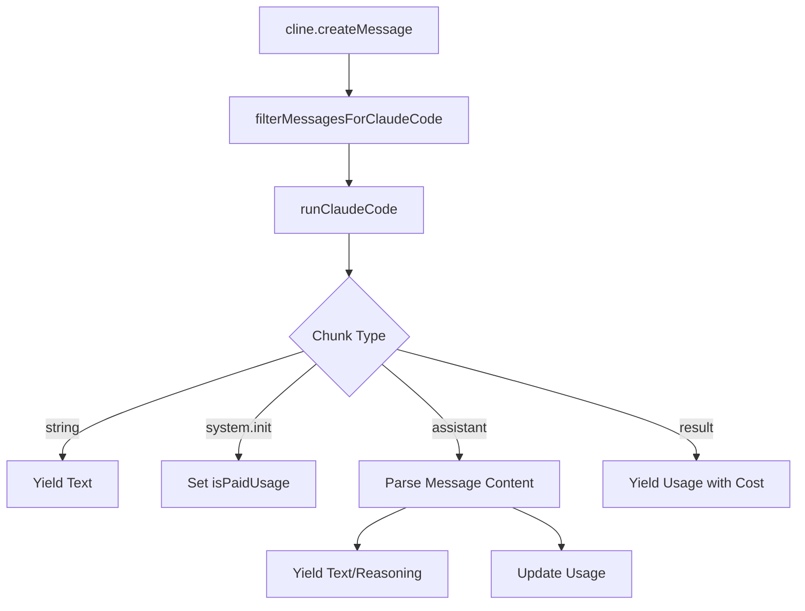

# Claude Code API

<cite>
**本文档中引用的文件**  
- [claude-code.ts](file://src/core/api/providers/claude-code.ts)
- [run.ts](file://src/integrations/claude-code/run.ts)
- [types.ts](file://src/integrations/claude-code/types.ts)
- [message-filter.ts](file://src/integrations/claude-code/message-filter.ts)
- [api.ts](file://src/shared/api.ts)
</cite>

## 目录
1. [简介](#简介)
2. [认证机制与配置方法](#认证机制与配置方法)
3. [Claude Code API 与标准 Anthropic API 的差异](#claude-code-api-与标准-anthropic-api-的差异)
4. [请求与响应结构](#请求与响应结构)
5. [代码分析与重构任务的执行](#代码分析与重构任务的执行)
6. [使用限制与最佳实践](#使用限制与最佳实践)
7. [完整代码示例与典型应用场景](#完整代码示例与典型应用场景)

## 简介
Claude Code API 是 cline 项目中用于与 Anthropic 的 Claude Code CLI 工具进行通信的核心模块。该 API 专为代码理解与生成任务优化，通过本地 CLI 工具调用 Claude 模型，避免了直接使用云端 API 的延迟与成本问题。本文档详细说明其集成方式、功能特性及使用方法。

## 认证机制与配置方法
Claude Code API 不依赖传统的 API 密钥进行认证。相反，它通过本地安装的 `claude` CLI 工具来管理身份验证。用户需先通过 `claude login` 命令登录其 Anthropic 账户，之后 CLI 工具会自动处理会话和认证。

在 cline 中，可通过以下配置项指定 Claude Code 的路径：
- `claudeCodePath`：指定 `claude` CLI 可执行文件的路径。若未设置，则默认使用系统 PATH 中的 `claude`。

此外，cline 提供图形化界面，允许用户在设置中直接输入 CLI 路径并选择模型。

**Section sources**
- [claude-code.ts](file://src/core/api/providers/claude-code.ts#L14-L20)
- [ClaudeCodeProvider.tsx](file://webview-ui/src/components/settings/providers/ClaudeCodeProvider.tsx#L27-L74)

## Claude Code API 与标准 Anthropic API 的差异
Claude Code API 与标准 Anthropic API 的主要区别在于其运行方式和功能优化：

1. **本地执行**：Claude Code API 通过调用本地 CLI 工具执行，而标准 API 通过 HTTP 请求调用云端服务。
2. **代码任务优化**：Claude Code CLI 专为代码编辑任务设计，内置了文件读取、编辑、执行等工具，适合在开发环境中使用。
3. **无图像支持**：Claude Code 不支持图像输入，所有图像块在发送前会被过滤并替换为文本占位符。
4. **禁用内置工具**：为避免工具冲突，cline 显式禁用了 Claude Code 的内置工具（如 Bash、Read、Edit 等），由 cline 自身的工具系统接管。
5. **缓存不支持**：与标准 API 不同，Claude Code 不支持输入缓存（prompt cache）。

**Section sources**
- [claude-code.ts](file://src/core/api/providers/claude-code.ts#L16-L17)
- [run.ts](file://src/integrations/claude-code/run.ts#L58-L72)
- [api.ts](file://src/shared/api.ts#L341-L375)

## 请求与响应结构
### 请求结构
cline 通过 `createMessage` 方法发起请求，参数包括：
- `systemPrompt`：系统提示词，描述任务上下文。
- `messages`：对话历史，包含用户和助手的消息。

在发送前，消息中的图像块会被 `filterMessagesForClaudeCode` 函数过滤，确保兼容性。

### 响应结构
响应以异步流（`ApiStream`）形式返回，包含以下类型的消息：
- `text`：文本内容。
- `reasoning`：模型的思考过程。
- `usage`：令牌使用情况，包括输入、输出、缓存读写等。

响应流的处理逻辑如下：
1. 接收来自 `runClaudeCode` 的 JSON 流。
2. 解析并转换为 cline 内部的流格式。
3. 提取使用数据并计算成本。
4. 处理错误信息，如模型名称无效等。



**Diagram sources**
- [claude-code.ts](file://src/core/api/providers/claude-code.ts#L25-L160)
- [run.ts](file://src/integrations/claude-code/run.ts#L29-L273)

**Section sources**
- [claude-code.ts](file://src/core/api/providers/claude-code.ts#L25-L160)
- [types.ts](file://src/integrations/claude-code/types.ts#L1-L35)

## 代码分析与重构任务的执行
cline 利用 Claude Code API 执行代码分析和重构任务，主要通过以下流程：
1. **任务初始化**：用户发起代码改进请求（如“优化此函数”）。
2. **上下文构建**：cline 收集相关文件内容并构建系统提示。
3. **消息过滤**：移除不支持的图像块。
4. **调用 API**：通过 `runClaudeCode` 执行 CLI 命令。
5. **结果处理**：解析模型输出，提取代码修改建议或重构方案。

例如，在 `fixWithCline` 命令中，cline 会将当前文件内容和错误信息发送给 Claude Code，由其生成修复建议。

**Section sources**
- [claude-code.ts](file://src/core/api/providers/claude-code.ts#L25-L160)
- [run.ts](file://src/integrations/claude-code/run.ts#L29-L273)
- [controller/commands/fixWithCline.ts](file://src/core/controller/commands/fixWithCline.ts)

## 使用限制与最佳实践
### 使用限制
- **系统提示长度限制**：在 Windows 上，系统提示长度受限于命令行参数长度（8191 字符）。过长提示会导致 `ENAMETOOLONG` 错误。
- **CLI 版本要求**：必须使用支持 `--system-prompt-file` 参数的 Claude Code CLI 版本。
- **无图像支持**：无法处理包含图像的输入。
- **无缓存支持**：无法利用输入缓存优化性能。

### 最佳实践
- **使用临时文件**：对于长系统提示，使用临时文件避免命令行长度限制。
- **错误处理**：捕获并友好提示 CLI 执行错误，如路径未找到或版本过旧。
- **资源清理**：确保临时文件在使用后被删除。
- **超时设置**：为 CLI 进程设置合理的超时（如 10 分钟），防止挂起。

**Section sources**
- [run.ts](file://src/integrations/claude-code/run.ts#L10-L273)
- [claude-code.ts](file://src/core/api/providers/claude-code.ts#L25-L160)

## 完整代码示例与典型应用场景
### 配置与使用示例
```typescript
const handler = new ClaudeCodeHandler({
  claudeCodePath: "/usr/local/bin/claude", // 可选：指定 CLI 路径
  apiModelId: "claude-3-5-sonnet-20241022", // 指定模型
  thinkingBudgetTokens: 8192, // 设置思考预算
});

for await (const chunk of handler.createMessage("优化以下代码", messages)) {
  if (chunk.type === "text") {
    console.log(chunk.text);
  } else if (chunk.type === "usage") {
    console.log(`成本: $${chunk.totalCost}`);
  }
}
```

### 典型应用场景
1. **代码重构**：分析现有代码并提出优化建议。
2. **错误修复**：根据错误日志生成修复方案。
3. **文档生成**：为函数或模块自动生成文档。
4. **测试编写**：为代码单元生成测试用例。

这些场景充分利用了 Claude Code 对代码上下文的理解能力，结合 cline 的集成环境，实现高效的开发辅助。

**Section sources**
- [claude-code.ts](file://src/core/api/providers/claude-code.ts#L14-L160)
- [run.ts](file://src/integrations/claude-code/run.ts#L29-L273)