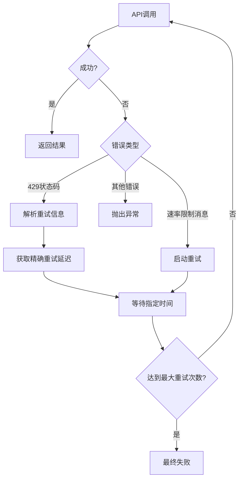

# Google Gemini API

<cite>
**本文档中引用的文件**   
- [gemini.ts](file://src/core/api/providers/gemini.ts)
- [gemini-format.ts](file://src/core/api/transform/gemini-format.ts)
- [GeminiProvider.tsx](file://webview-ui/src/components/settings/providers/GeminiProvider.tsx)
- [api.ts](file://src/shared/api.ts)
- [vertex.ts](file://src/core/api/providers/vertex.ts)
</cite>

## 目录
1. [简介](#简介)
2. [认证与配置](#认证与配置)
3. [请求与响应结构](#请求与响应结构)
4. [消息格式转换](#消息格式转换)
5. [多模态输入支持](#多模态输入支持)
6. [错误处理与重试策略](#错误处理与重试策略)
7. [Gemini与Vertex AI集成差异](#gemini与vertex-ai集成差异)
8. [完整代码示例](#完整代码示例)

## 简介
cline通过`src/core/api/providers/gemini.ts`实现了与Google Gemini服务的集成，提供了一套完整的API通信机制。该集成支持Gemini系列模型的调用，包括gemini-pro和gemini-ultra等先进模型，并实现了优化的缓存策略和准确的成本核算。系统通过标准化的接口与Gemini API交互，同时提供了灵活的配置选项和强大的错误处理能力。

## 认证与配置
cline使用API密钥进行Google Gemini服务的身份验证。用户需要在设置界面中提供有效的API密钥，该密钥将用于初始化Gemini客户端。系统支持标准API密钥认证，同时也兼容Vertex AI集成模式。

配置方法包括：
- **API密钥**：在设置界面的Gemini提供程序部分输入API密钥
- **自定义基础URL**：可选地指定自定义的基础URL，用于连接特定的Gemini端点
- **模型选择**：从支持的Gemini模型列表中选择目标模型
- **思考预算**：对于支持的模型（如gemini-2.5-pro），可配置思考预算令牌

当使用Vertex AI时，系统会使用项目ID和区域信息进行认证，而不是直接使用API密钥。这种双重认证模式使得cline能够灵活地在标准Gemini API和Vertex AI平台之间切换。

**Section sources**
- [gemini.ts](file://src/core/api/providers/gemini.ts#L55-L87)
- [GeminiProvider.tsx](file://webview-ui/src/components/settings/providers/GeminiProvider.tsx#L30-L73)

## 请求与响应结构
cline与Gemini API的通信遵循特定的JSON结构。对于gemini-pro和gemini-ultra模型，请求格式包括系统指令、内容部分和生成配置。

请求结构示例：
- **系统指令**：通过`systemInstruction`字段传递系统提示
- **内容**：包含用户和模型角色的消息序列
- **生成配置**：包括温度、思考预算等参数

响应结构包含：
- **文本内容**：模型生成的文本响应
- **思考内容**：当启用思考模式时，包含模型的推理过程
- **使用元数据**：包括提示令牌数、候选令牌数、缓存内容令牌数等

Gemini API返回流式响应，cline通过`ApiStream`接口处理这些流式数据，支持文本和推理内容的逐步输出。

**Section sources**
- [gemini.ts](file://src/core/api/providers/gemini.ts#L200-L263)
- [gemini-format.ts](file://src/core/api/transform/gemini-format.ts#L45-L83)

## 消息格式转换
cline通过`convertAnthropicMessageToGemini`函数将内部消息格式转换为Gemini兼容格式。这一转换过程涉及内容、角色和部分的映射。

### 角色映射
内部系统使用"assistant"和"user"角色，而Gemini API使用"model"和"user"角色。转换规则如下：
- "assistant" → "model"
- "user" → "user"

### 内容与部分映射
消息内容被转换为Gemini的`Content`对象，其中包含`parts`数组。转换过程如下：
- **文本内容**：字符串内容直接转换为`{ text: content }`格式
- **图像内容**：Base64编码的图像数据转换为`inlineData`格式，包含数据和MIME类型

`convertAnthropicContentToGemini`函数处理具体的块类型转换，支持文本和图像内容块。对于不支持的内容类型，系统会抛出错误。

**Section sources**
- [gemini-format.ts](file://src/core/api/transform/gemini-format.ts#L1-L44)
- [gemini.ts](file://src/core/api/providers/gemini.ts#L180-L198)

## 多模态输入支持
Gemini API原生支持多模态输入，包括文本和图像。cline通过其转换机制完全支持这一功能。

图像输入支持：
- **Base64编码**：系统仅支持Base64源类型的图像
- **MIME类型识别**：自动识别并设置正确的MIME类型
- **内联数据**：图像数据作为内联数据包含在请求中

当消息包含图像内容块时，系统会验证源类型是否为"base64"，然后将其转换为Gemini API所需的`inlineData`格式。这种设计使得cline能够处理包含图像的复杂查询，如图像分析和视觉推理任务。

**Section sources**
- [gemini-format.ts](file://src/core/api/transform/gemini-format.ts#L10-L25)
- [api.ts](file://src/shared/api.ts#L923-L1091)

## 错误处理与重试策略
cline实现了全面的错误处理和重试机制，以应对Gemini API的各种异常情况。

### 错误类型处理
系统识别多种错误模式，包括：
- **429配额不足**：当API返回429状态码时，系统会解析详细的重试信息
- **速率限制**：通过正则表达式模式匹配各种速率限制错误消息
- **其他API错误**：捕获并处理其他类型的API异常

### 重试策略
系统使用`withRetry`装饰器实现智能重试机制：
- **最大重试次数**：默认4次
- **基础延迟**：2000毫秒，指数增长
- **最大延迟**：15000毫秒
- **重试依据**：基于429状态码或特定错误消息模式

当遇到429错误时，系统会尝试解析Google API返回的详细重试信息，包括`RetryInfo`和`retryDelay`，以获得精确的重试时间。如果无法解析，则使用标准的指数退避策略。



**Diagram sources**
- [gemini.ts](file://src/core/api/providers/gemini.ts#L226-L263)
- [retry.ts](file://src/core/api/retry.ts#L0-L85)

**Section sources**
- [gemini.ts](file://src/core/api/providers/gemini.ts#L226-L263)
- [retry.ts](file://src/core/api/retry.ts#L0-L85)

## Gemini与Vertex AI集成差异
cline支持两种Gemini集成模式：标准Gemini API和Vertex AI平台，两者在认证、配置和功能上存在显著差异。

### 认证机制差异
| 特性 | 标准Gemini API | Vertex AI |
|------|----------------|----------|
| 认证方式 | API密钥 | 项目ID和区域 |
| 客户端初始化 | GoogleGenAI(apiKey) | GoogleGenAI(vertexai=true, project, location) |
| 安全模型 | 密钥管理 | Google Cloud IAM |

### 功能与配置差异
- **模型可用性**：Vertex AI可能提供不同的模型版本和预览模型
- **定价结构**：两种平台的定价可能不同，Vertex AI可能有企业级定价
- **网络配置**：Vertex AI支持私有连接和VPC配置
- **监控与日志**：Vertex AI集成Google Cloud Operations Suite

Vertex AI集成通过`VertexHandler`类实现，该类在内部使用`GeminiHandler`但配置了`isVertex: true`选项。这种设计允许共享大部分逻辑，同时适应平台特定的差异。

**Section sources**
- [gemini.ts](file://src/core/api/providers/gemini.ts#L55-L87)
- [vertex.ts](file://src/core/api/providers/vertex.ts#L40-L60)

## 完整代码示例
以下是在cline中配置和使用Gemini API的完整示例：

```typescript
// 创建Gemini处理器实例
const geminiHandler = new GeminiHandler({
  geminiApiKey: "your-api-key",
  apiModelId: "gemini-2.5-pro",
  thinkingBudgetTokens: 8192,
  ulid: "task-123"
});

// 准备消息
const messages: Anthropic.Messages.MessageParam[] = [
  {
    role: "user",
    content: "分析以下代码并提供改进建议：\n```typescript\nfunction hello(name: string) {\n  return `Hello ${name}!`;\n}\n```"
  }
];

// 创建消息流
const stream = geminiHandler.createMessage("你是一个专业的代码评审专家", messages);

// 处理流式响应
for await (const chunk of stream) {
  switch (chunk.type) {
    case "text":
      console.log("响应:", chunk.text);
      break;
    case "reasoning":
      console.log("思考过程:", chunk.reasoning);
      break;
    case "usage":
      console.log("使用情况:", {
        输入令牌: chunk.inputTokens,
        输出令牌: chunk.outputTokens,
        成本: chunk.totalCost
      });
      break;
  }
}
```

此示例展示了从初始化到处理响应的完整流程，包括错误处理和资源管理的最佳实践。

**Section sources**
- [gemini.ts](file://src/core/api/providers/gemini.ts#L100-L178)
- [gemini-format.ts](file://src/core/api/transform/gemini-format.ts#L1-L44)