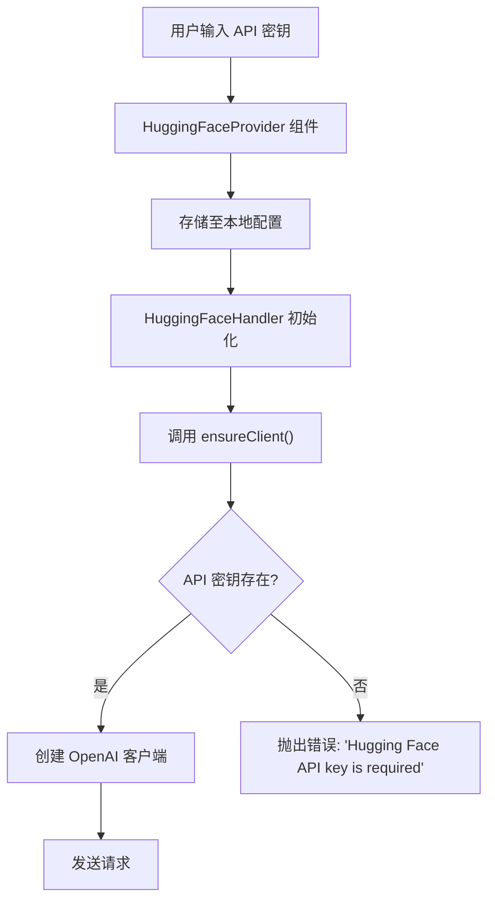
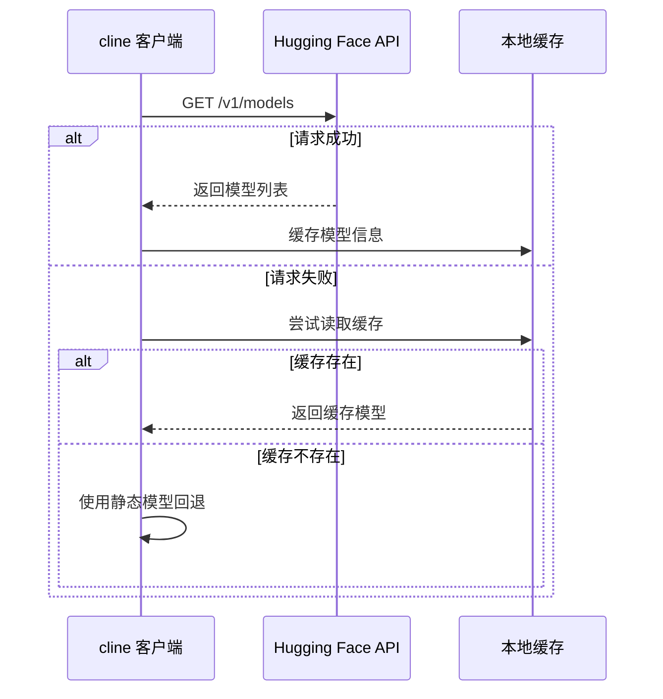
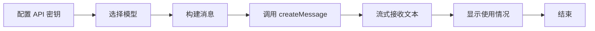

# Hugging Face API

<cite>
**本文档中引用的文件**  
- [huggingface.ts](file://src/core/api/providers/huggingface.ts)
- [refreshHuggingFaceModels.ts](file://src/core/controller/models/refreshHuggingFaceModels.ts)
- [HuggingFaceProvider.tsx](file://webview-ui/src/components/settings/providers/HuggingFaceProvider.tsx)
</cite>

## 目录
1. [简介](#简介)
2. [认证机制与配置方法](#认证机制与配置方法)
3. [请求与响应结构](#请求与响应结构)
4. [模型选择与推理参数调整](#模型选择与推理参数调整)
5. [Hugging Face API 特性与优势](#hugging-face-api-特性与优势)
6. [速率限制、异步推理与错误处理](#速率限制异步推理与错误处理)
7. [完整代码示例](#完整代码示例)
8. [实验与原型设计的灵活性](#实验与原型设计的灵活性)

## 简介
cline 是一个集成开发环境扩展，支持通过 Hugging Face Inference API 调用托管在 Hugging Face Hub 上的机器学习模型。本文档详细说明了 cline 如何通过 `src/core/api/providers/huggingface.ts` 与 Hugging Face 通信，涵盖认证、请求结构、模型配置、API 特性及错误处理机制。

**Section sources**
- [huggingface.ts](file://src/core/api/providers/huggingface.ts#L1-L142)

## 认证机制与配置方法
cline 使用 Hugging Face 的 API Token 进行身份验证。用户需在设置界面输入有效的 API 密钥，该密钥将被本地存储并用于所有 API 请求。

在代码层面，`HuggingFaceHandler` 类通过 `ensureClient()` 方法确保客户端初始化。若未提供 `huggingFaceApiKey`，则抛出错误。客户端使用 OpenAI 兼容接口，连接至 `https://router.huggingface.co/v1`，并设置自定义 User-Agent 标头。

前端配置由 `HuggingFaceProvider` 组件实现，提供密码输入框用于安全输入 API 密钥，并引导用户前往 [Hugging Face 令牌页面](https://huggingface.co/settings/tokens) 获取密钥。



**Diagram sources**
- [huggingface.ts](file://src/core/api/providers/huggingface.ts#L35-L55)
- [HuggingFaceProvider.tsx](file://webview-ui/src/components/settings/providers/HuggingFaceProvider.tsx#L25-L53)

**Section sources**
- [huggingface.ts](file://src/core/api/providers/huggingface.ts#L35-L55)
- [HuggingFaceProvider.tsx](file://webview-ui/src/components/settings/providers/HuggingFaceProvider.tsx#L25-L53)

## 请求与响应结构
cline 将内部消息格式转换为 OpenAI 兼容格式，通过流式方式发送请求并接收响应。

### 请求结构
请求体包含以下字段：
- **model**: 模型 ID（如 `meta-llama/Llama-3.2-1B`）
- **messages**: 包含系统提示和对话历史的消息数组
- **max_tokens**: 最大生成令牌数
- **stream**: 启用流式响应
- **stream_options**: 包含 usage 信息
- **temperature**: 温度参数（固定为 0）

### 响应结构
响应为流式 JSON 数据，包含两类事件：
1. **文本片段**:
```json
{
  "type": "text",
  "text": "生成的文本内容"
}
```
2. **使用情况统计**:
```json
{
  "type": "usage",
  "inputTokens": 150,
  "outputTokens": 45,
  "totalCost": 0.000123
}
```

**Section sources**
- [huggingface.ts](file://src/core/api/providers/huggingface.ts#L97-L141)

## 模型选择与推理参数调整
用户可通过界面选择特定模型，或使用默认模型。`getModel()` 方法负责解析模型配置：

- 若指定了 `huggingFaceModelId` 且存在于预定义列表中，则使用该模型。
- 否则，使用默认模型 `huggingFaceDefaultModelId`。
- 模型信息（如 `maxTokens`, `contextWindow`, 定价）从静态配置 `huggingFaceModels` 中获取。

模型列表通过 `refreshHuggingFaceModels` 函数从 `https://router.huggingface.co/v1/models` 动态获取，并缓存至本地文件系统以提高性能。

```mermaid
classDiagram
class HuggingFaceHandler {
+options : HuggingFaceHandlerOptions
+client : OpenAI | undefined
+cachedModel : {id, info} | undefined
+constructor(options)
+ensureClient() : OpenAI
+createMessage(system, messages) : ApiStream
+getModel() : {id, info}
}
class HuggingFaceHandlerOptions {
+huggingFaceApiKey? : string
+huggingFaceModelId? : string
+huggingFaceModelInfo? : ModelInfo
}
HuggingFaceHandler --> HuggingFaceHandlerOptions : "使用"
HuggingFaceHandler --> ModelInfo : "引用"
```

**Diagram sources**
- [huggingface.ts](file://src/core/api/providers/huggingface.ts#L10-L142)
- [refreshHuggingFaceModels.ts](file://src/core/controller/models/refreshHuggingFaceModels.ts#L42-L70)

**Section sources**
- [huggingface.ts](file://src/core/api/providers/huggingface.ts#L100-L142)
- [refreshHuggingFaceModels.ts](file://src/core/controller/models/refreshHuggingFaceModels.ts#L0-L112)

## Hugging Face API 特性与优势
Hugging Face 提供对数万个开源模型的访问，涵盖文本生成、图像识别、语音处理等多个领域。cline 利用 Hugging Face 的 OpenAI 兼容路由接口，实现无缝集成。

主要优势包括：
- **模型多样性**：可访问 Llama、Mistral、Phi 等系列模型。
- **无需自托管**：直接调用云端推理 API，降低部署复杂度。
- **灵活定价**：成本基于实际使用的输入/输出令牌计算。
- **社区支持**：受益于活跃的开源社区和持续更新的模型库。

**Section sources**
- [huggingface.ts](file://src/core/api/providers/huggingface.ts#L1-L142)

## 速率限制、异步推理与错误处理
### 速率限制
Hugging Face 根据账户类型施加速率限制。cline 未显式处理限流，依赖底层 API 客户端和重试机制。

### 异步推理
通过启用 `stream: true` 实现异步流式推理。`createMessage` 方法返回 `ApiStream`，支持逐块处理响应，提升用户体验。

### 错误处理
- **客户端初始化错误**：捕获并抛出带有详细信息的错误。
- **网络请求错误**：使用 `@withRetry()` 装饰器自动重试失败请求。
- **模型加载失败**：若无法从 API 获取模型列表，则回退至本地缓存或静态定义的模型。



**Diagram sources**
- [refreshHuggingFaceModels.ts](file://src/core/controller/models/refreshHuggingFaceModels.ts#L0-L112)

**Section sources**
- [huggingface.ts](file://src/core/api/providers/huggingface.ts#L75-L95)
- [refreshHuggingFaceModels.ts](file://src/core/controller/models/refreshHuggingFaceModels.ts#L0-L112)

## 完整代码示例
以下为在 cline 中配置和使用 Hugging Face API 的核心流程：

1. **配置 API 密钥**：在设置界面输入 Hugging Face API Token。
2. **选择模型**：通过模型选择器指定目标模型 ID。
3. **发起请求**：调用 `createMessage` 发送系统提示和消息历史。
4. **处理流式响应**：逐块接收文本和使用情况数据。



**Section sources**
- [huggingface.ts](file://src/core/api/providers/huggingface.ts#L1-L142)

## 实验与原型设计的灵活性
cline 的 Hugging Face 集成特别适合实验和原型设计阶段，原因如下：
- **快速切换模型**：轻松在不同模型间切换，比较输出质量。
- **低成本试错**：按使用量计费，避免高昂的自托管成本。
- **即时可用性**：无需下载或部署模型，开箱即用。
- **动态模型发现**：定期刷新模型列表，及时访问最新开源模型。

此灵活性使开发者能快速验证想法，优化提示工程，并选择最适合特定任务的模型。

**Section sources**
- [huggingface.ts](file://src/core/api/providers/huggingface.ts#L1-L142)
- [refreshHuggingFaceModels.ts](file://src/core/controller/models/refreshHuggingFaceModels.ts#L0-L112)