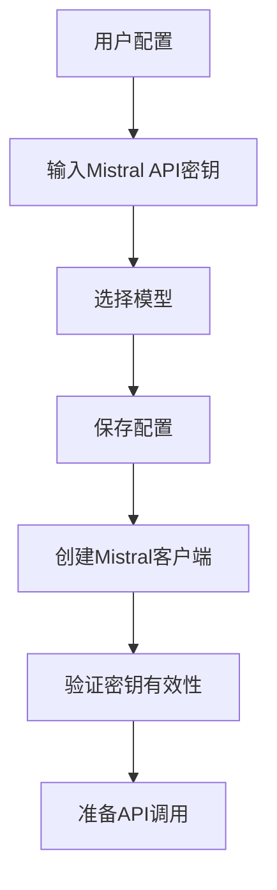
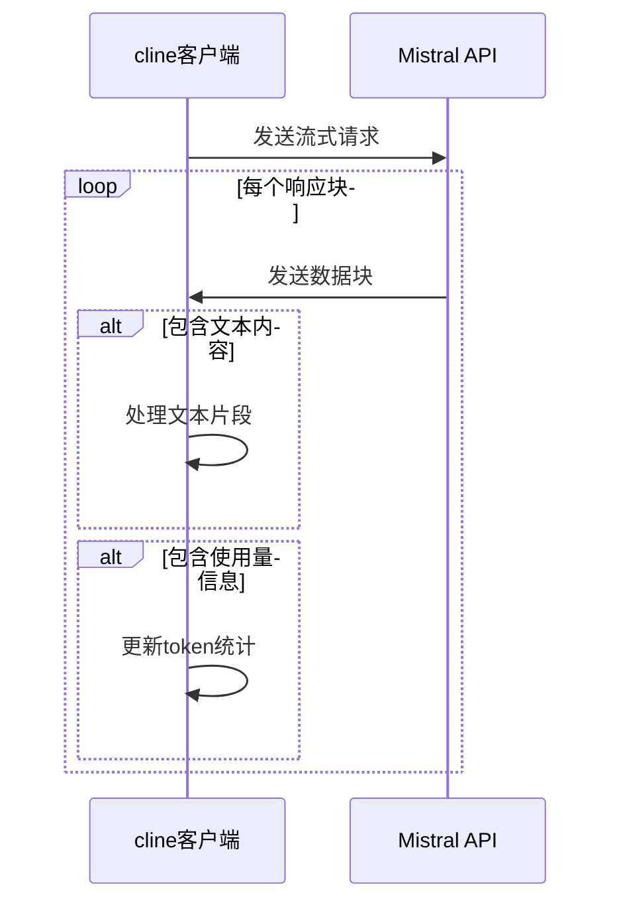
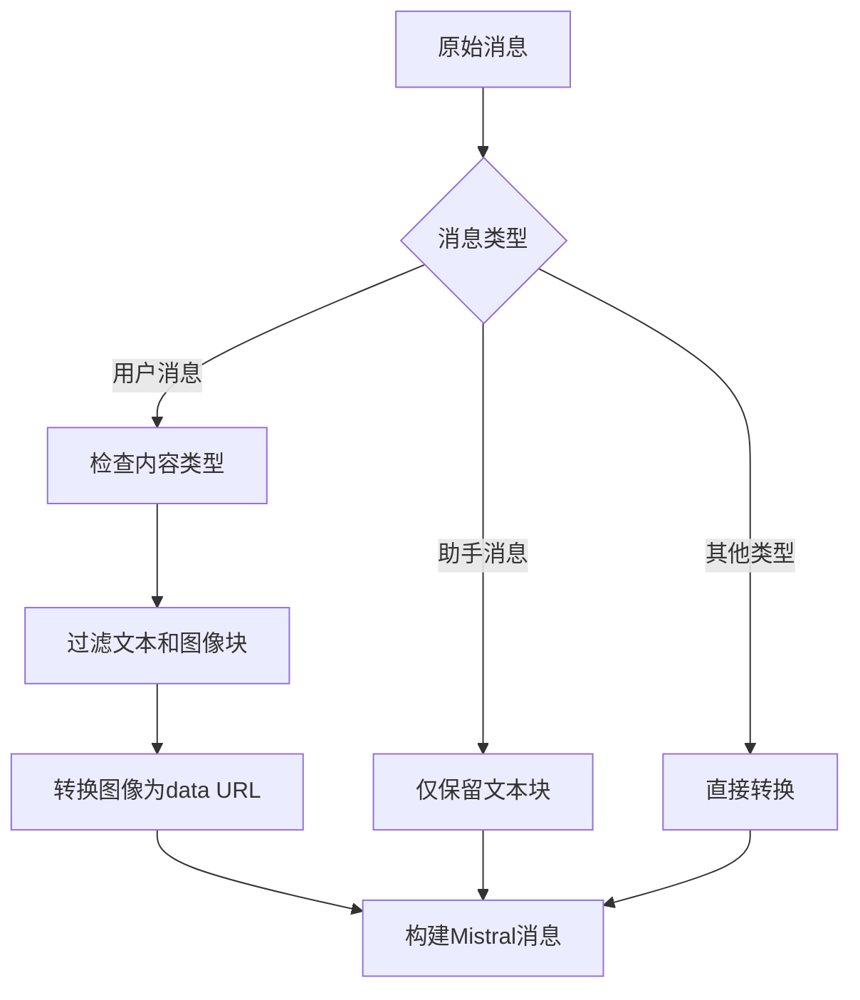
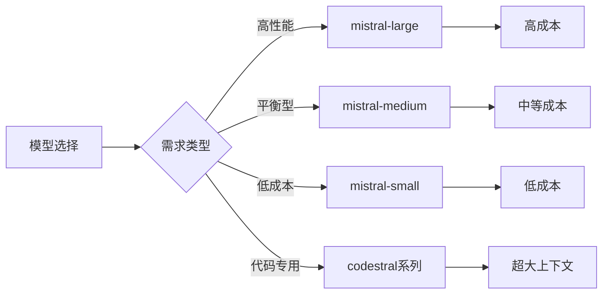
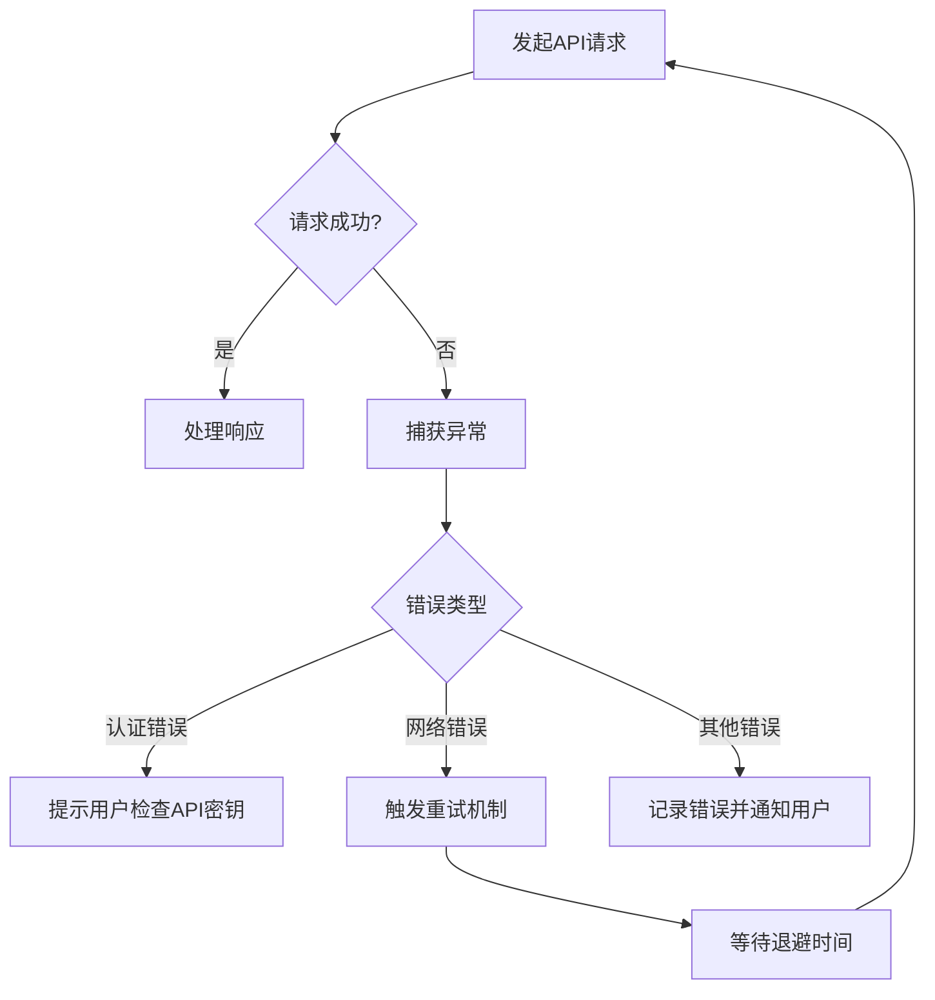

# Mistral API

<cite>
**本文档中引用的文件**
- [mistral.ts](file://src/core/api/providers/mistral.ts)
- [mistral-format.ts](file://src/core/api/transform/mistral-format.ts)
- [api.ts](file://src/shared/api.ts)
- [MistralProvider.tsx](file://webview-ui/src/components/settings/providers/MistralProvider.tsx)
</cite>

## 目录
1. [简介](#简介)
2. [认证与配置](#认证与配置)
3. [请求与响应结构](#请求与响应结构)
4. [消息格式处理](#消息格式处理)
5. [模型特性](#模型特性)
6. [错误处理与速率限制](#错误处理与速率限制)
7. [完整使用示例](#完整使用示例)
8. [总结](#总结)

## 简介
本文档详细说明了cline如何通过`src/core/api/providers/mistral.ts`与Mistral AI的API服务进行通信。文档涵盖了认证机制、请求/响应结构、消息格式转换、模型特性、错误处理等方面，并提供完整的集成示例。

**Section sources**
- [mistral.ts](file://src/core/api/providers/mistral.ts#L1-L95)

## 认证与配置
cline使用API密钥对Mistral服务进行认证。用户需要在设置中提供有效的Mistral API密钥。

配置选项包括：
- `mistralApiKey`: 必需的API密钥
- `apiModelId`: 可选的模型标识符，用于指定要使用的Mistral模型

如果未提供API密钥，系统将抛出错误："Mistral API key is required"。配置界面由`MistralProvider.tsx`实现，允许用户输入API密钥并选择模型。



**Diagram sources**
- [mistral.ts](file://src/core/api/providers/mistral.ts#L25-L35)
- [MistralProvider.tsx](file://webview-ui/src/components/settings/providers/MistralProvider.tsx#L1-L57)

**Section sources**
- [mistral.ts](file://src/core/api/providers/mistral.ts#L25-L35)
- [MistralProvider.tsx](file://webview-ui/src/components/settings/providers/MistralProvider.tsx#L1-L57)

## 请求与响应结构
cline通过流式方式与Mistral API通信，使用`chat.stream`方法发送请求并接收响应。

### 请求结构
```json
{
  "model": "模型ID",
  "temperature": 0,
  "messages": [
    {
      "role": "system",
      "content": "系统提示"
    },
    {
      "role": "user",
      "content": "用户消息"
    }
  ],
  "stream": true
}
```

### 响应处理
响应以流式形式处理，包含两种类型的数据：
1. 文本片段：包含模型生成的文本内容
2. 使用量信息：包含输入和输出的token数量

系统通过`yield`关键字逐块处理流式响应，确保实时性和内存效率。



**Diagram sources**
- [mistral.ts](file://src/core/api/providers/mistral.ts#L37-L94)

**Section sources**
- [mistral.ts](file://src/core/api/providers/mistral.ts#L37-L94)

## 消息格式处理
cline使用`convertToMistralMessages`函数将内部消息格式转换为Mistral API所需的格式。

### 消息类型支持
- **系统消息**: 直接转换，角色为"system"
- **用户消息**: 支持文本和图像内容
- **助手消息**: 仅支持文本内容
- **工具消息**: 支持工具调用相关消息

### 图像处理
当用户消息包含图像时，系统将其转换为"data URL"格式：
```
data:${媒体类型};base64,${base64编码的数据}
```

对于非文本内容块，系统会进行过滤，只保留文本和图像类型的内容。



**Diagram sources**
- [mistral-format.ts](file://src/core/api/transform/mistral-format.ts#L1-L61)

**Section sources**
- [mistral-format.ts](file://src/core/api/transform/mistral-format.ts#L1-L61)

## 模型特性
Mistral提供了多种模型，各具不同的性能和成本特点。

### 支持的模型
根据`api.ts`中的定义，支持以下主要模型：

| 模型名称 | 上下文窗口 | 输入价格(每百万token) | 输出价格(每百万token) | 支持图像 |
|---------|-----------|-------------------|-------------------|--------|
| mistral-large-2411 | 128,000 | $2.00 | $6.00 | 否 |
| mistral-medium-latest | 128,000 | $0.40 | $2.00 | 是 |
| mistral-small-latest | 128,000 | $0.10 | $0.30 | 是 |
| codestral-2501 | 256,000 | $0.30 | $0.90 | 否 |
| open-codestral-mamba | 256,000 | $0.15 | $0.15 | 否 |

### 性能与成本分析
- **Mistral Large**: 适合复杂任务，推理能力强，但成本较高
- **Mistral Medium**: 平衡性能与成本，支持图像输入，适合大多数场景
- **Mistral Small**: 成本效益高，适合简单任务和快速响应
- **Codestral系列**: 专为代码生成优化，具有超大上下文窗口

默认情况下，系统使用`mistralDefaultModelId`指定的模型。用户可以根据需求选择最适合的模型。



**Diagram sources**
- [api.ts](file://src/shared/api.ts#L2096-L2201)

**Section sources**
- [api.ts](file://src/shared/api.ts#L2096-L2201)

## 错误处理与速率限制
系统实现了完善的错误处理机制来应对API调用中的各种异常情况。

### 错误处理
- **客户端创建错误**: 当API密钥缺失或无效时抛出明确错误
- **状态码转换**: 将Mistral SDK使用的`statusCode`转换为标准的`status`字段
- **重试机制**: 使用`@withRetry`装饰器实现自动重试功能

### 速率限制
虽然代码中没有显式的速率限制处理，但系统通过以下方式间接管理：
- 流式响应处理减少内存压力
- 重试机制包含退避策略
- Token使用量统计帮助用户监控消耗

当遇到API错误时，系统会捕获异常并进行适当处理，确保不会导致整个应用崩溃。



**Section sources**
- [mistral.ts](file://src/core/api/providers/mistral.ts#L25-L95)

## 完整使用示例
以下是在cline中配置和使用Mistral API的完整流程：

1. **配置API密钥**
   - 打开设置界面
   - 在Mistral部分输入API密钥
   - 选择合适的模型

2. **发起请求**
```typescript
const handler = new MistralHandler({
  mistralApiKey: "your-api-key",
  apiModelId: "mistral-medium-latest"
});

const stream = handler.createMessage(
  "你是一个有用的助手",
  [{ role: "user", content: "你好，请介绍一下你自己" }]
);

for await (const chunk of stream) {
  if (chunk.type === "text") {
    console.log(chunk.text);
  }
}
```

3. **处理响应**
   - 实时接收文本片段
   - 监控token使用情况
   - 处理可能的错误

这种集成方式使Mistral成为高性能开源模型的优秀替代方案，特别是在需要大上下文窗口和高质量推理能力的场景下。

**Section sources**
- [mistral.ts](file://src/core/api/providers/mistral.ts#L1-L95)
- [mistral-format.ts](file://src/core/api/transform/mistral-format.ts#L1-L61)

## 总结
cline通过`mistral.ts`和`mistral-format.ts`模块实现了与Mistral AI服务的完整集成。系统支持多种Mistral模型，提供了灵活的认证机制、高效的消息格式转换和可靠的错误处理。通过合理的模型选择，用户可以在性能和成本之间找到最佳平衡点，充分利用Mistral模型在推理速度和上下文处理方面的优势。