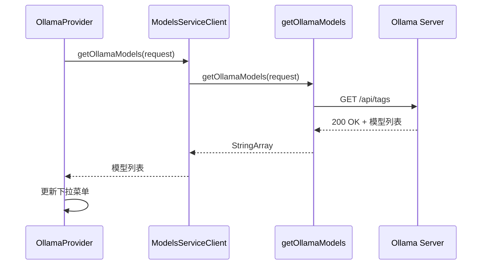

# Ollama API

<cite>
**本文档中引用的文件**  
- [ollama.ts](file://src/core/api/providers/ollama.ts)
- [getOllamaModels.ts](file://src/core/controller/models/getOllamaModels.ts)
- [ollama-format.ts](file://src/core/api/transform/ollama-format.ts)
- [OllamaProvider.tsx](file://webview-ui/src/components/settings/providers/OllamaProvider.tsx)
</cite>

## 目录
1. [简介](#简介)
2. [认证与配置](#认证与配置)
3. [请求与响应结构](#请求与响应结构)
4. [流式响应与模型列表获取](#流式响应与模型列表获取)
5. [Ollama 特有功能](#ollama-特有功能)
6. [错误处理与解决方案](#错误处理与解决方案)
7. [完整代码示例](#完整代码示例)
8. [离线环境优势](#离线环境优势)

## 简介
cline 是一个集成本地大语言模型服务的开发工具，通过 `src/core/api/providers/ollama.ts` 文件与本地运行的 Ollama 服务进行通信。Ollama 允许用户在本地设备上运行和管理大型语言模型，提供隐私保护和离线可用性。本文档详细说明了 cline 如何配置、调用和处理 Ollama API 的各个方面，包括认证机制、请求结构、流式响应处理、模型管理以及常见错误的解决方案。

## 认证与配置
cline 支持灵活的 Ollama 服务配置方式，允许连接到本地或远程的 Ollama 实例。

### 认证机制
Ollama 通常在本地运行时无需认证。对于需要身份验证的云实例或受保护的服务，cline 支持使用 Bearer Token 进行认证。当配置了 `ollamaApiKey` 时，cline 会在请求头中添加 `Authorization: Bearer <token>`。

### 配置方法
核心配置选项通过 `OllamaHandlerOptions` 接口定义：
- **自定义服务器 URL**：通过 `ollamaBaseUrl` 指定 Ollama 服务地址，默认为 `http://localhost:11434`。
- **API 密钥**：通过 `ollamaApiKey` 提供认证令牌（可选）。
- **模型 ID**：通过 `ollamaModelId` 指定要使用的模型名称。
- **上下文窗口大小**：通过 `ollamaApiOptionsCtxNum` 设置模型的上下文长度，默认为 32768。
- **请求超时**：通过 `requestTimeoutMs` 设置请求超时时间，默认为 30000 毫秒。

在用户界面中，这些配置通过 `OllamaProvider` 组件进行管理，允许用户输入自定义 URL 和 API 密钥。

**Section sources**
- [ollama.ts](file://src/core/api/providers/ollama.ts#L15-L37)
- [OllamaProvider.tsx](file://webview-ui/src/components/settings/providers/OllamaProvider.tsx#L31-L75)

## 请求与响应结构
cline 将内部消息格式转换为 Ollama 兼容的格式，并处理其流式响应。

### 文本生成请求
请求通过 `createMessage` 方法发起，将系统提示和消息历史转换为 Ollama 格式：
```json
{
  "model": "llama3.1",
  "messages": [
    { "role": "system", "content": "You are a helpful assistant." },
    { "role": "user", "content": "Hello" },
    { "role": "assistant", "content": "Hi, how can I help?" }
  ],
  "stream": true,
  "options": {
    "num_ctx": 32768
  }
}
```

### 嵌入模型
虽然当前代码主要关注聊天模型，但 Ollama 也支持嵌入模型。调用方式类似，但使用 `/api/embeddings` 端点。

### 响应结构
Ollama 返回流式 JSON 响应，每个数据块包含：
```json
{
  "model": "llama3.1",
  "created_at": "2024-07-15T18:58:45.261677Z",
  "message": {
    "role": "assistant",
    "content": "Hello! How can I assist you today?"
  },
  "done": false,
  "total_duration": 123456789,
  "load_duration": 98765432,
  "prompt_eval_count": 25,
  "prompt_eval_duration": 12345678,
  "eval_count": 10,
  "eval_duration": 87654321
}
```

cline 将这些流式块转换为统一的 `ApiStream` 格式，包括文本和使用量信息。

**Section sources**
- [ollama.ts](file://src/core/api/providers/ollama.ts#L41-L81)
- [ollama-format.ts](file://src/core/api/transform/ollama-format.ts#L0-L109)

## 流式响应与模型列表获取
cline 充分利用 Ollama 的流式 API 特性，并提供模型发现功能。

### 流式响应处理
`createMessage` 方法返回一个异步生成器，逐块处理流式响应：
1. 创建带有超时机制的 Promise，防止请求无限挂起。
2. 调用 Ollama 客户端的 `chat` 方法，启用 `stream: true`。
3. 使用 `for await...of` 循环逐个处理响应块。
4. 将每个文本块转换为 `{ type: "text", text: content }` 格式。
5. 当接收到 `prompt_eval_count` 或 `eval_count` 时，生成 `{ type: "usage", inputTokens, outputTokens }` 事件。

该方法使用 `@withRetry` 装饰器实现自动重试，增强可靠性。

### 模型列表获取
`getOllamaModels` 函数负责从 Ollama 服务器获取可用模型列表：
1. 接收可选的 `baseUrl`，默认为 `http://localhost:11434`。
2. 向 `${baseUrl}/api/tags` 发送 GET 请求。
3. 解析响应，提取模型名称数组。
4. 去重并排序后返回。

在 UI 层，`OllamaProvider` 组件每 2 秒轮询一次此 API，实时更新可用模型列表。



**Diagram sources**
- [getOllamaModels.ts](file://src/core/controller/models/getOllamaModels.ts#L0-L26)
- [OllamaProvider.tsx](file://webview-ui/src/components/settings/providers/OllamaProvider.tsx#L31-L58)

**Section sources**
- [ollama.ts](file://src/core/api/providers/ollama.ts#L41-L81)
- [getOllamaModels.ts](file://src/core/controller/models/getOllamaModels.ts#L0-L26)

## Ollama 特有功能
cline 集成了 Ollama 的核心特性，支持本地模型管理和运行。

### 本地模型运行
Ollama 的主要优势是能够在本地设备上运行 LLM，无需依赖云服务。cline 通过配置的 `ollamaBaseUrl` 连接到本地 Ollama 守护进程，所有推理都在用户机器上完成，确保数据隐私和安全。

### 模型拉取
虽然 cline 本身不直接实现模型拉取逻辑，但它依赖 Ollama 的模型管理功能。用户可以通过 Ollama CLI（如 `ollama pull llama3.1`）下载模型，然后在 cline 中选择使用。

### 自定义模型创建
Ollama 支持通过 Modelfile 创建自定义模型。cline 可以无缝使用这些自定义模型，只需在模型选择器中输入自定义模型的名称即可。

**Section sources**
- [ollama.ts](file://src/core/api/providers/ollama.ts#L0-L122)
- [OllamaProvider.tsx](file://webview-ui/src/components/settings/providers/OllamaProvider.tsx#L0-L149)

## 错误处理与解决方案
cline 实现了全面的错误处理机制来应对常见的 Ollama 连接问题。

### 常见错误
- **连接被拒绝**：当 Ollama 服务未运行或 URL 错误时发生。
- **模型未找到**：请求的模型未在本地拉取或名称错误。
- **请求超时**：模型推理时间过长，超过 `requestTimeoutMs` 限制。
- **认证失败**：提供了错误的 API 密钥。

### 解决方案
1. **连接被拒绝**：确保 Ollama 服务正在运行（`ollama serve`），并检查 `ollamaBaseUrl` 配置是否正确。
2. **模型未找到**：使用 `ollama list` 验证模型是否已下载，或使用 `ollama pull <model>` 下载所需模型。
3. **请求超时**：在设置中增加“请求超时”值，或选择更轻量级的模型。
4. **认证失败**：检查 API 密钥是否正确，或对于本地实例留空。

在代码层面，`ensureClient` 方法捕获客户端创建错误，`createMessage` 方法处理超时和流式处理错误，并提供详细的错误日志。

**Section sources**
- [ollama.ts](file://src/core/api/providers/ollama.ts#L83-L121)
- [getOllamaModels.ts](file://src/core/controller/models/getOllamaModels.ts#L15-L26)

## 完整代码示例
以下是一个在 cline 中配置和使用 Ollama API 的简化示例：

```typescript
// 创建 Ollama 处理器
const ollamaHandler = new OllamaHandler({
  ollamaBaseUrl: "http://localhost:11434",
  ollamaApiKey: "", // 本地实例通常为空
  ollamaModelId: "llama3.1",
  ollamaApiOptionsCtxNum: "32768",
  requestTimeoutMs: 30000,
});

// 发起聊天请求
const systemPrompt = "You are a helpful assistant.";
const messages: Anthropic.Messages.MessageParam[] = [
  { role: "user", content: "Explain the theory of relativity in simple terms." }
];

// 处理流式响应
for await (const chunk of ollamaHandler.createMessage(systemPrompt, messages)) {
  if (chunk.type === "text") {
    console.log("Received:", chunk.text);
  } else if (chunk.type === "usage") {
    console.log(`Tokens: ${chunk.inputTokens} in, ${chunk.outputTokens} out`);
  }
}
```

**Section sources**
- [ollama.ts](file://src/core/api/providers/ollama.ts#L0-L122)

## 离线环境优势
在离线环境下使用 Ollama 具有显著优势：
- **数据隐私**：所有数据处理都在本地完成，不会上传到任何外部服务器。
- **无网络依赖**：即使在没有互联网连接的环境中也能正常工作。
- **低延迟**：避免了网络传输延迟，响应速度更快。
- **成本效益**：无需支付云 API 调用费用。
- **完全控制**：用户可以完全控制模型的运行环境和资源分配。

这些特性使得 cline + Ollama 成为处理敏感代码或在受限网络环境中工作的理想选择。

**Section sources**
- [OllamaProvider.tsx](file://webview-ui/src/components/settings/providers/OllamaProvider.tsx#L131-L149)