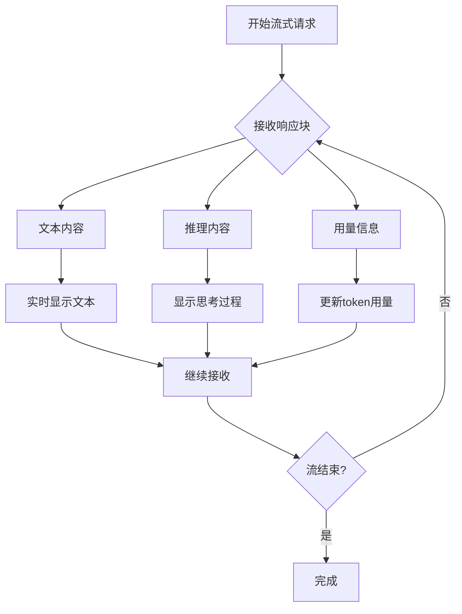

# OpenAI API

<cite>
**本文档中引用的文件**  
- [openai.ts](file://src/core/api/providers/openai.ts)
- [openai-native.ts](file://src/core/api/providers/openai-native.ts)
- [openai-format.ts](file://src/core/api/transform/openai-format.ts)
- [stream.ts](file://src/core/api/transform/stream.ts)
- [retry.ts](file://src/core/api/retry.ts)
</cite>

## 目录
1. [简介](#简介)
2. [认证机制与配置方法](#认证机制与配置方法)
3. [请求与响应结构](#请求与响应结构)
4. [流式响应与函数调用处理](#流式响应与函数调用处理)
5. [对原生API及o1推理模型的支持](#对原生api及o1推理模型的支持)
6. [错误码与重试策略](#错误码与重试策略)
7. [完整代码示例](#完整代码示例)
8. [与Azure OpenAI等变体的兼容性](#与azure-openai等变体的兼容性)

## 简介
cline通过`src/core/api/providers/openai.ts`和`src/core/api/providers/openai-native.ts`两个核心模块实现了与OpenAI服务的深度集成。该系统支持多种OpenAI模型（如gpt-4、gpt-4-turbo、o1系列等），并具备流式响应处理、函数调用、特殊格式转换等高级功能。本文档详细说明cline如何与OpenAI API通信，涵盖认证、配置、数据结构、错误处理等关键方面。

## 认证机制与配置方法
cline使用OpenAI API密钥进行身份验证，密钥通过配置对象传递给`OpenAiHandler`或`OpenAiNativeHandler`。在初始化时，若未提供API密钥，系统将抛出“OpenAI API key is required”错误。

对于Azure OpenAI服务，cline通过`azureApiVersion`或包含"azure.com"/"azure.us"的`openAiBaseUrl`来识别端点，并自动使用`AzureOpenAI`客户端进行连接。用户可通过`openAiHeaders`字段添加自定义请求头，实现更灵活的认证或元数据传递。

配置参数通过`CommonApiHandlerOptions`接口传递，包括`openAiApiKey`、`openAiBaseUrl`、`azureApiVersion`等关键字段，确保了配置的统一性和可扩展性。

**Section sources**
- [openai.ts](file://src/core/api/providers/openai.ts#L24-L60)
- [openai-native.ts](file://src/core/api/providers/openai-native.ts#L24-L40)

## 请求与响应结构
cline将内部消息格式转换为OpenAI兼容的JSON结构。系统提示（systemPrompt）和消息历史（messages）通过`convertToOpenAiMessages`函数转换为`ChatCompletionMessageParam[]`数组。

对于标准模型（如gpt-4），请求结构如下：
```json
{
  "model": "gpt-4",
  "messages": [
    {"role": "system", "content": "..."},
    {"role": "user", "content": "..."},
    {"role": "assistant", "content": "..."}
  ],
  "temperature": 0.7,
  "max_tokens": 4096,
  "stream": true
}
```

对于o1系列推理模型，系统使用"developer"角色替代"system"，并禁用temperature参数。响应以流式方式接收，包含文本、推理内容和用量信息三种类型的chunk。

**Section sources**
- [openai.ts](file://src/core/api/providers/openai.ts#L84-L139)
- [openai-format.ts](file://src/core/api/transform/openai-format.ts#L0-L210)

## 流式响应与函数调用处理
cline通过异步生成器（AsyncGenerator）实现流式响应处理。`createMessage`方法返回一个`ApiStream`，逐个yield不同类型的响应块。

流式响应包含三种类型：
- **文本块**：包含模型生成的可读内容
- **推理块**：包含模型的思考过程（reasoning_content）
- **用量块**：包含输入/输出token数及缓存命中信息

函数调用（function calling）通过`tool_calls`字段支持。当模型需要调用工具时，会在响应中包含`tool_calls`数组，cline将其转换为Anthropic格式的`tool_use`块，实现跨平台兼容。



**Diagram sources**
- [openai.ts](file://src/core/api/providers/openai.ts#L84-L139)
- [stream.ts](file://src/core/api/transform/stream.ts#L0-L22)

**Section sources**
- [openai.ts](file://src/core/api/providers/openai.ts#L84-L139)
- [stream.ts](file://src/core/api/transform/stream.ts#L0-L22)

## 对原生API及o1推理模型的支持
`OpenAiNativeHandler`专门处理OpenAI原生API，支持o1系列模型的特殊格式。对于o1、o1-preview、o1-mini等模型，由于不支持流式传输，系统采用非流式请求，并在完整响应到达后一次性返回结果。

对于o4-mini、o3等新型推理模型，系统启用`reasoning_effort`参数，并使用"developer"角色进行对话。这些模型支持流式响应，允许实时显示模型的思考过程。

o1模型的特殊处理包括：
- 移除system prompt，将其作为user消息发送
- 禁用temperature参数
- 使用`convertToO1Messages`函数处理消息历史

```mermaid
classDiagram
class ApiHandler {
<<interface>>
+createMessage(systemPrompt, messages) ApiStream
+getModel() {id, info}
}
class OpenAiHandler {
+ensureClient() OpenAI
+createMessage() ApiStream
+getModel() {id, info}
}
class OpenAiNativeHandler {
+ensureClient() OpenAI
+createMessage() ApiStream
+getModel() {id, info}
}
ApiHandler <|-- OpenAiHandler
ApiHandler <|-- OpenAiNativeHandler
OpenAiHandler --> "uses" OpenAI
OpenAiNativeHandler --> "uses" OpenAI
```

**Diagram sources**
- [openai-native.ts](file://src/core/api/providers/openai-native.ts#L0-L171)
- [openai.ts](file://src/core/api/providers/openai.ts#L0-L140)

**Section sources**
- [openai-native.ts](file://src/core/api/providers/openai-native.ts#L0-L171)

## 错误码与重试策略
cline实现了全面的错误处理机制。常见的HTTP错误码处理如下：
- **401未授权**：当API密钥无效时抛出，提示用户检查密钥配置
- **429速率限制**：触发重试策略，根据`Retry-After`头或指数退避算法进行重试

重试功能通过`@withRetry()`装饰器实现，支持最多3次重试，默认基础延迟1秒，最大延迟10秒。系统会检查多种速率限制头（`Retry-After`、`X-RateLimit-Reset`等）来确定最佳重试时间。

当检测到上下文窗口超出错误时，系统会抛出特定异常，允许上层逻辑进行适当处理（如摘要历史记录或删除旧消息）。

**Section sources**
- [retry.ts](file://src/core/api/retry.ts#L0-L86)
- [openai.ts](file://src/core/api/providers/openai.ts#L24-L60)

## 完整代码示例
以下是在cline中配置和使用OpenAI API的完整示例：

```typescript
const handler = new OpenAiHandler({
  openAiApiKey: "your-api-key",
  openAiBaseUrl: "https://api.openai.com/v1",
  openAiModelId: "gpt-4-turbo",
  openAiModelInfo: {
    maxTokens: 8192,
    temperature: 0.7
  },
  onRetryAttempt: (attempt, max, delay, error) => {
    console.log(`重试尝试 ${attempt}/${max}, 延迟: ${delay}ms`);
  }
});

const stream = await handler.createMessage(
  "你是一个有帮助的助手",
  [{ role: "user", content: "你好！" }]
);

for await (const chunk of stream) {
  switch (chunk.type) {
    case "text":
      console.log("文本:", chunk.text);
      break;
    case "reasoning":
      console.log("推理:", chunk.reasoning);
      break;
    case "usage":
      console.log(`用量: ${chunk.inputTokens}输入 + ${chunk.outputTokens}输出`);
      break;
  }
}
```

**Section sources**
- [openai.ts](file://src/core/api/providers/openai.ts#L0-L140)

## 与Azure OpenAI等变体的兼容性
cline通过智能客户端选择机制实现了与Azure OpenAI的无缝兼容。系统通过以下方式识别Azure端点：
1. 检查`azureApiVersion`是否设置
2. 检查`openAiBaseUrl`是否包含"azure.com"或"azure.us"
3. 排除DeepSeek模型的特殊情况

当识别为Azure端点时，cline自动使用`AzureOpenAI`客户端，该客户端接受`apiVersion`参数并使用Azure特定的API形状。对于自定义部署，用户可通过`openAiModelId`指定部署名称。

该设计确保了cline既能与标准OpenAI API通信，又能与Azure OpenAI服务兼容，为用户提供灵活的部署选项。

**Section sources**
- [openai.ts](file://src/core/api/providers/openai.ts#L24-L60)