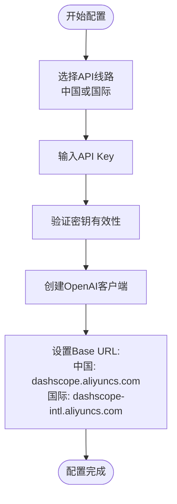
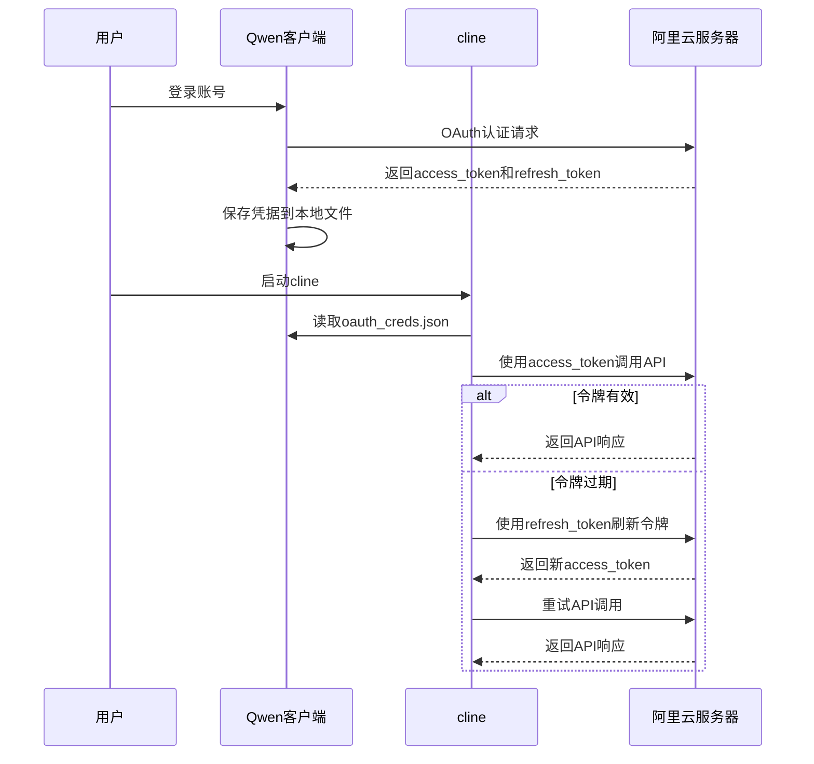
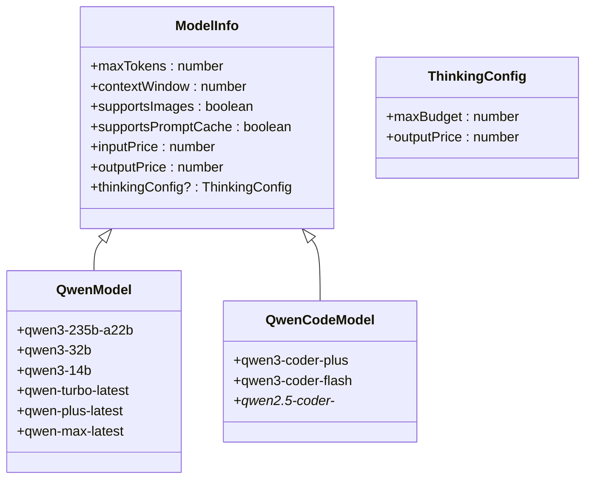
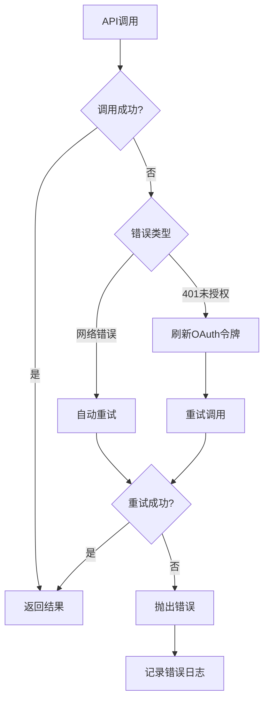

# Qwen API

<cite>
**本文档中引用的文件**  
- [qwen.ts](file://src/core/api/providers/qwen.ts)
- [qwen-code.ts](file://src/core/api/providers/qwen-code.ts)
- [QwenProvider.tsx](file://webview-ui/src/components/settings/providers/QwenProvider.tsx)
- [QwenCodeProvider.tsx](file://webview-ui/src/components/settings/providers/QwenCodeProvider.tsx)
- [api.ts](file://src/shared/api.ts)
</cite>

## 目录
1. [简介](#简介)
2. [认证机制与配置方法](#认证机制与配置方法)
3. [请求与响应结构](#请求与响应结构)
4. [Qwen API特性与功能](#qwen-api特性与功能)
5. [服务端点、区域可用性与性能指标](#服务端点区域可用性与性能指标)
6. [错误处理与最佳实践](#错误处理与最佳实践)
7. [完整代码示例](#完整代码示例)
8. [中文任务与阿里云生态集成优势](#中文任务与阿里云生态集成优势)

## 简介
本文档详细说明了cline如何通过`src/core/api/providers/qwen.ts`和`qwen-code.ts`与阿里云通义千问大模型服务进行通信。涵盖认证机制、请求响应结构、API功能特性、服务端点、错误处理及最佳实践，并提供完整集成示例。

**Section sources**
- [qwen.ts](file://src/core/api/providers/qwen.ts#L1-L146)
- [qwen-code.ts](file://src/core/api/providers/qwen-code.ts#L1-L272)

## 认证机制与配置方法
cline支持两种通义千问API的认证方式：通用Qwen API使用API Key认证，Qwen Code API使用OAuth 2.0认证。

对于通用Qwen API，用户需在配置中提供`qwenApiKey`，并选择API线路（中国区或国际区）。系统将根据所选线路自动配置基础URL。



**Diagram sources**
- [qwen.ts](file://src/core/api/providers/qwen.ts#L30-L50)

对于Qwen Code API，采用OAuth 2.0认证机制，需预先安装官方Qwen客户端并完成登录，认证凭据将自动保存至`~/.qwen/oauth_creds.json`。cline通过读取该文件中的访问令牌进行API调用，并在令牌过期时自动刷新。



**Diagram sources**
- [qwen-code.ts](file://src/core/api/providers/qwen-code.ts#L82-L156)
- [QwenCodeProvider.tsx](file://webview-ui/src/components/settings/providers/QwenCodeProvider.tsx#L25-L55)

**Section sources**
- [qwen.ts](file://src/core/api/providers/qwen.ts#L30-L60)
- [qwen-code.ts](file://src/core/api/providers/qwen-code.ts#L42-L156)

## 请求与响应结构
### 通用Qwen模型请求示例
```json
{
  "model": "qwen-turbo-latest",
  "messages": [
    {
      "role": "system",
      "content": "你是一个有用的助手"
    },
    {
      "role": "user",
      "content": "你好，请介绍一下你自己"
    }
  ],
  "max_completion_tokens": 16384,
  "stream": true,
  "temperature": 0
}
```

### Qwen代码模型请求示例
```json
{
  "model": "qwen3-coder-plus",
  "messages": [
    {
      "role": "system",
      "content": "你是一个专业的代码生成助手"
    },
    {
      "role": "user",
      "content": "请用Python实现一个快速排序算法"
    }
  ],
  "max_completion_tokens": 65536,
  "stream": true,
  "temperature": 0
}
```

### 流式响应结构
响应以流式方式返回，包含文本、推理过程和用量信息：
```json
{
  "type": "text",
  "text": "这是生成的文本内容"
}
```
```json
{
  "type": "reasoning",
  "reasoning": "这是模型的思考过程"
}
```
```json
{
  "type": "usage",
  "inputTokens": 1024,
  "outputTokens": 512,
  "cacheReadTokens": 256,
  "cacheWriteTokens": 128
}
```

**Section sources**
- [qwen.ts](file://src/core/api/providers/qwen.ts#L90-L140)
- [qwen-code.ts](file://src/core/api/providers/qwen-code.ts#L160-L250)

## Qwen API特性与功能
### 超长上下文支持
通义千问系列模型提供业界领先的上下文窗口支持：
- `qwen-turbo`系列支持高达1,000,000 tokens的上下文窗口
- `qwen3`系列支持131,072 tokens上下文
- 代码专用模型`qwen3-coder-plus`支持1,000,000 tokens上下文，适用于大型代码库分析

### 代码生成能力
Qwen Code模型专为代码生成优化，具备以下特性：
- 支持多种编程语言的语法理解和生成
- 能够理解项目结构和跨文件依赖
- 提供代码补全、重构、调试建议等功能
- 支持从自然语言描述生成高质量代码

### 推理模式
部分高级模型支持扩展思考模式，通过`enable_thinking`和`thinking_budget`参数控制：
- 允许模型进行更深入的推理和规划
- 可配置思考预算（tokens）
- 适用于复杂问题解决和算法设计



**Diagram sources**
- [api.ts](file://src/shared/api.ts#L1351-L2031)
- [qwen.ts](file://src/core/api/providers/qwen.ts#L10-L25)

**Section sources**
- [api.ts](file://src/shared/api.ts#L1351-L2031)
- [qwen.ts](file://src/core/api/providers/qwen.ts#L100-L120)

## 服务端点、区域可用性与性能指标
### 服务端点
根据区域选择不同的API端点：
- 中国区：`https://dashscope.aliyuncs.com/compatible-mode/v1`
- 国际区：`https://dashscope-intl.aliyuncs.com/compatible-mode/v1`

### 区域可用性
用户可根据地理位置选择最适合的API线路：
- 中国大陆用户应选择中国API线路以获得最佳性能
- 其他地区用户应选择国际API线路

### 性能指标
不同模型的性能指标如下表所示：

| 模型名称 | 最大输出tokens | 上下文窗口 | 输入价格(每百万tokens) | 输出价格(每百万tokens) | 特性 |
|---------|---------------|-----------|---------------------|---------------------|------|
| qwen-turbo-latest | 16,384 | 1,000,000 | 0.3元 | 0.6元 | 超长上下文，高速响应 |
| qwen3-235b-a22b | 16,384 | 131,072 | 2元 | 8元 | 高性能通用模型 |
| qwen-plus-latest | 16,384 | 131,072 | 0.8元 | 2元 | 平衡性能与成本 |
| qwen3-coder-plus | 65,536 | 1,000,000 | 免费 | 免费 | 专业代码生成 |
| qwen2.5-coder-7b-instruct | 8,192 | 131,072 | 0.001元 | 0.002元 | 轻量级代码模型 |

**Section sources**
- [qwen.ts](file://src/core/api/providers/qwen.ts#L30-L50)
- [api.ts](file://src/shared/api.ts#L1351-L2031)

## 错误处理与最佳实践
### 错误处理机制
系统实现了多层次的错误处理：
- 客户端初始化时验证API密钥
- 网络请求自动重试（通过`@withRetry`装饰器）
- OAuth令牌过期自动刷新
- 详细的错误日志记录



**Diagram sources**
- [qwen-code.ts](file://src/core/api/providers/qwen-code.ts#L158-L180)
- [qwen.ts](file://src/core/api/providers/qwen.ts#L10-L15)

### 最佳实践
1. **合理选择模型**：根据任务复杂度选择合适的模型，避免资源浪费
2. **利用超长上下文**：对于代码分析任务，充分利用百万级上下文窗口
3. **配置思考预算**：对复杂问题启用推理模式并合理设置预算
4. **缓存策略**：对于重复性查询，考虑实现客户端缓存
5. **流式处理**：使用流式响应提供更好的用户体验

**Section sources**
- [qwen.ts](file://src/core/api/providers/qwen.ts#L100-L140)
- [qwen-code.ts](file://src/core/api/providers/qwen-code.ts#L200-L250)

## 完整代码示例
以下是在cline中配置和使用Qwen API的完整示例：

```typescript
// 配置通用Qwen API
const qwenHandler = new QwenHandler({
  qwenApiKey: "your-api-key",
  qwenApiLine: QwenApiRegions.CHINA,
  apiModelId: "qwen-turbo-latest",
  thinkingBudgetTokens: 8192
});

// 配置Qwen Code API
const qwenCodeHandler = new QwenCodeHandler({
  qwenCodeOauthPath: "~/.qwen/oauth_creds.json",
  apiModelId: "qwen3-coder-plus"
});

// 创建消息请求
async function callQwen() {
  const systemPrompt = "你是一个专业的软件开发助手";
  const messages = [
    {
      role: "user",
      content: "请用TypeScript实现一个简单的发布订阅模式"
    }
  ];

  try {
    const stream = qwenCodeHandler.createMessage(systemPrompt, messages);
    for await (const chunk of stream) {
      if (chunk.type === "text") {
        console.log("生成内容:", chunk.text);
      } else if (chunk.type === "reasoning") {
        console.log("思考过程:", chunk.reasoning);
      } else if (chunk.type === "usage") {
        console.log(`用量: 输入${chunk.inputTokens} tokens, 输出${chunk.outputTokens} tokens`);
      }
    }
  } catch (error) {
    console.error("API调用失败:", error);
  }
}
```

**Section sources**
- [qwen.ts](file://src/core/api/providers/qwen.ts#L60-L140)
- [qwen-code.ts](file://src/core/api/providers/qwen-code.ts#L150-L270)

## 中文任务与阿里云生态集成优势
### 中文任务优势
通义千问模型在中文处理方面具有显著优势：
- 经过大规模中文语料训练，中文理解能力卓越
- 对中文编程习惯和注释有良好支持
- 能够准确理解中文需求文档并生成相应代码
- 在中文语法、语义和文化背景理解上表现优异

### 阿里云生态集成
与阿里云生态的深度集成带来以下优势：
- **无缝身份认证**：与阿里云账号体系集成，统一身份管理
- **高性能网络**：阿里云内网通信，低延迟高带宽
- **成本优化**：与阿里云其他服务组合使用可获得成本优惠
- **安全合规**：符合中国数据安全法规，适合企业级应用
- **监控与运维**：集成阿里云监控体系，便于运维管理

这些优势使得cline在处理中文开发任务时能够提供更高效、更准确的服务，特别适合中国开发者和企业用户。

**Section sources**
- [qwen.ts](file://src/core/api/providers/qwen.ts#L1-L146)
- [qwen-code.ts](file://src/core/api/providers/qwen-code.ts#L1-L272)
- [api.ts](file://src/shared/api.ts#L1351-L2031)