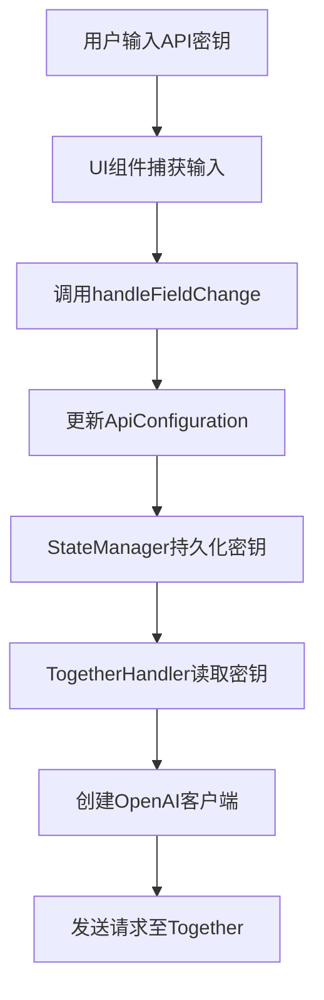
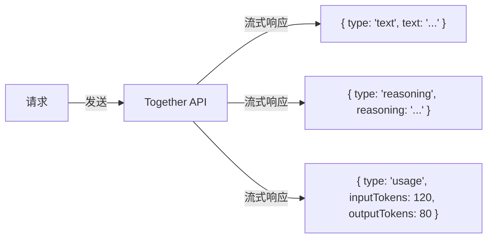
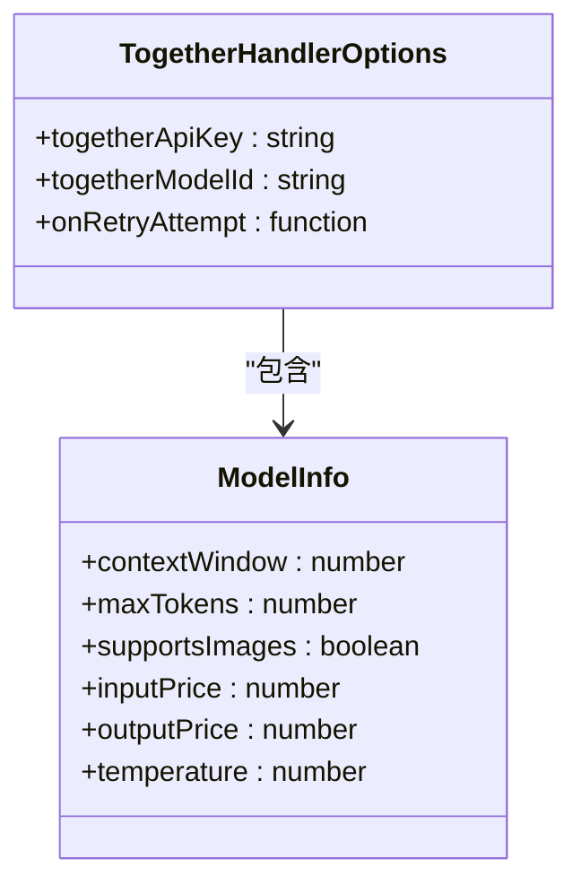
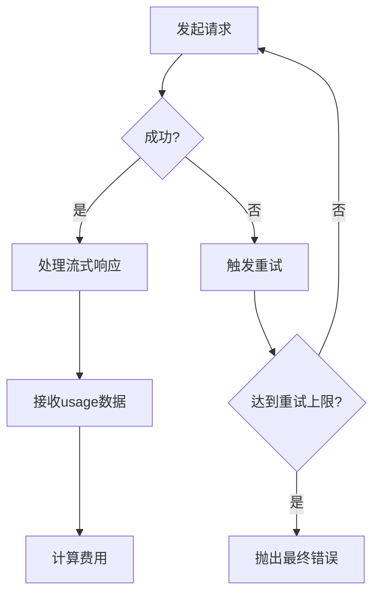

# Together API

<cite>
**本文档中引用的文件**  
- [together.ts](file://src/core/api/providers/together.ts)
- [StateManager.ts](file://src/core/storage/StateManager.ts)
- [TogetherProvider.tsx](file://webview-ui/src/components/settings/providers/TogetherProvider.tsx)
- [openai-format.ts](file://src/core/api/transform/openai-format.ts)
- [r1-format.ts](file://src/core/api/transform/r1-format.ts)
- [api.ts](file://src/shared/api.ts)
</cite>

## 目录
1. [简介](#简介)
2. [认证机制与配置方法](#认证机制与配置方法)
3. [请求与响应结构](#请求与响应结构)
4. [Together API特性与优势](#together-api特性与优势)
5. [模型选择与参数调整](#模型选择与参数调整)
6. [错误处理与费用计算](#错误处理与费用计算)
7. [完整代码示例](#完整代码示例)
8. [灵活性说明](#灵活性说明)

## 简介
本文档详细说明了cline如何通过`src/core/api/providers/together.ts`与Together.ai平台进行通信。Together API为用户提供对多种开源大模型（如Llama、Mixtral等）的访问能力，支持高性能GPU推理和灵活的模型配置。cline通过统一的API抽象层集成Together服务，实现无缝调用。

**Section sources**
- [together.ts](file://src/core/api/providers/together.ts#L1-L94)

## 认证机制与配置方法
cline使用API密钥进行身份验证以连接Together平台。用户需在设置界面中配置`togetherApiKey`，该密钥将被安全存储于状态管理器中，并在创建API客户端时使用。

配置流程如下：
1. 用户在UI中输入Together API密钥
2. 系统通过`StateManager`持久化密钥至加密存储
3. `TogetherHandler`在初始化时读取密钥并构建OpenAI兼容客户端
4. 客户端指向Together的自定义端点`https://api.together.xyz/v1`

若未提供API密钥，系统将抛出错误：“Together API key is required”。



**Diagram sources**
- [TogetherProvider.tsx](file://webview-ui/src/components/settings/providers/TogetherProvider.tsx#L19-L54)
- [StateManager.ts](file://src/core/storage/StateManager.ts#L816-L844)
- [together.ts](file://src/core/api/providers/together.ts#L25-L35)

**Section sources**
- [together.ts](file://src/core/api/providers/together.ts#L25-L35)
- [StateManager.ts](file://src/core/storage/StateManager.ts#L816-L844)
- [TogetherProvider.tsx](file://webview-ui/src/components/settings/providers/TogetherProvider.tsx#L19-L54)

## 请求与响应结构
cline将内部消息格式转换为OpenAI兼容格式后发送至Together API。系统提示和消息历史被合并为标准的`messages`数组。

### 请求结构示例
```json
{
  "model": "meta-llama/Llama-3-70b-chat-hf",
  "messages": [
    { "role": "system", "content": "你是一个代码助手..." },
    { "role": "user", "content": "请解释这段代码..." },
    { "role": "assistant", "content": "好的，这是解释..." }
  ],
  "temperature": 0,
  "stream": true,
  "stream_options": { "include_usage": true }
}
```

### 响应流结构
响应以流式方式处理，包含三种类型的数据块：
- **文本块**：包含模型生成的文本内容
- **推理块**：针对Deepseek Reasoner等特殊模型返回的推理过程
- **用量块**：包含输入/输出token统计信息



**Diagram sources**
- [together.ts](file://src/core/api/providers/together.ts#L50-L90)
- [openai-format.ts](file://src/core/api/transform/openai-format.ts#L3-L150)

**Section sources**
- [together.ts](file://src/core/api/providers/together.ts#L50-L90)
- [openai-format.ts](file://src/core/api/transform/openai-format.ts#L3-L150)

## Together API特性与优势
Together平台提供以下关键优势：

1. **高性能GPU支持**：所有模型均运行在高性能GPU集群上，确保低延迟和高吞吐量
2. **丰富的模型选择**：支持包括Llama、Mixtral、Qwen、Deepseek等在内的多种开源大模型
3. **OpenAI兼容接口**：采用标准OpenAI API格式，便于集成和迁移
4. **流式响应**：支持实时流式输出，提升用户体验
5. **用量统计**：通过`stream_options.include_usage`获取精确的token使用情况

这些特性使Together成为需要强大开源模型能力的应用的理想选择。

**Section sources**
- [together.ts](file://src/core/api/providers/together.ts#L1-L94)

## 模型选择与参数调整
用户可通过配置`togetherModelId`指定要使用的模型。支持的模型包括但不限于：
- `meta-llama/Llama-3-70b-chat-hf`
- `mistralai/Mixtral-8x7B-Instruct-v0.1`
- `deepseek-ai/deepseek-coder-6.7b-instruct`

当前实现中，`temperature`参数固定为0，以确保输出的确定性和一致性。未来可通过扩展`TogetherHandlerOptions`接口支持动态参数配置。

模型信息默认使用`openAiModelInfoSaneDefaults`，包含上下文窗口大小、图像支持、价格等元数据。



**Diagram sources**
- [together.ts](file://src/core/api/providers/together.ts#L10-L18)
- [api.ts](file://src/shared/api.ts#L908-L917)

**Section sources**
- [together.ts](file://src/core/api/providers/together.ts#L10-L18)
- [api.ts](file://src/shared/api.ts#L908-L917)

## 错误处理与费用计算
### 错误处理
系统实现了多层次的错误处理机制：
- 客户端创建时验证API密钥是否存在
- 使用`@withRetry()`装饰器自动重试失败的请求
- 捕获并包装底层SDK错误，提供清晰的错误信息

### 费用计算
虽然当前代码未直接实现费用计算，但通过`usage`流式数据可获取token用量。结合模型定价信息（存储在`ModelInfo`中），可计算出每次请求的成本。

费用计算公式：
```
总成本 = (输入token数 × 输入单价) + (输出token数 × 输出单价)
```

系统通过流式响应中的`usage`事件实时更新token统计。



**Diagram sources**
- [together.ts](file://src/core/api/providers/together.ts#L37-L50)
- [together.ts](file://src/core/api/providers/together.ts#L75-L90)

**Section sources**
- [together.ts](file://src/core/api/providers/together.ts#L37-L90)

## 完整代码示例
以下是在cline中配置和使用Together API的完整示例：

```typescript
// 1. 配置API密钥和模型ID
const config: ApiConfiguration = {
  togetherApiKey: "your-api-key-here",
  planModeTogetherModelId: "meta-llama/Llama-3-70b-chat-hf",
  actModeTogetherModelId: "meta-llama/Llama-3-70b-chat-hf"
};

// 2. 创建Together处理器
const handler = new TogetherHandler({
  togetherApiKey: config.togetherApiKey,
  togetherModelId: config.planModeTogetherModelId
});

// 3. 发起流式请求
const stream = handler.createMessage(
  "你是一个代码助手",
  [{ role: "user", content: "请解释快速排序算法" }]
);

// 4. 处理响应流
for await (const chunk of stream) {
  if (chunk.type === "text") {
    console.log("生成文本:", chunk.text);
  } else if (chunk.type === "usage") {
    console.log(`用量: ${chunk.inputTokens} in, ${chunk.outputTokens} out`);
  }
}
```

**Section sources**
- [together.ts](file://src/core/api/providers/together.ts#L1-L94)

## 灵活性说明
cline的Together API集成具有高度灵活性，主要体现在：

1. **多模型支持**：通过简单更改`togetherModelId`即可切换不同模型，无需修改核心逻辑
2. **双模式配置**：支持为规划模式（plan）和执行模式（act）独立配置不同的模型
3. **统一抽象层**：`ApiHandler`接口确保不同提供商之间的互换性
4. **特殊格式支持**：通过`convertToR1Format`支持Deepseek Reasoner等需要特定格式的模型
5. **可扩展性**：易于添加新的参数配置选项（如temperature、max_tokens）

这种设计使得cline能够灵活适应不同场景的需求，在需要特定开源模型时提供无缝切换能力。

**Section sources**
- [together.ts](file://src/core/api/providers/together.ts#L1-L94)
- [r1-format.ts](file://src/core/api/transform/r1-format.ts#L11-L91)
- [TogetherProvider.tsx](file://webview-ui/src/components/settings/providers/TogetherProvider.tsx#L19-L54)