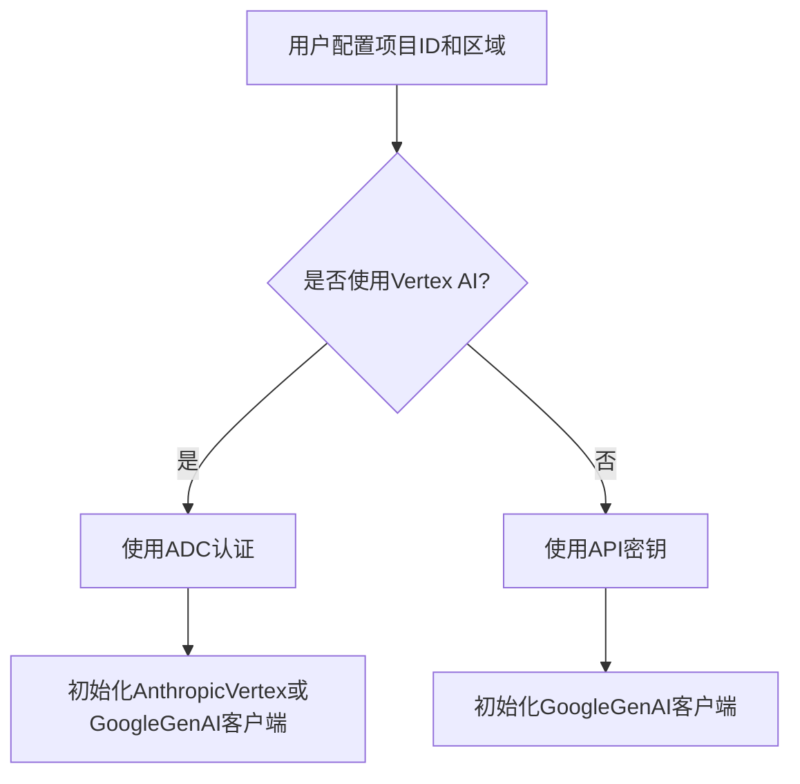
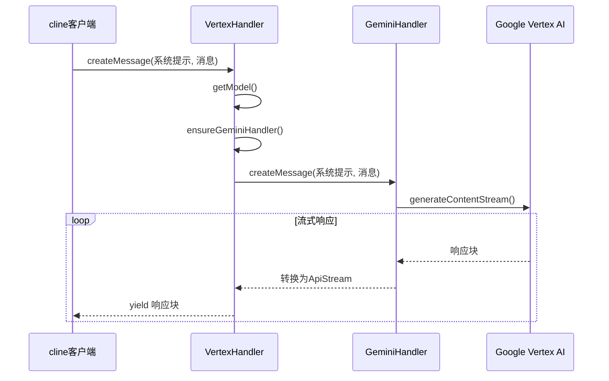

# Vertex AI API

<cite>
**本文档中引用的文件**  
- [vertex.ts](file://src/core/api/providers/vertex.ts#L1-L279)
- [gemini.ts](file://src/core/api/providers/gemini.ts#L46-L471)
- [VertexProvider.tsx](file://webview-ui/src/components/settings/providers/VertexProvider.tsx#L1-L124)
- [api.ts](file://src/shared/api.ts#L592-L902)
</cite>

## 目录
1. [简介](#简介)
2. [认证机制与配置方法](#认证机制与配置方法)
3. [请求与响应结构示例](#请求与响应结构示例)
4. [Vertex AI与标准Gemini API的对比](#vertex-ai与标准gemini-api的对比)
5. [模型部署与管理](#模型部署与管理)
6. [错误处理与计费注意事项](#错误处理与计费注意事项)
7. [完整代码示例](#完整代码示例)
8. [适用场景](#适用场景)

## 简介
Vertex AI是Google Cloud提供的企业级AI平台，支持多种大型语言模型（如PaLM 2、Gemini和Claude系列）。cline通过`src/core/api/providers/vertex.ts`与Vertex AI服务通信，实现安全、高效的AI推理调用。本文档详细说明cline如何集成Vertex AI API，并涵盖认证、配置、请求结构、模型管理、错误处理和计费等关键方面。

## 认证机制与配置方法
cline使用Google Cloud的应用默认凭据（Application Default Credentials, ADC）进行认证。用户需完成以下步骤：

1. 创建Google Cloud账户并启用Vertex AI API。
2. 在Google Cloud控制台中启用所需的模型（如Claude或Gemini）。
3. 安装Google Cloud CLI并运行`gcloud auth application-default login`配置ADC。
4. 在cline的设置界面中配置项目ID和区域。

配置参数包括：
- **Google Cloud Project ID**: 项目的唯一标识符。
- **Google Cloud Region**: 模型所在的地理区域（如`us-east5`、`europe-west1`），或使用`global`端点。



**Diagram sources**
- [vertex.ts](file://src/core/api/providers/vertex.ts#L8-L279)
- [VertexProvider.tsx](file://webview-ui/src/components/settings/providers/VertexProvider.tsx#L1-L124)

**Section sources**
- [vertex.ts](file://src/core/api/providers/vertex.ts#L8-L279)
- [VertexProvider.tsx](file://webview-ui/src/components/settings/providers/VertexProvider.tsx#L1-L124)

## 请求与响应结构示例
### 调用Gemini模型的请求结构
当调用Vertex AI上的Gemini模型时，cline使用`GeminiHandler`类。请求通过`createMessage`方法发起，参数包括系统提示和消息历史。

**请求示例（JSON结构）**
```json
{
  "systemPrompt": "你是一个有帮助的助手。",
  "messages": [
    {
      "role": "user",
      "content": "解释量子计算。"
    }
  ]
}
```

**响应流结构**
响应以流式方式返回，包含以下类型的块：
- `text`: 生成的文本内容。
- `reasoning`: 思考过程（如果启用了思考预算）。
- `usage`: 令牌使用情况，包括输入、输出、缓存读取和写入令牌。



**Diagram sources**
- [vertex.ts](file://src/core/api/providers/vertex.ts#L1-L279)
- [gemini.ts](file://src/core/api/providers/gemini.ts#L46-L471)

**Section sources**
- [vertex.ts](file://src/core/api/providers/vertex.ts#L1-L279)
- [gemini.ts](file://src/core/api/providers/gemini.ts#L46-L471)

## Vertex AI与标准Gemini API的对比
| 特性 | Vertex AI | 标准Gemini API |
|------|---------|--------------|
| **安全性** | 使用ADC，集成IAM和VPC服务控制，适合企业级安全需求 | 使用API密钥，安全性较低 |
| **合规性** | 符合HIPAA、PCI DSS等企业级合规标准 | 基础合规性 |
| **集成** | 深度集成Google Cloud生态系统（如Cloud Logging、Monitoring） | 独立API，集成有限 |
| **缓存** | 支持提示缓存（Prompt Cache），减少重复输入成本 | 支持隐式缓存 |
| **模型支持** | 支持Gemini和Claude系列模型 | 仅支持Gemini模型 |
| **计费** | 详细计费，包含缓存读写成本 | 基于输入输出令牌计费 |

**Section sources**
- [vertex.ts](file://src/core/api/providers/vertex.ts#L1-L279)
- [gemini.ts](file://src/core/api/providers/gemini.ts#L46-L471)
- [api.ts](file://src/shared/api.ts#L592-L902)

## 模型部署与管理
在Vertex AI中，模型由Google Cloud托管，用户无需自行部署。cline通过配置`apiModelId`来选择模型。支持的模型包括：

- **Gemini模型**: `gemini-2.5-pro`, `gemini-2.5-flash`等。
- **Claude模型**: `claude-3-5-sonnet`, `claude-3-opus`等。

模型信息（如上下文窗口、价格）在`src/shared/api.ts`中定义。用户可在cline的UI中通过下拉菜单选择模型。

```mermaid
classDiagram
class VertexHandler {
+options : VertexHandlerOptions
+createMessage(systemPrompt, messages) : ApiStream
+getModel() : {id, info}
}
class GeminiHandler {
+options : GeminiHandlerOptions
+createMessage(systemPrompt, messages) : ApiStream
+getModel() : {id, info}
+calculateCost() : number
}
class ModelInfo {
+maxTokens : number
+contextWindow : number
+inputPrice : number
+outputPrice : number
}
VertexHandler --> GeminiHandler : "使用"
VertexHandler --> ModelInfo : "获取"
GeminiHandler --> ModelInfo : "获取"
```

**Diagram sources**
- [vertex.ts](file://src/core/api/providers/vertex.ts#L1-L279)
- [gemini.ts](file://src/core/api/providers/gemini.ts#L46-L471)
- [api.ts](file://src/shared/api.ts#L592-L902)

**Section sources**
- [vertex.ts](file://src/core/api/providers/vertex.ts#L1-L279)
- [gemini.ts](file://src/core/api/providers/gemini.ts#L46-L471)
- [api.ts](file://src/shared/api.ts#L592-L902)

## 错误处理与计费注意事项
### 错误处理
- **认证错误**: 如果项目ID或区域未设置，会抛出`Vertex AI project ID is required`或`Vertex AI region is required`错误。
- **速率限制**: 当遇到429错误时，`withRetry`装饰器会自动重试。
- **模型不支持**: 如果指定的模型ID无效，将使用默认模型。

### 计费注意事项
- **输入/输出令牌**: 按百万令牌计费，价格因模型而异。
- **缓存成本**: 
  - 缓存写入：每次将提示写入缓存时计费。
  - 缓存读取：每次从缓存读取时计费。
- **思考预算**: 启用思考功能会增加输出令牌成本。

计费计算在`GeminiHandler.calculateCost`方法中实现，考虑了分层定价（tiers）。

**Section sources**
- [vertex.ts](file://src/core/api/providers/vertex.ts#L1-L279)
- [gemini.ts](file://src/core/api/providers/gemini.ts#L46-L471)
- [api.ts](file://src/shared/api.ts#L592-L902)

## 完整代码示例
以下是在cline中配置和使用Vertex AI API的代码示例：

```typescript
const vertexHandler = new VertexHandler({
  vertexProjectId: "your-project-id",
  vertexRegion: "us-east5",
  apiModelId: "gemini-2.5-pro",
  thinkingBudgetTokens: 32767,
  ulid: "unique-task-id"
});

const systemPrompt = "你是一个有帮助的助手。";
const messages = [{ role: "user", content: "解释机器学习。" }];

for await (const chunk of vertexHandler.createMessage(systemPrompt, messages)) {
  switch (chunk.type) {
    case "text":
      console.log(chunk.text);
      break;
    case "reasoning":
      console.log("[思考]", chunk.reasoning);
      break;
    case "usage":
      console.log(`输入令牌: ${chunk.inputTokens}, 输出令牌: ${chunk.outputTokens}`);
      break;
  }
}
```

**Section sources**
- [vertex.ts](file://src/core/api/providers/vertex.ts#L1-L279)

## 适用场景
Vertex AI API适用于需要高级安全和合规性的企业场景，例如：
- **金融行业**: 处理敏感客户数据，需符合PCI DSS。
- **医疗健康**: 处理患者信息，需符合HIPAA。
- **政府机构**: 需要VPC服务控制和审计日志。
- **大型企业**: 利用提示缓存降低运营成本。

通过集成Vertex AI，cline为这些场景提供了安全、可靠且可扩展的AI能力。