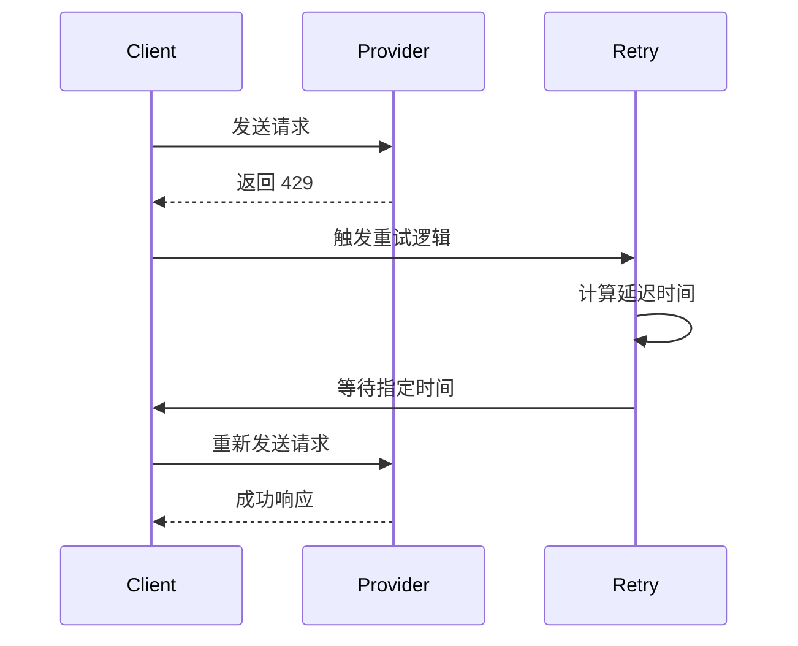

# 外部AI服务API

<cite>
**本文档中引用的文件**  
- [anthropic.ts](file://src/core/api/providers/anthropic.ts)
- [openai.ts](file://src/core/api/providers/openai.ts)
- [gemini.ts](file://src/core/api/providers/gemini.ts)
- [ollama.ts](file://src/core/api/providers/ollama.ts)
- [openai-format.ts](file://src/core/api/transform/openai-format.ts)
- [gemini-format.ts](file://src/core/api/transform/gemini-format.ts)
- [ollama-format.ts](file://src/core/api/transform/ollama-format.ts)
- [mistral-format.ts](file://src/core/api/transform/mistral-format.ts)
</cite>

## 目录
1. [简介](#简介)
2. [认证机制](#认证机制)
3. [请求与响应结构](#请求与响应结构)
4. [消息格式转换逻辑](#消息格式转换逻辑)
5. [各提供商特有功能与限制](#各提供商特有功能与限制)
6. [错误码映射与重试策略](#错误码映射与重试策略)
7. [配置与调用示例](#配置与调用示例)

## 简介
`cline` 是一个支持多种外部AI模型提供商的集成框架，通过 `src/core/api/providers/` 目录下的适配器实现与不同AI服务的通信。该系统支持包括 Anthropic、OpenAI、Google Gemini 和 Ollama 在内的主流AI平台，并通过统一的接口抽象化各提供商的差异。本文档详细说明了这些集成的技术细节，涵盖认证方式、数据格式转换、错误处理机制以及配置方法。

**Section sources**
- [anthropic.ts](file://src/core/api/providers/anthropic.ts#L1-L247)
- [openai.ts](file://src/core/api/providers/openai.ts#L1-L141)
- [gemini.ts](file://src/core/api/providers/gemini.ts#L1-L473)
- [ollama.ts](file://src/core/api/providers/ollama.ts#L1-L123)

## 认证机制
`cline` 为每个AI提供商实现了独立的认证机制，确保安全且灵活地访问外部服务。

- **Anthropic**: 使用 API Key 进行身份验证。若未提供 `apiKey`，则抛出错误 `"Anthropic API key is required"`。
- **OpenAI**: 支持标准 OpenAI 和 Azure OpenAI。使用 `openAiApiKey` 字段进行认证。对于 Azure，还需指定 `azureApiVersion` 或通过 URL 自动识别。
- **Google Gemini**: 支持两种模式：
  - 标准模式：需提供 `geminiApiKey`
  - Vertex AI 模式：使用 `isVertex: true` 并配置 `vertexProjectId` 与 `vertexRegion`
- **Ollama**: 支持可选的 `ollamaApiKey`（用于 Ollama Cloud 或受保护实例），通过 Bearer Token 认证。

所有认证均在首次请求时延迟初始化客户端，避免不必要的连接开销。

**Section sources**
- [anthropic.ts](file://src/core/api/providers/anthropic.ts#L30-L50)
- [openai.ts](file://src/core/api/providers/openai.ts#L35-L55)
- [gemini.ts](file://src/core/api/providers/gemini.ts#L85-L115)
- [ollama.ts](file://src/core/api/providers/ollama.ts#L35-L50)

## 请求与响应结构
`cline` 使用统一的流式响应接口 `ApiStream` 处理来自不同提供商的响应，标准化输出类型。

### 标准请求结构
所有请求均以 `systemPrompt` 和 `messages` 形式传递，其中 `messages` 遵循 Anthropic 的 `MessageParam` 格式。

### 标准响应结构示例
```json
[
  {
    "type": "text",
    "text": "Hello, how can I help you?"
  },
  {
    "type": "reasoning",
    "reasoning": "Thinking step by step..."
  },
  {
    "type": "usage",
    "inputTokens": 128,
    "outputTokens": 64,
    "cacheReadTokens": 32,
    "cacheWriteTokens": 0,
    "totalCost": 0.0012
  }
]
```

各字段含义如下：

| 字段 | 类型 | 描述 |
|------|------|------|
| `type` | string | 响应类型：`text`、`reasoning`、`usage` |
| `text` | string | 文本响应内容 |
| `reasoning` | string | 推理过程文本（如启用） |
| `inputTokens` | number | 输入 token 数量 |
| `outputTokens` | number | 输出 token 数量 |
| `cacheReadTokens` | number | 缓存读取 token 数量 |
| `cacheWriteTokens` | number | 缓存写入 token 数量 |
| `totalCost` | number | 本次调用总费用（美元） |

**Section sources**
- [anthropic.ts](file://src/core/api/providers/anthropic.ts#L100-L200)
- [openai.ts](file://src/core/api/providers/openai.ts#L90-L130)
- [gemini.ts](file://src/core/api/providers/gemini.ts#L250-L400)
- [ollama.ts](file://src/core/api/providers/ollama.ts#L90-L110)

## 消息格式转换逻辑
`cline` 在内部使用 Anthropic 的消息格式作为标准，并通过 `src/core/api/transform/` 中的转换器将其适配到各提供商的特定格式。

### 转换流程
```mermaid
flowchart TD
A[内部消息格式<br/>(Anthropic Messages)] --> B{目标提供商}
B --> C[OpenAI]
B --> D[Google Gemini]
B --> E[Ollama]
B --> F[Mistral]
C --> G[convertToOpenAiMessages]
D --> H[convertAnthropicMessageToGemini]
E --> I[convertToOllamaMessages]
F --> J[convertToMistralMessages]
```

**Diagram sources**
- [openai-format.ts](file://src/core/api/transform/openai-format.ts#L1-L50)
- [gemini-format.ts](file://src/core/api/transform/gemini-format.ts#L1-L30)
- [ollama-format.ts](file://src/core/api/transform/ollama-format.ts#L1-L30)
- [mistral-format.ts](file://src/core/api/transform/mistral-format.ts#L1-L20)

#### OpenAI 转换
- 将 `tool_use` 映射为 `tool_calls`
- 将 `tool_result` 映射为 `role: "tool"`
- 图像内容编码为 `data:image/png;base64,...` 格式

#### Gemini 转换
- `user` → `role: "user"`
- `assistant` → `role: "model"`
- 图像使用 `inlineData` 结构
- 支持自动解码双转义字符（如 `\\n` → `\n`）

#### Ollama 转换
- 工具结果合并为字符串
- 图像通过 `images` 数组单独传递
- 不支持结构化工具调用

**Section sources**
- [openai-format.ts](file://src/core/api/transform/openai-format.ts#L1-L210)
- [gemini-format.ts](file://src/core/api/transform/gemini-format.ts#L1-L84)
- [ollama-format.ts](file://src/core/api/transform/ollama-format.ts#L1-L110)

## 各提供商特有功能与限制
不同AI提供商在功能支持上存在差异，`cline` 对其进行了封装与适配。

| 提供商 | 上下文长度 | 推理模式 | 缓存支持 | 特殊限制 |
|--------|------------|----------|----------|----------|
| **Anthropic** | 最高 1M tokens | 支持 (`thinking`) | 支持 (`cache_control`) | 不兼容 `temperature` 参数 |
| **OpenAI** | 依赖模型 | 支持 (`reasoning_effort`) | 依赖后端 | `o1` 系列不支持 `temperature` |
| **Google Gemini** | 依赖模型 | 支持 (`thinkingConfig`) | 隐式缓存 | 按小时计费缓存存储 |
| **Ollama** | 可配置 | 不支持 | 不支持 | 本地运行，无内置缓存 |

### 特性说明
- **Anthropic**: 支持 `cache_control: { type: "ephemeral" }` 实现请求级缓存断点。
- **Gemini**: 使用 `ulid` 作为稳定缓存键，优化跨轮次缓存复用。
- **Ollama**: 支持自定义 `num_ctx` 上下文窗口大小。
- **OpenAI**: 支持 Azure 与 OpenRouter 等兼容接口。

**Section sources**
- [anthropic.ts](file://src/core/api/providers/anthropic.ts#L120-L180)
- [openai.ts](file://src/core/api/providers/openai.ts#L60-L90)
- [gemini.ts](file://src/core/api/providers/gemini.ts#L150-L200)
- [ollama.ts](file://src/core/api/providers/ollama.ts#L60-L70)

## 错误码映射与重试策略
`cline` 实现了统一的错误处理与重试机制，提升系统稳定性。

### 错误码映射
| 原始错误 | 映射为 | 处理方式 |
|---------|--------|----------|
| 429 (Too Many Requests) | `RetriableError` | 自动重试 |
| Rate limit exceeded | `RetriableError` | 自动重试 |
| Timeout | `Error` | 抛出超时异常 |
| Invalid API Key | `Error` | 终止请求 |

### 重试策略
使用 `@withRetry()` 装饰器实现智能重试：

- **Anthropic**: 默认重试配置
- **OpenAI**: 最多 4 次重试
- **Gemini**: 最多 4 次重试，基础延迟 2s，最大延迟 15s
- **Ollama**: 启用 `retryAllErrors: true`

重试逻辑支持从错误响应中解析 `retry-after` 时间，并动态调整等待间隔。



**Diagram sources**
- [anthropic.ts](file://src/core/api/providers/anthropic.ts#L100-L110)
- [openai.ts](file://src/core/api/providers/openai.ts#L80-L90)
- [gemini.ts](file://src/core/api/providers/gemini.ts#L200-L250)
- [retry.ts](file://src/core/api/retry.ts#L1-L50)

**Section sources**
- [gemini.ts](file://src/core/api/providers/gemini.ts#L350-L450)
- [retry.ts](file://src/core/api/retry.ts#L1-L100)

## 配置与调用示例
以下为各提供商的配置与启用方式。

### Anthropic 配置
```ts
const handler = new AnthropicHandler({
  apiKey: "your-api-key",
  apiModelId: "claude-3-5-sonnet-20241022",
  thinkingBudgetTokens: 8192
});
```

### OpenAI 配置
```ts
const handler = new OpenAiHandler({
  openAiApiKey: "your-api-key",
  openAiBaseUrl: "https://api.openai.com/v1",
  openAiModelId: "gpt-4o",
  reasoningEffort: "medium"
});
```

### Google Gemini 配置
```ts
// 标准模式
const handler = new GeminiHandler({
  geminiApiKey: "your-api-key",
  apiModelId: "gemini-1.5-pro",
  thinkingBudgetTokens: 8192,
  ulid: "task-123"
});

// Vertex AI 模式
const handler = new GeminiHandler({
  isVertex: true,
  vertexProjectId: "my-project",
  vertexRegion: "us-central1",
  apiModelId: "gemini-1.5-pro"
});
```

### Ollama 配置
```ts
const handler = new OllamaHandler({
  ollamaBaseUrl: "http://localhost:11434",
  ollamaModelId: "llama3:70b",
  ollamaApiOptionsCtxNum: "32768"
});
```

### 在 cline 中启用
在设置界面中添加对应提供商的 API 密钥，并选择模型。系统将自动加载适配器并建立连接。

**Section sources**
- [anthropic.ts](file://src/core/api/providers/anthropic.ts#L20-L40)
- [openai.ts](file://src/core/api/providers/openai.ts#L20-L40)
- [gemini.ts](file://src/core/api/providers/gemini.ts#L70-L90)
- [ollama.ts](file://src/core/api/providers/ollama.ts#L20-L30)