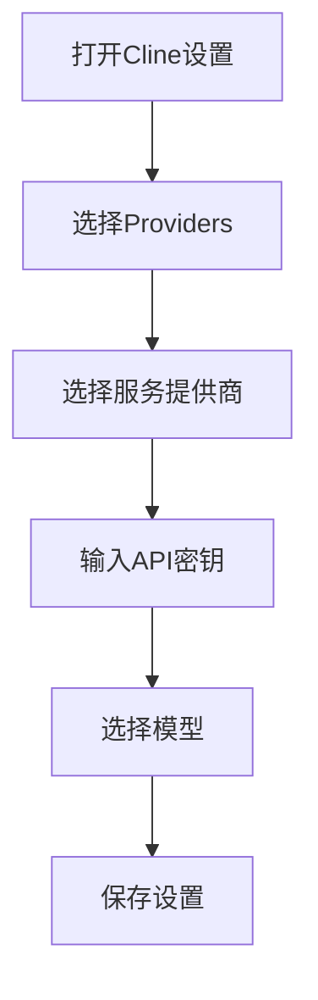
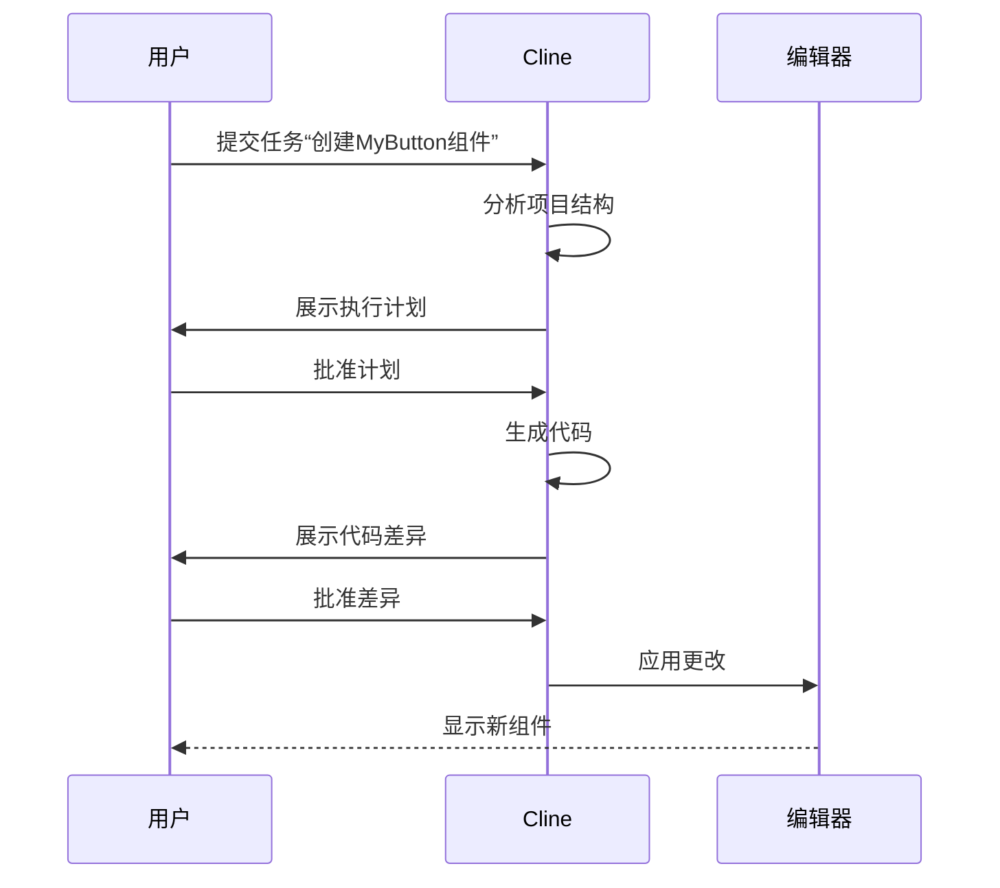

# 快速开始

<cite>
**本文档中引用的文件**  
- [README.md](file://README.md)
- [package.json](file://package.json)
- [walkthrough/step1.md](file://walkthrough/step1.md)
- [walkthrough/step2.md](file://walkthrough/step2.md)
- [walkthrough/step3.md](file://walkthrough/step3.md)
- [webview-ui/src/components/settings/providers/ZAiProvider.tsx](file://webview-ui/src/components/settings/providers/ZAiProvider.tsx)
- [webview-ui/src/components/settings/providers/DeepSeekProvider.tsx](file://webview-ui/src/components/settings/providers/DeepSeekProvider.tsx)
- [webview-ui/src/components/settings/providers/MoonshotProvider.tsx](file://webview-ui/src/components/settings/providers/MoonshotProvider.tsx)
- [webview-ui/src/components/settings/providers/DoubaoProvider.tsx](file://webview-ui/src/components/settings/providers/DoubaoProvider.tsx)
- [webview-ui/src/components/settings/providers/QwenProvider.tsx](file://webview-ui/src/components/settings/providers/QwenProvider.tsx)
</cite>

## 目录
1. [简介](#简介)
2. [安装与初始设置](#安装与初始设置)
3. [配置API密钥和模型](#配置api密钥和模型)
4. [执行示例任务：创建一个简单的React组件](#执行示例任务创建一个简单的react组件)
5. [计划审查与差异审查](#计划审查与差异审查)
6. [常见问题与提示](#常见问题与提示)
7. [总结](#总结)

## 简介

Cline是一款集成于IDE中的自主编码助手，能够通过命令行界面（CLI）和编辑器与开发者协同工作。它支持多种AI模型和API提供商，包括Anthropic、Google Gemini、OpenAI等，并允许用户通过图形界面（GUI）对每个文件更改和终端命令进行审批，确保开发过程的安全性和可控性。

本指南旨在帮助新手用户在15分钟内完成Cline的安装、配置并成功执行第一个任务。

## 安装与初始设置

### 安装Cline扩展

1. 打开Visual Studio Code (VS Code)。
2. 进入扩展市场（Extensions Marketplace），搜索“Cline”。
3. 找到由Cline Bot Inc.发布的Cline扩展，点击“安装”按钮进行安装。
4. 安装完成后，重启VS Code以确保扩展正确加载。

### 启动Cline

1. 重启后，在VS Code的活动栏中找到Cline图标并点击，打开Cline侧边栏。
2. 或者使用快捷键 `Ctrl+Shift+P` 打开命令面板，输入“Cline: Open In New Tab”，将Cline作为新标签页打开。

**Section sources**
- [package.json](file://package.json#L1-L50)

## 配置API密钥和模型

### 添加API密钥

1. 在Cline侧边栏中，点击右上角的“设置”按钮（齿轮图标）。
2. 在设置页面中，选择“Providers”选项卡。
3. 根据您使用的AI服务提供商，选择相应的选项（如Anthropic、OpenAI、Google Gemini等）。
4. 输入您的API密钥。例如：
   - 对于Z AI，选择API入口点（`api.z.ai` 或 `open.bigmodel.cn`），然后输入API密钥。
   - 对于DeepSeek，直接输入API密钥。
   - 对于Moonshot，选择API入口点（`api.moonshot.ai` 或 `api.moonshot.cn`），然后输入API密钥。
   - 对于Doubao，输入API密钥。
   - 对于Qwen，选择API线路（中国或国际），然后输入API密钥。

### 选择模型

1. 在同一设置页面中，选择您希望使用的AI模型。
2. Cline会根据您选择的提供商列出可用的模型列表。
3. 选择一个适合当前任务的模型（例如，Claude Sonnet、GPT-4等）。



**Diagram sources**
- [webview-ui/src/components/settings/providers/ZAiProvider.tsx](file://webview-ui/src/components/settings/providers/ZAiProvider.tsx#L1-L94)
- [webview-ui/src/components/settings/providers/DeepSeekProvider.tsx](file://webview-ui/src/components/settings/providers/DeepSeekProvider.tsx#L1-L57)
- [webview-ui/src/components/settings/providers/MoonshotProvider.tsx](file://webview-ui/src/components/settings/providers/MoonshotProvider.tsx#L1-L79)
- [webview-ui/src/components/settings/providers/DoubaoProvider.tsx](file://webview-ui/src/components/settings/providers/DoubaoProvider.tsx#L1-L57)
- [webview-ui/src/components/settings/providers/QwenProvider.tsx](file://webview-ui/src/components/settings/providers/QwenProvider.tsx#L1-L90)

**Section sources**
- [README.md](file://README.md#L1-L146)

## 执行示例任务：创建一个简单的React组件

### 提出任务

1. 在Cline聊天界面中，输入以下任务描述：
   ```
   请创建一个简单的React组件，名为MyButton，该组件显示一个按钮，点击时弹出“Hello, Cline!”的提示框。
   ```
2. 按回车发送任务请求。

### 计划审查

1. Cline接收到任务后，会首先分析您的项目结构和代码库。
2. 它会生成一个详细的执行计划，并在聊天界面中展示给您。
3. 您需要仔细审查这个计划，确认其符合您的预期。如果计划正确，点击“批准”按钮继续；如果有问题，可以提出修改意见。


**Section sources**
- [walkthrough/step1.md](file://walkthrough/step1.md#L1-L7)

### 代码生成与差异审查

1. 计划被批准后，Cline开始生成代码。
2. 生成完成后，Cline会在聊天界面中展示代码更改的差异（diff）。
3. 您可以在差异视图中查看具体的更改内容，包括新增的文件和修改的代码。
4. 如果更改符合预期，点击“应用更改”按钮；如果有问题，可以直接在差异视图中编辑或拒绝更改。



**Diagram sources**
- [README.md](file://README.md#L1-L146)

**Section sources**
- [walkthrough/step2.md](file://walkthrough/step2.md#L1-L8)

## 计划审查与差异审查

### 计划审查的重要性

计划审查是确保Cline理解任务需求的关键步骤。通过审查计划，您可以确认Cline是否正确理解了任务目标、是否选择了合适的实现路径。

### 差异审查的操作方法

1. 当Cline提交代码更改时，您会在聊天界面看到一个差异视图。
2. 差异视图中，绿色部分表示新增的代码，红色部分表示删除的代码。
3. 您可以逐行审查更改，确保没有意外的修改。
4. 如果一切正常，点击“应用更改”；如果有问题，可以选择“拒绝”或直接在视图中编辑。

## 常见问题与提示

### 如何处理API密钥错误？

- 确保输入的API密钥是正确的，并且具有足够的权限。
- 检查API入口点是否正确（例如，中国用户应选择国内入口点）。

### Cline无法访问某些文件怎么办？

- 确保Cline有权限访问相关文件和目录。
- 使用`@file`或`@folder`指令手动添加需要的文件或文件夹到上下文中。

### 如何提高Cline的响应速度？

- 选择性能更强的AI模型。
- 减少不必要的上下文信息，保持任务描述简洁明了。

## 总结

通过以上步骤，您已经成功安装并配置了Cline扩展，并完成了第一个任务。Cline的强大之处在于其能够结合多种AI模型和服务，通过人机协作的方式高效地完成开发任务。希望本指南能帮助您快速上手Cline，享受智能化开发的乐趣。

**Section sources**
- [README.md](file://README.md#L1-L146)
- [package.json](file://package.json#L1-L50)
- [walkthrough/step1.md](file://walkthrough/step1.md#L1-L7)
- [walkthrough/step2.md](file://walkthrough/step2.md#L1-L8)
- [walkthrough/step3.md](file://walkthrough/step3.md#L1-L8)