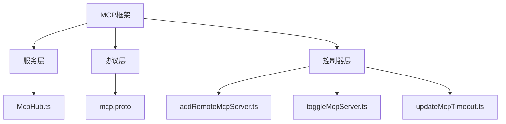
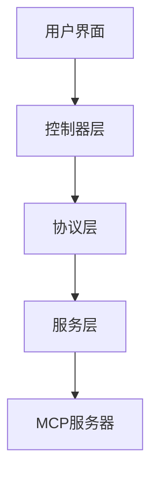
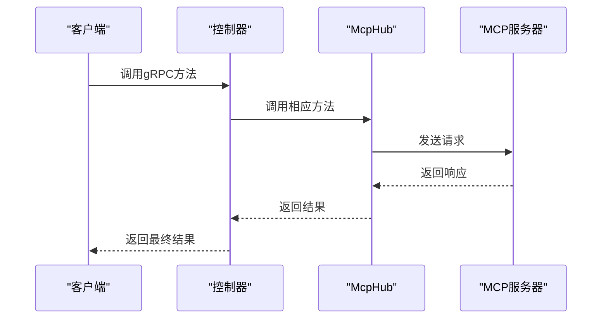
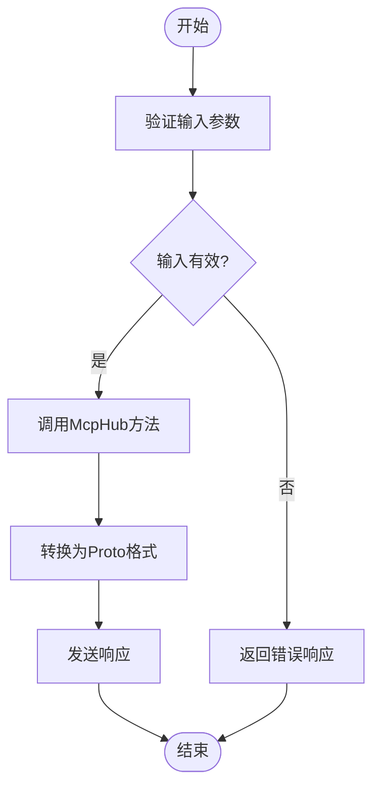

# MCP工具开发

<cite>
**本文档中引用的文件**  
- [mcp.proto](file://proto/cline/mcp.proto)
- [McpHub.ts](file://src/services/mcp/McpHub.ts)
- [addRemoteMcpServer.ts](file://src/core/controller/mcp/addRemoteMcpServer.ts)
- [toggleMcpServer.ts](file://src/core/controller/mcp/toggleMcpServer.ts)
- [updateMcpTimeout.ts](file://src/core/controller/mcp/updateMcpTimeout.ts)
- [types.ts](file://src/services/mcp/types.ts)
- [schemas.ts](file://src/services/mcp/schemas.ts)
- [constants.ts](file://src/services/mcp/constants.ts)
- [mcp.ts](file://src/shared/mcp.ts)
</cite>

## 目录
1. [简介](#简介)
2. [项目结构](#项目结构)
3. [核心组件](#核心组件)
4. [架构概述](#架构概述)
5. [详细组件分析](#详细组件分析)
6. [依赖分析](#依赖分析)
7. [性能考虑](#性能考虑)
8. [故障排除指南](#故障排除指南)
9. [结论](#结论)

## 简介
MCP（模块化能力提供者）框架是一个用于集成和管理外部工具和服务的系统。它允许开发者通过标准化的接口连接到各种MCP服务器，执行工具调用并管理资源。`McpHub`类作为中心枢纽，负责管理所有MCP服务器的发现、连接和通信。该文档详细解释了gRPC服务接口、控制器逻辑以及如何创建和注册MCP服务器。

## 项目结构
MCP框架的代码分布在多个目录中，主要集中在`src/services/mcp`和`proto/cline`下。`McpHub`类位于`src/services/mcp/McpHub.ts`，负责管理MCP服务器的连接和状态。gRPC服务定义在`proto/cline/mcp.proto`中，而控制器逻辑则分布在`src/core/controller/mcp`目录下的各个文件中。



**图示来源**
- [McpHub.ts](file://src/services/mcp/McpHub.ts)
- [mcp.proto](file://proto/cline/mcp.proto)
- [addRemoteMcpServer.ts](file://src/core/controller/mcp/addRemoteMcpServer.ts)

**章节来源**
- [McpHub.ts](file://src/services/mcp/McpHub.ts)
- [mcp.proto](file://proto/cline/mcp.proto)

## 核心组件
MCP框架的核心组件包括`McpHub`类、gRPC服务接口和控制器逻辑。`McpHub`类负责管理所有MCP服务器的连接和状态，而gRPC服务接口定义了与MCP服务器交互的方法。控制器逻辑则处理来自用户界面的请求，并调用相应的服务方法。

**章节来源**
- [McpHub.ts](file://src/services/mcp/McpHub.ts)
- [mcp.proto](file://proto/cline/mcp.proto)

## 架构概述
MCP框架的架构分为三层：服务层、协议层和控制器层。服务层包含`McpHub`类，负责管理MCP服务器的连接和状态。协议层定义了gRPC服务接口，用于与MCP服务器进行通信。控制器层处理来自用户界面的请求，并调用相应的服务方法。



**图示来源**
- [McpHub.ts](file://src/services/mcp/McpHub.ts)
- [mcp.proto](file://proto/cline/mcp.proto)
- [addRemoteMcpServer.ts](file://src/core/controller/mcp/addRemoteMcpServer.ts)

## 详细组件分析

### McpHub类分析
`McpHub`类是MCP框架的核心，负责管理所有MCP服务器的连接和状态。它通过读取和验证MCP设置文件来初始化服务器连接，并监听设置文件的变化以更新连接状态。

#### 类图
```mermaid
classDiagram
class McpHub {
+getMcpServersPath : () => Promise<string>
+getSettingsDirectoryPath : () => Promise<string>
+clientVersion : string
+telemetryService : TelemetryService
+settingsWatcher? : FSWatcher
+fileWatchers : Map<string, FSWatcher>
+connections : McpConnection[]
+isConnecting : boolean
+pendingNotifications : Array<{serverName : string, level : string, message : string, timestamp : number}>
+notificationCallback? : (serverName : string, level : string, message : string) => void
+constructor(getMcpServersPath : () => Promise<string>, getSettingsDirectoryPath : () => Promise<string>, clientVersion : string, telemetryService : TelemetryService)
+getServers() : McpServer[]
+getMcpSettingsFilePath() : Promise<string>
+readAndValidateMcpSettingsFile() : Promise<z.infer<typeof McpSettingsSchema> | undefined>
+watchMcpSettingsFile() : Promise<void>
+initializeMcpServers() : Promise<void>
+findConnection(name : string, source : "rpc" | "internal") : McpConnection | undefined
+connectToServer(name : string, config : z.infer<typeof ServerConfigSchema>, source : "rpc" | "internal") : Promise<void>
+appendErrorMessage(connection : McpConnection, error : string) : void
+fetchToolsList(serverName : string) : Promise<McpTool[]>
+fetchResourcesList(serverName : string) : Promise<McpResource[]>
+fetchResourceTemplatesList(serverName : string) : Promise<McpResourceTemplate[]>
+deleteConnection(name : string) : Promise<void>
+updateServerConnectionsRPC(newServers : Record<string, McpServerConfig>) : Promise<void>
+updateServerConnections(newServers : Record<string, McpServerConfig>) : Promise<void>
+setupFileWatcher(name : string, config : Extract<McpServerConfig, { type : "stdio" }>) : void
+removeAllFileWatchers() : void
+restartConnectionRPC(serverName : string) : Promise<McpServer[]>
+restartConnection(serverName : string) : Promise<void>
+getSortedMcpServers(serverOrder : string[]) : McpServer[]
+notifyWebviewOfServerChanges() : Promise<void>
+sendLatestMcpServers() : Promise<void>
+getLatestMcpServersRPC() : Promise<McpServer[]>
+toggleServerDisabledRPC(serverName : string, disabled : boolean) : Promise<McpServer[]>
+readResource(serverName : string, uri : string) : Promise<McpResourceResponse>
+callTool(serverName : string, toolName : string, toolArguments : Record<string, unknown> | undefined, ulid : string) : Promise<McpToolCallResponse>
+toggleToolAutoApproveRPC(serverName : string, toolNames : string[], shouldAllow : boolean) : Promise<McpServer[]>
+toggleToolAutoApprove(serverName : string, toolNames : string[], shouldAllow : boolean) : Promise<void>
+addRemoteServer(serverName : string, serverUrl : string) : Promise<McpServer[]>
+deleteServerRPC(serverName : string) : Promise<McpServer[]>
+updateServerTimeoutRPC(serverName : string, timeout : number) : Promise<McpServer[]>
+getPendingNotifications() : Array<{serverName : string, level : string, message : string, timestamp : number}>
+setNotificationCallback(callback : (serverName : string, level : string, message : string) => void) : void
+clearNotificationCallback() : void
+dispose() : Promise<void>
}
class McpConnection {
+server : McpServer
+client : Client
+transport : Transport
}
class McpServer {
+name : string
+config : string
+status : "connected" | "connecting" | "disconnected"
+error? : string
+tools? : McpTool[]
+resources? : McpResource[]
+resourceTemplates? : McpResourceTemplate[]
+disabled? : boolean
+timeout? : number
}
class McpTool {
+name : string
+description? : string
+inputSchema? : object
+autoApprove? : boolean
}
class McpResource {
+uri : string
+name : string
+mimeType? : string
+description? : string
}
class McpResourceTemplate {
+uriTemplate : string
+name : string
+description? : string
+mimeType? : string
}
McpHub --> McpConnection : "包含"
McpConnection --> McpServer : "包含"
McpServer --> McpTool : "包含"
McpServer --> McpResource : "包含"
McpServer --> McpResourceTemplate : "包含"
```

**图示来源**
- [McpHub.ts](file://src/services/mcp/McpHub.ts)
- [types.ts](file://src/services/mcp/types.ts)
- [mcp.ts](file://src/shared/mcp.ts)

**章节来源**
- [McpHub.ts](file://src/services/mcp/McpHub.ts)

### gRPC服务接口分析
gRPC服务接口定义在`mcp.proto`文件中，提供了与MCP服务器交互的方法。这些方法包括`ListResources`和`CallTool`，分别用于列出资源和调用工具。

#### 序列图


**图示来源**
- [mcp.proto](file://proto/cline/mcp.proto)
- [McpHub.ts](file://src/services/mcp/McpHub.ts)

**章节来源**
- [mcp.proto](file://proto/cline/mcp.proto)

### 控制器逻辑分析
控制器逻辑分布在`src/core/controller/mcp`目录下的各个文件中，处理来自用户界面的请求，并调用相应的服务方法。例如，`addRemoteMcpServer.ts`文件中的`addRemoteMcpServer`函数用于添加新的远程MCP服务器。

#### 流程图


**图示来源**
- [addRemoteMcpServer.ts](file://src/core/controller/mcp/addRemoteMcpServer.ts)
- [McpHub.ts](file://src/services/mcp/McpHub.ts)

**章节来源**
- [addRemoteMcpServer.ts](file://src/core/controller/mcp/addRemoteMcpServer.ts)

## 依赖分析
MCP框架依赖于多个外部库和内部模块。外部库包括`@modelcontextprotocol/sdk`用于MCP协议的实现，`zod`用于数据验证，`chokidar`用于文件监听。内部模块包括`TelemetryService`用于遥测数据收集，`HostProvider`用于与宿主环境交互。

```mermaid
graph TD
A[MCP框架] --> B[@modelcontextprotocol/sdk]
A --> C[zod]
A --> D[chokidar]
A --> E[TelemetryService]
A --> F[HostProvider]
```

**图示来源**
- [McpHub.ts](file://src/services/mcp/McpHub.ts)
- [schemas.ts](file://src/services/mcp/schemas.ts)

**章节来源**
- [McpHub.ts](file://src/services/mcp/McpHub.ts)
- [schemas.ts](file://src/services/mcp/schemas.ts)

## 性能考虑
在使用MCP框架时，需要注意以下性能考虑：
- **超时配置**：合理设置超时时间，避免长时间等待导致用户体验下降。
- **错误处理**：及时捕获和处理错误，防止错误累积影响系统稳定性。
- **资源管理**：有效管理MCP服务器的连接和资源，避免资源泄露。

## 故障排除指南
在使用MCP框架时，可能会遇到一些常见问题。以下是故障排除指南：
- **连接失败**：检查MCP服务器的URL和配置是否正确。
- **工具调用失败**：确保工具名称和参数正确无误。
- **资源读取失败**：确认资源URI是否有效且可访问。

**章节来源**
- [McpHub.ts](file://src/services/mcp/McpHub.ts)
- [addRemoteMcpServer.ts](file://src/core/controller/mcp/addRemoteMcpServer.ts)

## 结论
MCP框架提供了一个强大的机制来集成和管理外部工具和服务。通过`McpHub`类作为中心枢纽，可以方便地管理MCP服务器的连接和状态。gRPC服务接口和控制器逻辑使得与MCP服务器的交互变得简单而高效。开发者可以根据需要创建和注册自己的MCP服务器，充分利用这一框架的强大功能。