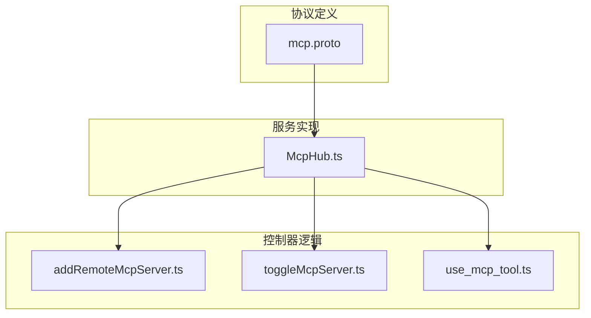
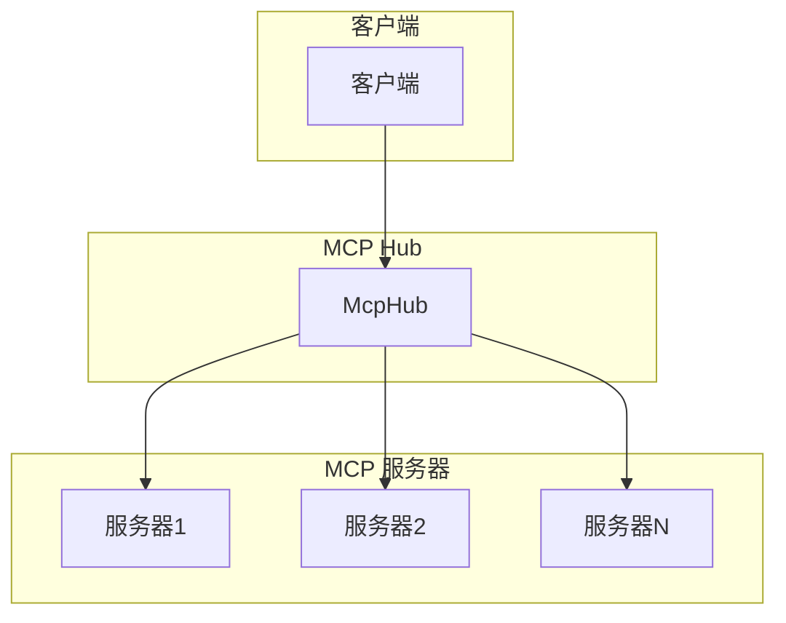
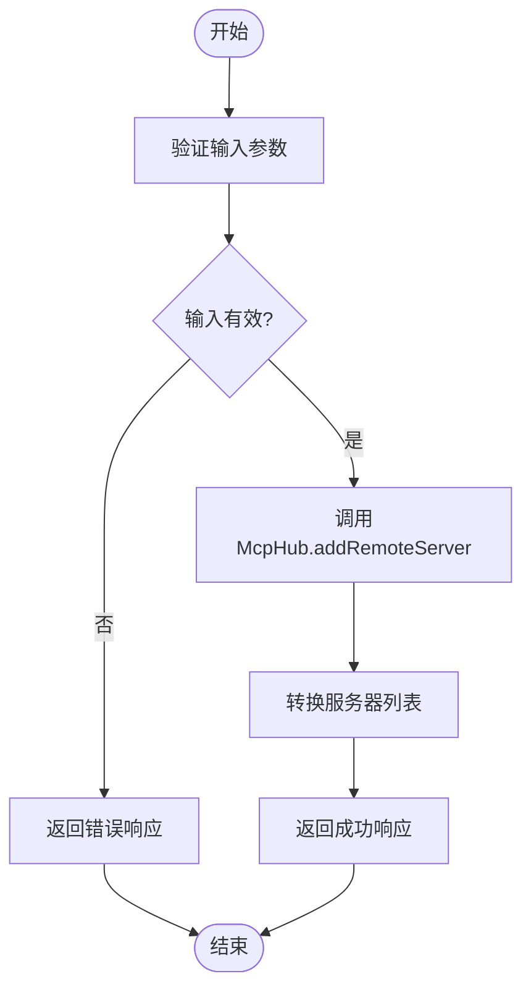
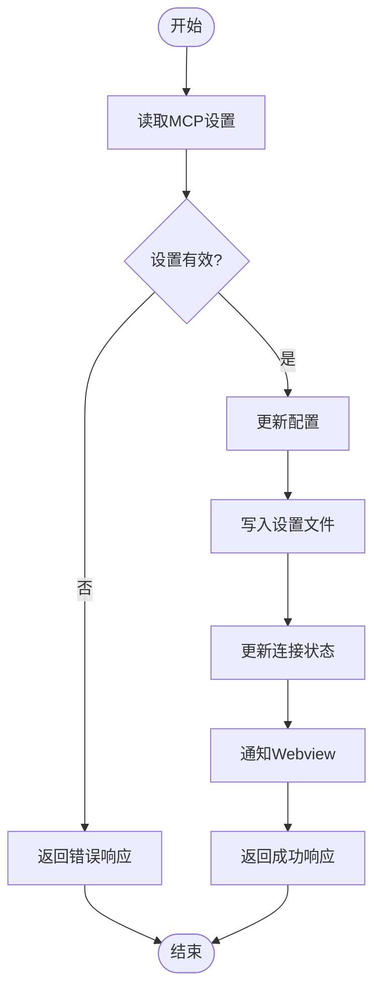
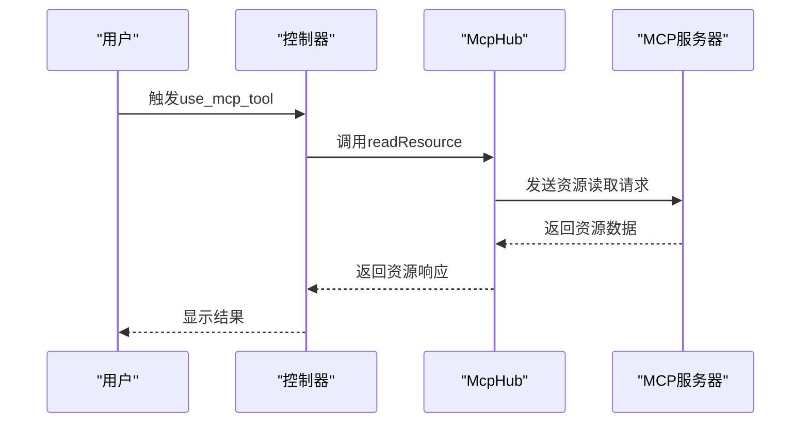
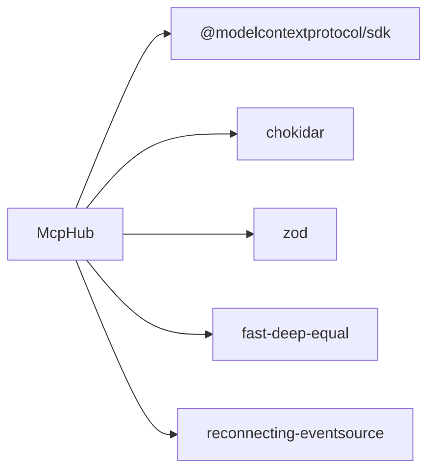

# MCP框架详解

<cite>
**本文档中引用的文件**  
- [mcp.proto](file://proto/cline/mcp.proto)
- [McpHub.ts](file://src/services/mcp/McpHub.ts)
- [addRemoteMcpServer.ts](file://src/core/controller/mcp/addRemoteMcpServer.ts)
- [toggleMcpServer.ts](file://src/core/controller/mcp/toggleMcpServer.ts)
- [use_mcp_tool.ts](file://src/core/prompts/system-prompt/tools/use_mcp_tool.ts)
</cite>

## 目录
1. [引言](#引言)
2. [项目结构](#项目结构)
3. [核心组件](#核心组件)
4. [架构概述](#架构概述)
5. [详细组件分析](#详细组件分析)
6. [依赖分析](#依赖分析)
7. [性能考虑](#性能考虑)
8. [故障排除指南](#故障排除指南)
9. [结论](#结论)

## 引言
本文档深入探讨MCP（Modular Capability Provider）框架的设计与实现，重点分析`McpHub`类作为核心枢纽如何管理MCP服务器的生命周期，包括发现、连接、通信和状态同步。文档详细说明了`proto/host/mcp.proto`中定义的gRPC服务接口，特别是`ListResourcesRequest/Response`和`CallToolRequest/Response`的消息结构、字段类型及语义。此外，还分析了`src/core/controller/mcp`中控制器的实现逻辑，如`addRemoteMcpServer`的配置验证流程、`toggleMcpServer`的状态管理机制以及`use_mcp_tool`的调用链路。最后，解释了`src/services/mcp`中`McpHub`服务如何与核心系统集成，并提供序列图展示从用户触发`use_mcp_tool`到远程服务器响应的完整数据流。

## 项目结构
MCP框架的代码组织清晰，主要分为协议定义、服务实现和控制器逻辑三个部分。协议定义位于`proto/cline/mcp.proto`，服务实现位于`src/services/mcp/McpHub.ts`，而控制器逻辑则分布在`src/core/controller/mcp`目录下。



**图示来源**
- [mcp.proto](file://proto/cline/mcp.proto#L1-L132)
- [McpHub.ts](file://src/services/mcp/McpHub.ts#L1-L799)
- [addRemoteMcpServer.ts](file://src/core/controller/mcp/addRemoteMcpServer.ts#L1-L33)
- [toggleMcpServer.ts](file://src/core/controller/mcp/toggleMcpServer.ts#L1-L24)
- [use_mcp_tool.ts](file://src/core/prompts/system-prompt/tools/use_mcp_tool.ts)

**本节来源**
- [mcp.proto](file://proto/cline/mcp.proto#L1-L132)
- [McpHub.ts](file://src/services/mcp/McpHub.ts#L1-L799)

## 核心组件
MCP框架的核心组件包括`McpHub`类、gRPC服务接口和控制器函数。`McpHub`类负责管理所有MCP服务器的连接和状态，而gRPC服务接口则定义了客户端与服务器之间的通信协议。

**本节来源**
- [McpHub.ts](file://src/services/mcp/McpHub.ts#L1-L799)
- [mcp.proto](file://proto/cline/mcp.proto#L1-L132)

## 架构概述
MCP框架采用分层架构，顶层是gRPC服务接口，中间层是`McpHub`服务，底层是具体的MCP服务器。`McpHub`作为中心枢纽，通过不同的传输方式（如stdio、sse、streamableHttp）与MCP服务器建立连接，并管理其生命周期。



**图示来源**
- [McpHub.ts](file://src/services/mcp/McpHub.ts#L1-L799)
- [mcp.proto](file://proto/cline/mcp.proto#L1-L132)

## 详细组件分析
### McpHub 类分析
`McpHub`类是MCP框架的核心，负责管理所有MCP服务器的连接和状态。它通过读取配置文件来初始化服务器连接，并监听配置文件的变化以动态更新连接。

#### 类图
```mermaid
classDiagram
class McpHub {
+getMcpServersPath : () => Promise<string>
+getSettingsDirectoryPath : () => Promise<string>
+clientVersion : string
+telemetryService : TelemetryService
+settingsWatcher : FSWatcher
+fileWatchers : Map<string, FSWatcher>
+connections : McpConnection[]
+isConnecting : boolean
+pendingNotifications : Array<{serverName : string, level : string, message : string, timestamp : number}>
+notificationCallback : (serverName : string, level : string, message : string) => void
+getServers() : McpServer[]
+getMcpSettingsFilePath() : Promise<string>
+readAndValidateMcpSettingsFile() : Promise<z.infer<typeof McpSettingsSchema> | undefined>
+watchMcpSettingsFile() : Promise<void>
+initializeMcpServers() : Promise<void>
+findConnection(name : string, source : "rpc" | "internal") : McpConnection | undefined
+connectToServer(name : string, config : z.infer<typeof ServerConfigSchema>, source : "rpc" | "internal") : Promise<void>
+appendErrorMessage(connection : McpConnection, error : string)
+fetchToolsList(serverName : string) : Promise<McpTool[]>
+fetchResourcesList(serverName : string) : Promise<McpResource[]>
+fetchResourceTemplatesList(serverName : string) : Promise<McpResourceTemplate[]>
+deleteConnection(name : string) : Promise<void>
+updateServerConnectionsRPC(newServers : Record<string, McpServerConfig>) : Promise<void>
+updateServerConnections(newServers : Record<string, McpServerConfig>) : Promise<void>
+setupFileWatcher(name : string, config : Extract<McpServerConfig, { type : "stdio" }>)
+removeAllFileWatchers()
+restartConnectionRPC(serverName : string) : Promise<McpServer[]>
+restartConnection(serverName : string) : Promise<void>
+getSortedMcpServers(serverOrder : string[]) : McpServer[]
+notifyWebviewOfServerChanges() : Promise<void>
+sendLatestMcpServers()
+getLatestMcpServersRPC() : Promise<McpServer[]>
+toggleServerDisabledRPC(serverName : string, disabled : boolean) : Promise<McpServer[]>
+readResource(serverName : string, uri : string) : Promise<McpResourceResponse>
}
```

**图示来源**
- [McpHub.ts](file://src/services/mcp/McpHub.ts#L1-L799)

#### 配置验证流程
`addRemoteMcpServer`函数负责添加新的远程MCP服务器。它首先验证请求中的必要字段，然后调用`McpHub`的方法来添加服务器。



**图示来源**
- [addRemoteMcpServer.ts](file://src/core/controller/mcp/addRemoteMcpServer.ts#L1-L33)

#### 状态管理机制
`toggleMcpServer`函数用于切换MCP服务器的启用/禁用状态。它通过调用`McpHub`的`toggleServerDisabledRPC`方法来更新服务器状态。



**图示来源**
- [toggleMcpServer.ts](file://src/core/controller/mcp/toggleMcpServer.ts#L1-L24)

#### 调用链路
`use_mcp_tool`函数展示了从用户触发工具调用到远程服务器响应的完整数据流。



**图示来源**
- [use_mcp_tool.ts](file://src/core/prompts/system-prompt/tools/use_mcp_tool.ts)

**本节来源**
- [McpHub.ts](file://src/services/mcp/McpHub.ts#L1-L799)
- [addRemoteMcpServer.ts](file://src/core/controller/mcp/addRemoteMcpServer.ts#L1-L33)
- [toggleMcpServer.ts](file://src/core/controller/mcp/toggleMcpServer.ts#L1-L24)
- [use_mcp_tool.ts](file://src/core/prompts/system-prompt/tools/use_mcp_tool.ts)

## 依赖分析
MCP框架依赖于多个外部库，如`@modelcontextprotocol/sdk`用于MCP协议的实现，`chokidar`用于文件监听，`zod`用于数据验证等。这些依赖关系确保了框架的稳定性和可扩展性。



**图示来源**
- [McpHub.ts](file://src/services/mcp/McpHub.ts#L1-L799)

**本节来源**
- [McpHub.ts](file://src/services/mcp/McpHub.ts#L1-L799)

## 性能考虑
MCP框架在设计时考虑了性能优化，例如通过`DEFAULT_REQUEST_TIMEOUT_MS`常量设置请求超时时间，避免长时间等待。此外，`McpHub`类中的`notifyWebviewOfServerChanges`方法通过排序确保服务器列表的一致性，提高了用户体验。

## 故障排除指南
当MCP服务器连接失败时，可以通过检查日志文件和配置文件来诊断问题。常见的错误包括配置文件格式错误、服务器地址不可达等。`McpHub`类中的错误处理机制会记录详细的错误信息，帮助开发者快速定位问题。

**本节来源**
- [McpHub.ts](file://src/services/mcp/McpHub.ts#L1-L799)

## 结论
MCP框架通过`McpHub`类实现了对MCP服务器的集中管理，提供了灵活的配置选项和强大的错误处理机制。通过详细的gRPC服务接口定义和清晰的控制器逻辑，框架确保了系统的稳定性和可维护性。未来可以通过增加更多的传输方式和支持更多的MCP服务器类型来进一步扩展框架的功能。