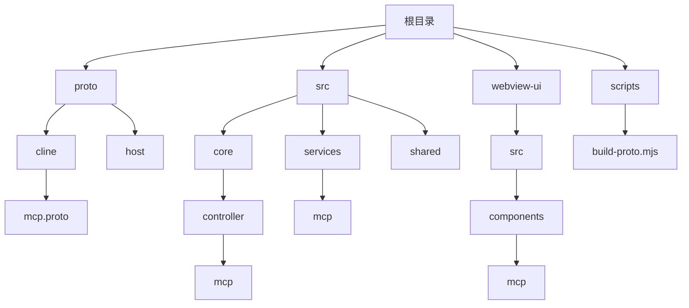
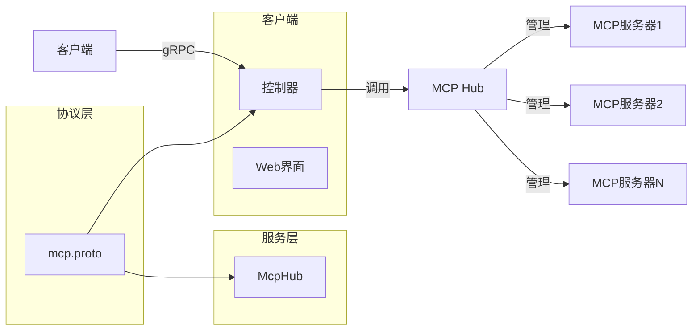
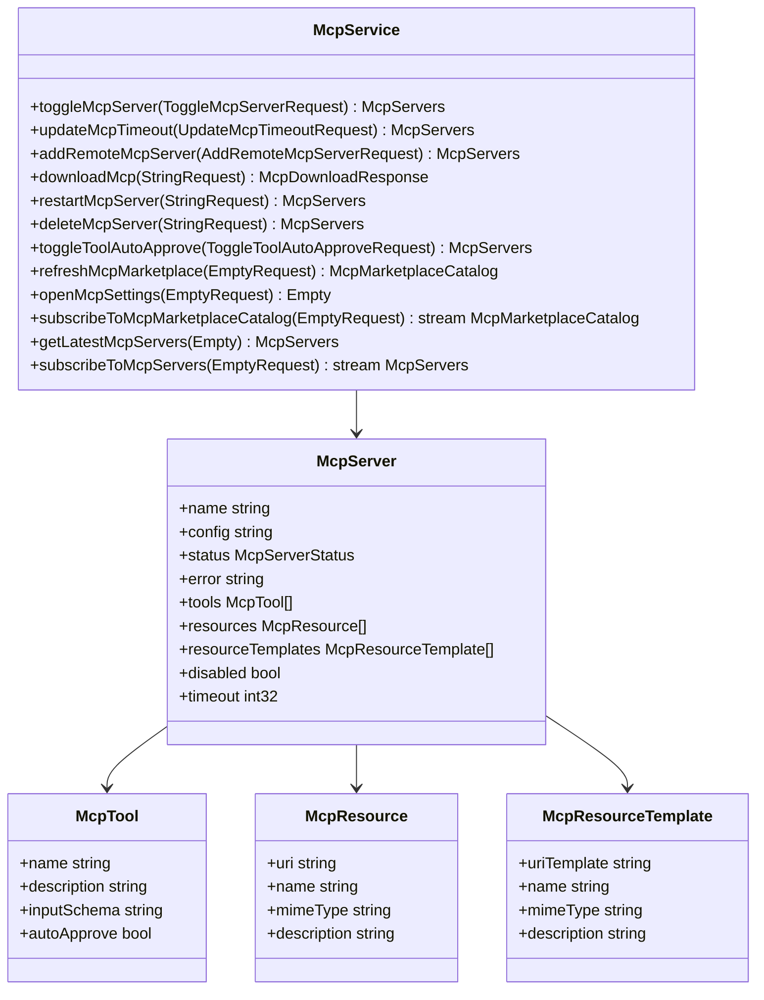
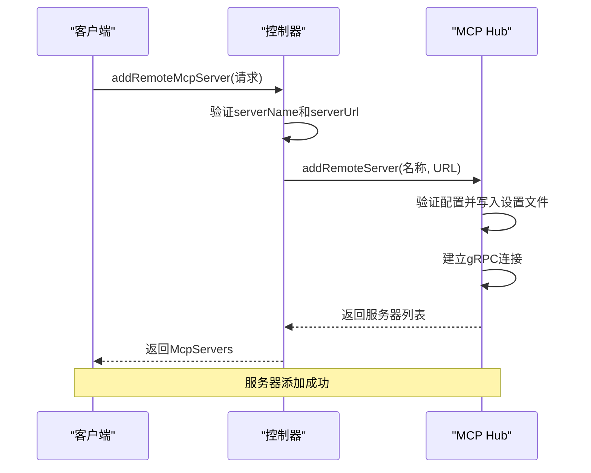
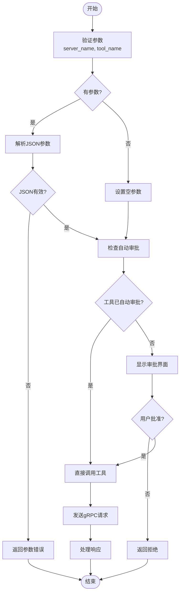
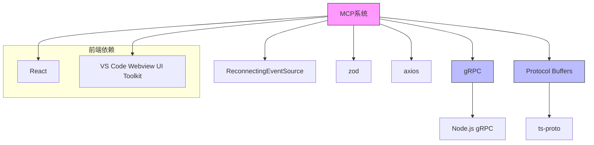

# 创建MCP服务器教程

<cite>
**本文档中引用的文件**  
- [mcp.proto](file://proto/cline/mcp.proto)
- [build-proto.mjs](file://scripts/build-proto.mjs)
- [addRemoteMcpServer.ts](file://src/core/controller/mcp/addRemoteMcpServer.ts)
- [McpHub.ts](file://src/services/mcp/McpHub.ts)
- [loadMcpDocumentation.ts](file://src/core/prompts/loadMcpDocumentation.ts)
- [UseMcpToolHandler.ts](file://src/core/task/tools/handlers/UseMcpToolHandler.ts)
- [AddRemoteServerForm.tsx](file://webview-ui/src/components/mcp/configuration/tabs/add-server/AddRemoteServerForm.tsx)
</cite>

## 目录
1. [简介](#简介)
2. [项目结构](#项目结构)
3. [核心组件](#核心组件)
4. [架构概述](#架构概述)
5. [详细组件分析](#详细组件分析)
6. [依赖分析](#依赖分析)
7. [性能考虑](#性能考虑)
8. [故障排除指南](#故障排除指南)
9. [结论](#结论)

## 简介
本教程旨在指导开发者从零开始创建一个MCP（Model Context Protocol）服务器。我们将详细介绍如何定义服务接口、生成服务器端代码、实现gRPC服务逻辑、在客户端添加服务器以及调用工具的完整流程。通过一个查询天气的完整示例，您将掌握MCP服务器开发的核心技能，并了解常见的调试技巧和问题解决方案。

## 项目结构
本项目采用模块化结构，主要包含协议定义、核心服务、控制器、Web界面等组件。协议文件位于`proto`目录下，核心逻辑实现在`src`目录中，Web界面使用React构建在`webview-ui`目录下。

**Diagram sources**
- [mcp.proto](file://proto/cline/mcp.proto)
- [build-proto.mjs](file://scripts/build-proto.mjs)

**Section sources**
- [mcp.proto](file://proto/cline/mcp.proto)
- [build-proto.mjs](file://scripts/build-proto.mjs)

## 核心组件
MCP服务器的核心组件包括协议定义、服务接口、控制器和客户端集成。`mcp.proto`文件定义了服务接口和数据结构，`McpHub`类负责管理服务器连接和状态，`addRemoteMcpServer`控制器处理添加新服务器的请求。

**Section sources**
- [mcp.proto](file://proto/cline/mcp.proto)
- [McpHub.ts](file://src/services/mcp/McpHub.ts)
- [addRemoteMcpServer.ts](file://src/core/controller/mcp/addRemoteMcpServer.ts)

## 架构概述
MCP系统采用gRPC作为通信协议，通过Protocol Buffers定义接口。客户端通过控制器与MCP Hub交互，Hub负责管理多个MCP服务器的连接和状态。整个系统遵循微服务架构，各组件通过明确定义的接口进行通信。

**Diagram sources**
- [mcp.proto](file://proto/cline/mcp.proto)
- [McpHub.ts](file://src/services/mcp/McpHub.ts)
- [addRemoteMcpServer.ts](file://src/core/controller/mcp/addRemoteMcpServer.ts)

## 详细组件分析

### MCP协议定义分析
MCP协议通过Protocol Buffers定义了服务接口和数据结构。`mcp.proto`文件中定义了`McpService`服务，包含添加、删除、重启服务器等RPC方法，以及`McpServer`、`McpTool`等消息类型。

**Diagram sources**
- [mcp.proto](file://proto/cline/mcp.proto)

**Section sources**
- [mcp.proto](file://proto/cline/mcp.proto)

### 服务器添加流程分析
添加远程MCP服务器的流程涉及客户端、控制器和MCP Hub三个主要组件。客户端通过Web界面提交服务器信息，控制器验证请求并调用MCP Hub的方法，Hub将服务器配置保存到文件并建立连接。

**Diagram sources**
- [addRemoteMcpServer.ts](file://src/core/controller/mcp/addRemoteMcpServer.ts)
- [McpHub.ts](file://src/services/mcp/McpHub.ts)

**Section sources**
- [addRemoteMcpServer.ts](file://src/core/controller/mcp/addRemoteMcpServer.ts)
- [McpHub.ts](file://src/services/mcp/McpHub.ts)

### 工具调用流程分析
工具调用流程展示了客户端如何通过`use_mcp_tool`指令调用MCP服务器上的工具。该流程包括参数验证、自动审批检查、用户审批（如需要）和实际工具调用。

**Diagram sources**
- [UseMcpToolHandler.ts](file://src/core/task/tools/handlers/UseMcpToolHandler.ts)

**Section sources**
- [UseMcpToolHandler.ts](file://src/core/task/tools/handlers/UseMcpToolHandler.ts)

## 依赖分析
MCP系统的依赖关系清晰，主要依赖gRPC框架进行通信，使用Protocol Buffers进行数据序列化。前端依赖React和VS Code Webview UI Toolkit构建用户界面。

**Diagram sources**
- [package.json](file://package.json)
- [build-proto.mjs](file://scripts/build-proto.mjs)

**Section sources**
- [package.json](file://package.json)
- [build-proto.mjs](file://scripts/build-proto.mjs)

## 性能考虑
MCP系统在性能方面考虑了连接管理、超时处理和错误恢复。系统使用`ReconnectingEventSource`确保连接的稳定性，设置了默认的请求超时时间，并实现了错误重试机制。

## 故障排除指南
常见问题及解决方案：

1. **连接失败**：检查服务器URL是否正确，确保服务器正在运行，验证网络连接。
2. **超时**：增加超时设置，检查服务器响应时间，优化网络环境。
3. **参数错误**：验证JSON参数格式，确保所有必需字段都已提供。
4. **自动审批失败**：检查工具的`autoApprove`设置，确保在MCP Hub中正确配置。

**Section sources**
- [McpHub.ts](file://src/services/mcp/McpHub.ts)
- [UseMcpToolHandler.ts](file://src/core/task/tools/handlers/UseMcpToolHandler.ts)

## 结论
通过本教程，您已经学习了如何从零开始创建一个MCP服务器，包括协议定义、代码生成、服务实现和客户端集成。我们通过一个完整的天气查询示例演示了整个开发流程，并提供了实用的调试技巧。MCP框架为扩展系统功能提供了强大的基础，开发者可以基于此创建各种有用的工具和服务。