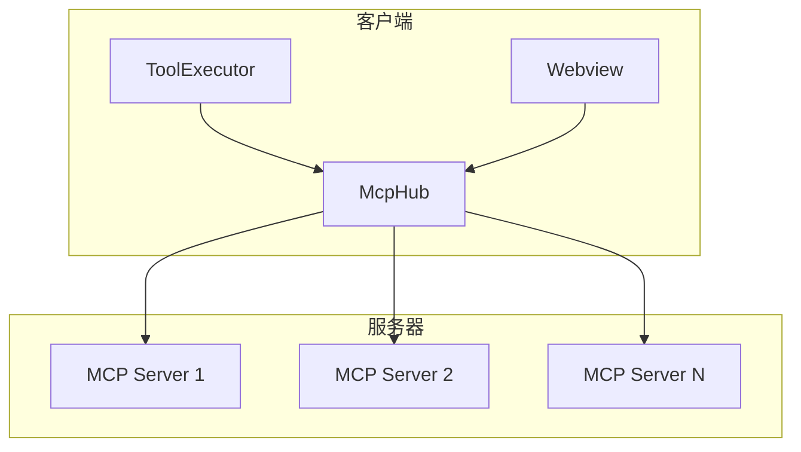
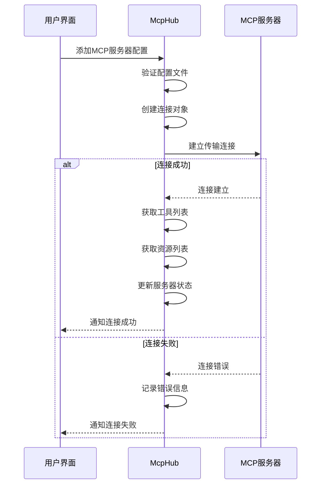
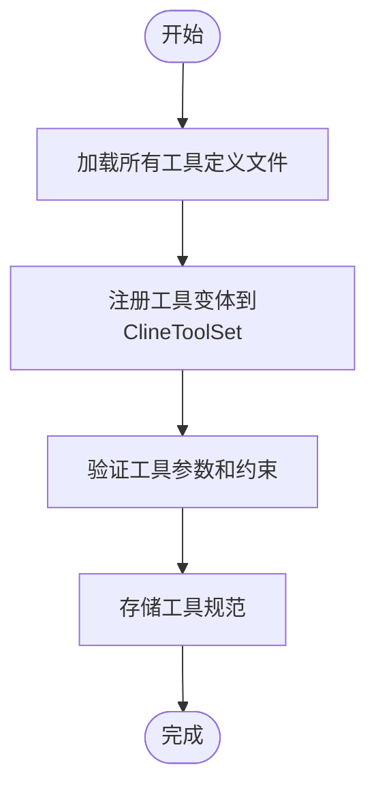
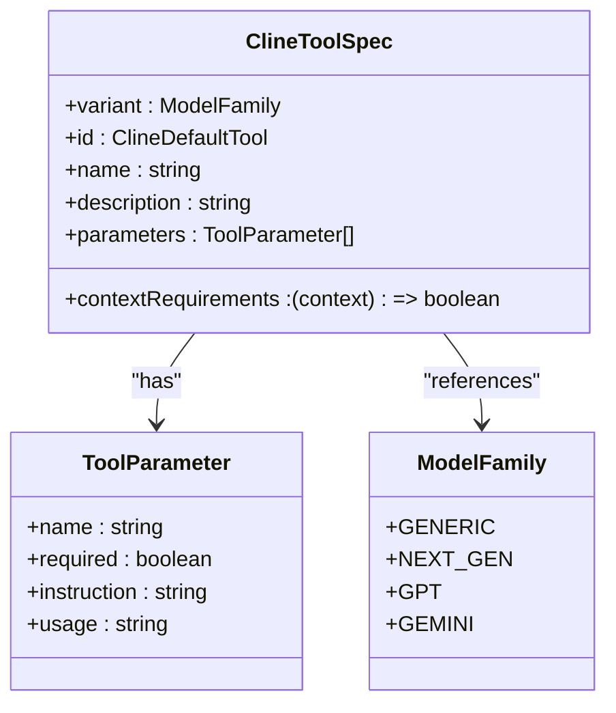
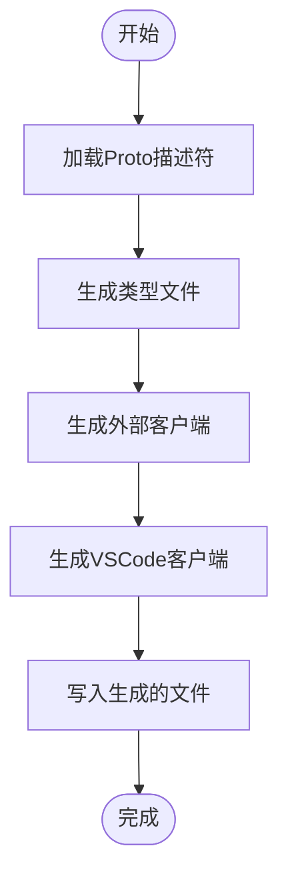
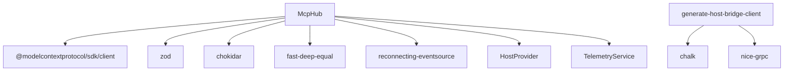

# 扩展与集成

<cite>
**本文档中引用的文件**  
- [McpHub.ts](file://src/services/mcp/McpHub.ts)
- [use_mcp_tool.ts](file://src/core/prompts/system-prompt/tools/use_mcp_tool.ts)
- [init.ts](file://src/core/prompts/system-prompt/tools/init.ts)
- [index.ts](file://src/core/prompts/system-prompt/tools/index.ts)
- [generate-host-bridge-client.mjs](file://scripts/generate-host-bridge-client.mjs)
- [constants.ts](file://src/services/mcp/constants.ts)
- [schemas.ts](file://src/services/mcp/schemas.ts)
- [types.ts](file://src/services/mcp/types.ts)
</cite>

## 目录
1. [简介](#简介)
2. [项目结构](#项目结构)
3. [核心组件](#核心组件)
4. [架构概述](#架构概述)
5. [详细组件分析](#详细组件分析)
6. [依赖分析](#依赖分析)
7. [性能考虑](#性能考虑)
8. [故障排除指南](#故障排除指南)
9. [结论](#结论)

## 简介
本文档旨在为开发者提供关于如何扩展cline功能的全面指导，重点介绍MCP（模块化能力提供者）框架。文档将详细说明如何开发、注册和使用自定义工具，解释`McpHub`如何管理和发现MCP服务器，并提供从零开始创建MCP工具的完整教程。此外，文档还将涵盖如何通过`prompts/tools`添加新的系统级工具指令，以及`hostbridge`的生成机制，帮助开发者为新的IDE或环境添加支持。

## 项目结构
cline项目采用模块化设计，主要分为以下几个核心目录：
- `src/core`：包含核心功能逻辑，如API提供者、上下文管理、控制器等。
- `src/services`：实现各种服务，包括账户、认证、浏览器、MCP等。
- `src/prompts/system-prompt/tools`：存放系统提示工具的定义文件。
- `scripts`：包含各种脚本工具，如生成host-bridge客户端的脚本。
- `proto`：存放协议缓冲区定义文件。

**Section sources**
- [McpHub.ts](file://src/services/mcp/McpHub.ts)
- [use_mcp_tool.ts](file://src/core/prompts/system-prompt/tools/use_mcp_tool.ts)
- [generate-host-bridge-client.mjs](file://scripts/generate-host-bridge-client.mjs)

## 核心组件
本节将深入分析MCP框架的核心组件，包括`McpHub`、工具注册机制和host-bridge生成器。

**Section sources**
- [McpHub.ts](file://src/services/mcp/McpHub.ts)
- [init.ts](file://src/core/prompts/system-prompt/tools/init.ts)
- [generate-host-bridge-client.mjs](file://scripts/generate-host-bridge-client.mjs)

## 架构概述
MCP框架采用客户端-服务器架构，通过标准化的协议实现工具的动态加载和管理。`McpHub`作为中心枢纽，负责管理所有MCP服务器的连接和状态。



**Diagram sources**
- [McpHub.ts](file://src/services/mcp/McpHub.ts)

## 详细组件分析

### McpHub分析
`McpHub`是MCP框架的核心组件，负责管理所有MCP服务器的连接、状态和通信。

#### 类图
```mermaid
classDiagram
class McpHub {
+getMcpServersPath : () => Promise<string>
+getSettingsDirectoryPath : () => Promise<string>
+clientVersion : string
+telemetryService : TelemetryService
+connections : McpConnection[]
+isConnecting : boolean
+pendingNotifications : Array
+notificationCallback : (serverName, level, message) => void
+getServers() : McpServer[]
+getMcpSettingsFilePath() : Promise<string>
+readAndValidateMcpSettingsFile() : Promise<z.infer<typeof McpSettingsSchema> | undefined>
+watchMcpSettingsFile() : Promise<void>
+initializeMcpServers() : Promise<void>
+findConnection(name : string, source : "rpc" | "internal") : McpConnection | undefined
+connectToServer(name : string, config : z.infer<typeof ServerConfigSchema>, source : "rpc" | "internal") : Promise<void>
+fetchToolsList(serverName : string) : Promise<McpTool[]>
+fetchResourcesList(serverName : string) : Promise<McpResource[]>
+fetchResourceTemplatesList(serverName : string) : Promise<McpResourceTemplate[]>
+deleteConnection(name : string) : Promise<void>
+updateServerConnectionsRPC(newServers : Record<string, McpServerConfig>) : Promise<void>
+updateServerConnections(newServers : Record<string, McpServerConfig>) : Promise<void>
+setupFileWatcher(name : string, config : Extract<McpServerConfig, { type : "stdio" }>)
+removeAllFileWatchers()
+restartConnectionRPC(serverName : string) : Promise<McpServer[]>
+restartConnection(serverName : string) : Promise<void>
+getSortedMcpServers(serverOrder : string[]) : McpServer[]
+notifyWebviewOfServerChanges() : Promise<void>
+sendLatestMcpServers()
+getLatestMcpServersRPC() : Promise<McpServer[]>
+toggleServerDisabledRPC(serverName : string, disabled : boolean) : Promise<McpServer[]>
+readResource(serverName : string, uri : string) : Promise<McpResourceResponse>
}
class McpConnection {
+server : McpServer
+client : Client
+transport : Transport
}
class McpServer {
+name : string
+config : string
+status : string
+disabled : boolean
+tools : McpTool[]
+resources : McpResource[]
+resourceTemplates : McpResourceTemplate[]
+error : string
}
class McpTool {
+name : string
+description : string
+inputSchema : any
+autoApprove : boolean
}
class McpResource {
+uri : string
+name : string
+description : string
}
class McpResourceTemplate {
+templateUri : string
+name : string
+description : string
}
McpHub --> McpConnection : "has"
McpConnection --> McpServer : "has"
McpServer --> McpTool : "has"
McpServer --> McpResource : "has"
McpServer --> McpResourceTemplate : "has"
```

**Diagram sources**
- [McpHub.ts](file://src/services/mcp/McpHub.ts#L0-L799)

#### 连接流程


**Diagram sources**
- [McpHub.ts](file://src/services/mcp/McpHub.ts#L0-L799)

**Section sources**
- [McpHub.ts](file://src/services/mcp/McpHub.ts#L0-L799)

### 工具系统分析
MCP框架的工具系统允许开发者定义和使用各种功能工具。

#### 工具注册流程


**Diagram sources**
- [init.ts](file://src/core/prompts/system-prompt/tools/init.ts#L0-L52)

#### use_mcp_tool工具分析
`use_mcp_tool`是用于调用MCP服务器上工具的核心指令。



**Diagram sources**
- [use_mcp_tool.ts](file://src/core/prompts/system-prompt/tools/use_mcp_tool.ts#L0-L73)

**Section sources**
- [use_mcp_tool.ts](file://src/core/prompts/system-prompt/tools/use_mcp_tool.ts#L0-L73)
- [init.ts](file://src/core/prompts/system-prompt/tools/init.ts#L0-L52)

### hostbridge生成机制分析
`generate-host-bridge-client.mjs`脚本负责生成host-bridge客户端代码，支持不同IDE环境的集成。

#### 生成流程


**Diagram sources**
- [generate-host-bridge-client.mjs](file://scripts/generate-host-bridge-client.mjs#L0-L243)

#### 类图
```mermaid
classDiagram
class HostBridgeGenerator {
+main() : Promise<void>
+generateTypesFile(hostServices) : Promise<void>
+generateExternalClientFile(hostServices) : Promise<void>
+generateVscodeClientFile(hostServices) : Promise<void>
+generateClientInterfaceType(serviceName, serviceDefinition) : string
+generateExternalClientSetup(serviceName, serviceDefinition) : string
+generateVscodeClientImplementation(serviceName, serviceDefinition) : string
}
class ServiceDefinition {
+service : Record<string, MethodDefinition>
}
class MethodDefinition {
+requestType : TypeDefinition
+responseType : TypeDefinition
+responseStream : boolean
}
class TypeDefinition {
+type : {name : string}
}
HostBridgeGenerator --> ServiceDefinition : "uses"
ServiceDefinition --> MethodDefinition : "has"
MethodDefinition --> TypeDefinition : "references"
```

**Diagram sources**
- [generate-host-bridge-client.mjs](file://scripts/generate-host-bridge-client.mjs#L0-L243)

**Section sources**
- [generate-host-bridge-client.mjs](file://scripts/generate-host-bridge-client.mjs#L0-L243)

## 依赖分析
MCP框架依赖于多个关键组件和外部库。



**Diagram sources**
- [McpHub.ts](file://src/services/mcp/McpHub.ts#L0-L799)
- [generate-host-bridge-client.mjs](file://scripts/generate-host-bridge-client.mjs#L0-L243)

**Section sources**
- [McpHub.ts](file://src/services/mcp/McpHub.ts#L0-L799)
- [generate-host-bridge-client.mjs](file://scripts/generate-host-bridge-client.mjs#L0-L243)

## 性能考虑
在扩展cline功能时，需要考虑以下性能因素：
- MCP服务器连接的延迟和超时设置
- 工具调用的响应时间和资源消耗
- 频繁的文件系统监控对性能的影响
- 大量工具注册对内存的占用

## 故障排除指南
当遇到MCP框架相关问题时，可以参考以下排查步骤：
1. 检查MCP服务器配置文件是否正确
2. 验证MCP服务器是否正常运行
3. 查看连接日志中的错误信息
4. 确认工具参数是否符合输入模式
5. 检查网络连接和防火墙设置

**Section sources**
- [McpHub.ts](file://src/services/mcp/McpHub.ts#L0-L799)

## 结论
本文档详细介绍了如何扩展cline功能，重点讲解了MCP框架的工作原理和使用方法。通过理解`McpHub`的管理机制、工具系统的注册流程以及`hostbridge`的生成机制，开发者可以有效地为cline添加新的功能和集成支持。建议在开发过程中遵循文档中的最佳实践，确保扩展功能的稳定性和性能。