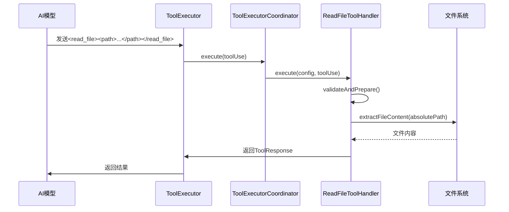

# 自定义系统工具

<cite>
**本文档中引用的文件**  
- [tools.ts](file://src/core/prompts/system-prompt/components/tool_use/tools.ts)
- [formatting.ts](file://src/core/prompts/system-prompt/components/tool_use/formatting.ts)
- [guidelines.ts](file://src/core/prompts/system-prompt/components/tool_use/guidelines.ts)
- [ToolExecutor.ts](file://src/core/task/ToolExecutor.ts)
- [ReadFileToolHandler.ts](file://src/core/task/tools/handlers/ReadFileToolHandler.ts)
- [WriteToFileToolHandler.ts](file://src/core/task/tools/handlers/WriteToFileToolHandler.ts)
- [ToolExecutorCoordinator.ts](file://src/core/task/tools/ToolExecutorCoordinator.ts)
</cite>

## 目录
1. [简介](#简介)
2. [工具定义机制](#工具定义机制)
3. [工具提示格式化与指南](#工具提示格式化与指南)
4. [工具执行流程](#工具执行流程)
5. [添加新系统工具的实例](#添加新系统工具的实例)
6. [变体系统](#变体系统)

## 简介
`cline` 是一个系统级工具，支持通过插件化机制扩展其功能。本指南详细说明如何在 `src/core/prompts/system-prompt/components/tool_use` 目录下定义和注册新的系统工具，确保其提示符合 AI 模型的解析要求，并通过 `ToolExecutor` 和 `ToolHandler` 实现具体功能。

**Section sources**
- [tools.ts](file://src/core/prompts/system-prompt/components/tool_use/tools.ts)
- [ToolExecutor.ts](file://src/core/task/ToolExecutor.ts)

## 工具定义机制
系统工具的定义位于 `src/core/prompts/system-prompt/components/tool_use/tools.ts` 文件中。该文件通过 `getToolUseToolsSection` 函数生成工具描述部分的提示内容。此函数接收 `PromptVariant` 和 `SystemPromptContext` 参数，并根据上下文动态生成可用工具列表。

工具模板由 `PromptBuilder.getToolsPrompts` 方法获取，该方法根据模型家族（model family）返回对应的工具提示模板。此外，当 `focusChainSettings.enabled` 为真时，会包含与任务进度相关的占位符（如 `TASK_PROGRESS`、`FOCUS_CHAIN_ATTEMPT` 等），以支持任务链功能。

工具的注册是通过 `ToolExecutor` 类中的 `registerToolHandlers` 方法完成的。该方法创建一个 `ToolExecutorCoordinator` 实例，并将所有 `ToolHandler` 注册到协调器中。每个处理器实现 `IToolHandler` 接口，包含 `name`、`execute` 和 `getDescription` 方法。

**Section sources**
- [tools.ts](file://src/core/prompts/system-prompt/components/tool_use/tools.ts)
- [ToolExecutor.ts](file://src/core/task/ToolExecutor.ts#L150-L200)

## 工具提示格式化与指南
为了确保 AI 模型能够正确解析工具调用，`cline` 提供了标准化的格式化规则和使用指南。

### 格式化规则
`formatting.ts` 文件定义了工具调用的 XML 风格格式：
```text
<tool_name>
<parameter1_name>value1</parameter1_name>
<parameter2_name>value2</parameter2_name>
</tool_name>
```
例如：
```text
<read_file>
<path>src/main.js</path>
</read_file>
```
该格式通过 `getToolUseFormattingSection` 函数注入到系统提示中，并根据 `focusChainSettings.enabled` 决定是否包含 `<task_progress>` 标签。

### 使用指南
`guidelines.ts` 文件提供了详细的工具使用规范，包括：
1. 在 `<thinking>` 标签内评估已有信息和所需信息。
2. 选择最合适的工具并思考其有效性。
3. 每次仅使用一个工具，逐步推进任务。
4. 使用指定的 XML 格式进行工具调用。
5. 始终等待用户确认结果后再继续下一步操作。

这些指南强调了迭代式、反馈驱动的工作流，确保每一步都基于前一步的实际结果。

**Section sources**
- [formatting.ts](file://src/core/prompts/system-prompt/components/tool_use/formatting.ts)
- [guidelines.ts](file://src/core/prompts/system-prompt/components/tool_use/guidelines.ts)

## 工具执行流程
工具执行由 `ToolExecutor` 类驱动，其核心是 `executeTool` 方法。该方法接收 `ToolUse` 对象并调用 `ToolExecutorCoordinator` 来路由到相应的处理器。

### 执行协调器
`ToolExecutorCoordinator` 是一个注册中心，维护所有已注册的 `IToolHandler` 实例。它提供 `register`、`has`、`getHandler` 和 `execute` 方法。当收到工具调用请求时，协调器查找对应的处理器并执行其 `execute` 方法。

### 处理器实现
每个工具处理器（如 `ReadFileToolHandler` 或 `WriteToFileToolHandler`）实现 `IFullyManagedTool` 接口，该接口继承自 `IToolHandler` 和 `IPartialBlockHandler`，支持完整和部分块处理。

以 `ReadFileToolHandler` 为例：
- `handlePartialBlock`：处理流式 UI 更新，在自动批准模式下直接发送工具消息，否则请求用户批准。
- `execute`：执行实际的文件读取操作，包括参数验证、`.clineignore` 检查、路径解析、内容提取和上下文跟踪。

工具执行过程中还会处理自动批准逻辑、通知显示和遥测数据收集。



**Diagram sources**
- [ToolExecutor.ts](file://src/core/task/ToolExecutor.ts)
- [ReadFileToolHandler.ts](file://src/core/task/tools/handlers/ReadFileToolHandler.ts)
- [ToolExecutorCoordinator.ts](file://src/core/task/tools/ToolExecutorCoordinator.ts)

**Section sources**
- [ToolExecutor.ts](file://src/core/task/ToolExecutor.ts)
- [ReadFileToolHandler.ts](file://src/core/task/tools/handlers/ReadFileToolHandler.ts)
- [ToolExecutorCoordinator.ts](file://src/core/task/tools/ToolExecutorCoordinator.ts)

## 添加新系统工具的实例
以下步骤展示如何添加一个新的系统工具——代码分析工具。

### 1. 定义工具函数
在 `src/shared/tools.ts` 中添加新的工具名称枚举值：
```ts
export enum ClineDefaultTool {
  // ... existing tools
  ANALYZE_CODE,
}
```

### 2. 创建处理器
创建 `src/core/task/tools/handlers/AnalyzeCodeToolHandler.ts`：
```ts
import { IToolHandler } from "../ToolExecutorCoordinator"
import { TaskConfig } from "../types/TaskConfig"
import { ToolResponse } from "../../index"

export class AnalyzeCodeToolHandler implements IToolHandler {
  readonly name = ClineDefaultTool.ANALYZE_CODE

  getDescription(block: ToolUse): string {
    return `[分析代码: ${block.params.path}]`
  }

  async execute(config: TaskConfig, block: ToolUse): Promise<ToolResponse> {
    const relPath = block.params.path
    if (!relPath) {
      return "缺少必需参数: path"
    }

    const absolutePath = resolveWorkspacePath(config.cwd, relPath)
    const content = await fs.promises.readFile(absolutePath, 'utf-8')

    // 调用代码分析引擎
    const analysis = await analyzeCode(content)

    return JSON.stringify(analysis, null, 2)
  }
}
```

### 3. 更新提示模板
在 `src/core/prompts/system-prompt/templates/tools/analyze_code.hbs` 中创建模板：
```hbs
- analyze_code:
  - path: (required) 要分析的文件路径
  - description: 分析指定文件中的代码结构、依赖关系和潜在问题。
```

### 4. 在任务流中集成
在 `ToolExecutor` 的 `registerToolHandlers` 方法中注册新处理器：
```ts
this.coordinator.register(new AnalyzeCodeToolHandler())
```

### 5. 测试工具
通过发送以下提示测试新工具：
```text
<analyze_code>
<path>src/main.ts</path>
</analyze_code>
```

**Section sources**
- [tools.ts](file://src/core/prompts/system-prompt/components/tool_use/tools.ts)
- [ToolExecutor.ts](file://src/core/task/ToolExecutor.ts#L150-L200)
- [ReadFileToolHandler.ts](file://src/core/task/tools/handlers/ReadFileToolHandler.ts)

## 变体系统
`variants` 系统允许为不同 AI 模型定制工具提示。该系统通过 `PromptVariant` 类型和 `PromptBuilder` 类实现。`PromptBuilder.getToolsPrompts` 方法根据当前模型家族（如 `claude`、`gemini` 等）选择适当的工具模板集。

例如，某些模型可能需要更详细的参数说明，而其他模型则偏好简洁的格式。变体系统通过模板引擎（`TemplateEngine`）动态解析这些差异，确保每个模型都能接收到最适合其解析能力的提示格式。

此机制增强了系统的灵活性和兼容性，使得 `cline` 能够无缝支持多种 AI 模型，而无需修改核心逻辑。

**Section sources**
- [tools.ts](file://src/core/prompts/system-prompt/components/tool_use/tools.ts)
- [PromptBuilder.ts](file://src/core/prompts/system-prompt/registry/PromptBuilder.ts)