# 应用状态持久化

<cite>
**本文档中引用的文件**  
- [StateManager.ts](file://src/core/storage/StateManager.ts)
- [disk.ts](file://src/core/storage/disk.ts)
- [state-migrations.ts](file://src/core/storage/state-migrations.ts)
- [state-keys.ts](file://src/core/storage/state-keys.ts)
</cite>

## 目录
1. [简介](#简介)
2. [项目结构](#项目结构)
3. [核心组件](#核心组件)
4. [架构概述](#架构概述)
5. [详细组件分析](#详细组件分析)
6. [依赖分析](#依赖分析)
7. [性能考虑](#性能考虑)
8. [故障排除指南](#故障排除指南)
9. [结论](#结论)

## 简介
本文档详细阐述了cline应用中状态持久化的实现机制。重点分析了`StateManager`类的设计与功能，该类负责管理应用的运行时状态（如用户设置、会话数据、任务历史等），并将其序列化到磁盘。文档还深入探讨了`disk.ts`中定义的底层存储机制，说明其如何使用JSON文件进行数据持久化、文件路径管理以及读写操作的原子性保证。此外，文档详细描述了`state-migrations.ts`中的版本迁移逻辑，解释了当数据模型发生变化时，系统如何安全地升级旧版本数据。最后，文档列出了`state-keys.ts`中定义的所有关键状态项及其数据结构，并提供了状态管理的生命周期图和错误处理策略。

## 项目结构
cline应用的状态管理模块位于`src/core/storage`目录下，包含四个核心文件：`StateManager.ts`、`disk.ts`、`state-migrations.ts`和`state-keys.ts`。这些文件共同构成了一个高效、可靠的状态管理系统。

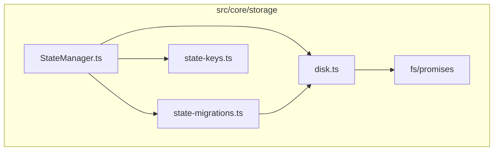

**Diagram sources**
- [StateManager.ts](file://src/core/storage/StateManager.ts)
- [disk.ts](file://src/core/storage/disk.ts)
- [state-migrations.ts](file://src/core/storage/state-migrations.ts)
- [state-keys.ts](file://src/core/storage/state-keys.ts)

**Section sources**
- [StateManager.ts](file://src/core/storage/StateManager.ts)
- [disk.ts](file://src/core/storage/disk.ts)
- [state-migrations.ts](file://src/core/storage/state-migrations.ts)
- [state-keys.ts](file://src/core/storage/state-keys.ts)

## 核心组件
本节深入分析`StateManager`类的设计与实现，包括其如何管理应用的运行时状态并将其序列化到磁盘。

**Section sources**
- [StateManager.ts](file://src/core/storage/StateManager.ts)

## 架构概述
`StateManager`类采用内存缓存与异步磁盘持久化相结合的设计，提供快速的状态访问。它通过`initialize`方法从磁盘加载数据到内存缓存，并在状态更新时立即更新缓存，同时安排延迟的持久化操作。

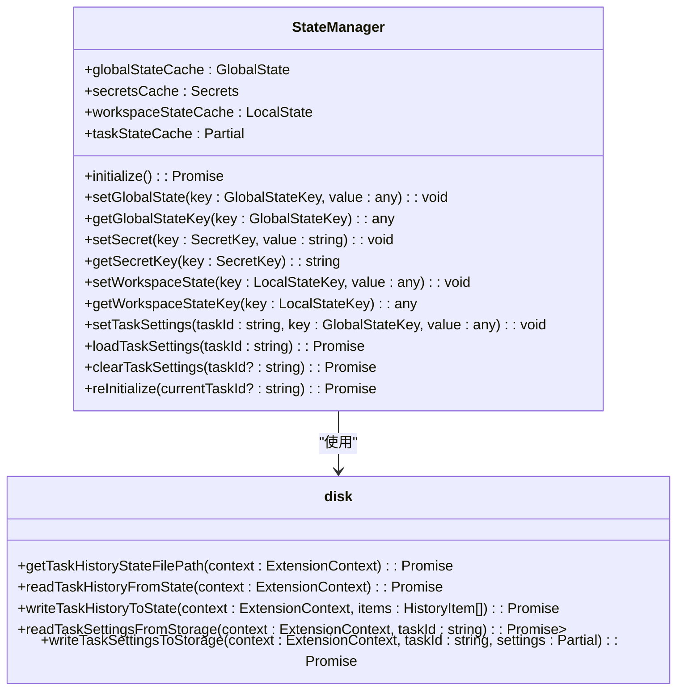

**Diagram sources**
- [StateManager.ts](file://src/core/storage/StateManager.ts)
- [disk.ts](file://src/core/storage/disk.ts)

## 详细组件分析
### StateManager类分析
`StateManager`类是应用状态管理的核心，它通过内存缓存提供即时读写访问，并通过异步操作将更改持久化到磁盘。

#### 内存缓存与延迟持久化
`StateManager`维护多个缓存对象，包括`globalStateCache`、`secretsCache`、`workspaceStateCache`和`taskStateCache`。当状态更新时，`StateManager`立即更新相应的缓存，然后将更改标记为“待持久化”，并安排一个延迟的持久化操作。

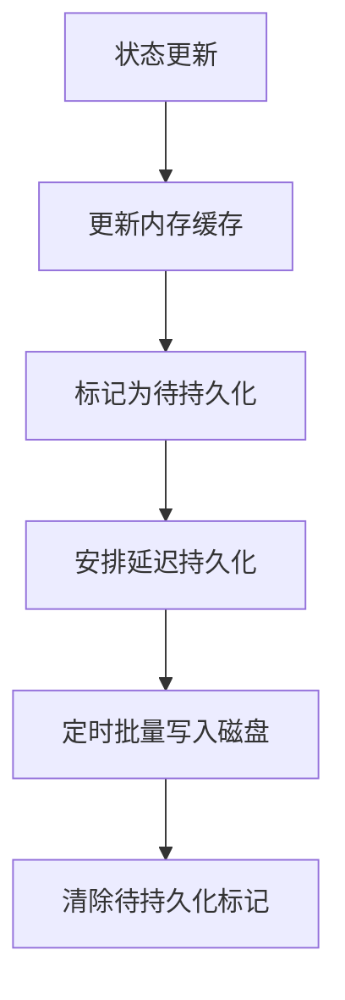

**Diagram sources**
- [StateManager.ts](file://src/core/storage/StateManager.ts)

#### 任务历史文件监控
`StateManager`使用`chokidar`库监控`taskHistory.json`文件的变化。当外部修改了该文件时，`StateManager`会自动重新加载数据到内存缓存中，确保状态的一致性。

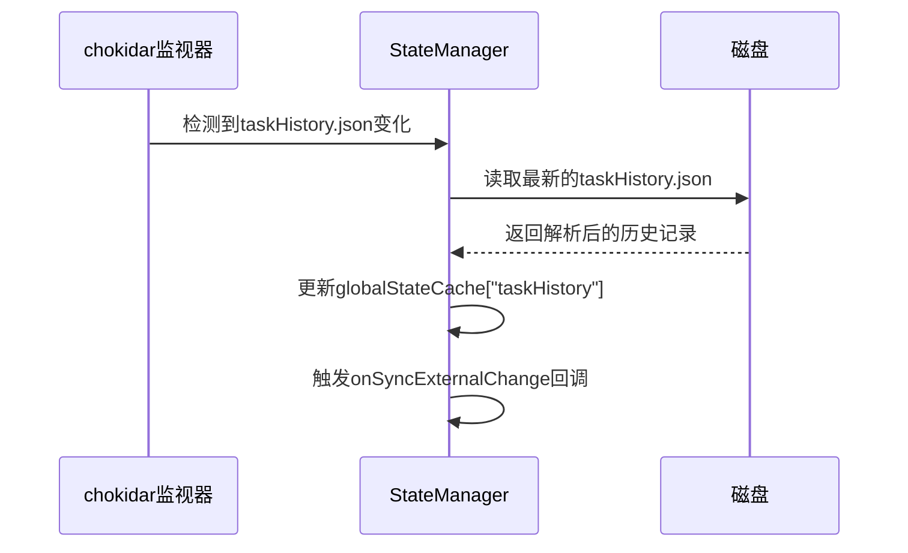

**Diagram sources**
- [StateManager.ts](file://src/core/storage/StateManager.ts)

### 底层存储机制分析
`disk.ts`文件定义了底层的存储机制，负责与文件系统交互，实现数据的持久化。

#### 文件路径管理
`disk.ts`通过`ensureStateDirectoryExists`和`ensureTaskDirectoryExists`等函数管理文件路径。`taskHistory.json`文件存储在全局存储目录的`state`子目录中，而每个任务的设置则存储在`tasks/{taskId}`目录下的`settings.json`文件中。

```mermaid
flowchart TD
A[getExtensionContext] --> B[获取globalStorageUri]
B --> C[构建state目录路径]
C --> D[确保state目录存在]
D --> E[返回taskHistory.json完整路径]
F[getExtensionContext] --> G[获取globalStorageUri]
G --> H[构建tasks/{taskId}目录路径]
H --> I[确保tasks/{taskId}目录存在]
I --> J[返回settings.json完整路径]
```

**Diagram sources**
- [disk.ts](file://src/core/storage/disk.ts)

#### 原子性读写操作
`disk.ts`中的读写操作都使用了`fs/promises`模块的异步方法，确保了操作的原子性。例如，`writeTaskHistoryToState`函数使用`fs.writeFile`一次性写入整个JSON对象，避免了部分写入的风险。

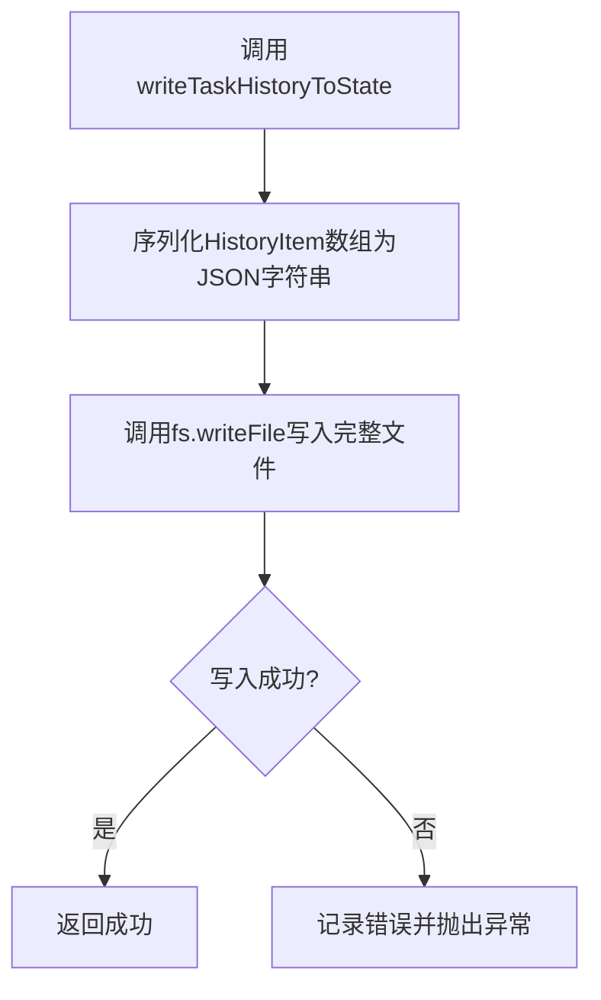

**Diagram sources**
- [disk.ts](file://src/core/storage/disk.ts)

### 版本迁移逻辑分析
`state-migrations.ts`文件包含了多个迁移函数，用于处理数据模型的变化。

#### 任务历史迁移
`migrateTaskHistoryToFile`函数负责将存储在VS Code全局状态中的任务历史迁移到独立的JSON文件中。如果新旧位置都有数据，则会合并它们。

```mermaid
flowchart TD
A[检查旧位置(taskHistory)] --> B{有数据?}
B --> |否| C[完成]
B --> |是| D[读取新位置(taskHistory.json)]
D --> E{有数据?}
E --> |否| F[将旧数据写入新位置]
E --> |是| G[合并新旧数据]
G --> H[写入新位置]
H --> I[清除旧位置数据]
I --> J[完成]
```

**Diagram sources**
- [state-migrations.ts](file://src/core/storage/state-migrations.ts)

#### API配置迁移
`migrateLegacyApiConfigurationToModeSpecific`函数将旧的单一模式API配置迁移到新的计划模式和执行模式分离的配置中，根据`planActSeparateModelsSetting`的值决定迁移策略。

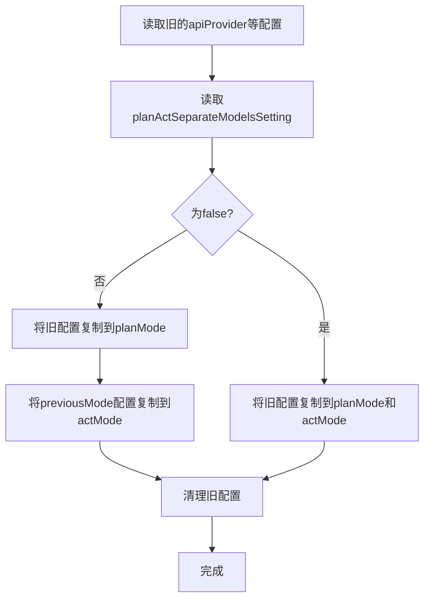

**Diagram sources**
- [state-migrations.ts](file://src/core/storage/state-migrations.ts)

### 关键状态项分析
`state-keys.ts`文件定义了所有关键状态项的数据结构。

#### 全局状态
`GlobalState`接口定义了应用的全局配置，包括API提供者、模型ID、思考预算令牌、推理努力程度等。

```mermaid
erDiagram
GLOBAL_STATE {
string awsRegion
boolean awsUseCrossRegionInference
boolean awsBedrockUsePromptCache
string awsBedrockEndpoint
string awsProfile
string awsAuthentication
boolean awsUseProfile
string vertexProjectId
string vertexRegion
string lastShownAnnouncementId
HistoryItem[] taskHistory
string requestyBaseUrl
string openAiBaseUrl
map openAiHeaders
string ollamaBaseUrl
string ollamaApiOptionsCtxNum
string lmStudioBaseUrl
string lmStudioMaxTokens
string anthropicBaseUrl
string geminiBaseUrl
string azureApiVersion
string openRouterProviderSorting
AutoApprovalSettings autoApprovalSettings
ClineRulesToggles globalClineRulesToggles
ClineRulesToggles globalWorkflowToggles
BrowserSettings browserSettings
UserInfo userInfo
string liteLlmBaseUrl
boolean liteLlmUsePromptCache
number fireworksModelMaxCompletionTokens
number fireworksModelMaxTokens
string qwenApiLine
string moonshotApiLine
string zaiApiLine
McpMarketplaceCatalog mcpMarketplaceCatalog
TelemetrySetting telemetrySetting
string asksageApiUrl
boolean planActSeparateModelsSetting
boolean enableCheckpointsSetting
boolean mcpMarketplaceEnabled
string[] favoritedModelIds
number requestTimeoutMs
number shellIntegrationTimeout
boolean mcpResponsesCollapsed
boolean terminalReuseEnabled
string defaultTerminalProfile
boolean isNewUser
boolean welcomeViewCompleted
number terminalOutputLineLimit
McpDisplayMode mcpDisplayMode
string sapAiCoreTokenUrl
string sapAiCoreBaseUrl
string sapAiResourceGroup
boolean sapAiCoreUseOrchestrationMode
string claudeCodePath
string qwenCodeOauthPath
boolean strictPlanModeEnabled
boolean yoloModeToggled
boolean useAutoCondense
string preferredLanguage
OpenaiReasoningEffort openaiReasoningEffort
Mode mode
FocusChainSettings focusChainSettings
string customPrompt
string difyBaseUrl
WorkspaceRoot[] workspaceRoots
number primaryRootIndex
boolean multiRootEnabled
ApiProvider planModeApiProvider
string planModeApiModelId
number planModeThinkingBudgetTokens
string planModeReasoningEffort
LanguageModelChatSelector planModeVsCodeLmModelSelector
boolean planModeAwsBedrockCustomSelected
BedrockModelId planModeAwsBedrockCustomModelBaseId
string planModeOpenRouterModelId
ModelInfo planModeOpenRouterModelInfo
string planModeOpenAiModelId
ModelInfo planModeOpenAiModelInfo
string planModeOllamaModelId
string planModeLmStudioModelId
string planModeLiteLlmModelId
ModelInfo planModeLiteLlmModelInfo
string planModeRequestyModelId
ModelInfo planModeRequestyModelInfo
string planModeTogetherModelId
string planModeFireworksModelId
string planModeSapAiCoreModelId
string planModeSapAiCoreDeploymentId
string planModeGroqModelId
ModelInfo planModeGroqModelInfo
string planModeBasetenModelId
ModelInfo planModeBasetenModelInfo
string planModeHuggingFaceModelId
ModelInfo planModeHuggingFaceModelInfo
string planModeHuaweiCloudMaasModelId
ModelInfo planModeHuaweiCloudMaasModelInfo
string planModeVercelAiGatewayModelId
ModelInfo planModeVercelAiGatewayModelInfo
ApiProvider actModeApiProvider
string actModeApiModelId
number actModeThinkingBudgetTokens
string actModeReasoningEffort
LanguageModelChatSelector actModeVsCodeLmModelSelector
boolean actModeAwsBedrockCustomSelected
BedrockModelId actModeAwsBedrockCustomModelBaseId
string actModeOpenRouterModelId
ModelInfo actModeOpenRouterModelInfo
string actModeOpenAiModelId
ModelInfo actModeOpenAiModelInfo
string actModeOllamaModelId
string actModeLmStudioModelId
string actModeLiteLlmModelId
ModelInfo actModeLiteLlmModelInfo
string actModeRequestyModelId
ModelInfo actModeRequestyModelInfo
string actModeTogetherModelId
string actModeFireworksModelId
string actModeSapAiCoreModelId
string actModeSapAiCoreDeploymentId
string actModeGroqModelId
ModelInfo actModeGroqModelInfo
string actModeBasetenModelId
ModelInfo actModeBasetenModelInfo
string actModeHuggingFaceModelId
ModelInfo actModeHuggingFaceModelInfo
string actModeHuaweiCloudMaasModelId
ModelInfo actModeHuaweiCloudMaasModelInfo
string actModeVercelAiGatewayModelId
ModelInfo actModeVercelAiGatewayModelInfo
}
```

**Diagram sources**
- [state-keys.ts](file://src/core/storage/state-keys.ts)

#### 秘密状态
`Secrets`接口定义了需要安全存储的敏感信息，如API密钥、访问密钥等。

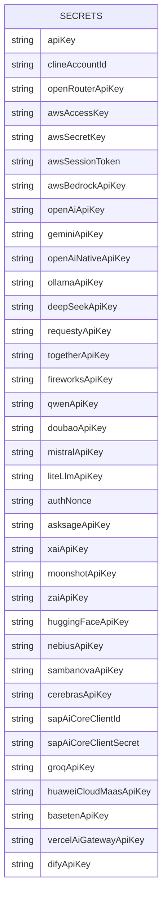

**Diagram sources**
- [state-keys.ts](file://src/core/storage/state-keys.ts)

#### 工作区状态
`LocalState`接口定义了与特定工作区相关的配置。

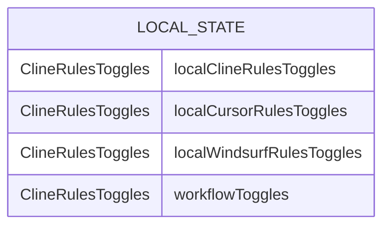

**Diagram sources**
- [state-keys.ts](file://src/core/storage/state-keys.ts)

### 状态管理生命周期
以下是状态管理的完整生命周期图。

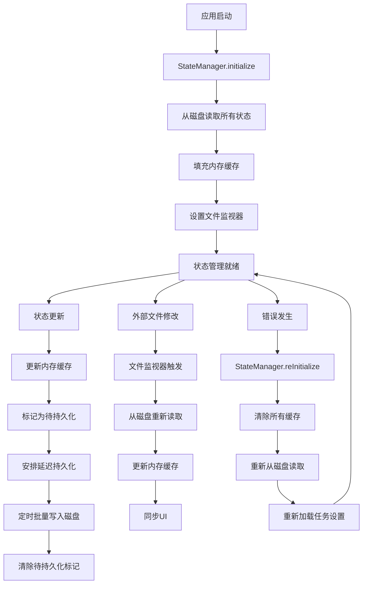

**Diagram sources**
- [StateManager.ts](file://src/core/storage/StateManager.ts)
- [disk.ts](file://src/core/storage/disk.ts)

## 依赖分析
`StateManager`类依赖于VS Code的`ExtensionContext`来访问全局状态和机密存储，同时依赖于`chokidar`库来监控文件系统变化。`disk.ts`文件依赖于Node.js的`fs/promises`模块进行文件操作。

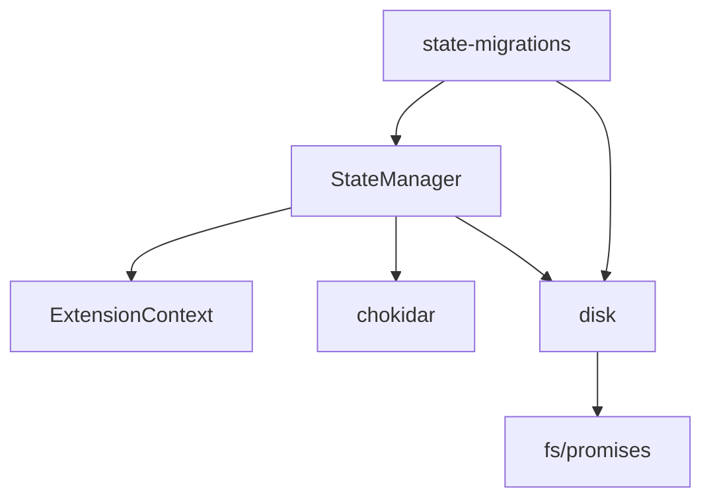

**Diagram sources**
- [StateManager.ts](file://src/core/storage/StateManager.ts)
- [disk.ts](file://src/core/storage/disk.ts)
- [state-migrations.ts](file://src/core/storage/state-migrations.ts)

**Section sources**
- [StateManager.ts](file://src/core/storage/StateManager.ts)
- [disk.ts](file://src/core/storage/disk.ts)
- [state-migrations.ts](file://src/core/storage/state-migrations.ts)

## 性能考虑
`StateManager`通过内存缓存提供了极快的状态读取速度。写入操作采用延迟批量处理的方式，减少了磁盘I/O的频率，提高了性能。对于频繁更新的状态，这种设计可以显著减少对磁盘的写入次数。

## 故障排除指南
当状态持久化出现问题时，可以采取以下措施：

1. **数据损坏恢复**：调用`StateManager.reInitialize`方法，该方法会清除所有缓存并从磁盘重新加载数据。
2. **备份机制**：虽然当前实现中没有显式的备份机制，但`taskHistory.json`等关键文件的独立存储本身就提供了一定程度的保护。
3. **错误处理**：`StateManager`提供了`onPersistenceError`回调，可以在持久化失败时进行错误恢复。

**Section sources**
- [StateManager.ts](file://src/core/storage/StateManager.ts)

## 结论
cline应用的状态持久化系统设计精良，通过内存缓存与异步磁盘持久化的结合，实现了高性能和高可靠性的平衡。`StateManager`类提供了统一的API来管理各种状态，而`disk.ts`和`state-migrations.ts`则确保了数据的安全存储和版本兼容性。该系统能够有效管理应用的运行时状态，并在各种情况下保持数据的一致性和完整性。