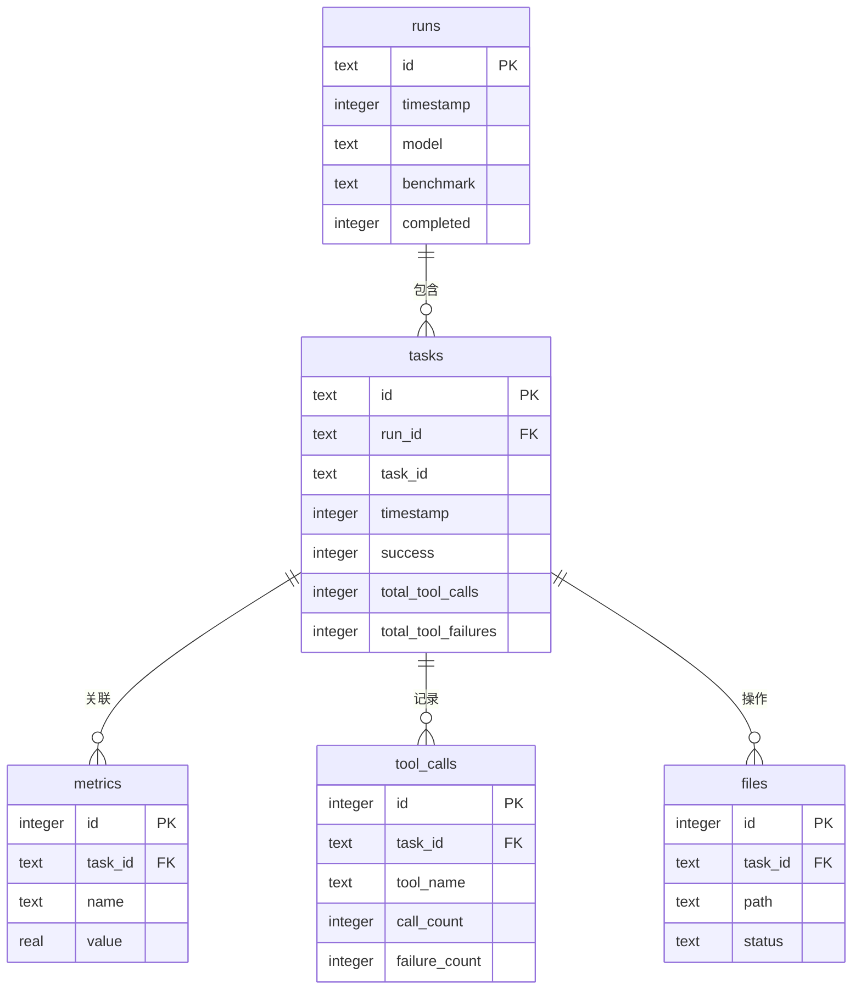

# 持久化数据模型

<cite>
**本文档引用的文件**  
- [StateManager.ts](file://src/core/storage/StateManager.ts)
- [disk.ts](file://src/core/storage/disk.ts)
- [state-migrations.ts](file://src/core/storage/state-migrations.ts)
- [schema.ts](file://evals/cli/src/db/schema.ts)
</cite>

## 目录
1. [引言](#引言)
2. [运行时状态持久化机制](#运行时状态持久化机制)
3. [数据库模式设计](#数据库模式设计)
4. [Evals模块数据库结构](#evals模块数据库结构)
5. [数据生命周期操作流程](#数据生命周期操作流程)
6. [性能优化建议](#性能优化建议)
7. [结论](#结论)

## 引言
本文档详细阐述了`cline`项目中持久化数据模型的设计与实现，重点分析`StateManager`如何将运行时状态序列化并持久化到磁盘，以及`evals`模块的数据库设计。文档涵盖存储策略、数据加密、版本迁移、表结构定义、外键约束、ER图、数据操作流程和性能优化策略。

## 运行时状态持久化机制

`StateManager`是`cline`核心模块中负责管理应用运行时状态持久化的关键组件。该组件通过`disk.ts`提供的底层文件操作接口，将内存中的状态对象序列化为JSON格式并写入本地磁盘文件，实现跨会话的状态保持。

状态持久化采用异步写入策略，确保UI响应性不受I/O操作影响。所有状态数据按功能域划分存储于独立的JSON文件中，遵循模块化设计原则。系统通过`state-keys.ts`统一管理状态键名，保证命名一致性与可维护性。

在安全性方面，敏感信息如认证凭据和API密钥在写入磁盘前经过加密处理，使用平台特定的安全存储机制（如Windows DPAPI或macOS Keychain）进行保护，防止未授权访问。

**Section sources**
- [StateManager.ts](file://src/core/storage/StateManager.ts#L1-L200)
- [disk.ts](file://src/core/storage/disk.ts#L1-L80)

## 数据库模式设计

主应用程序的数据库模式由`schema.ts`文件定义，采用SQLite作为嵌入式数据库引擎。模式设计遵循规范化原则，通过外键约束维护数据完整性，并利用索引优化查询性能。

核心表包括`runs`（评估运行记录）、`tasks`（任务元数据）、`metrics`（评估指标）、`tool_calls`（工具调用统计）和`files`（文件操作记录）。所有时间戳字段均以Unix时间戳（INTEGER）存储，确保跨平台兼容性和高效范围查询。

**Diagram sources**
- [schema.ts](file://evals/cli/src/db/schema.ts#L5-L48)

**Section sources**
- [schema.ts](file://evals/cli/src/db/schema.ts#L1-L48)

## Evals模块数据库结构

### eval_tasks表（任务元数据）
`tasks`表存储每次评估任务的元数据，主键为`id`，外键`run_id`关联至`runs`表。关键字段包括：
- `task_id`: 原始任务标识符
- `timestamp`: 任务开始时间戳
- `success`: 布尔标志（0/1）表示任务是否成功完成
- `total_tool_calls` 和 `total_tool_failures`: 统计工具调用情况

该表通过`run_id`建立与运行记录的关联，支持按评估批次进行聚合分析。

### eval_results表（评估结果指标）
实际评估结果指标存储在`metrics`表中，采用键值对结构设计，支持灵活扩展。关键字段：
- `task_id`: 外键关联至`tasks.id`
- `name`: 指标名称（如"accuracy", "latency"）
- `value`: 指标数值（REAL类型）

此设计允许同一任务记录多个不同类型的指标，便于后续多维度数据分析。

**Section sources**
- [schema.ts](file://evals/cli/src/db/schema.ts#L15-L35)

## 数据生命周期操作流程

### 数据写入流程
1. 应用生成新状态或评估数据
2. `StateManager`或数据库客户端序列化数据
3. 异步调用`disk.ts`的写入方法
4. 数据持久化至JSON文件或SQLite数据库
5. 触发状态变更通知

### 数据读取流程
1. 应用启动或需要数据时发起读取请求
2. `StateManager`从磁盘加载JSON文件并反序列化
3. 数据库连接执行SELECT查询
4. 返回结构化数据供上层使用

### 数据更新与删除
更新操作采用"读取-修改-写入"模式，确保数据一致性。删除操作通过事务保证相关记录的级联清理，如删除`runs`记录时自动清除关联的`tasks`及其他子表数据。

版本迁移通过`state-migrations.ts`实现，定义了从旧版本状态结构到新版本的转换逻辑，确保升级后数据的兼容性与完整性。

**Section sources**
- [StateManager.ts](file://src/core/storage/StateManager.ts#L50-L150)
- [state-migrations.ts](file://src/core/storage/state-migrations.ts#L1-L100)

## 性能优化建议

### 索引策略
- 在`runs(timestamp)`上创建索引以加速时间范围查询
- 为`tasks(run_id)`创建外键索引，优化连接查询性能
- 考虑在`metrics(name)`上创建索引，加快特定指标的检索速度

### 查询优化
- 使用批量插入（INSERT OR REPLACE）减少事务开销
- 对频繁聚合查询（如按模型统计成功率）实现结果缓存
- 限制历史数据查询范围，避免全表扫描

### 存储优化
- 定期归档旧的评估数据，保持数据库文件大小可控
- 考虑对`files`表的`path`字段进行哈希化存储，减少索引大小
- 监控数据库文件碎片，必要时执行VACUUM操作

## 结论
`cline`的持久化数据模型设计兼顾了功能性、性能和可维护性。通过`StateManager`实现的JSON文件存储与SQLite数据库相结合的方式，既满足了运行时状态的灵活持久化需求，又为评估数据提供了结构化的存储方案。建议持续监控数据库性能，根据实际使用模式调整索引策略，并定期审查数据保留策略以优化存储效率。