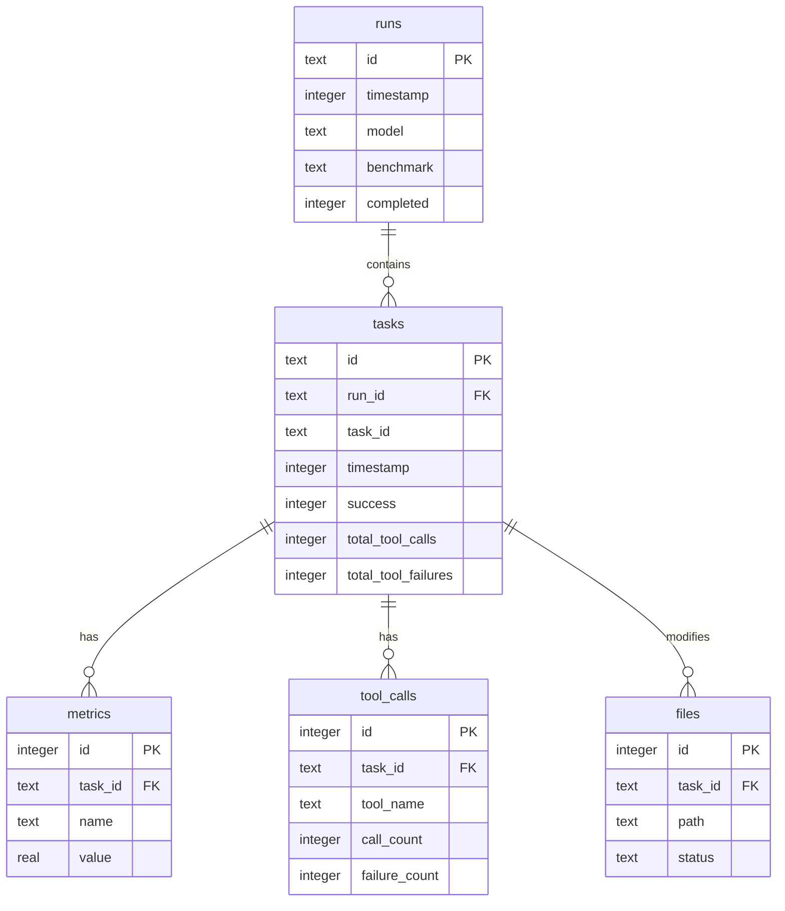

# 评估数据模型

<cite>
**本文档中引用的文件**  
- [evals/cli/src/db/schema.ts](file://evals/cli/src/db/schema.ts)
- [evals/diff-edits/database/schema.sql](file://evals/diff-edits/database/schema.sql)
- [evals/cli/src/db/index.ts](file://evals/cli/src/db/index.ts)
</cite>

## 目录
1. [引言](#引言)
2. [项目结构](#项目结构)
3. [核心数据模型分析](#核心数据模型分析)
4. [数据库模式对比](#数据库模式对比)
5. [生产环境数据库初始化](#生产环境数据库初始化)
6. [实体关系图（ER图）](#实体关系图er图)
7. [数据访问层接口](#数据访问层接口)
8. [性能优化建议](#性能优化建议)
9. [结论](#结论)

## 引言
本文档详细分析 `cline` 评估模块的数据模型，涵盖其数据库结构、字段定义、主外键关系、数据访问接口及性能优化策略。重点解析 `evals/cli/src/db/schema.ts` 中定义的评估数据库模式，并与 `evals/diff-edits/database/schema.sql` 进行对比，揭示两者在设计目标和实现上的异同。同时，文档化数据访问层提供的CRUD操作接口，并提出针对高频查询场景的索引优化建议。

## 项目结构
评估模块主要由两个子系统构成：通用评估CLI（`evals/cli`）和差异编辑评估（`evals/diff-edits`）。每个子系统拥有独立的数据库模式和数据访问逻辑，分别位于各自的 `db` 目录下。

**Section sources**
- [evals/cli/src/db/schema.ts](file://evals/cli/src/db/schema.ts)
- [evals/diff-edits/database/schema.sql](file://evals/diff-edits/database/schema.sql)

## 核心数据模型分析

### 通用评估数据库模式 (`evals/cli/src/db/schema.ts`)
该模式定义了用于存储自动化任务评估结果的五张核心表。

#### `runs` 表
存储一次完整的评估运行的元数据。
- **字段**:
  - `id`: TEXT, 主键，运行的唯一标识符。
  - `timestamp`: INTEGER, NOT NULL, 运行开始的时间戳（毫秒）。
  - `model`: TEXT, NOT NULL, 被评估的模型名称。
  - `benchmark`: TEXT, NOT NULL, 基准测试的名称。
  - `completed`: INTEGER, NOT NULL, 默认值为0，标记运行是否完成。

#### `tasks` 表
存储单个评估任务的执行状态和结果。
- **字段**:
  - `id`: TEXT, 主键，任务实例的唯一ID。
  - `run_id`: TEXT, NOT NULL, 外键，关联到 `runs.id`。
  - `task_id`: TEXT, NOT NULL, 原始任务的ID（如来自基准数据集）。
  - `timestamp`: INTEGER, NOT NULL, 任务开始的时间戳。
  - `success`: INTEGER, NOT NULL, 默认值为0，标记任务是否成功。
  - `total_tool_calls`: INTEGER, 工具调用的总次数。
  - `total_tool_failures`: INTEGER, 工具调用失败的总次数。
- **外键**: `FOREIGN KEY (run_id) REFERENCES runs(id)`

#### `metrics` 表
存储与特定任务关联的数值型指标。
- **字段**:
  - `id`: INTEGER, 主键，自增。
  - `task_id`: TEXT, NOT NULL, 外键，关联到 `tasks.id`。
  - `name`: TEXT, NOT NULL, 指标名称（如 "accuracy", "latency"）。
  - `value`: REAL, NOT NULL, 指标的数值。
- **外键**: `FOREIGN KEY (task_id) REFERENCES tasks(id)`

#### `tool_calls` 表
记录任务执行过程中发生的工具调用详情。
- **字段**:
  - `id`: INTEGER, 主键，自增。
  - `task_id`: TEXT, NOT NULL, 外键，关联到 `tasks.id`。
  - `tool_name`: TEXT, NOT NULL, 调用的工具名称。
  - `call_count`: INTEGER, NOT NULL, 该工具的调用次数。
  - `failure_count`: INTEGER, NOT NULL, 该工具的失败次数。
- **外键**: `FOREIGN KEY (task_id) REFERENCES tasks(id)`

#### `files` 表
跟踪任务执行过程中文件的变更情况。
- **字段**:
  - `id`: INTEGER, 主键，自增。
  - `task_id`: TEXT, NOT NULL, 外键，关联到 `tasks.id`。
  - `path`: TEXT, NOT NULL, 文件的路径。
  - `status`: TEXT, NOT NULL, 文件状态（"created", "modified", "deleted"）。
- **外键**: `FOREIGN KEY (task_id) REFERENCES tasks(id)`

**Section sources**
- [evals/cli/src/db/schema.ts](file://evals/cli/src/db/schema.ts#L0-L47)

## 数据库模式对比

`evals/cli/src/db/schema.ts` 和 `evals/diff-edits/database/schema.sql` 定义了两个独立的数据库模式，服务于不同的评估场景。

### 设计目标差异
- **通用评估模式 (`schema.ts`)**: 设计简洁，侧重于通用任务评估。其核心是 `runs` -> `tasks` 的层级结构，每个任务可以关联多个指标、工具调用和文件变更。它不直接存储原始模型输出或详细的执行日志，而是通过 `metrics` 表聚合结果。
- **差异编辑评估模式 (`schema.sql`)**: 设计更为复杂和精细化，专为代码编辑任务设计。它引入了 `system_prompts`、`processing_functions` 等支持表来实现内容版本化和去重，并通过 `results` 表存储极其详细的单次尝试结果，包括原始模型输出、解析后的工具调用、精确的耗时和错误码。

### 核心实体对比
| 特性 | 通用评估模式 (`schema.ts`) | 差异编辑评估模式 (`schema.sql`) |
| :--- | :--- | :--- |
| **顶层容器** | `runs` (运行) | `runs` (运行) |
| **评估单元** | `tasks` (任务) | `cases` (案例) |
| **结果粒度** | 每个 `task` 一个结果 | 每个 `case` 可能有多个 `results` (不同模型/配置) |
| **模型信息** | 存储在 `runs.model` | 存储在 `results.model_id` |
| **原始输出** | 未直接存储 | 在 `results.raw_model_output` 中存储 |
| **时间度量** | 仅任务开始时间 (`tasks.timestamp`) | 高精度时间 (`time_to_first_token_ms` 等) |
| **错误分析** | 仅 `success` 标志 | 详细的 `error_enum` 错误码 |
| **内容去重** | 无 | 使用 `hash` 字段对 `system_prompts`, `files` 等进行去重 |

**Section sources**
- [evals/cli/src/db/schema.ts](file://evals/cli/src/db/schema.ts#L0-L47)
- [evals/diff-edits/database/schema.sql](file://evals/diff-edits/database/schema.sql#L0-L78)

## 生产环境数据库初始化

`evals/diff-edits/database/schema.sql` 文件定义了在生产环境中初始化差异编辑评估数据库的SQL DDL语句。

### 初始化流程
1.  **启用外键约束**: `PRAGMA foreign_keys = ON;` 确保数据库强制执行外键关系，维护数据完整性。
2.  **创建支持表**: 首先创建 `system_prompts`, `processing_functions`, 和 `files` 表，这些表存储了评估所依赖的静态或版本化内容。
3.  **创建核心表**: 接着创建 `runs`, `cases`, 和 `results` 表。这些表通过外键（如 `system_prompt_hash`, `run_id`, `case_id`）与支持表建立联系。
4.  **创建索引**: 在文件末尾创建了多个索引，例如 `idx_results_run_model` 和 `idx_results_created_at`，以优化基于 `run_id`、`model_id` 和 `created_at` 的查询性能。

该SQL脚本确保了数据库结构的完整性和查询效率，为后续的数据插入和分析奠定了基础。

**Section sources**
- [evals/diff-edits/database/schema.sql](file://evals/diff-edits/database/schema.sql#L0-L78)

## 实体关系图（ER图）



**Diagram sources**
- [evals/cli/src/db/schema.ts](file://evals/cli/src/db/schema.ts#L0-L47)

## 数据访问层接口

`evals/cli/src/db/index.ts` 文件实现了 `ResultsDatabase` 类，为通用评估数据库提供了封装的CRUD操作接口。

### 核心CRUD操作
- **创建运行**: `createRun(id, model, benchmark)` - 向 `runs` 表插入一条新记录。
- **完成运行**: `completeRun(id)` - 更新 `runs` 表，将指定运行的 `completed` 字段设为1。
- **创建任务**: `createTask(id, runId, taskId)` - 向 `tasks` 表插入一条新记录。
- **完成任务**: `completeTask(id, success, toolCalls, toolFailures)` - 更新 `tasks` 表，记录任务的最终状态和工具调用统计。
- **添加指标**: `addMetric(taskId, name, value)` - 向 `metrics` 表插入一条记录。
- **添加工具调用**: `addToolCall(taskId, toolName, callCount, failureCount)` - 向 `tool_calls` 表插入一条记录。
- **添加文件变更**: `addFile(taskId, filePath, status)` - 向 `files` 表插入一条记录。
- **查询数据**: 提供了 `getRuns()`, `getRunTasks(runId)`, `getTaskMetrics(taskId)` 等方法，用于从数据库中检索数据。

该接口通过预编译的SQL语句（`this.db.prepare()`）和参数化查询，确保了操作的安全性和效率。

**Section sources**
- [evals/cli/src/db/index.ts](file://evals/cli/src/db/index.ts#L0-L211)

## 性能优化建议

为了提升评估数据的查询性能，建议为以下频繁查询的字段创建索引：

1.  **`tasks` 表的 `run_id` 字段**: 在 `getRunTasks(runId)` 方法中，需要根据 `run_id` 查询所有任务。创建索引可显著加速此操作。
    ```sql
    CREATE INDEX idx_tasks_run_id ON tasks(run_id);
    ```
2.  **`tasks` 表的 `success` 字段**: 当需要统计特定运行的成功率或筛选失败任务时，对该字段的查询会很频繁。
    ```sql
    CREATE INDEX idx_tasks_success ON tasks(success);
    ```
3.  **`metrics` 表的 `name` 字段**: 如果需要跨多个任务查询特定指标（如所有任务的 "latency"），对该字段的索引将非常有用。
    ```sql
    CREATE INDEX idx_metrics_name ON metrics(name);
    ```
4.  **`files` 表的 `path` 字段**: 当需要分析特定文件在不同任务中的变更情况时，索引 `path` 字段可以提高查询效率。
    ```sql
    CREATE INDEX idx_files_path ON files(path);
    ```

这些索引将有效减少全表扫描的发生，特别是在数据量增长时，能保证数据分析脚本的响应速度。

## 结论
`cline` 的评估模块采用了模块化的数据模型设计。通用评估模块 (`evals/cli`) 提供了一个简洁、通用的数据库模式，适用于广泛的自动化任务评估。而差异编辑评估模块 (`evals/diff-edits`) 则拥有一个更复杂、更精细的模式，能够捕获代码编辑任务的丰富细节，支持深入的性能和错误分析。两个模块都通过清晰的数据访问层与数据库交互，并具备良好的可扩展性。通过实施建议的索引策略，可以进一步优化数据查询性能，为评估结果的分析提供有力支持。