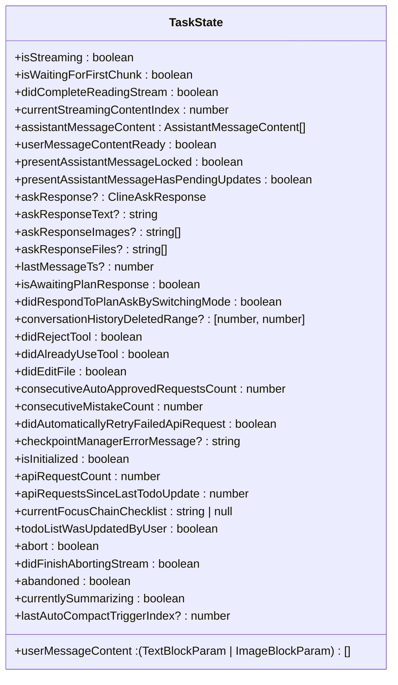
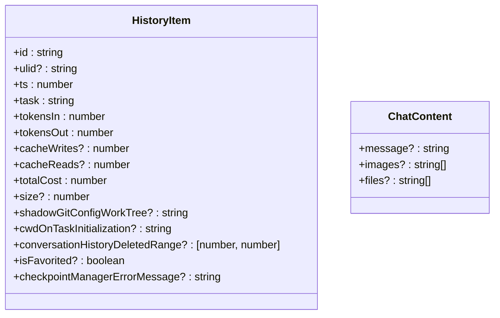
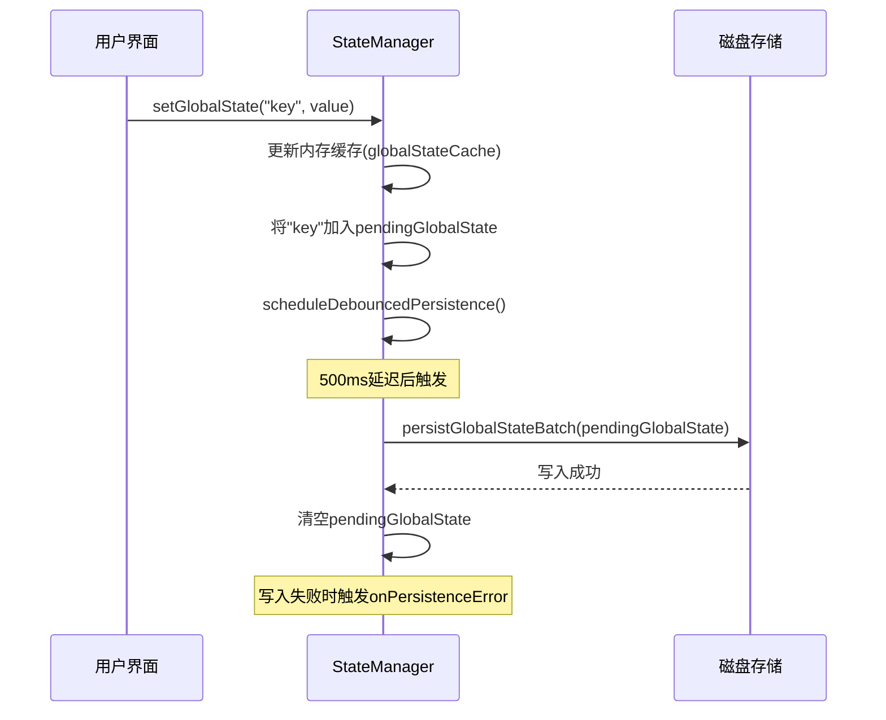
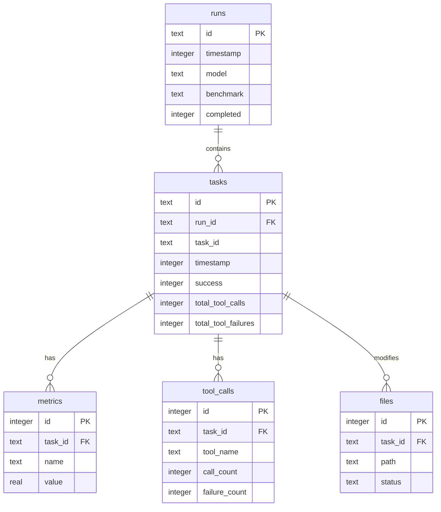

# 数据模型

<cite>
**本文档中引用的文件**  
- [TaskState.ts](file://src/core/task/TaskState.ts)
- [HistoryItem.ts](file://src/shared/HistoryItem.ts)
- [ChatContent.ts](file://src/shared/ChatContent.ts)
- [StateManager.ts](file://src/core/storage/StateManager.ts)
- [schema.ts](file://evals/cli/src/db/schema.ts)
</cite>

## 目录
1. [引言](#引言)
2. [核心数据模型](#核心数据模型)
3. [任务状态模型](#任务状态模型)
4. [历史记录与聊天内容模型](#历史记录与聊天内容模型)
5. [状态管理机制](#状态管理机制)
6. [评估模块数据库模型](#评估模块数据库模型)
7. [数据生命周期与流转](#数据生命周期与流转)
8. [结论](#结论)

## 引言
本文档旨在全面描述 `cline` 应用中的关键数据模型，涵盖任务状态、用户交互历史、聊天内容表示以及状态持久化机制。同时，文档化 `evals` 模块的数据库表结构，阐明各数据实体在业务流程中的定义、关系和生命周期。通过 UML 类图和 JSON Schema 的形式，为开发者提供清晰的数据结构参考。

## 核心数据模型
`cline` 的核心数据模型围绕任务（Task）展开，以 `TaskState` 为核心状态容器，结合 `HistoryItem` 记录任务执行历史，并通过 `ChatContent` 表示用户与 AI 助手的交互内容。`StateManager` 负责这些模型在内存与磁盘之间的同步与持久化。`evals` 模块则独立维护一个 SQLite 数据库，用于存储模型评估任务的运行结果和性能指标。

## 任务状态模型
`TaskState` 类定义了单个任务在其生命周期内的所有状态信息，是应用运行时逻辑的核心。

**Diagram sources**
- [TaskState.ts](file://src/core/task/TaskState.ts)

**Section sources**
- [TaskState.ts](file://src/core/task/TaskState.ts)

### 字段说明
- **任务ID**: 任务的唯一标识符，通常作为 `StateManager` 中存储任务设置的键。
- **状态**: 通过多个布尔字段表示任务的当前状态，例如 `isStreaming` (是否正在流式传输响应)、`abort` (是否已中止)、`abandoned` (是否已放弃)。
- **消息历史**: `assistantMessageContent` 存储 AI 助手的响应内容，`userMessageContent` 存储用户输入的内容。
- **计划与差异**: `currentFocusChainChecklist` 字段用于管理任务的待办事项列表（计划），`didEditFile` 标志表示任务是否已修改文件（差异）。
- **其他关键字段**: `askResponse` 存储特定的问答响应，`consecutiveMistakeCount` 跟踪连续错误次数，`checkpointManagerErrorMessage` 存储检查点管理器的错误信息。

## 历史记录与聊天内容模型
`HistoryItem` 和 `ChatContent` 定义了任务历史和聊天消息的数据结构。

**Diagram sources**
- [HistoryItem.ts](file://src/shared/HistoryItem.ts)
- [ChatContent.ts](file://src/shared/ChatContent.ts)

**Section sources**
- [HistoryItem.ts](file://src/shared/HistoryItem.ts)
- [ChatContent.ts](file://src/shared/ChatContent.ts)

### 序列化与存储
- **`HistoryItem`**: 该类型被序列化为 JSON 对象，并存储在 `taskHistory.json` 文件中。`StateManager` 通过 `readTaskHistoryFromState` 和 `writeTaskHistoryToState` 函数负责其读写。`id` 和 `ts` (时间戳) 是核心索引字段，`tokensIn` 和 `tokensOut` 用于成本计算。
- **`ChatContent`**: 该接口用于表示聊天消息的有效负载。`message` 字段存储文本内容，`images` 和 `files` 字段存储相关资源的路径数组。它通常作为更大消息对象的一部分被序列化和传输。

## 状态管理机制
`StateManager` 是应用状态持久化的中枢，采用内存缓存与异步磁盘持久化相结合的策略。

**Diagram sources**
- [StateManager.ts](file://src/core/storage/StateManager.ts)

**Section sources**
- [StateManager.ts](file://src/core/storage/StateManager.ts)

### 工作原理
1.  **内存优先**: 所有 `get` 操作直接从内存缓存 (`globalStateCache`, `secretsCache` 等) 读取，确保快速响应。
2.  **异步持久化**: 所有 `set` 操作立即更新内存缓存，然后将变更的键加入待处理集合 (`pendingGlobalState` 等)，并启动一个 500ms 的延迟定时器。
3.  **批量写入**: 当延迟定时器到期时，`StateManager` 会批量将所有待处理的变更写入磁盘（VS Code 的 `globalState`、`secrets` 或文件系统）。
4.  **错误处理**: 写入失败时，会触发 `onPersistenceError` 回调，允许上层进行错误恢复（如 `reInitialize`）。
5.  **外部变更同步**: 使用 `chokidar` 监听 `taskHistory.json` 文件的变化，当检测到外部修改时，自动重新加载文件内容到内存缓存，保持数据一致性。

## 评估模块数据库模型
`evals` 模块使用 SQLite 数据库存储评估任务的数据，其表结构由 `schema.ts` 中的 `SCHEMA` 常量定义。

**Diagram sources**
- [schema.ts](file://evals/cli/src/db/schema.ts)

**Section sources**
- [schema.ts](file://evals/cli/src/db/schema.ts)

### 表结构说明
- **`runs`**: 记录一次完整的评估运行。`id` 是主键，`model` 和 `benchmark` 记录测试的模型和基准，`completed` 标记运行是否完成。
- **`tasks`**: 记录 `runs` 下的单个评估任务。`run_id` 是外键，关联到 `runs` 表，`task_id` 是任务在基准中的唯一ID，`success` 标记任务是否成功。
- **`metrics`**: 存储与 `tasks` 相关的数值型指标。一个任务可以有多个指标（如准确率、耗时），`name` 和 `value` 分别存储指标名称和值。
- **`tool_calls`**: 记录任务中调用的工具信息。`tool_name` 是工具名称，`call_count` 和 `failure_count` 统计调用次数和失败次数。
- **`files`**: 记录任务修改的文件。`path` 是文件路径，`status` 可能表示文件的状态（如“已修改”、“已创建”）。

## 数据生命周期与流转
1.  **任务初始化**: 用户创建新任务，`StateManager` 初始化一个空的 `TaskState` 对象并将其缓存在内存中。
2.  **交互与状态变更**: 用户输入消息，`ChatContent` 被构建并发送。AI 响应流式更新 `TaskState` 中的 `assistantMessageContent` 等字段。`StateManager` 将这些变更异步持久化。
3.  **历史记录归档**: 当任务完成或被清除时，其关键信息（来自 `TaskState` 和 `HistoryItem`）被序列化并追加到 `taskHistory.json` 文件中。
4.  **评估任务执行**: `evals` 模块启动一个 `run`，为每个测试任务创建 `tasks` 记录，并在执行过程中填充 `metrics`、`tool_calls` 和 `files` 表。
5.  **数据查询与分析**: 应用或外部工具可以查询 `taskHistory.json` 或 `evals` 数据库，用于分析成本、性能或生成报告。

## 结论
`cline` 的数据模型设计清晰地分离了运行时状态 (`TaskState`)、持久化历史 (`HistoryItem`)、用户交互 (`ChatContent`) 和状态管理 (`StateManager`)。`StateManager` 的缓存-持久化模式确保了性能与数据安全的平衡。`evals` 模块的数据库模型则为自动化评估提供了结构化的数据存储方案。这些模型共同支撑了应用的核心功能和可扩展性。