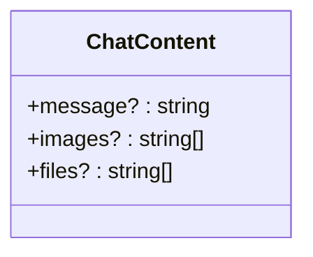
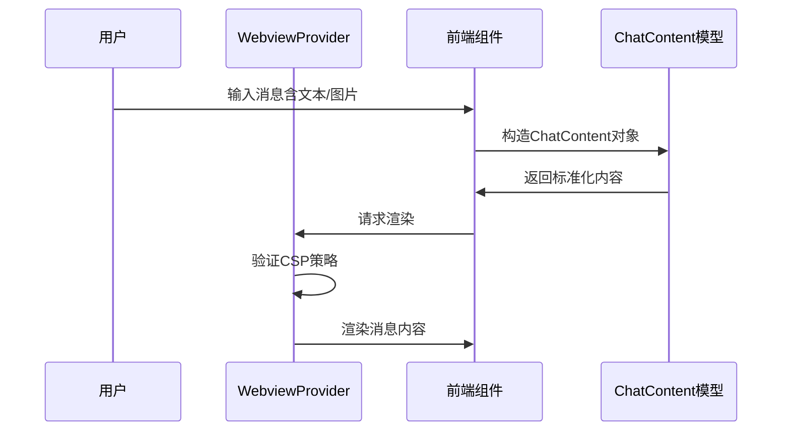
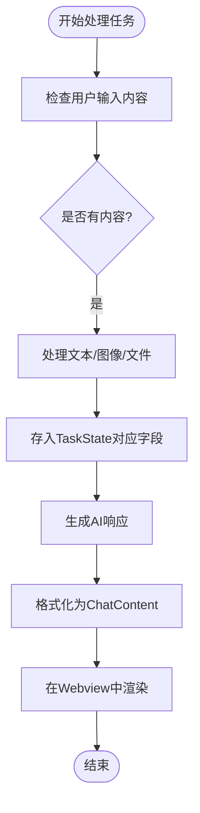

# ChatContent模型

<cite>
**本文档中引用的文件**  
- [ChatContent.ts](file://src/shared/ChatContent.ts)
- [WebviewProvider.ts](file://src/core/webview/WebviewProvider.ts)
- [TaskState.ts](file://src/core/task/TaskState.ts)
</cite>

## 目录
1. [简介](#简介)
2. [核心结构](#核心结构)
3. [字段设计与用途](#字段设计与用途)
4. [富文本与结构化数据支持](#富文本与结构化数据支持)
5. [实际应用场景](#实际应用场景)
6. [在WebviewProvider中的使用](#在webviewprovider中的使用)
7. [在Task模块中的处理](#在task模块中的处理)
8. [总结](#总结)

## 简介
`ChatContent` 接口是本项目中用于统一表示聊天会话中各类消息内容的核心数据结构。它为用户输入、AI响应、工具调用及系统通知等不同类型的消息提供了标准化的数据承载方式。该模型设计简洁且具有良好的扩展性，支持文本、图像和文件等多种内容形式的混合表达，是构建完整聊天功能的基础组件。

**Section sources**
- [ChatContent.ts](file://src/shared/ChatContent.ts)

## 核心结构
`ChatContent` 是一个 TypeScript 接口，定义了聊天消息内容的基本组成。其结构包含三个可选字段：`message`、`images` 和 `files`，分别用于存储文本内容、图像资源链接和文件附件路径。

**Diagram sources**
- [ChatContent.ts](file://src/shared/ChatContent.ts#L1-L5)

**Section sources**
- [ChatContent.ts](file://src/shared/ChatContent.ts#L1-L5)

## 字段设计与用途
### message
- **类型**: `string | undefined`
- **用途**: 存储消息的主体文本内容，支持 Markdown 格式以实现富文本展示。
- **示例**: 用户提问或 AI 生成的自然语言回复。

### images
- **类型**: `string[] | undefined`
- **用途**: 存储图像资源的 URL 列表，允许在消息中嵌入一张或多张图片。
- **限制**: 每条消息最多支持 20 张图像（由 `MAX_IMAGES_AND_FILES_PER_MESSAGE` 常量控制）。

### files
- **类型**: `string[] | undefined`
- **用途**: 存储文件附件的路径或下载链接，支持文档、代码片段等非图像类文件的传输。
- **限制**: 同样受 `MAX_IMAGES_AND_FILES_PER_MESSAGE` 限制，总数不超过 20 项。

这些字段均为可选，使得 `ChatContent` 能够灵活适应不同场景下的消息构造需求。

**Section sources**
- [ChatContent.ts](file://src/shared/ChatContent.ts#L1-L5)
- [constants.ts](file://webview-ui/src/components/chat/chat-view/constants.ts#L3)

## 富文本与结构化数据支持
`ChatContent` 模型通过 `message` 字段天然支持 Markdown 格式的富文本内容，允许使用加粗、斜体、代码块、列表等语法增强信息表达能力。同时，结合 `images` 和 `files` 字段，可以实现图文混排和附件嵌入，满足复杂交互需求。

虽然当前接口未直接包含 JSON 结构化数据字段，但可通过 `message` 字段内嵌 JSON 字符串的方式传递结构化信息，并在前端进行解析渲染。这种设计保持了接口的简洁性，同时保留了扩展结构化数据处理的能力。

**Section sources**
- [ChatContent.ts](file://src/shared/ChatContent.ts#L1-L5)

## 实际应用场景
`ChatContent` 模型广泛应用于聊天界面的消息构建与展示流程中。无论是用户输入、AI 回复还是系统提示，均通过该模型进行标准化封装。典型用例如下：
- 用户发送包含图片的问题 → 构造 `ChatContent` 对象，填充 `message` 和 `images`
- AI 返回带代码示例的解答 → 使用 Markdown 格式编写 `message`，包含代码块
- 工具执行结果返回生成的文件 → 将文件路径写入 `files` 字段

## 在WebviewProvider中的使用
`WebviewProvider` 类负责管理 Webview 的生命周期和内容渲染。虽然其本身不直接操作 `ChatContent`，但作为聊天界面的宿主容器，它通过注入客户端 ID 和提供 CSP 安全策略，确保 `ChatContent` 中的资源（如图像、脚本）能够在 Webview 环境中安全加载与显示。

此外，`WebviewProvider` 提供的 HTML 模板中包含了对 React 应用的支持，使得前端组件能够解析并渲染 `ChatContent` 中的富文本内容。

**Diagram sources**
- [WebviewProvider.ts](file://src/core/webview/WebviewProvider.ts#L1-L324)
- [ChatContent.ts](file://src/shared/ChatContent.ts#L1-L5)

**Section sources**
- [WebviewProvider.ts](file://src/core/webview/WebviewProvider.ts#L1-L324)
- [ChatContent.ts](file://src/shared/ChatContent.ts#L1-L5)

## 在Task模块中的处理
`TaskState` 类中定义了多个与 `ChatContent` 相关的状态字段，用于管理用户和助手消息的内容流。例如：
- `userMessageContent`: 存储用户消息内容，类型为 Anthropic SDK 的文本或图像块参数。
- `askResponseText`, `askResponseImages`, `askResponseFiles`: 分别对应 `ChatContent` 的三个字段，用于暂存待响应的内容。

当任务执行过程中需要生成回复时，这些字段会被整合成符合 `ChatContent` 结构的数据，传递给前端进行展示。

**Diagram sources**
- [TaskState.ts](file://src/core/task/TaskState.ts#L4-L64)
- [ChatContent.ts](file://src/shared/ChatContent.ts#L1-L5)

**Section sources**
- [TaskState.ts](file://src/core/task/TaskState.ts#L4-L64)
- [ChatContent.ts](file://src/shared/ChatContent.ts#L1-L5)

## 总结
`ChatContent` 模型作为聊天系统的核心数据结构，通过简洁而灵活的设计，有效支持了多种消息类型的统一表示。其对富文本和多媒体内容的良好支持，结合在 `WebviewProvider` 和 `Task` 模块中的实际应用，构成了完整的聊天功能链路。未来可进一步扩展以支持工具调用标识（`toolCallId`）等高级特性，提升交互能力。