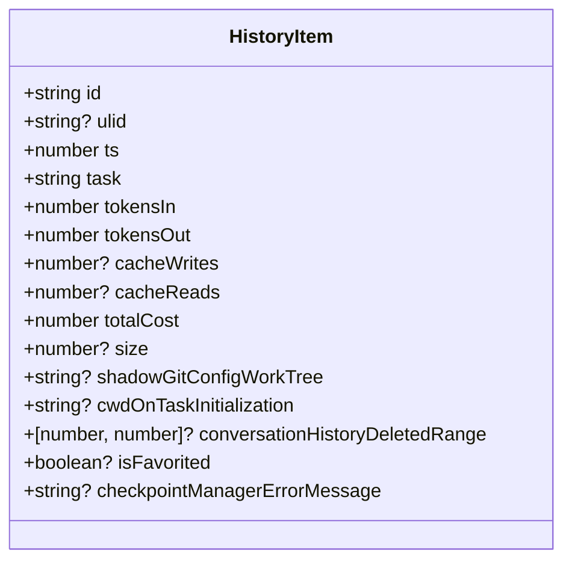
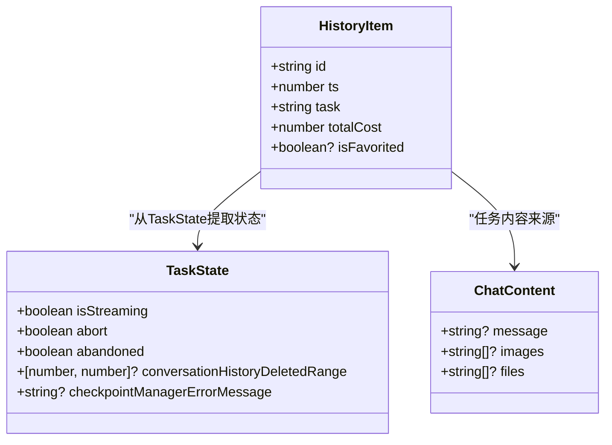
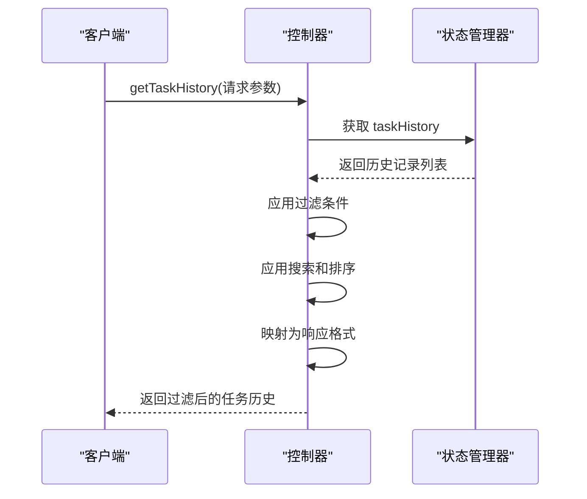
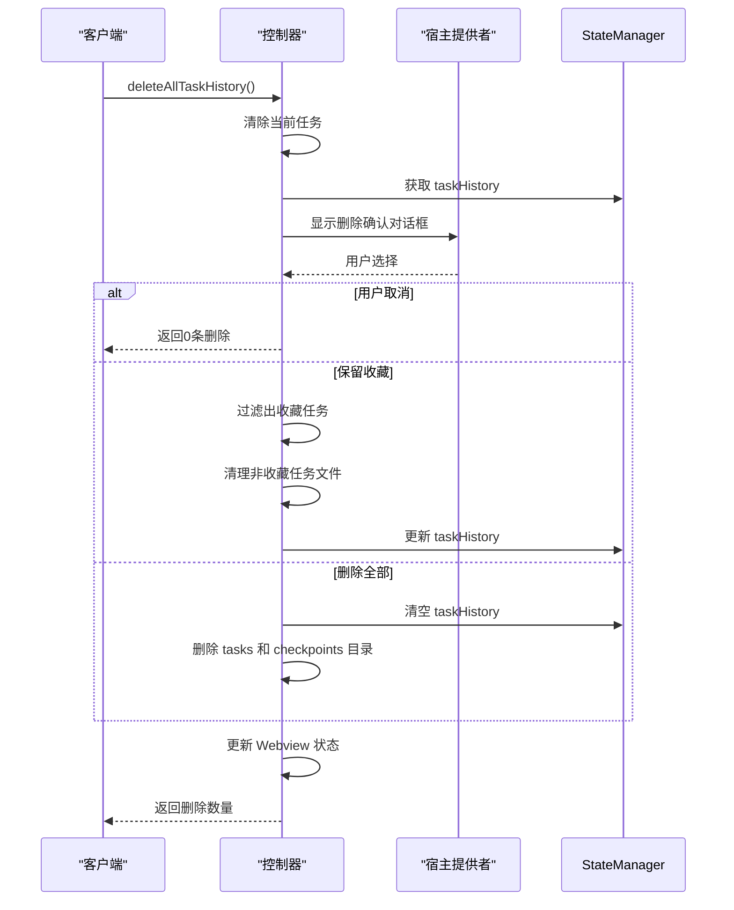

# HistoryItem模型

<cite>
**本文档中引用的文件**  
- [HistoryItem.ts](file://src/shared/HistoryItem.ts)
- [TaskState.ts](file://src/core/task/TaskState.ts)
- [ChatContent.ts](file://src/shared/ChatContent.ts)
- [getTaskHistory.ts](file://src/core/controller/task/getTaskHistory.ts)
- [deleteAllTaskHistory.ts](file://src/core/controller/task/deleteAllTaskHistory.ts)
</cite>

## 目录
1. [简介](#简介)
2. [数据模型结构](#数据模型结构)
3. [字段详解](#字段详解)
4. [与其他模型的关系](#与其他模型的关系)
5. [生成机制](#生成机制)
6. [控制器命令使用](#控制器命令使用)
7. [查询与过滤示例](#查询与过滤示例)

## 简介
`HistoryItem` 数据模型用于在内存和持久化存储中表示一个已完成或已取消的任务记录。该模型由 `Task` 模块在任务结束时生成，包含任务的关键元数据、成本信息以及上下文快照。它支持用户对历史任务进行查询、过滤和管理，是任务历史功能的核心数据结构。

**Section sources**
- [HistoryItem.ts](file://src/shared/HistoryItem.ts#L1-L18)

## 数据模型结构
`HistoryItem` 是一个 TypeScript 类型定义，表示单个任务的历史记录条目。该模型包含任务标识、时间戳、成本估算、上下文信息以及用户偏好设置等字段。

**Diagram sources**
- [HistoryItem.ts](file://src/shared/HistoryItem.ts#L1-L18)

**Section sources**
- [HistoryItem.ts](file://src/shared/HistoryItem.ts#L1-L18)

## 字段详解
`HistoryItem` 模型包含以下字段：

- **id**: 唯一标识符，用于区分不同的任务历史记录。
- **ulid**: 可选的 ULID（通用唯一字典序标识符），用于更精确的跟踪和指标分析。
- **ts**: 时间戳，表示任务创建或完成的时间（毫秒级）。
- **task**: 任务描述文本，通常为用户输入的指令或任务标题。
- **tokensIn**: 输入 token 数量，表示发送给模型的输入数据量。
- **tokensOut**: 输出 token 数量，表示模型生成的输出数据量。
- **cacheWrites**: 可选，缓存写入次数，用于衡量缓存使用情况。
- **cacheReads**: 可选，缓存读取次数，反映缓存命中率。
- **totalCost**: 总成本估算，基于 token 使用量和其他资源消耗计算得出。
- **size**: 可选，任务相关数据的大小（字节）。
- **shadowGitConfigWorkTree**: 可选，旧版 Git 工作树路径，用于确定任务所属的工作区。
- **cwdOnTaskInitialization**: 可选，任务初始化时的当前工作目录路径，用于更准确地识别任务所属工作区。
- **conversationHistoryDeletedRange**: 可选，对话历史中被删除内容的时间范围。
- **isFavorited**: 可选布尔值，标记该任务是否被用户收藏。
- **checkpointManagerErrorMessage**: 可选，检查点管理器在任务执行过程中遇到的错误消息。

**Section sources**
- [HistoryItem.ts](file://src/shared/HistoryItem.ts#L1-L18)

## 与其他模型的关系
`HistoryItem` 模型与 `TaskState` 和 `ChatContent` 模型存在紧密关系：

- `TaskState` 包含任务执行过程中的完整状态信息，包括流式传输标志、内容处理状态、上下文历史、工具执行标志和错误跟踪等。当任务结束时，`Task` 模块会从 `TaskState` 中提取关键信息并生成 `HistoryItem`。
- `ChatContent` 是一个接口，定义了聊天消息的内容结构，包括可选的消息文本、图像和文件列表。`HistoryItem` 中的 `task` 字段可能来源于 `ChatContent` 的消息内容。

**Diagram sources**
- [HistoryItem.ts](file://src/shared/HistoryItem.ts#L1-L18)
- [TaskState.ts](file://src/core/task/TaskState.ts#L1-L65)
- [ChatContent.ts](file://src/shared/ChatContent.ts#L1-L5)

**Section sources**
- [HistoryItem.ts](file://src/shared/HistoryItem.ts#L1-L18)
- [TaskState.ts](file://src/core/task/TaskState.ts#L1-L65)
- [ChatContent.ts](file://src/shared/ChatContent.ts#L1-L5)

## 生成机制
`HistoryItem` 模型在任务结束时由 `Task` 模块生成。当任务完成或被取消时，系统会收集当前 `TaskState` 中的关键信息（如 token 使用量、成本、时间戳、收藏状态等），并结合任务上下文（如工作目录路径）创建一个新的 `HistoryItem` 实例，然后将其添加到全局状态管理器的 `taskHistory` 列表中。

**Section sources**
- [TaskState.ts](file://src/core/task/TaskState.ts#L1-L65)
- [HistoryItem.ts](file://src/shared/HistoryItem.ts#L1-L18)

## 控制器命令使用
`HistoryItem` 模型在控制器命令中被广泛使用，主要涉及两个核心功能：获取任务历史和删除所有任务历史。

### 获取任务历史 (`getTaskHistory`)
`getTaskHistory` 函数用于根据过滤条件查询任务历史记录。支持按收藏状态、当前工作区、搜索关键词和排序方式等条件进行筛选。

**Diagram sources**
- [getTaskHistory.ts](file://src/core/controller/task/getTaskHistory.ts#L1-L116)

**Section sources**
- [getTaskHistory.ts](file://src/core/controller/task/getTaskHistory.ts#L1-L116)

### 删除所有任务历史 (`deleteAllTaskHistory`)
`deleteAllTaskHistory` 函数用于删除所有任务历史记录，支持保留收藏任务的选项。执行时会弹出确认对话框，用户可选择删除全部或仅删除非收藏任务。

**Diagram sources**
- [deleteAllTaskHistory.ts](file://src/core/controller/task/deleteAllTaskHistory.ts#L1-L154)

**Section sources**
- [deleteAllTaskHistory.ts](file://src/core/controller/task/deleteAllTaskHistory.ts#L1-L154)

## 查询与过滤示例
以下是一些常见的查询和过滤操作示例：

- **获取所有任务（按最新排序）**：调用 `getTaskHistory` 不带任何参数，默认返回按时间倒序排列的所有任务。
- **仅获取收藏任务**：设置 `favoritesOnly: true` 参数，返回所有被标记为收藏的任务。
- **获取当前工作区的任务**：设置 `currentWorkspaceOnly: true` 参数，系统会根据 `cwdOnTaskInitialization` 或 `shadowGitConfigWorkTree` 匹配当前工作区路径。
- **搜索包含特定关键词的任务**：提供 `searchQuery` 参数（如 "修复登录问题"），系统将对 `task` 字段进行模糊匹配。
- **按成本排序**：设置 `sortBy: "mostExpensive"`，返回按总成本从高到低排序的任务列表。

**Section sources**
- [getTaskHistory.ts](file://src/core/controller/task/getTaskHistory.ts#L1-L116)