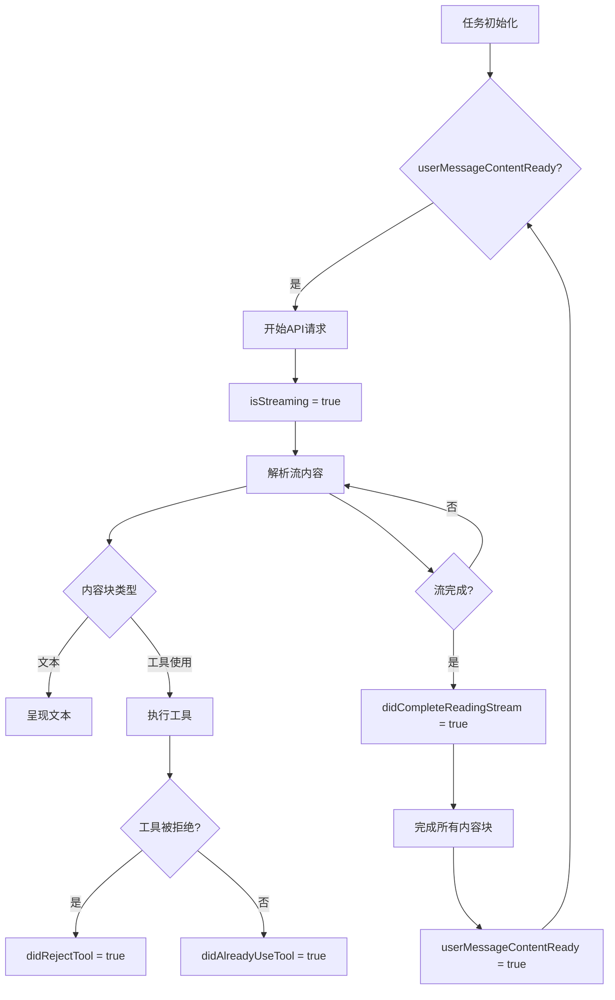
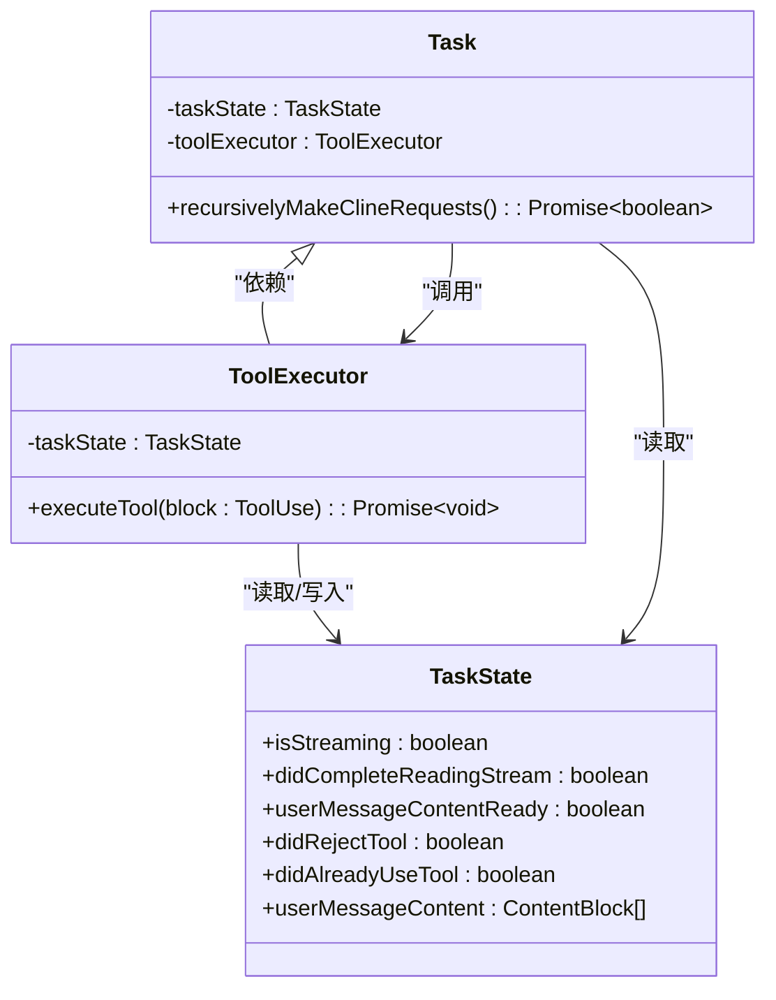

# TaskState模型

<cite>
**本文档中引用的文件**
- [TaskState.ts](file://src/core/task/TaskState.ts)
- [ToolExecutor.ts](file://src/core/task/ToolExecutor.ts)
- [index.ts](file://src/core/task/index.ts)
</cite>

## 目录
1. [简介](#简介)
2. [核心状态属性](#核心状态属性)
3. [状态转换与执行流程](#状态转换与执行流程)
4. [任务上下文管理](#任务上下文管理)
5. [与ToolExecutor的交互](#与toolexecutor的交互)
6. [序列化与持久化](#序列化与持久化)
7. [错误处理与恢复](#错误处理与恢复)
8. [总结](#总结)

## 简介

`TaskState` 类是任务执行系统的核心状态机，负责管理任务从初始化到完成或取消的整个生命周期。它不仅跟踪任务的当前执行状态，还管理与任务相关的上下文、历史记录、工具调用以及用户交互。该模型作为任务执行的单一事实来源，确保了系统各组件（如 `ToolExecutor` 和 `Task` 模块）之间的状态一致性。

`TaskState` 通过一系列布尔标志和计数器来精确控制任务的执行流程，例如 `isStreaming`、`didCompleteReadingStream` 和 `userMessageContentReady` 等，这些状态共同决定了任务何时可以接收用户输入、何时可以继续执行下一个请求。此外，它还支持复杂的交互模式，如计划模式（plan mode）和执行模式（act mode），并能处理任务的暂停、取消和恢复。

**Section sources**
- [TaskState.ts](file://src/core/task/TaskState.ts#L4-L64)

## 核心状态属性

`TaskState` 类通过多个属性组来定义和管理任务的复杂状态。

### 流式传输与内容处理
该模型使用一组标志来精确控制流式传输过程。`isStreaming` 表示当前是否有活动的API流，`isWaitingForFirstChunk` 表示正在等待流的第一个数据块，而 `didCompleteReadingStream` 表示流的读取已经完成。在内容处理方面，`currentStreamingContentIndex` 跟踪当前正在处理的助手消息内容块的索引，`assistantMessageContent` 存储从API流解析出的完整内容块数组，`userMessageContent` 存储需要返回给API的用户响应内容。

### 用户交互与响应处理
`TaskState` 管理与用户的交互流程。`askResponse` 及其相关属性（`askResponseText`、`askResponseImages`、`askResponseFiles`）用于存储用户对 `ask` 请求的响应。`lastMessageTs` 记录最后一条消息的时间戳，用于同步和去重。当任务处于计划模式时，`isAwaitingPlanResponse` 标志表示正在等待用户对计划的确认。

### 工具执行与任务控制
该模型严格控制工具的执行。`didRejectTool` 标志表示用户已拒绝执行某个工具，这将中断当前的响应流。`didAlreadyUseTool` 确保在单个消息中只执行一个工具。`abort` 和 `abandoned` 标志分别表示任务已被用户取消和实例已被废弃，用于安全地中止所有正在进行的操作。

### 错误与性能跟踪
为了提高系统的健壮性，`TaskState` 包含了错误跟踪机制。`consecutiveMistakeCount` 记录连续的错误次数，当达到阈值时会提示用户。`consecutiveAutoApprovedRequestsCount` 跟踪自动批准的请求数量，用于实现自动批准的配额限制。`checkpointManagerErrorMessage` 存储检查点管理器的错误信息，以便在UI中显示。

**Section sources**
- [TaskState.ts](file://src/core/task/TaskState.ts#L4-L64)

## 状态转换与执行流程

`TaskState` 的状态转换由 `Task` 类和 `ToolExecutor` 协同驱动，形成一个闭环的执行流程。

### 初始化与启动
当一个新任务被创建时，`Task` 类会实例化一个 `TaskState` 对象，并将其 `isInitialized` 标志设置为 `true`。此时，`isStreaming` 为 `false`，`userMessageContentReady` 为 `true`，表示任务已准备好接收初始任务描述。

### 执行循环
任务的执行遵循一个递归的请求循环。当 `recursivelyMakeClineRequests` 函数被调用时，它会首先检查 `userMessageContentReady` 是否为 `true`。如果是，则开始一个新的API请求，将 `isStreaming` 设置为 `true`，并重置 `currentStreamingContentIndex` 和 `assistantMessageContent`。随着API流的进行，内容块被解析并添加到 `assistantMessageContent` 中，`presentAssistantMessage` 函数会根据 `currentStreamingContentIndex` 将内容呈现给用户。

### 状态转换触发
状态转换由特定事件触发。当一个工具使用块（`tool_use`）被解析时，`presentAssistantMessage` 会调用 `ToolExecutor.executeTool`。如果用户拒绝了工具，`ToolExecutor` 会将 `didRejectTool` 设置为 `true`，这会中断当前的流，并在 `presentAssistantMessage` 的下一次调用中导致 `userMessageContentReady` 被设置为 `true`，从而允许任务继续。当整个流读取完成时，`didCompleteReadingStream` 被设置为 `true`，并最终触发 `userMessageContentReady` 为 `true`，完成一个完整的执行周期。

**Diagram sources**
- [TaskState.ts](file://src/core/task/TaskState.ts#L4-L64)
- [index.ts](file://src/core/task/index.ts#L91-L2631)

## 任务上下文管理

`TaskState` 模型在管理任务上下文方面扮演着核心角色，它通过多个属性来跟踪任务的执行环境和历史。

### 执行堆栈与步骤跟踪
`apiRequestCount` 和 `apiRequestsSinceLastTodoUpdate` 用于跟踪API请求的总数以及自上次待办事项更新以来的请求数。这些计数器对于管理“焦点链”（Focus Chain）功能至关重要，该功能允许用户定义任务的待办事项列表。`currentFocusChainChecklist` 存储当前的待办事项列表，而 `todoListWasUpdatedByUser` 标志则指示该列表是否已被用户手动修改。

### 工具调用历史
虽然 `TaskState` 本身不直接存储完整的工具调用历史，但它通过 `userMessageContent` 数组间接管理。当一个工具执行完成后，其结果会通过 `ToolExecutor.pushToolResult` 方法被格式化并添加到 `userMessageContent` 中。这个数组随后会被作为用户消息的一部分发送回API，从而形成一个持续的上下文对话。

### 错误状态管理
`TaskState` 提供了多层次的错误状态管理。`consecutiveMistakeCount` 用于检测模型是否陷入循环或无法正确使用工具。`didAutomaticallyRetryFailedApiRequest` 标志表示系统是否已自动重试失败的API请求，这有助于防止无限重试循环。`checkpointManagerErrorMessage` 专门用于捕获和显示与版本控制检查点相关的错误，确保用户能及时了解潜在问题。

**Section sources**
- [TaskState.ts](file://src/core/task/TaskState.ts#L4-L64)

## 与ToolExecutor的交互

`TaskState` 与 `ToolExecutor` 之间存在着紧密的耦合关系，`TaskState` 作为 `ToolExecutor` 的输入和状态存储。

### 依赖注入
在 `ToolExecutor` 的构造函数中，`TaskState` 实例被作为参数传入。这使得 `ToolExecutor` 能够直接访问和修改任务状态。例如，在 `execute` 方法中，`ToolExecutor` 会检查 `taskState.didRejectTool` 和 `taskState.didAlreadyUseTool` 来决定是否执行当前工具。

### 状态变更与事件发布
`ToolExecutor` 通过修改 `TaskState` 的属性来发布状态变更事件。当一个工具被成功执行后，`pushToolResult` 方法会将结果推送到 `userMessageContent`，并设置 `taskState.didAlreadyUseTool = true`。这相当于发布了一个“工具已使用”事件，该事件会被 `Task` 类的主循环捕获，从而阻止在同一消息中执行其他工具。

### 订阅模式
`Task` 类的主循环（`recursivelyMakeClineRequests`）可以被视为一个订阅者，它持续“监听” `TaskState` 中关键属性的变化。特别是，它会等待 `userMessageContentReady` 变为 `true`，这表示当前的响应流已经完成，可以开始下一个请求。这种模式实现了松耦合的事件驱动架构，`ToolExecutor` 作为发布者，`Task` 作为订阅者。

**Diagram sources**
- [TaskState.ts](file://src/core/task/TaskState.ts#L4-L64)
- [ToolExecutor.ts](file://src/core/task/ToolExecutor.ts#L50-L405)
- [index.ts](file://src/core/task/index.ts#L91-L2631)

## 序列化与持久化

`TaskState` 模型本身不直接负责序列化和持久化，而是通过与 `Task` 和 `StateManager` 模块的协作来实现任务历史的持久化。

### 间接持久化
`TaskState` 的状态是通过 `Task` 类的 `messageStateHandler` 和 `stateManager` 间接持久化的。当任务状态发生变化时，`Task` 类会调用 `messageStateHandler.saveClineMessagesAndUpdateHistory()` 方法。这个方法会将当前的 `TaskState` 相关信息（如 `clineMessages` 和 `apiConversationHistory`）序列化为JSON并写入磁盘文件。

### 关键持久化点
持久化在多个关键点发生：
1.  **任务初始化**：当任务从历史记录中恢复时，`resumeTaskFromHistory` 方法会从磁盘加载之前保存的状态。
2.  **检查点保存**：在 `execute` 方法的 `try` 块末尾，无论工具执行成功与否，都会调用 `saveCheckpoint()`。这个方法最终会触发 `stateManager` 将当前状态写入磁盘。
3.  **任务取消**：在 `abortTask` 方法中，会进行最终的状态清理和持久化，确保任务的最终状态被正确记录。

### 序列化范围
并非 `TaskState` 的所有属性都会被直接序列化。例如，`isStreaming` 和 `presentAssistantMessageLocked` 这类运行时标志在任务重启时会被重置。真正被持久化的是那些构成任务上下文的数据，如 `assistantMessageContent`、`userMessageContent` 以及 `conversationHistoryDeletedRange`。这些数据足以在任务恢复时重建完整的对话历史和执行上下文。

**Section sources**
- [TaskState.ts](file://src/core/task/TaskState.ts#L4-L64)
- [ToolExecutor.ts](file://src/core/task/ToolExecutor.ts#L50-L405)
- [index.ts](file://src/core/task/index.ts#L91-L2631)

## 错误处理与恢复

`TaskState` 模型通过其状态属性为系统的错误处理和恢复机制提供了坚实的基础。

### 异常情况下的状态恢复
在异常情况下，`TaskState` 的设计允许任务安全地恢复。例如，当API流因错误而中断时，`ToolExecutor.handleError` 方法会被调用。它会将错误信息添加到 `userMessageContent` 中，并调用 `saveCheckpoint`。这确保了错误上下文被持久化。当任务恢复时，`Task` 类的主循环会从 `userMessageContentReady` 为 `true` 的状态开始，将错误信息作为新的用户输入发送给API，从而引导模型纠正错误。

### 任务取消与中止
`TaskState` 提供了清晰的取消和中止机制。`abort` 标志是一个全局的取消信号。当它被设置为 `true` 时，`Task` 类的主循环和 `presentAssistantMessage` 函数都会检查此标志并提前返回。`didFinishAbortingStream` 标志用于通知外部系统（如VS Code扩展）流的中止已经完成，可以安全地清理资源。`abandoned` 标志则用于处理更极端的情况，如扩展进程被终止，确保被废弃的实例不会干扰新的任务实例。

### 自动恢复机制
`TaskState` 支持自动恢复。`didAutomaticallyRetryFailedApiRequest` 标志与 `handleContextWindowExceededError` 方法结合，实现了在上下文窗口溢出时的自动截断和重试。系统会先尝试自动恢复，只有在自动恢复失败后才会向用户请求手动干预，这极大地提升了用户体验。

**Section sources**
- [TaskState.ts](file://src/core/task/TaskState.ts#L4-L64)
- [ToolExecutor.ts](file://src/core/task/ToolExecutor.ts#L50-L405)
- [index.ts](file://src/core/task/index.ts#L91-L2631)

## 总结

`TaskState` 模型是整个任务执行系统的核心，它通过精心设计的状态属性和转换逻辑，有效地管理了任务的生命周期。它不仅是一个简单的数据容器，更是一个动态的状态机，协调着 `Task`、`ToolExecutor` 和持久化层之间的复杂交互。其设计体现了清晰的关注点分离：`TaskState` 负责状态定义，`ToolExecutor` 负责状态变更，而 `Task` 类负责基于状态的流程控制。这种架构使得系统既灵活又健壮，能够处理从正常执行到各种异常情况的完整场景。通过与 `StateManager` 的协作，`TaskState` 确保了任务历史的可靠持久化，为用户提供了无缝的任务恢复体验。