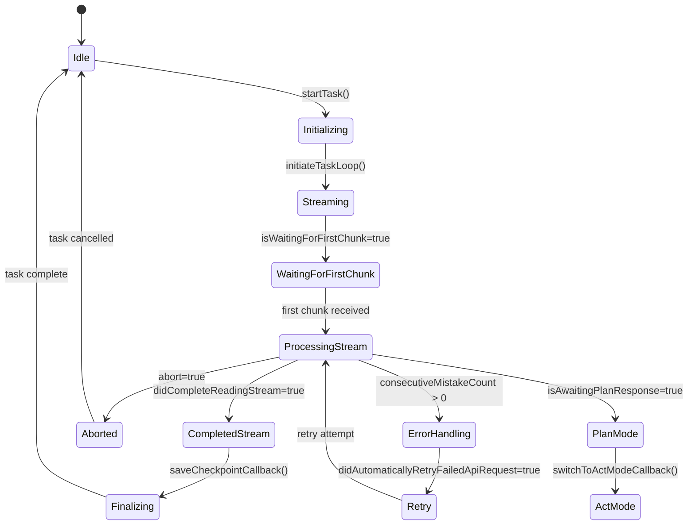
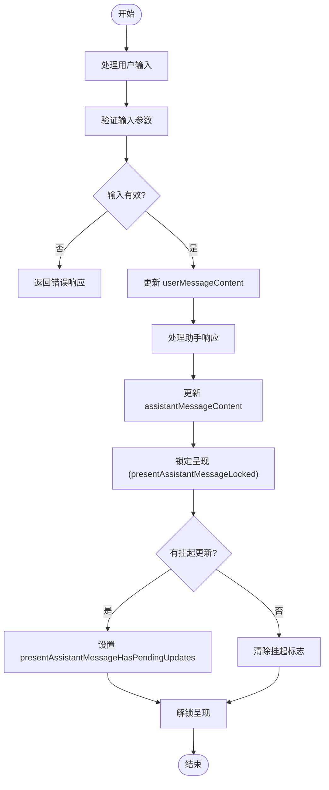
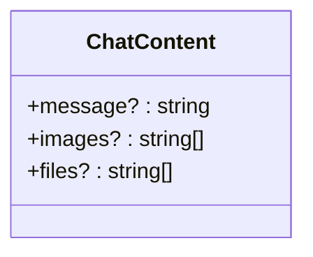
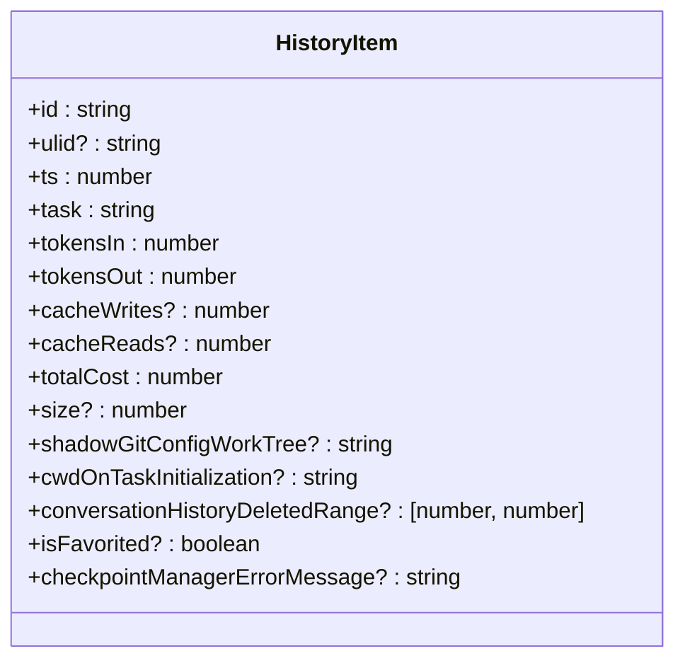
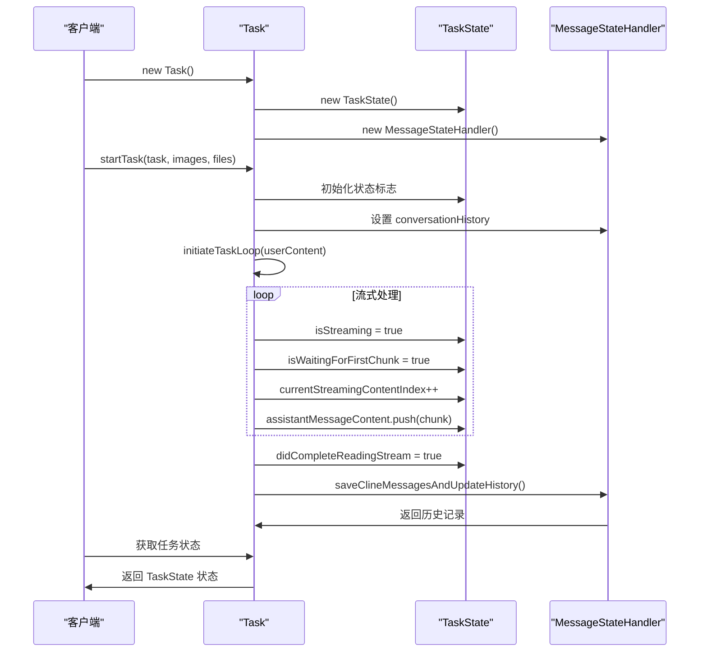

# 运行时状态模型

<cite>
**本文档中引用的文件**  
- [TaskState.ts](file://src/core/task/TaskState.ts)
- [ChatContent.ts](file://src/shared/ChatContent.ts)
- [HistoryItem.ts](file://src/shared/HistoryItem.ts)
- [message-state.ts](file://src/core/task/message-state.ts)
- [index.ts](file://src/core/task/index.ts)
</cite>

## 目录
1. [简介](#简介)
2. [核心组件](#核心组件)
3. [状态机设计](#状态机设计)
4. [任务上下文与消息处理](#任务上下文与消息处理)
5. [数据模型定义](#数据模型定义)
6. [模型间关系与数据流](#模型间关系与数据流)
7. [实际使用示例](#实际使用示例)
8. [结论](#结论)

## 简介
本文档详细解析 `cline` 运行时状态模型的核心实现，重点分析 `TaskState` 类的状态机设计、`ChatContent` 接口的消息结构定义以及 `HistoryItem` 类型的历史记录表示。通过深入探讨这些核心模型的实现细节和相互关系，为开发者提供全面的理解和使用指导。

## 核心组件

本文档深入分析 `cline` 运行时状态模型的三个核心组件：`TaskState`、`ChatContent` 和 `HistoryItem`。这些组件共同构成了任务执行、消息交互和历史追踪的基础架构。

**Section sources**
- [TaskState.ts](file://src/core/task/TaskState.ts#L4-L64)
- [ChatContent.ts](file://src/shared/ChatContent.ts#L0-L4)
- [HistoryItem.ts](file://src/shared/HistoryItem.ts#L0-L17)

## 状态机设计

`TaskState` 类是 `cline` 任务执行状态的核心管理器，它通过一系列布尔标志和计数器来跟踪任务的生命周期和内部状态。该类的设计体现了复杂的状态机模式，用于管理从任务初始化到完成或取消的整个流程。



**Diagram sources**
- [TaskState.ts](file://src/core/task/TaskState.ts#L4-L64)
- [index.ts](file://src/core/task/index.ts#L300-L350)

**Section sources**
- [TaskState.ts](file://src/core/task/TaskState.ts#L4-L64)
- [index.ts](file://src/core/task/index.ts#L300-L350)

## 任务上下文与消息处理

`TaskState` 类不仅管理任务状态，还负责处理用户和助手的消息内容。它通过 `userMessageContent` 和 `assistantMessageContent` 数组来存储和管理对话的上下文，确保消息的正确传递和呈现。



**Diagram sources**
- [TaskState.ts](file://src/core/task/TaskState.ts#L10-L20)
- [message-state.ts](file://src/core/task/message-state.ts#L100-L150)

**Section sources**
- [TaskState.ts](file://src/core/task/TaskState.ts#L10-L20)
- [message-state.ts](file://src/core/task/message-state.ts#L100-L150)

## 数据模型定义

### ChatContent 接口
`ChatContent` 接口定义了聊天消息的基本结构，支持文本、图片和文件三种类型的内容。该接口作为消息传递的基础类型，被广泛用于用户输入和AI响应的表示。



**Diagram sources**
- [ChatContent.ts](file://src/shared/ChatContent.ts#L0-L4)

### HistoryItem 类型
`HistoryItem` 类型定义了任务历史记录的数据结构，包含了任务的元数据、执行统计和成本信息。该类型用于持久化存储任务的历史信息，支持任务的恢复和分析。



**Diagram sources**
- [HistoryItem.ts](file://src/shared/HistoryItem.ts#L0-L17)

**Section sources**
- [ChatContent.ts](file://src/shared/ChatContent.ts#L0-L4)
- [HistoryItem.ts](file://src/shared/HistoryItem.ts#L0-L17)

## 模型间关系与数据流

以下图表展示了 `TaskState`、`ChatContent` 和 `HistoryItem` 三个核心模型之间的关系和数据流转过程。`TaskState` 作为中心组件，管理着任务的执行状态，并与消息内容和历史记录进行交互。

```mermaid
erDiagram
TaskState ||--o{ ChatContent : "包含"
TaskState ||--o{ HistoryItem : "生成"
ChatContent }o--|| HistoryItem : "构成历史记录"
class TaskState {
isStreaming: boolean
isWaitingForFirstChunk: boolean
didCompleteReadingStream: boolean
currentStreamingContentIndex: number
assistantMessageContent: AssistantMessageContent[]
userMessageContent: (TextBlockParam | ImageBlockParam)[]
presentAssistantMessageLocked: boolean
presentAssistantMessageHasPendingUpdates: boolean
askResponse?: ClineAskResponse
askResponseText?: string
askResponseImages?: string[]
askResponseFiles?: string[]
lastMessageTs?: number
isAwaitingPlanResponse: boolean
didRespondToPlanAskBySwitchingMode: boolean
conversationHistoryDeletedRange?: [number, number]
didRejectTool: boolean
didAlreadyUseTool: boolean
didEditFile: boolean
consecutiveAutoApprovedRequestsCount: number
consecutiveMistakeCount: number
didAutomaticallyRetryFailedApiRequest: boolean
checkpointManagerErrorMessage?: string
isInitialized: boolean
apiRequestCount: number
apiRequestsSinceLastTodoUpdate: number
currentFocusChainChecklist: string | null
todoListWasUpdatedByUser: boolean
abort: boolean
didFinishAbortingStream: boolean
abandoned: boolean
currentlySummarizing: boolean
lastAutoCompactTriggerIndex?: number
}
class ChatContent {
message?: string
images?: string[]
files?: string[]
}
class HistoryItem {
id: string
ulid?: string
ts: number
task: string
tokensIn: number
tokensOut: number
cacheWrites?: number
cacheReads?: number
totalCost: number
size?: number
shadowGitConfigWorkTree?: string
cwdOnTaskInitialization?: string
conversationHistoryDeletedRange?: [number, number]
isFavorited?: boolean
checkpointManagerErrorMessage?: string
}
```

**Diagram sources**
- [TaskState.ts](file://src/core/task/TaskState.ts#L4-L64)
- [ChatContent.ts](file://src/shared/ChatContent.ts#L0-L4)
- [HistoryItem.ts](file://src/shared/HistoryItem.ts#L0-L17)

**Section sources**
- [TaskState.ts](file://src/core/task/TaskState.ts#L4-L64)
- [ChatContent.ts](file://src/shared/ChatContent.ts#L0-L4)
- [HistoryItem.ts](file://src/shared/HistoryItem.ts#L0-L17)

## 实际使用示例

以下代码示例展示了如何创建、更新和查询 `TaskState` 对象，以及如何使用 `ChatContent` 和 `HistoryItem` 模型。



**Diagram sources**
- [TaskState.ts](file://src/core/task/TaskState.ts#L4-L64)
- [index.ts](file://src/core/task/index.ts#L300-L350)
- [message-state.ts](file://src/core/task/message-state.ts#L100-L150)

**Section sources**
- [TaskState.ts](file://src/core/task/TaskState.ts#L4-L64)
- [index.ts](file://src/core/task/index.ts#L300-L350)
- [message-state.ts](file://src/core/task/message-state.ts#L100-L150)

## 结论
`cline` 的运行时状态模型通过 `TaskState`、`ChatContent` 和 `HistoryItem` 三个核心组件，构建了一个完整、健壮的任务执行和管理框架。`TaskState` 类的状态机设计确保了任务生命周期的精确控制，`ChatContent` 接口提供了灵活的消息表示，而 `HistoryItem` 类型则实现了任务历史的持久化存储。这些组件之间的紧密协作，为 `cline` 的核心功能提供了坚实的基础。