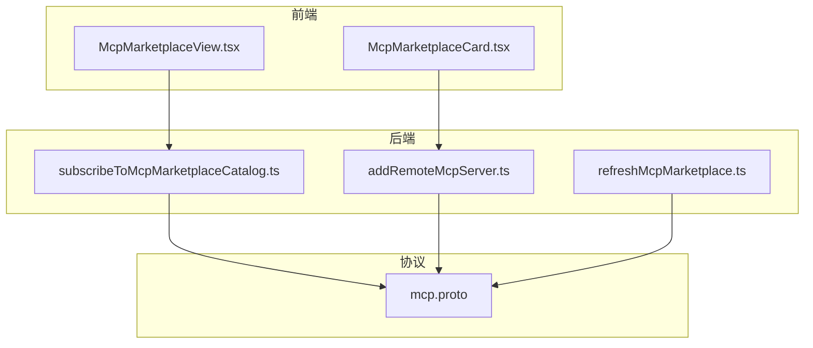
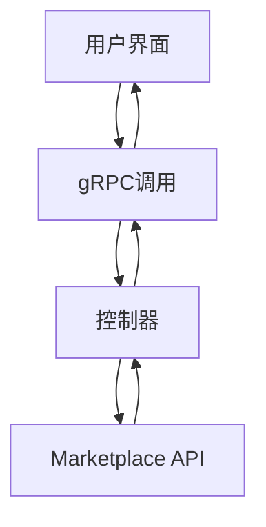
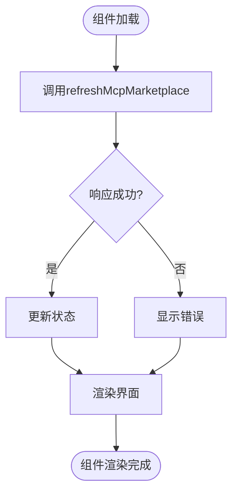
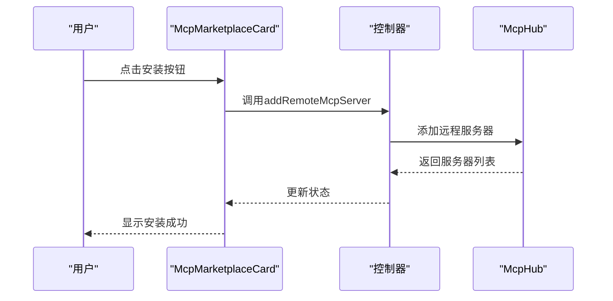
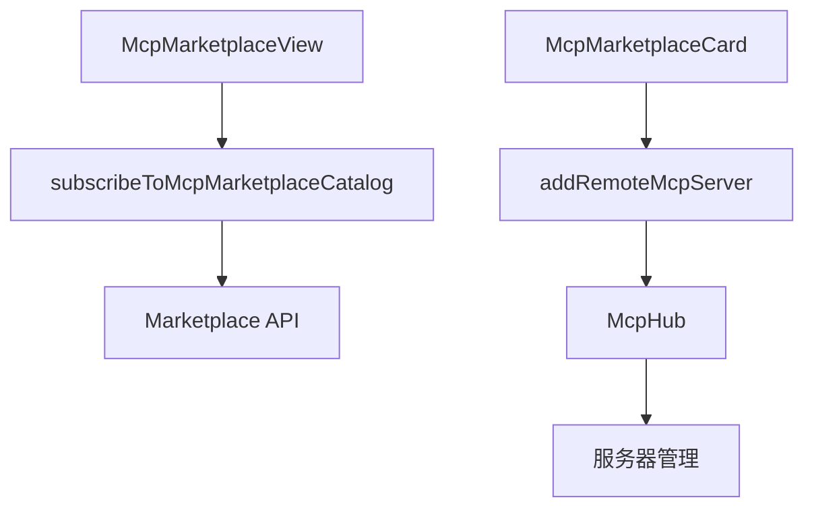

# MCP Marketplace集成

<cite>
**本文档中引用的文件**  
- [McpMarketplaceView.tsx](file://webview-ui/src/components/mcp/configuration/tabs/marketplace/McpMarketplaceView.tsx)
- [McpMarketplaceCard.tsx](file://webview-ui/src/components/mcp/configuration/tabs/marketplace/McpMarketplaceCard.tsx)
- [mcp.proto](file://proto/cline/mcp.proto)
- [subscribeToMcpMarketplaceCatalog.ts](file://src/core/controller/mcp/subscribeToMcpMarketplaceCatalog.ts)
- [addRemoteMcpServer.ts](file://src/core/controller/mcp/addRemoteMcpServer.ts)
- [refreshMcpMarketplace.ts](file://src/core/controller/mcp/refreshMcpMarketplace.ts)
- [index.ts](file://src/core/controller/index.ts)
</cite>

## 目录
1. [简介](#简介)
2. [项目结构](#项目结构)
3. [核心组件](#核心组件)
4. [架构概述](#架构概述)
5. [详细组件分析](#详细组件分析)
6. [依赖分析](#依赖分析)
7. [性能考虑](#性能考虑)
8. [故障排除指南](#故障排除指南)
9. [结论](#结论)

## 简介
本文档详细记录了MCP Marketplace的集成实现。描述了用户如何通过Webview界面浏览Marketplace、查看服务器详情并安装远程MCP服务器。解释了`subscribeToMcpMarketplaceCatalog`服务调用如何获取服务器列表，以及`addRemoteMcpServer`控制器命令如何处理安装流程。详述了服务器状态管理、认证机制和工具权限控制。提供了界面交互流程图和状态转换说明，包括错误处理（如网络失败、认证拒绝）。包含从Marketplace安装服务器的实际代码示例和调试技巧。

## 项目结构
项目结构清晰地组织了MCP Marketplace相关的前端和后端组件。前端组件位于`webview-ui`目录下，主要负责用户界面的展示和交互。后端逻辑和控制器位于`src/core/controller/mcp`目录下，处理与MCP Marketplace的通信和业务逻辑。协议定义位于`proto/cline/mcp.proto`文件中，定义了服务接口和数据结构。

**图示来源**  
- [McpMarketplaceView.tsx](file://webview-ui/src/components/mcp/configuration/tabs/marketplace/McpMarketplaceView.tsx)
- [McpMarketplaceCard.tsx](file://webview-ui/src/components/mcp/configuration/tabs/marketplace/McpMarketplaceCard.tsx)
- [subscribeToMcpMarketplaceCatalog.ts](file://src/core/controller/mcp/subscribeToMcpMarketplaceCatalog.ts)
- [addRemoteMcpServer.ts](file://src/core/controller/mcp/addRemoteMcpServer.ts)
- [refreshMcpMarketplace.ts](file://src/core/controller/mcp/refreshMcpMarketplace.ts)
- [mcp.proto](file://proto/cline/mcp.proto)

**本节来源**  
- [McpMarketplaceView.tsx](file://webview-ui/src/components/mcp/configuration/tabs/marketplace/McpMarketplaceView.tsx)
- [McpMarketplaceCard.tsx](file://webview-ui/src/components/mcp/configuration/tabs/marketplace/McpMarketplaceCard.tsx)
- [mcp.proto](file://proto/cline/mcp.proto)
- [subscribeToMcpMarketplaceCatalog.ts](file://src/core/controller/mcp/subscribeToMcpMarketplaceCatalog.ts)
- [addRemoteMcpServer.ts](file://src/core/controller/mcp/addRemoteMcpServer.ts)
- [refreshMcpMarketplace.ts](file://src/core/controller/mcp/refreshMcpMarketplace.ts)

## 核心组件
MCP Marketplace集成的核心组件包括前端的`McpMarketplaceView`和`McpMarketplaceCard`，以及后端的`subscribeToMcpMarketplaceCatalog`和`addRemoteMcpServer`控制器。这些组件协同工作，实现了Marketplace的浏览、服务器详情查看和远程服务器安装功能。

**本节来源**  
- [McpMarketplaceView.tsx](file://webview-ui/src/components/mcp/configuration/tabs/marketplace/McpMarketplaceView.tsx)
- [McpMarketplaceCard.tsx](file://webview-ui/src/components/mcp/configuration/tabs/marketplace/McpMarketplaceCard.tsx)
- [subscribeToMcpMarketplaceCatalog.ts](file://src/core/controller/mcp/subscribeToMcpMarketplaceCatalog.ts)
- [addRemoteMcpServer.ts](file://src/core/controller/mcp/addRemoteMcpServer.ts)

## 架构概述
MCP Marketplace的架构分为前端、后端和协议三层。前端负责用户界面的展示和交互，后端处理业务逻辑和与Marketplace的通信，协议定义了服务接口和数据结构。前端通过gRPC调用后端服务，后端服务通过HTTP请求与Marketplace API通信。

**图示来源**  
- [McpMarketplaceView.tsx](file://webview-ui/src/components/mcp/configuration/tabs/marketplace/McpMarketplaceView.tsx)
- [subscribeToMcpMarketplaceCatalog.ts](file://src/core/controller/mcp/subscribeToMcpMarketplaceCatalog.ts)
- [index.ts](file://src/core/controller/index.ts)

## 详细组件分析
### McpMarketplaceView分析
`McpMarketplaceView`组件负责展示Marketplace的主界面，包括服务器列表、搜索和筛选功能。它通过`subscribeToMcpMarketplaceCatalog`服务获取服务器列表，并在界面上展示。

#### 组件分析内容
`McpMarketplaceView`组件使用React的`useEffect`钩子在组件加载时调用`refreshMcpMarketplace`服务，获取服务器列表。列表数据通过`useState`钩子管理，并在界面上动态展示。用户可以通过搜索框和下拉菜单筛选服务器。

**图示来源**  
- [McpMarketplaceView.tsx](file://webview-ui/src/components/mcp/configuration/tabs/marketplace/McpMarketplaceView.tsx)

**本节来源**  
- [McpMarketplaceView.tsx](file://webview-ui/src/components/mcp/configuration/tabs/marketplace/McpMarketplaceView.tsx)

### McpMarketplaceCard分析
`McpMarketplaceCard`组件负责展示单个服务器的详情，包括名称、作者、描述和安装按钮。它通过`addRemoteMcpServer`服务处理服务器的安装流程。

#### 组件分析内容
`McpMarketplaceCard`组件接收服务器数据作为props，并在界面上展示。用户点击安装按钮时，组件调用`addRemoteMcpServer`服务，传入服务器名称和URL。安装过程中，组件显示加载状态，安装完成后更新界面。

**图示来源**  
- [McpMarketplaceCard.tsx](file://webview-ui/src/components/mcp/configuration/tabs/marketplace/McpMarketplaceCard.tsx)
- [addRemoteMcpServer.ts](file://src/core/controller/mcp/addRemoteMcpServer.ts)

**本节来源**  
- [McpMarketplaceCard.tsx](file://webview-ui/src/components/mcp/configuration/tabs/marketplace/McpMarketplaceCard.tsx)
- [addRemoteMcpServer.ts](file://src/core/controller/mcp/addRemoteMcpServer.ts)

## 依赖分析
MCP Marketplace集成依赖于多个组件和服务。前端组件依赖于后端控制器，后端控制器依赖于Marketplace API。协议文件定义了服务接口，确保前后端的通信一致性。

**图示来源**  
- [McpMarketplaceView.tsx](file://webview-ui/src/components/mcp/configuration/tabs/marketplace/McpMarketplaceView.tsx)
- [McpMarketplaceCard.tsx](file://webview-ui/src/components/mcp/configuration/tabs/marketplace/McpMarketplaceCard.tsx)
- [subscribeToMcpMarketplaceCatalog.ts](file://src/core/controller/mcp/subscribeToMcpMarketplaceCatalog.ts)
- [addRemoteMcpServer.ts](file://src/core/controller/mcp/addRemoteMcpServer.ts)
- [mcp.proto](file://proto/cline/mcp.proto)

**本节来源**  
- [McpMarketplaceView.tsx](file://webview-ui/src/components/mcp/configuration/tabs/marketplace/McpMarketplaceView.tsx)
- [McpMarketplaceCard.tsx](file://webview-ui/src/components/mcp/configuration/tabs/marketplace/McpMarketplaceCard.tsx)
- [subscribeToMcpMarketplaceCatalog.ts](file://src/core/controller/mcp/subscribeToMcpMarketplaceCatalog.ts)
- [addRemoteMcpServer.ts](file://src/core/controller/mcp/addRemoteMcpServer.ts)
- [mcp.proto](file://proto/cline/mcp.proto)

## 性能考虑
MCP Marketplace集成在性能方面考虑了多个因素。前端组件使用React的`useMemo`钩子优化列表渲染，减少不必要的重新渲染。后端服务使用缓存机制，减少对Marketplace API的重复请求。协议定义使用高效的二进制格式，减少网络传输开销。

## 故障排除指南
### 网络失败
如果用户无法加载Marketplace数据，可能是网络连接问题。建议检查网络连接，或尝试重新加载页面。

**本节来源**  
- [McpMarketplaceView.tsx](file://webview-ui/src/components/mcp/configuration/tabs/marketplace/McpMarketplaceView.tsx)
- [subscribeToMcpMarketplaceCatalog.ts](file://src/core/controller/mcp/subscribeToMcpMarketplaceCatalog.ts)

### 认证拒绝
如果用户无法安装远程服务器，可能是认证问题。建议检查服务器URL和认证信息，或联系服务器管理员。

**本节来源**  
- [McpMarketplaceCard.tsx](file://webview-ui/src/components/mcp/configuration/tabs/marketplace/McpMarketplaceCard.tsx)
- [addRemoteMcpServer.ts](file://src/core/controller/mcp/addRemoteMcpServer.ts)

## 结论
MCP Marketplace集成通过清晰的架构和高效的组件协作，实现了Marketplace的浏览、服务器详情查看和远程服务器安装功能。通过详细的文档和示例，开发者可以快速理解和使用该集成。