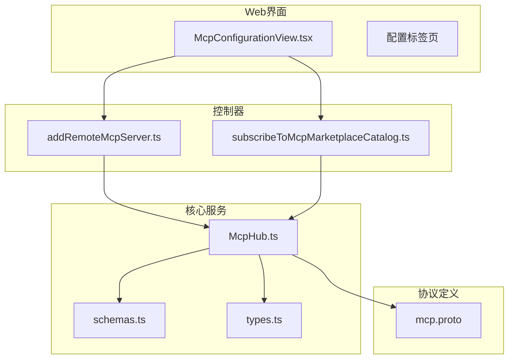
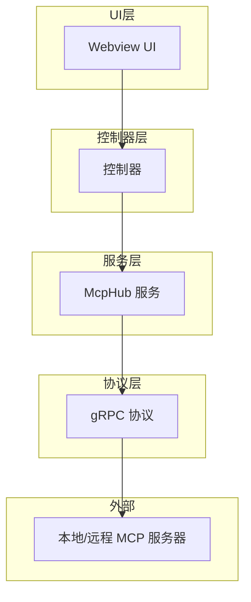
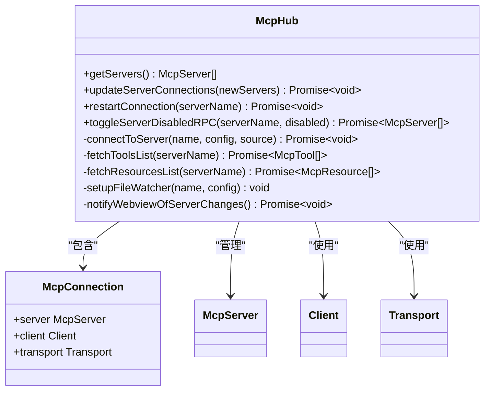
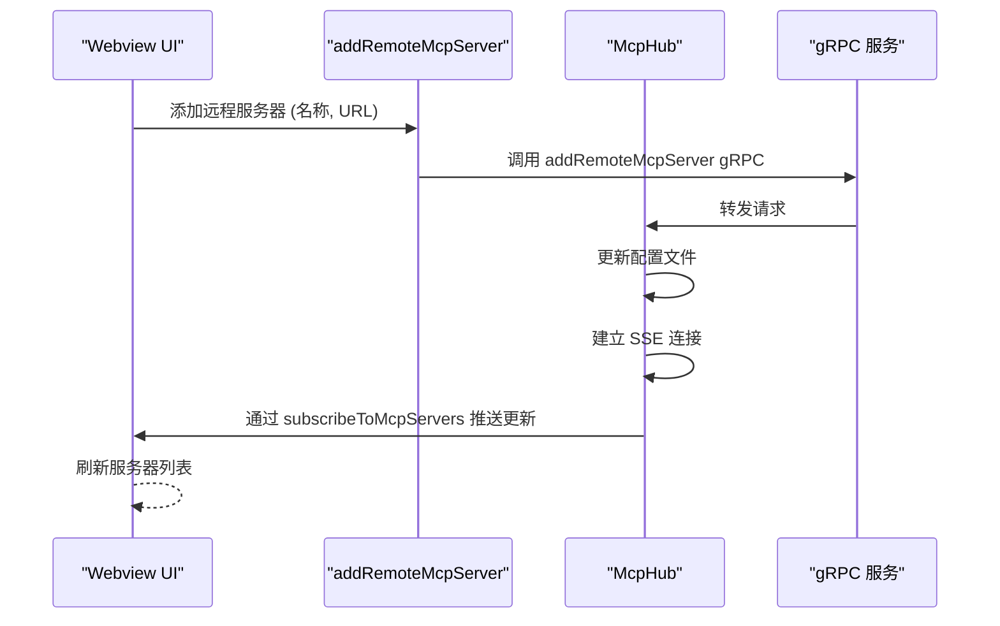
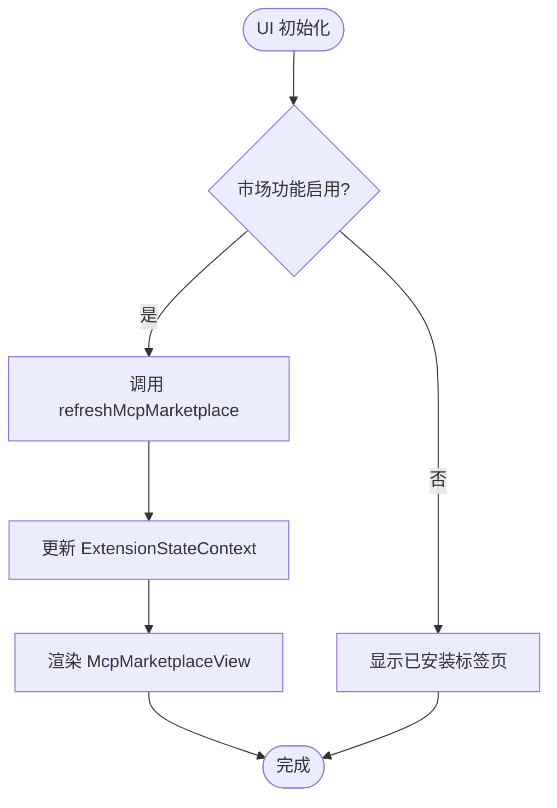
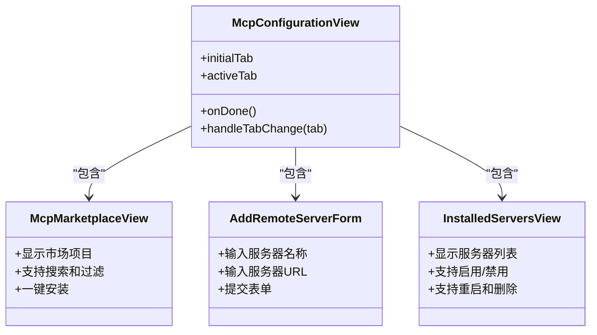
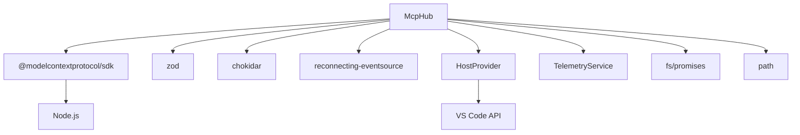

# MCP工具扩展

<cite>
**本文档中引用的文件**  
- [McpHub.ts](file://src/services/mcp/McpHub.ts)
- [mcp.proto](file://proto/cline/mcp.proto)
- [addRemoteMcpServer.ts](file://src/core/controller/mcp/addRemoteMcpServer.ts)
- [subscribeToMcpMarketplaceCatalog.ts](file://src/core/controller/mcp/subscribeToMcpMarketplaceCatalog.ts)
- [McpConfigurationView.tsx](file://webview-ui/src/components/mcp/configuration/McpConfigurationView.tsx)
- [schemas.ts](file://src/services/mcp/schemas.ts)
- [types.ts](file://src/services/mcp/types.ts)
</cite>

## 目录
1. [简介](#简介)
2. [项目结构](#项目结构)
3. [核心组件](#核心组件)
4. [架构概述](#架构概述)
5. [详细组件分析](#详细组件分析)
6. [依赖分析](#依赖分析)
7. [性能考虑](#性能考虑)
8. [故障排除指南](#故障排除指南)
9. [结论](#结论)

## 简介
本文档详细记录了“MCP工具扩展”功能，重点描述MCP（Model Context Protocol）Hub如何作为中心枢纽，管理本地和远程MCP服务器的发现、连接和调用。文档解释了`addRemoteMcpServer`控制器命令和`subscribeToMcpMarketplaceCatalog`的实现细节，详述用户如何通过Webview界面浏览MCP Marketplace、安装服务器并授权工具使用，并提供创建自定义MCP服务器的指南，包括`mcp.proto`的接口定义和认证流程。

## 项目结构
MCP功能模块分布在多个目录中，核心逻辑位于`src/services/mcp`，协议定义在`proto/cline`，用户界面在`webview-ui/src/components/mcp`。

**Diagram sources**
- [McpHub.ts](file://src/services/mcp/McpHub.ts)
- [mcp.proto](file://proto/cline/mcp.proto)
- [addRemoteMcpServer.ts](file://src/core/controller/mcp/addRemoteMcpServer.ts)
- [subscribeToMcpMarketplaceCatalog.ts](file://src/core/controller/mcp/subscribeToMcpMarketplaceCatalog.ts)
- [McpConfigurationView.tsx](file://webview-ui/src/components/mcp/configuration/McpConfigurationView.tsx)

**Section sources**
- [McpHub.ts](file://src/services/mcp/McpHub.ts)
- [mcp.proto](file://proto/cline/mcp.proto)
- [McpConfigurationView.tsx](file://webview-ui/src/components/mcp/configuration/McpConfigurationView.tsx)

## 核心组件
MCP工具扩展的核心是`McpHub`类，它作为中心枢纽管理所有MCP服务器的生命周期。`McpHub`负责建立连接、维护状态、处理工具调用，并通过gRPC服务向UI层广播状态更新。它支持多种传输协议（stdio, SSE, streamableHttp），并实现了自动重连和错误处理机制。

**Section sources**
- [McpHub.ts](file://src/services/mcp/McpHub.ts)
- [types.ts](file://src/services/mcp/types.ts)

## 架构概述
MCP系统采用分层架构，从下到上的层次为：协议层、服务层、控制器层和UI层。`mcp.proto`文件定义了所有gRPC服务和消息格式，`McpHub`实现了核心业务逻辑，控制器处理来自UI的命令，Webview提供用户交互界面。

**Diagram sources**
- [mcp.proto](file://proto/cline/mcp.proto)
- [McpHub.ts](file://src/services/mcp/McpHub.ts)
- [addRemoteMcpServer.ts](file://src/core/controller/mcp/addRemoteMcpServer.ts)

## 详细组件分析

### McpHub 服务分析
`McpHub`是MCP系统的中枢，负责管理所有服务器连接。它通过`connectToServer`方法建立连接，根据配置的`type`（stdio, sse, streamableHttp）创建相应的传输层。`watchMcpSettingsFile`方法监听配置文件变化，实现配置热更新。

#### 类图

**Diagram sources**
- [McpHub.ts](file://src/services/mcp/McpHub.ts)
- [types.ts](file://src/services/mcp/types.ts)

**Section sources**
- [McpHub.ts](file://src/services/mcp/McpHub.ts)

### 控制器命令分析
控制器命令作为UI与服务层的桥梁，将用户操作转换为对`McpHub`的调用。

#### addRemoteMcpServer 命令流程

**Diagram sources**
- [addRemoteMcpServer.ts](file://src/core/controller/mcp/addRemoteMcpServer.ts)
- [McpHub.ts](file://src/services/mcp/McpHub.ts)
- [mcp.proto](file://proto/cline/mcp.proto)

#### subscribeToMcpMarketplaceCatalog 流程

**Diagram sources**
- [subscribeToMcpMarketplaceCatalog.ts](file://src/core/controller/mcp/subscribeToMcpMarketplaceCatalog.ts)
- [McpConfigurationView.tsx](file://webview-ui/src/components/mcp/configuration/McpConfigurationView.tsx)

**Section sources**
- [addRemoteMcpServer.ts](file://src/core/controller/mcp/addRemoteMcpServer.ts)
- [subscribeToMcpMarketplaceCatalog.ts](file://src/core/controller/mcp/subscribeToMcpMarketplaceCatalog.ts)

### Webview 界面分析
Webview界面提供了用户友好的MCP服务器管理体验，包含市场、远程和已安装三个标签页。

#### McpConfigurationView 组件结构

**Diagram sources**
- [McpConfigurationView.tsx](file://webview-ui/src/components/mcp/configuration/McpConfigurationView.tsx)

**Section sources**
- [McpConfigurationView.tsx](file://webview-ui/src/components/mcp/configuration/McpConfigurationView.tsx)

## 依赖分析
MCP系统依赖于多个外部库和内部模块，形成了复杂的依赖网络。

**Diagram sources**
- [McpHub.ts](file://src/services/mcp/McpHub.ts)
- [package.json](file://package.json)

**Section sources**
- [McpHub.ts](file://src/services/mcp/McpHub.ts)

## 性能考虑
McpHub在性能方面进行了多项优化：
- 使用`chokidar`进行文件监听，支持原子写入和稳定性阈值，避免重复触发。
- 对MCP设置文件的读取和解析进行错误处理，防止格式错误导致整个系统崩溃。
- 在连接服务器时使用`deepEqual`进行配置比较，避免不必要的重连。
- 通过`notifyWebviewOfServerChanges`方法批量更新UI，减少gRPC调用次数。

## 故障排除指南
当MCP服务器连接出现问题时，可按以下步骤排查：

1. **检查配置文件**：确认`mcpSettings.json`文件格式正确，路径为`getSettingsDirectoryPath()/mcpSettings.json`。
2. **查看错误日志**：`McpHub`会将连接错误和stderr输出记录到控制台。
3. **验证服务器状态**：通过`getServers()`方法获取当前所有服务器状态。
4. **手动重启**：使用`restartConnection`方法尝试重新连接。
5. **检查网络**：对于SSE和HTTP服务器，确保URL可达且认证信息正确。

**Section sources**
- [McpHub.ts](file://src/services/mcp/McpHub.ts)
- [addRemoteMcpServer.ts](file://src/core/controller/mcp/addRemoteMcpServer.ts)

## 结论
MCP工具扩展通过`McpHub`中心枢纽实现了对本地和远程MCP服务器的统一管理。系统采用清晰的分层架构，通过gRPC协议实现前后端通信，提供了完整的服务器发现、连接、调用和监控功能。Webview界面使用户能够方便地浏览Marketplace、安装和管理服务器。该设计具有良好的扩展性和稳定性，为集成各种MCP服务器提供了坚实的基础。