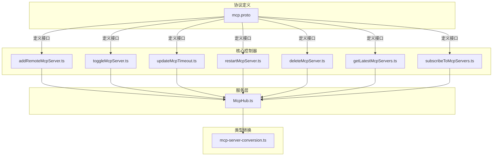
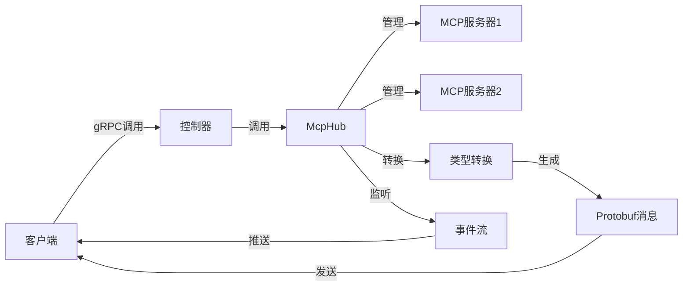
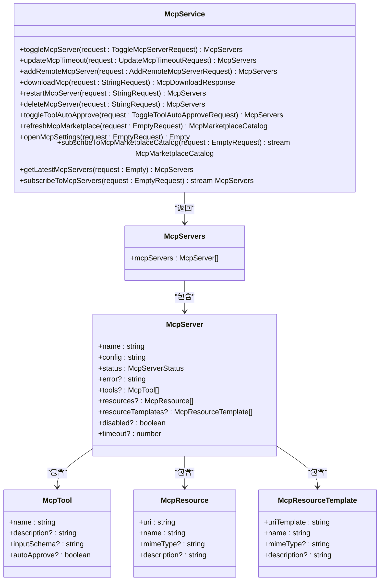
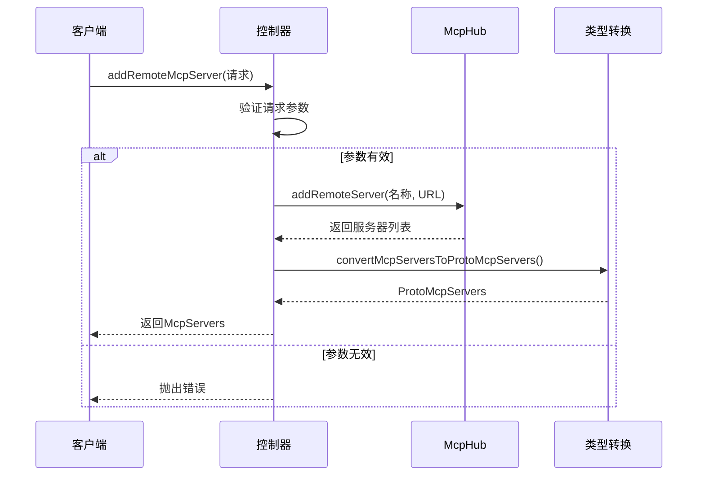
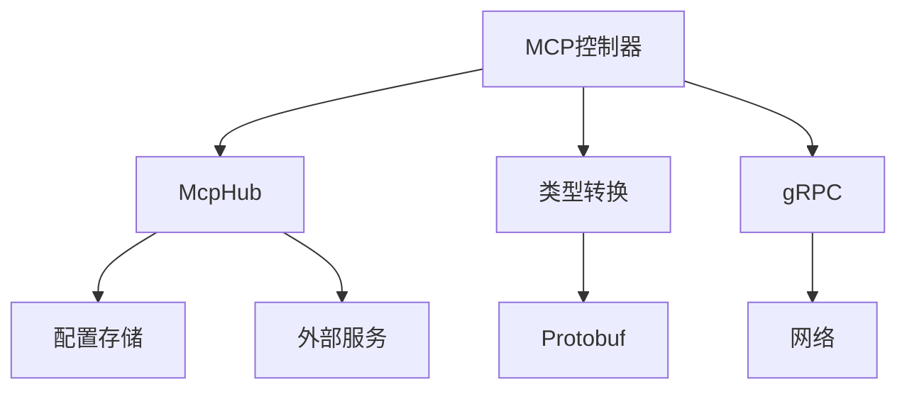

# 自定义MCP服务器开发

<cite>
**本文档中引用的文件**   
- [mcp.proto](file://proto/cline/mcp.proto)
- [subscribeToMcpServers.ts](file://src/core/controller/mcp/subscribeToMcpServers.ts)
- [addRemoteMcpServer.ts](file://src/core/controller/mcp/addRemoteMcpServer.ts)
- [toggleMcpServer.ts](file://src/core/controller/mcp/toggleMcpServer.ts)
- [updateMcpTimeout.ts](file://src/core/controller/mcp/updateMcpTimeout.ts)
- [restartMcpServer.ts](file://src/core/controller/mcp/restartMcpServer.ts)
- [deleteMcpServer.ts](file://src/core/controller/mcp/deleteMcpServer.ts)
- [getLatestMcpServers.ts](file://src/core/controller/mcp/getLatestMcpServers.ts)
- [McpHub.ts](file://src/services/mcp/McpHub.ts)
- [mcp-server-conversion.ts](file://src/shared/proto-conversions/mcp/mcp-server-conversion.ts)
- [mcp.ts](file://src/shared/mcp.ts)
</cite>

## 目录
1. [简介](#简介)
2. [项目结构](#项目结构)
3. [核心组件](#核心组件)
4. [架构概述](#架构概述)
5. [详细组件分析](#详细组件分析)
6. [依赖分析](#依赖分析)
7. [性能考虑](#性能考虑)
8. [故障排除指南](#故障排除指南)
9. [结论](#结论)

## 简介
本文档提供了一个全面的指南，用于开发自定义MCP（Model Control Protocol）服务器。基于`mcp.proto`文件中的gRPC服务定义，详细说明了如何实现核心方法如`InvokeTool`、`ListResources`等。文档涵盖了服务器认证流程和安全要求，并提供了使用Node.js/Python实现MCP服务器的代码模板和最佳实践。此外，还详述了如何定义工具元数据、处理请求/响应序列化以及与Cline客户端进行双向流通信的技术细节。包含错误码定义、超时处理和性能优化建议，并通过一个完整的“数据库查询助手”示例服务器实现来演示实际应用。

## 项目结构
本项目遵循模块化设计原则，主要分为以下几个部分：`proto`目录包含所有协议缓冲区定义；`src`目录存放核心逻辑代码；`evals`用于评估和测试；`scripts`包含构建和自动化脚本；`webview-ui`负责前端界面。MCP相关的核心文件位于`proto/cline/mcp.proto`中，定义了gRPC服务接口，而具体的控制器实现在`src/core/controller/mcp/`下。



**图示来源**
- [mcp.proto](file://proto/cline/mcp.proto#L1-L133)
- [McpHub.ts](file://src/services/mcp/McpHub.ts#L737-L772)
- [mcp-server-conversion.ts](file://src/shared/proto-conversions/mcp/mcp-server-conversion.ts#L33-L79)

**本节来源**
- [mcp.proto](file://proto/cline/mcp.proto#L1-L133)
- [src/core/controller/mcp/](file://src/core/controller/mcp/)

## 核心组件
MCP服务器的核心组件包括gRPC服务定义、控制器逻辑、状态管理和服务协调器。`McpService`在`mcp.proto`中定义了所有远程过程调用（RPC）方法，这些方法由相应的控制器函数实现，例如`addRemoteMcpServer`、`toggleMcpServer`等。`McpHub`类作为中心协调器，负责管理所有MCP服务器实例的状态和生命周期操作。

**本节来源**
- [mcp.proto](file://proto/cline/mcp.proto#L1-L133)
- [McpHub.ts](file://src/services/mcp/McpHub.ts#L737-L772)

## 架构概述
MCP服务器采用基于gRPC的微服务架构，通过协议缓冲区定义清晰的服务接口。客户端与服务器之间通过双向流通信进行交互，支持实时更新和事件订阅。`McpHub`作为核心服务协调器，管理多个MCP服务器连接，并提供统一的API供上层控制器调用。类型转换层确保应用内部数据结构与protobuf消息格式之间的正确映射。



**图示来源**
- [mcp.proto](file://proto/cline/mcp.proto#L1-L133)
- [McpHub.ts](file://src/services/mcp/McpHub.ts#L737-L772)
- [mcp-server-conversion.ts](file://src/shared/proto-conversions/mcp/mcp-server-conversion.ts#L33-L79)

## 详细组件分析

### MCP服务接口分析
`McpService`定义了一系列用于管理MCP服务器的方法，包括启用/禁用服务器、更新超时设置、添加远程服务器、重启服务器连接、删除服务器、切换工具自动批准状态、刷新市场目录以及获取最新服务器列表。特别地，`subscribeToMcpServers`和`subscribeToMcpMarketplaceCatalog`支持流式响应，允许客户端实时接收服务器状态变化。



**图示来源**
- [mcp.proto](file://proto/cline/mcp.proto#L1-L133)

**本节来源**
- [mcp.proto](file://proto/cline/mcp.proto#L1-L133)

### 控制器逻辑分析
每个MCP服务方法都有对应的控制器实现，这些控制器函数封装了业务逻辑并调用`McpHub`进行实际操作。例如，`addRemoteMcpServer`验证输入参数后调用`McpHub`的`addRemoteServer`方法，然后将结果转换为protobuf格式返回。所有控制器都遵循统一的错误处理模式，捕获异常并记录日志。



**图示来源**
- [addRemoteMcpServer.ts](file://src/core/controller/mcp/addRemoteMcpServer.ts#L0-L32)
- [McpHub.ts](file://src/services/mcp/McpHub.ts#L737-L772)
- [mcp-server-conversion.ts](file://src/shared/proto-conversions/mcp/mcp-server-conversion.ts#L33-L79)

**本节来源**
- [addRemoteMcpServer.ts](file://src/core/controller/mcp/addRemoteMcpServer.ts#L0-L32)
- [toggleMcpServer.ts](file://src/core/controller/mcp/toggleMcpServer.ts#L0-L23)
- [updateMcpTimeout.ts](file://src/core/controller/mcp/updateMcpTimeout.ts#L0-L25)

### 状态管理与事件流分析
MCP服务器状态通过`subscribeToMcpServers`方法以流的形式推送给客户端。当服务器状态发生变化时，`McpHub`会调用`sendMcpServersUpdate`通知所有活跃订阅者。这种设计实现了客户端与服务器之间的实时同步，确保UI能够及时反映最新的服务器状态。

```mermaid
flowchart TD
Start([开始]) --> Init[初始化]
Init --> CheckHub{"McpHub存在?"}
CheckHub --> |是| GetServers[McpHub.getServers()]
GetServers --> HasServers{"服务器数量>0?"}
HasServers --> |是| Convert[convertMcpServersToProtoMcpServers]
Convert --> Send[发送初始状态]
Send --> Listen[监听更新]
Listen --> UpdateEvent[收到服务器更新]
UpdateEvent --> SendUpdate[sendMcpServersUpdate]
SendUpdate --> AllSubscribers[向所有订阅者发送]
AllSubscribers --> Error{"发送失败?"}
Error --> |是| Cleanup[清理订阅]
Error --> |否| Continue[继续监听]
Continue --> Listen
HasServers --> |否| Listen
CheckHub --> |否| End([结束])
```

**图示来源**
- [subscribeToMcpServers.ts](file://src/core/controller/mcp/subscribeToMcpServers.ts#L0-L75)
- [McpHub.ts](file://src/services/mcp/McpHub.ts#L737-L772)

**本节来源**
- [subscribeToMcpServers.ts](file://src/core/controller/mcp/subscribeToMcpServers.ts#L0-L75)

## 依赖分析
MCP服务器的实现依赖于多个核心模块：`grpc`用于网络通信，`protobuf`用于数据序列化，`McpHub`作为业务逻辑中心，`type conversion`模块负责数据格式转换。控制器层依赖于`McpHub`和类型转换工具，而`McpHub`本身可能依赖外部服务或存储来持久化配置。



**图示来源**
- [mcp.proto](file://proto/cline/mcp.proto#L1-L133)
- [McpHub.ts](file://src/services/mcp/McpHub.ts#L737-L772)
- [mcp-server-conversion.ts](file://src/shared/proto-conversions/mcp/mcp-server-conversion.ts#L33-L79)

**本节来源**
- [mcp.proto](file://proto/cline/mcp.proto#L1-L133)
- [McpHub.ts](file://src/services/mcp/McpHub.ts#L737-L772)

## 性能考虑
为了优化性能，建议采用以下策略：使用连接池管理gRPC连接，对频繁访问的数据进行缓存，合理设置超时时间避免资源浪费，批量处理多个请求以减少网络开销。同时，应监控服务器负载并根据需要水平扩展MCP服务器实例。

## 故障排除指南
常见问题包括连接失败、序列化错误和权限问题。对于连接问题，检查服务器URL和网络配置；对于序列化错误，验证protobuf消息定义与实际数据的一致性；对于权限问题，确认API密钥和认证令牌的有效性。启用详细的日志记录有助于快速定位问题根源。

**本节来源**
- [addRemoteMcpServer.ts](file://src/core/controller/mcp/addRemoteMcpServer.ts#L0-L32)
- [toggleMcpServer.ts](file://src/core/controller/mcp/toggleMcpServer.ts#L0-L23)
- [updateMcpTimeout.ts](file://src/core/controller/mcp/updateMcpTimeout.ts#L0-L25)

## 结论
本文档详细介绍了自定义MCP服务器的开发流程，从协议定义到具体实现，再到性能优化和故障排除。通过遵循本文档中的指导，开发者可以构建高效、可靠的MCP服务器，为Cline客户端提供强大的功能支持。